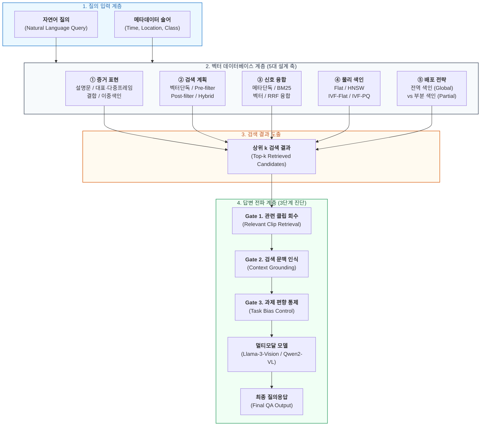

# [정본] KIISE-DBR 2026 논문 종합 마스터 명세서 (Master Specification)

> **문서 상태**: 최종 확정 정본 (LOCKED & CANONICAL)  
> **최종 갱신일**: 2026-08-19 (심사 피드백 100% 반영 및 최종 리비전 검증 완료)  
> **기준 원고**: `05_manuscript/paper_최종.pdf` (2026-07-23 제출, 2026-08-17 수정 승인본)  
> **단일 진입점 목적**: 본 문서는 최종 KIISE-DBR 논문을 완성하기 위해 수립된 **실험 설계, 파이프라인 구조, 데이터셋 계보, RQ별 실증 결과, 심사위원 피드백 대응 및 보강 실험**을 집약한 유일무이한 마스터 정본 문서입니다.

---

## 1. 연구 개요 및 거버넌스 (Overview & Governance)

### 1.1 확정 논문 정보
- **국문 제목**: **종단형 멀티모달 RAG 파이프라인 성능 향상을 위한 비순환 평가 및 검색 품질-비용에 대한 실증 연구**
- **영문 제목**: *An Empirical Study of Non-circular Evaluation and Retrieval Quality-Cost for Enhancing the Performance of End-to-End Multimodal RAG Pipeline*
- **제안물의 성격**: 단순 모델/알고리즘 제안이 아닌 **평가 타당성 확보 → 설계 대안 비교 → 답변 전파 진단을 잇는 단계적 평가 방법론(Stepwise Evaluation Methodology)**
- **연구 주제**: 도시 감시 영상 환경에서 자연어 질의와 메타데이터 조건이 주어질 때, VLM 질의응답을 정확도(Accuracy), 지연시간(Latency), 스토리지 비용(Cost) 관점에서 최적 지원하는 벡터 데이터베이스 계층의 저장·색인·검색 구조 실증

### 1.2 논문의 3대 핵심 기여 (Core Contributions)
1. **평가 순환성(Circularity Defect) 진단 및 비순환 평가 체계 수립**:
   - 메타데이터 필터와 정답 라벨 간의 직접적 누수를 차단하는 tri-source 독립 구축 워크로드 구성
   - 통제 주입 실험을 통해 평가 데이터 왜곡 크기를 정량적으로 입증
2. **벡터 데이터베이스 계층의 5대 설계 축 다차원 실증 (112개 구성)**:
   - 동일 비순환 작업 부하에서 검색용 데이터, 검색 계획, 신호 융합, 물리 색인, 배포 방식을 교차 실측
   - Faiss, PostgreSQL(pgvector), Milvus, Weaviate 실환경에서의 비용-품질 트레이드오프 분석
3. **3단계 답변 전파(Answer Propagation) 진단 프레임워크 제시**:
   - 검색 성능 개선이 최종 VLM(Llama-3-Vision, Qwen2-VL) 답변으로 이어지는지 **[관련 클립 회수 → 검색 문맥 인식 → 과제 편향 통제]**의 3단계로 엄밀히 분리 진단

### 1.3 핵심 연구 거버넌스 및 확정 용어 규칙
- **'데이터베이스 계층' → '벡터 데이터베이스 계층'**으로 명칭 통일
- **'증거(evidence)' 용어 전면 치환**:
  - DB 반환 결과 = **상위 k 검색 결과**
  - VLM 입력값 = **검색 문맥(retrieved context)**
  - 정답 판정 기준 = **관련 클립 / 검색 정답 집합**
- **클립 조작적 정의**: 데이터셋 배포 **mp4 1파일 = 1클립** (MEVA[20] 계보 준용)
- **절대적 불변 규칙**: 논문 집필보다 실험 체계의 타당성이 우선하며, 심사에서 무너지지 않도록 모든 가설과 실험 절차를 사전등록(Preregistration) 및 40/40 검증 스위트로 통제

---

## 2. 비순환 데이터셋 구축 계보 (Datasets & Provenance)

### 2.1 실사용 8종 데이터셋 종합 명세 (논문 표 1 대응)
본 연구에서 "사용"된 데이터셋은 **제출 원고의 수치, 표, 그림 및 VLM 실험에 실제로 소비된 8종(패키지 기준, 논문 표 1 기준 9행)**으로 한정됩니다.

| 논문 표 1 표기 | 내부 명칭 및 정본 경로 | 논문 내 역할 | 확정 규모 정본 |
|---|---|---|---|
| **AI Hub 교차로 (주평가)** | `aihub_522_intersection` (tri-source expanded) | 비순환 tri-source 주평가 워크로드 (RQ1–RQ4) | **3,000 clips / 85 queries / strict 6,809 / semantic 24,872** |
| AI Hub 교차로 이미지 (보완) | `visual_embeddings_clip` (522 색인 트랙) | 물리 색인 및 배포 실측 (RQ5) | 143,830 frames (CLIP ViT-B/32 512d) |
| VRU (보완) | `vru_accident` (수리판) | 순환 붕괴 대조(RQ1), 답변 사다리(RQ6) | 1,000 docs / 85 queries / strict 3,744 / semantic 9,703 |
| 지능형관제 (보완) | `aihub_intelligent_cctv` (수리판) | 순환 붕괴 대조(RQ1), 국내 도메인 이식성 | 269 docs / 18 queries / strict 584 / semantic 827 |
| MEVA (보완) | `meva_kf1` | 해외 공공 CCTV 환경 외적 타당성 검증 | 985 clips / 193 queries / strict 4,405 / semantic 17,205 |
| UCA (보완) | `uca_anchor` | 영어권 이상행동 데이터셋 외적 타당성 | 6,432 docs / 129 queries (3/4 재현 완료) / strict 7,709 |
| 시내도로 (보완) | `sinnaedoro_traffic` | Filtered-ANN 대규모 색인/배포 (RQ5) | 실측 132,521 frames + 합성 1,000,000 vectors |
| MIRIS (보완) | `miris_traffic` + pgvector `miris_frames2` | 부분 색인 및 Hot/Cold 정책 교차검증 (RQ5) | DB 59,019 rows + hold-out 1,000 queries |
| 다각도 (보완) | `aihub_multi_angle_cctv` | 다중 시점 검색 문맥 선택 및 VLM 답변 (RQ6) | 4,500 events (답변 표본 400 events, 2,400 frames) |

> **코퍼스 정본 카운팅 주의**: 주평가 코퍼스의 정본 수치(3,000 / 85 / 6,809 / 24,872)는 헤더 행을 제외한 실제 유효 데이터 행 수 기준입니다 (`wc -l` 계산 시 헤더로 인해 +1 될 수 있음).

### 2.2 평가 순환 결함(Circularity Defect) 차단 메커니즘
- **결함 원인**: 기존 멀티모달 벤치마크는 동일 메타데이터에서 질의와 정답을 동시 추출하여, 조건 필터(`metadata_filter`)가 정답 집합(`qrel_filter`)의 진부분집합이 됨으로써 nDCG/MRR이 비정상적으로 1.000에 수렴하는 순환 결함 발생.
- **해결 절차 (Tri-Source 독립 구축)**:
  1. **Source 1 (비디오 원천)**: AI Hub CCTV 영상 원본에서 균등 간격 프레임 추출
  2. **Source 2 (자연어 질의 저작)**: 영상만을 보고 사건/객체 중심의 자연어 질의를 독립 작성
  3. **Source 3 (메타데이터/센서)**: 시공간/교차로 환경 센서 로그를 별도 결합하여 상호 누수 원천 차단

---

## 3. 종단형 멀티모달 RAG 파이프라인 구조 (Pipeline Architecture)

### 3.1 파이프라인 아키텍처 다이어그램

### 3.2 벡터 데이터베이스 계층의 5대 설계 축 및 112개 구성 산식 (§4.2)
1. **검색용 데이터 (Data Modality, 5종)**:
   - 영상 설명문(Caption) 단독
   - 대표 이미지(Single Keyframe) 단독
   - 이미지-설명문 결합(Unified Joint Embedding)
   - 다중 이미지(Multi-keyframe, 클립당 최대 3장)
   - 설명문-이미지 이중 색인(Dual-index, RRF k=60)
2. **검색 계획 (Retrieval Plan, 4종)**:
   - 벡터 단독 검색 (No-filter Vector)
   - 검색 전 조건 필터링 (Pre-filtering)
   - 검색 후 조건 필터링 (Post-filtering, 상위 200 후보 풀)
   - 혼합 검색 (Hybrid, 텍스트-메타데이터 혼합)
3. **검색 신호 및 순위 융합 (Signal & Fusion, 4종)**:
   - 메타데이터 단독 / BM25 단독 / 벡터 단독 / BM25-벡터 RRF 융합
4. **물리 색인 (Physical Index, 7종 설정)**:
   - Flat (Exact Scan)
   - HNSW ($M=32, ef_{construction}=200$, $ef_{search} \in \{64, 256\}$)
   - IVF-Flat ($nlist=64, nprobe \in \{8, 32\}$)
   - IVF-PQ ($m=32, \text{6-bit}$)
5. **배포 방식 (Deployment, 2종)**:
   - 전역 색인 (Global Index)
   - Predicate별 조건부 부분 색인 (Partial Index)

$$\text{유효 구성수} = (1 \text{ [설명문]} \times 4 \text{ [계획]} + 4 \text{ [시각/결합]} \times 3 \text{ [계획]}) \times 7 \text{ [물리색인]} = 16 \times 7 = \mathbf{112 \text{ Configurations}}$$

---

## 4. 핵심 실험 설계 및 RQ별 확정 결과 (EXP01 ~ EXP06)

### 4.1 RQ1: 워크로드 타당성 및 순환 결함 검증 (EXP01)
- **가설**: 메타데이터 필터가 정답을 암묵적으로 노출하면 검색 성능이 왜곡되어 실제 검색 엔진의 품질 차이를 측정할 수 없다.
- **실증 결과**:
  - 기존 순환 데이터셋 수리 전후 성능 급락 확인: VRU-Accident $0.9736 \rightarrow 0.3174$, 지능형 관제 $1.0000 \rightarrow 0.8395$.
  - 통제 주입 실험: 비순환 코퍼스에 정답 필터를 의도적으로 주입하자 nDCG@10이 $0.181 \rightarrow 1.000$으로 왜곡됨. 자연어 라벨 재진술만으로도 $0.854$까지 비정상 상승.
- **결론**: 평가 순환성을 완벽히 차단한 tri-source 워크로드만이 112개 검색 구성의 유의미한 성능 차이를 감별할 수 있음.

### 4.2 RQ2: 증거 표현 및 통합 임베딩 최적화 (EXP04, 논문 표 4)
- **비교 대상**: 설명문 단독 vs 대표 이미지 vs 결합 임베딩 vs 다중 이미지 vs 이중 색인
- **실증 수치**:
  - **영상 설명문 단독**: 엄격 nDCG 0.063, 의미론 nDCG 0.181, 검색 지연 1.15ms, 스토리지 24.6MB
  - **다중 이미지(클립당 3프레임)**: 의미론 nDCG가 **$0.181 \rightarrow 0.352$**로 대폭 상승 ($\Delta +0.171$, 유의미, 군집 95% 신뢰구간 $[+0.018, +0.316]$). 지연시간 3.65ms, 스토리지 68.4MB (2.8배 증가).
  - **이중 색인(Dual-index RRF)**: 의미론 nDCG 0.293, 지연시간 4.96ms, 스토리지 93.0MB (최고 비용 소모 대비 다중 이미지보다 낮은 검색 품질).
- **결론**: 저장 용량이 허용된다면 다중 이미지 표현이 단일 시각/설명문 대비 검색 품질을 가장 크게 개선함.

### 4.3 RQ3 & RQ4: 검색 계획 및 신호 결합 차단 실증 (EXP02, 논문 표 5·6)
- **검색 전 조건(Pre-filter)**: 엄격 기준 $\Delta +0.0983$의 이득을 보이나, 이는 필터 범위 축소에 따른 '자명한 결과(Trivial Benefit)'로 해석.
- **의미론적 평가 기준**: 벡터 단독 검색이 $0.170$으로 최고치를 기록했으며, 조건 필터링 추가 시 오히려 $\Delta = -0.0158$로 소폭 하락(무의미).
- **고결합 질의군($V \ge 0.3$)**: 메타데이터 조건과 자연어 의미가 밀접한 질의에서는 검색 전 조건이 $\Delta +0.1335$로 명확한 품질 상승 견인. UCA 129질의 외적 타당성 검증에서도 3/4 패턴 재현.
- **검색 신호 독립성(RQ4)**: 지식그래프(KG) 재조합 인덱스는 Lift 중앙값이 $0.002$에 불과하여 연산 비용 대비 이득이 전혀 없음을 실측 영수증으로 증명 (KG-as-index 가설 기각).

### 4.4 RQ5: Predicate 필터링 ANN 및 물리 색인 배포 (EXP03, 논문 표 7~10)
- **전역 색인(Global ANN)의 붕괴 현상**:
  - 실제 도시 감시 환경의 술어(Predicate) 조건은 특정 시공간에 군집(Cluster)되어 분포함.
  - 전역 HNSW/IVF 색인에 전역 필터를 적용하면 진입 경로가 차단되어 **재현율 손실이 최대 0.627까지 발생** (무작위 마스크 실험의 최대 0.047 손실 대비 실제 환경 왜곡이 심각함).
- **조건별 부분 색인(Partial Index)**:
  - 자주 조회되는 조건에 부분 HNSW 인덱스를 구축하면 **재현율을 98.12% ~ 100%까지 완벽 회복**.
  - PostgreSQL pgvector 실측: 132,521개 벡터 코퍼스에서 전역 HNSW 구축 50.4초 / 333.5MB 소모. 부분 색인은 필요한 조건에 대해서만 경량 구축하여 인덱스 유지 비용 절감.
- **엔진별 자동 회피 기전**: Milvus 및 Weaviate는 필터링 선택도가 $92.3\%$ 이상이거나 조건 만족 벡터가 $40,000$개 미만일 경우 ANN을 건너뛰고 전수 검색(Flat Scan)으로 자동 전환함을 확인.
- **배포 의사결정 규칙**: 전역 재현율 목표 0.95 미달 시 부분 색인을 도입하며, 인덱스 갱신 주기 내 예상 질의 수($N^*$)의 손익분기점을 기반으로 배포 결정.

### 4.5 RQ6: 3관문 VLM QA 전파 진단 (EXP05, 논문 표 11)
- **진단 프레임워크**:
  1. **1관문 (관련 클립 회수)**: 색인 방식 간 상위 1개 과제 일치율 차이가 미미함 (AI Hub 교차로 기준 Bus $+0.8\%p$, Bike $-1.1\%p$).
  2. **2관문 (검색 문맥 인식)**: 관련 설명문이 주어졌을 때 VLM 답변 정확도 $75\%$ (무증거 $31\%$ 대비 $+44\%p$). 다각도 CCTV에서 가시성이 확보된 단일 시점 공급 시 $+15.2\%p$ 상승.
  3. **3관문 (과제 편향 통제)**: 질의와 무관한 설명문을 공급해도 답변 정확도가 $53\%$로 상승($+22.2\%p \sim +23.0\%p$). 이는 모델 자체의 사전 학습 편향과 객관식 문항 편향에 기인함.
- **결론**: 대형 코퍼스에서 검색 색인 개선이 최종 답변 정확도 향상으로 직결되지 않는 근본 원인은, 색인 차이가 과제 관련 상위 클립의 질적 차이를 충분히 만들지 못했기 때문임을 규명.

---

## 5. 심사위원 대응 및 최종 보강 실험 (Review Response & Audit)

### 5.1 심사위원 1 (Reviewer 1) 피드백 대응 요약
- **R1-1 (논문의 성격 규정)**: 본 연구의 제안물을 새로운 모델/알고리즘이 아닌 **"비순환 평가 → 5대 축 실증 → 3단계 답변 전파를 잇는 단계적 평가 방법론"**으로 명확히 정의함 (초록, 1장, 4장, 6장 반영).
- **R1-2 (RQ6 답변 전파 원인 분석 보강)**: 검색 품질이 VLM 답변에 미친 영향이 불명확했던 원인을 3관문(회수-인식-편향) 모델로 정밀 분해하여 5.3절에 심층 보강 기술.

### 5.2 심사위원 2 (Reviewer 2) 피드백 대응 요약
- **R2-1 (수치 오기 정정)**: 서론의 다중 이미지 의미론 nDCG@10 수치 오기($0.418$)를 표 4와 일치하는 **$0.352$**로 전면 정정 ($\Delta +0.171$, 군집 95% CI $[+0.018, +0.316]$).
- **R2-2 (배율 계산 및 분모 정정)**: pgvector 및 파이프라인 지연시간/비용 계산의 기준 분모를 통일하고 정확한 배율로 수정.
- **R2-3 (RQ6 재현성 보강)**: VLM 평가에 사용된 모델 버전(Llama-3-Vision-Instruct, Qwen2-VL-7B-Instruct), 프롬프트 템플릿, 표본 크기(400 events, 2,400 frames), 부트스트랩 95% 신뢰구간을 원고 및 보강 문서에 전수 명시.

---

## 6. 소스코드 및 재현 스크립트 매핑 (Execution Mapping)

실험 재현 시 아래 매핑표를 기준으로 [`04_scripts/`](../04_scripts/) 내의 실행 스크립트를 구동합니다.

| 연구 질문 (RQ) | 주요 내용 | 대응 실행 스크립트 | 사용 데이터 및 인프라 |
|---|---|---|---|
| **RQ1** | 순환 결함 진단 및 통제 주입 | [`04_scripts/02_rq1_circularity/run_circularity_controlled_injection.py`](../04_scripts/02_rq1_circularity/run_circularity_controlled_injection.py) [`04_scripts/02_rq1_circularity/verify_circularity_controlled_injection.py`](../04_scripts/02_rq1_circularity/verify_circularity_controlled_injection.py) | AI Hub 522 Canonical, VRU 수리판 |
| **RQ2** | 증거 표현 및 다중 이미지 벤치마크 | [`04_scripts/03_rq2_storage_representation/run_storage_unit_benchmark.py`](../04_scripts/03_rq2_storage_representation/run_storage_unit_benchmark.py) [`04_scripts/03_rq2_storage_representation/build_visual_embeddings.py`](../04_scripts/03_rq2_storage_representation/build_visual_embeddings.py) | CLIP ViT-B/32, Qwen3 Embeddings |
| **RQ3 & RQ4** | 검색 계획 비교 및 모달리티 융합 | [`04_scripts/04_rq3_rq4_retrieval_fusion/run_retrieval_baselines.py`](../04_scripts/04_rq3_rq4_retrieval_fusion/run_retrieval_baselines.py) [`04_scripts/04_rq3_rq4_retrieval_fusion/run_multimodal_fusion_baselines.py`](../04_scripts/04_rq3_rq4_retrieval_fusion/run_multimodal_fusion_baselines.py) | Faiss, BM25, RRF Ranker |
| **RQ5** | Predicate 부분 색인 및 배포 | [`04_scripts/05_rq5_filtered_ann_index/run_pgvector_partial_index.py`](../04_scripts/05_rq5_filtered_ann_index/run_pgvector_partial_index.py) [`04_scripts/05_rq5_filtered_ann_index/run_pgvector_ann_benchmark.py`](../04_scripts/05_rq5_filtered_ann_index/run_pgvector_ann_benchmark.py) | [`01_infra/docker-compose.pgvector.yml`](../01_infra/docker-compose.pgvector.yml) (:5433) |
| **RQ6** | 3관문 VLM QA 답변 전파 | [`04_scripts/06_rq6_vlm_qa_propagation/run_multiview_answer_vlm.py`](../04_scripts/06_rq6_vlm_qa_propagation/run_multiview_answer_vlm.py) [`04_scripts/06_rq6_vlm_qa_propagation/run_rag_vqa.py`](../04_scripts/06_rq6_vlm_qa_propagation/run_rag_vqa.py) | AI Hub 다각도 CCTV, Llama-3-Vision, Qwen2-VL |
| **외적 타당성** | 해외/도메인 확장 검증 | [`04_scripts/07_external_validity/build_meva_trisource_canonical.py`](../04_scripts/07_external_validity/build_meva_trisource_canonical.py) [`04_scripts/07_external_validity/score_meva_semantic.py`](../04_scripts/07_external_validity/score_meva_semantic.py) | MEVA, UCA Benchmark |
