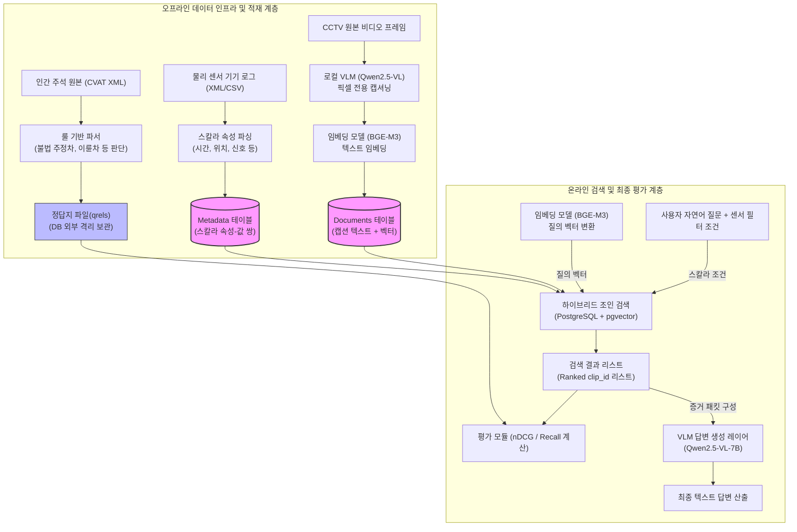

# 810 — 종합 아키텍처 및 데이터 흐름 청사진 (Architecture & Data Flow Blueprint)

---

## 1. 개요 (Overview)

본 문서는 도시 교통 및 방범 감시 멀티모달 환경을 지원하기 위한 **데이터베이스 근거 계층(Database Evidence Layer)의 전체 데이터 라이프사이클 및 검색·평가 아키텍처 조감도(Blueprint)**를 정의한다. 

기존의 논의들이 실험 로그나 부분적인 문서에 파편화되어 있어 시스템의 전체 상호작용을 파악하기 어렵다는 문제의식을 바탕으로, **[데이터 수집 및 이기종 가공 ➡️ 벡터 DB 적재 및 스키마 설계 ➡️ 하이브리드 검색 및 질의 계획 ➡️ 비순환 채점 및 평가 ➡️ VLM-QA 답변 생성]**에 이르는 전 과정을 체계적으로 명세한다.

---

## 2. 전체 시스템 아키텍처 및 데이터 흐름도

시스템은 크게 **오프라인 데이터 가공/인덱싱 파이프라인(Offline Pipeline)**과 **온라인 하이브리드 검색/평가 파이프라인(Online Pipeline)**의 두 영역으로 구성된다.



---

## 3. Tri-Source 데이터 가공 및 소스 격리 파이프라인

평가 타당성의 오염(순환성)을 원천 차단하기 위해 세 가지 독립된 소스 채널에서 데이터 속성을 각각 독자 추출한다.

1.  **Predicate (필터 속성 채널)**:
    *   **입력**: 교차로 내 물리 루프 디텍터, 신호등 제어 장치, 기상 관측기로부터 기계 수집된 원시 데이터 (CSV/XML).
    *   **처리**: 텍스트 분석이나 픽셀 정보 개입 없이, 실제 신호 제어기 로그에서 `time_of_day`, `sig_has_yellow`, `sig_has_pedestrian` 등의 환경적 조건을 문자열 및 불리언(Boolean) 값으로 파싱하여 스칼라 조건 데이터로 고정한다.
2.  **Document (검색 대상 문서 채널)**:
    *   **입력**: 원본 비디오 프레임 픽셀 데이터.
    *   **처리**: 인간이 작성한 레이블이나 어노테이션 텍스트를 일절 참고하지 않고, 로컬 GPU 환경에 고정된 독립 VLM(Qwen2.5-VL)이 픽셀의 시각 정보만을 보고 묘사 문장(캡션)을 기계 생성한다. 이 자연어 캡션을 BGE-M3 모델로 임베딩하여 고차원 벡터로 변환한다.
3.  **Relevance (적합성 판단 채널)**:
    *   **입력**: 인간이 CVAT 도구를 사용해 객체 궤적과 상태를 태깅해 놓은 주석 파일 ([taskXML](file:///home/explorer/vectorDB/experiments/db/KIISE_datasociety/Datasets/processed/aihub_522_intersection/20260710/labels_src/val/VL_3/12022/task12022_003.xml)).
    *   **처리**: 룰 기반의 파서를 통해 XML 내의 객체 속성(예: `is_parked=True`, `is_stopped=True`, `bike` 존재 여부 등)을 파싱하여 특정 질문(예: "불법 주정차 차량이 있는 비디오")에 대한 정답 클립 ID 목록(`qrels`)을 빌드한다. 
    *   **격리 정책**: 해당 데이터는 데이터베이스 테이블이나 검색 인덱싱에 전혀 활용하지 않고, **채점 모듈에서만 외부 파일로 따로 보관**한다.

---

## 4. 관계형 벡터 데이터베이스(PostgreSQL + pgvector) 저장 스키마

실제 시스템에 탑재되는 물리 저장 스키마는 캡션 문서를 보관하는 **Documents 테이블**과 스칼라 센서 속성들을 보관하는 **Metadata 테이블**로 쪼개어, 비디오 식별값인 `clip_id`를 외래 키(FK)처럼 사용하여 상호 조인(JOIN)되도록 구현한다.

### 4.1 Documents 테이블 스키마 및 적재 예시

*   **DDL 정의**:
    ```sql
    CREATE TABLE aihub522_documents (
        doc_id text PRIMARY KEY,      -- 프레임 고유 ID (예: 'frame_12022_001')
        clip_id text NOT NULL,        -- 비디오 클립 고유 ID
        doc_type text NOT NULL,      -- 저장 입도 (frame / clip / chunk)
        text text NOT NULL,           -- VLM이 생성한 비주얼 캡션 텍스트
        embedding vector(512)         -- BGE-M3 임베딩 벡터 (512차원)
    );
    ```
*   **실제 데이터 적재 예시**:
    ```sql
    INSERT INTO aihub522_documents (doc_id, clip_id, doc_type, text, embedding) VALUES
    ('doc_001', 'clip_12022', 'frame', 'A yellow taxi passenger vehicle is stopped at a crosswalk.', '[0.1102, -0.0451, 0.5521, ..., 0.0912]');
    ```

### 4.2 Metadata 테이블 스키마 및 적재 예시

*   **DDL 정의**:
    ```sql
    CREATE TABLE aihub522_metadata (
        clip_id text NOT NULL,        -- 비디오 클립 고유 ID (JOIN 키)
        facet_name text NOT NULL,     -- 센서 조건의 속성 분류명
        facet_value text NOT NULL     -- 센서 조건의 속성값
    );
    ```
*   **실제 데이터 적재 예시**:
    ```sql
    INSERT INTO aihub522_metadata (clip_id, facet_name, facet_value) VALUES
    ('clip_12022', 'time_of_day', '오전'),
    ('clip_12022', 'hour', '10'),
    ('clip_12022', 'sig_has_pedestrian', 'True'),
    ('clip_12022', 'veh_density_bin', 'high');
    ```

---

## 5. 하이브리드 검색 메커니즘 및 쿼리 플래닝 (Query Execution)

사용자가 쿼리 "오전 시간대 교차로에서 보행자 신호가 켜진 비주얼 장면"을 요청하면, 시스템은 **질의 벡터**와 **스칼라 필터 조건**을 파라미터로 수신하여 다음과 같은 세 가지 질의 계획 분기로 최적화 및 검색을 수행한다.

### 5.1 Pre-filtering (필터 선처리 방식)
*   **원리**: 메타데이터 조건을 충족하는 `clip_id`를 먼저 식별하고, 해당 후보 집합 안에서만 벡터 유사도 탐색을 전개한다.
*   **SQL 구현**:
    ```sql
    SELECT doc.clip_id, doc.text, (doc.embedding <=> '[질의벡터]') AS distance
    FROM aihub522_documents doc
    WHERE doc.clip_id IN (
        SELECT clip_id FROM aihub522_metadata 
        WHERE (facet_name = 'time_of_day' AND facet_value = '오전')
          AND (facet_name = 'sig_has_pedestrian' AND facet_value = 'True')
    )
    ORDER BY distance ASC LIMIT 5;
    ```
*   **특징**: 하드 조건 필터링 정확도가 100% 보장되지만, 통과 범위가 매우 낮은 Highly Selective 조건에서는 인덱스를 타지 못하고 exact scan으로 이행되거나 그래프 인덱스 상에서 연결 경로가 깨지는(Graph Disconnection) 문제가 관찰된다.

### 5.2 Post-filtering (필터 후처리 및 pgvector Iterative Scan 방식)
*   **원리**: 글로벌 벡터 인덱스로 유사도 상위 $K$개를 우선 인출한 후, 메타데이터 필터링을 사후 적용한다. `pgvector 0.8+`에서는 필터를 통과한 데이터 개수가 $K$개에 도달할 때까지 검색 반경을 동적으로 넓혀 추가 인출을 반복하는 `iterative scan`을 실행한다.
*   **SQL 구현**:
    ```sql
    SELECT doc.clip_id, doc.text, (doc.embedding <=> '[질의벡터]') AS distance
    FROM aihub522_documents doc
    JOIN aihub522_metadata meta ON doc.clip_id = meta.clip_id
    WHERE (meta.facet_name = 'time_of_day' AND meta.facet_value = '오전')
    ORDER BY distance ASC LIMIT 5;  -- DB 옵티마이저가 인덱스 조건 결합 후 iterative 스캔 판단
    ```
*   **특징**: 인덱스 빌드 비용이 없으나, 스칼라 필터의 선택도가 매우 낮을 시 반복적인 스캔으로 인해 쿼리 지연 시간(latency)이 요동치는 한계가 발생한다.

### 5.3 Partial / Local Indexing (부분 색인 설계 최적화)
*   **원리**: 질의 빈도가 높고 선택도가 매우 극단적인 메타데이터(예: 특정 병목 교차로, 야간 시간대 등)에 대해, 전체 데이터가 아닌 **해당 필터 조건 범위만 커버하는 가볍고 빠른 특화 벡터 인덱스**를 동적으로 개설하여 쿼리를 가속한다.
*   **SQL 구현 (부분 색인 생성)**:
    ```sql
    CREATE INDEX idx_partial_hnsw_night 
    ON aihub522_documents (embedding vector_cosine_ops)
    WHERE clip_id IN (
        SELECT clip_id FROM aihub522_metadata 
        WHERE facet_name = 'time_of_day' AND facet_value = '야간'
    );
    ```
*   **최적의 hot/cold 인덱스 배포 모델 ($N^*$)**:
    무분별한 인덱스 빌드 비용(build cost) 낭비를 방지하기 위해, 본 연구는 다음 손익분기 수식 모델에 입각하여 부분 인덱스를 물질화(materialization)할지 여부를 판정한다.
    $$N^* = \frac{\text{Index Build Cost}}{\text{Per-Query Latency Saving}}$$
    누적 쿼리 횟수가 $N^*$을 상회하는 핫 프레디케이트(Hot Predicate) 집합에 대해서만 선별적으로 부분 인덱스를 물질화하고, 나머지는 콜드 프레디케이트(Cold Predicate)로 분류해 global index + iterative scan 방식으로 라우팅하는 운영 정책을 확립한다.

---

## 6. 비순환 채점 및 평가 구조 (Evaluation Phase)

검색 프로세스가 완료되어 출력된 ranked list(`Ranked clip_id 리스트`)는 DB 외부로 격리된 qrels 파일과 대조되어 채점된다.

*   **매칭 및 스코어링 수식**:
    *   **strict qrels**: 필터 조건(Predicate)과 의미 조건(Relevance)을 동시에 만족해야만 정답으로 채점 ($Recall_{strict}$).
    *   **semantic qrels**: 메타데이터 필터 충족 여부와 무관하게, 시각적인 의미 조건(Relevance)만 만족하면 정답으로 채점 ($Recall_{semantic}$).
*   **핵심 평가 발견**:
    실측 감시 데이터 환경에서는 의미상 정답인 데이터(`semantic positive`) 중 약 **72.6%**가 실제 센서 메타데이터 필터를 통과하지 못하는 것으로 드러났다. 
    이로 인해 쿼리에 엄격한 하드 조건을 강제하는 pre-filtering은 soft-intent 상황에서 의미상 매우 중요한 비주얼 증거들을 사전에 누락시키고 만다는 비보장성 현상이 본 평가 구조를 통해 실증적으로 정량화된다.

---

## 7. 최종 VLM-QA 답변 생성 연계 (Answer Propagation Phase)

검색 모듈이 최종 반환한 top-K 비디오 프레임/클립들은 **VLM-QA 생성 단계**로 전달되어 근거 컨텍스트로 제공된다.

```
[사용자 질문] -> "교차로 A 부근에 불법 주정차한 적색 차량이 몇 대 있습니까?"
       │
       ▼ (RAG 증거 검색 단계)
[검색된 프레임 ID] -> doc_001, doc_002 (CCTV 픽셀 비주얼 정보)
       │
       ▼ (증거 패킷 구성 및 VLM 프롬프트 결합)
[VLM 입력 프롬프트] -> 
   "질문: 교차로 A 부근에 불법 주정차한 적색 차량이 몇 대 있습니까?
    근거 이미지: [doc_001 이미지 픽셀 데이터, doc_002 이미지 픽셀 데이터]"
       │
       ▼ (VLM 최종 생성)
[VLM 최종 답변] -> "근거 이미지 doc_001과 doc_002를 판독한 결과, 우측 황색 실선 도로변에 주차된 적색 승용차 1대와 적색 트럭 1대로 총 2대의 적색 차량이 불법 주차되어 있습니다."
```

*   본 연구는 검색 엔진이 가져온 이미지의 품질(Recall 등)에 따라 상위 생성 모델(Qwen2.5-VL-7B)이 최종 답변의 팩트(Fact)를 교정해 내는 정확도의 상관관계를 정밀 측정하였으며, 코퍼스 규모와 모델 지각력 등의 영향 관계를 함께 기술한다.
