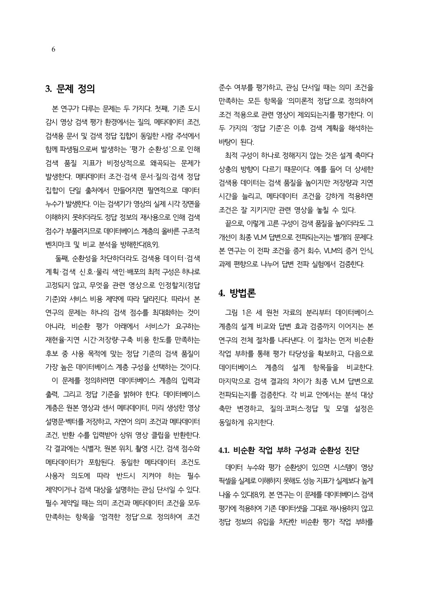

# 3. 문제 정의와 비순환 평가 계약

## 분석 단위와 입력·출력

- 기본 저장·검색·정답 판정 단위는 데이터셋이 배포한 `mp4` 영상 파일 하나인 **클립**이다.
- 입력 질의는 자연어 의미 조건과 메타데이터 조건을 함께 가진다.
- 데이터베이스 출력은 상위 `k`개 클립·프레임·설명문의 순위 목록이다.
- 이 목록을 VLM 입력으로 구성한 것을 **검색 문맥(retrieved context)**이라 한다.
- 검색 정답은 qrels에 기록된 관련 클립 집합이다.

## ‘증거’라는 말의 세 대상

| 구분 | 정확한 명칭 | 의미 |
|---|---|---|
| DB 출력 | 상위 `k` 검색 결과 | 클립·프레임·설명문의 순위 목록 |
| VLM 입력 | 검색 문맥 | 검색 결과를 모델 입력 형식으로 구성한 집합 |
| 평가 대상 | 관련 클립 / qrels | 정답 기준을 만족하는 클립 |

세 대상을 모두 “증거”라고 부르면 DB 검색 성공, VLM 입력 구성, 정답 판정이 혼동된다. 문서에서는 가능한 한 위 명칭을 구분한다.

## 벡터 데이터베이스 계층

영상에서 파생된 설명문, 이미지 임베딩 벡터, 센서 메타데이터를 저장·색인하고, 자연어 의미 조건과 메타데이터 조건을 받아 필터링·어휘 검색·벡터 검색·순위 융합을 수행해 상위 검색 결과를 반환하는 계층이다. Faiss·Milvus·Weaviate 같은 전용 엔진과 PostgreSQL/pgvector 같은 관계형 확장을 모두 포괄한다.

## 비순환 세 원천 프로토콜

| 평가 구성 요소 | 허용된 생성 원천 | 금지되는 재사용 |
|---|---|---|
| 메타데이터 predicate | 센서 기록·독립 구조화 메타데이터 | 사람 정답 라벨을 필터로 변환 |
| 검색 문서 | 영상 픽셀만 본 VLM 설명문 또는 시각 임베딩 | 정답 정의·라벨·내부 정답 필드 삽입 |
| relevance / qrels | 독립 사람 주석 | 검색 문서의 모델 출력을 정답으로 재사용 |

프로토콜은 특정 데이터셋 이름이 아니라 데이터를 만드는 규칙이다. AI Hub 교차로는 이 규칙으로 구축한 주 평가 산출물이고, VRU-Accident와 지능형 관제 CCTV의 수정 전후 비교는 같은 규칙을 기존 작업 부하에 이식한 사례다.

## 순환성의 두 주요 경로

### C1. Filter–answer circularity

정답 집합 또는 정답을 정의한 속성을 필터 조건으로 사용하면 필터 통과 집합이 곧 정답 집합이 된다. 이후 벡터 순위가 무의미해져도 nDCG가 구조적으로 높아진다.

### C2. Document–answer circularity

사람 정답 라벨의 정의 문장을 검색 문서에 재진술하면 질의와 문서의 어휘·의미 중복이 인위적으로 커진다. 특히 BM25는 장면을 이해하지 않고도 직접 단어 일치로 높은 순위를 얻는다.

## 이중 정답 계약

| 항목 | 엄격한 정답(strict) | 의미론적 정답(semantic) |
|---|---|---|
| 조건 해석 | 필수 제약(hard constraint) | 관심 단서(soft cue/intent) |
| 정답 정의 | 의미 관련성 ∩ 메타데이터 조건 | 의미 관련성을 만족하는 모든 클립 |
| 출처 | 사람 주석 ∩ 센서 기록 | 사람 주석 |
| 평가 목적 | 명시 조건 준수 | 의미상 유용한 결과의 조기 누락 진단 |
| 제출본 규모 | qrels 6,809행 | qrels 24,872행 |

엄격한 정답에서 사전 필터가 유리한 것은 부분적으로 정의상 자명하다. 반대로 의미론적 정답은 센서 조건과 무관해도 의미상 관련된 클립을 인정하므로 사전 필터의 조기 누락을 드러낸다. 따라서 두 기준을 분리하지 않은 평균은 필터의 효과를 해석하기 어렵다.

## 조건–관련성 결합도

메타데이터 조건 충족 여부와 의미 관련성 여부가 함께 나타나는 정도를 Cramér's `V`로 측정한다.

- `V < 0.3`: 저결합. 조건이 의미 관련성을 잘 예측하지 못하므로 사전 필터가 관련 결과를 잘라낼 수 있다.
- `V ≥ 0.3`: 고결합. 조건이 의미 관련성과 함께 움직여 사전 필터가 후보를 줄이면서 관련 결과를 보존할 가능성이 높다.

예를 들어 `황색 신호 여부 × 주차 차량`은 낮은 결합을 보일 수 있지만, `센서 교통 밀도 × 화면 내 개체 20개 이상`은 자연스럽게 결합될 수 있다.

## 자동 감사(A6)의 목적

자동 감사는 최소한 다음을 확인해야 한다.

1. predicate, document, relevance의 출처가 분리되어 있는가?
2. 메타데이터에 정답 라벨이나 내부 정답 필드가 포함되지 않았는가?
3. 검색 문서가 정답 라벨·정의 문구를 직접 노출하지 않는가?
4. 질의 템플릿이 정답 문장을 그대로 복사하지 않는가?
5. qrels와 문서·조건 사이의 직접 키 조인이 차단되었는가?

자동 검사 통과는 모든 의미적 누수를 완전히 부정하는 증명은 아니지만, 직접적인 생성 경로 재사용을 재현 가능하게 차단하는 최소 계약이다.

---

## 논문 원문 — 3. 문제 정의

> 출처: `paper_final.pdf` 6쪽. 같은 쪽 후반에는 4장 방법론이 시작된다.

[제출 PDF 6쪽 열기](../paper_final.pdf#page=6)

### 제출 PDF 6쪽

