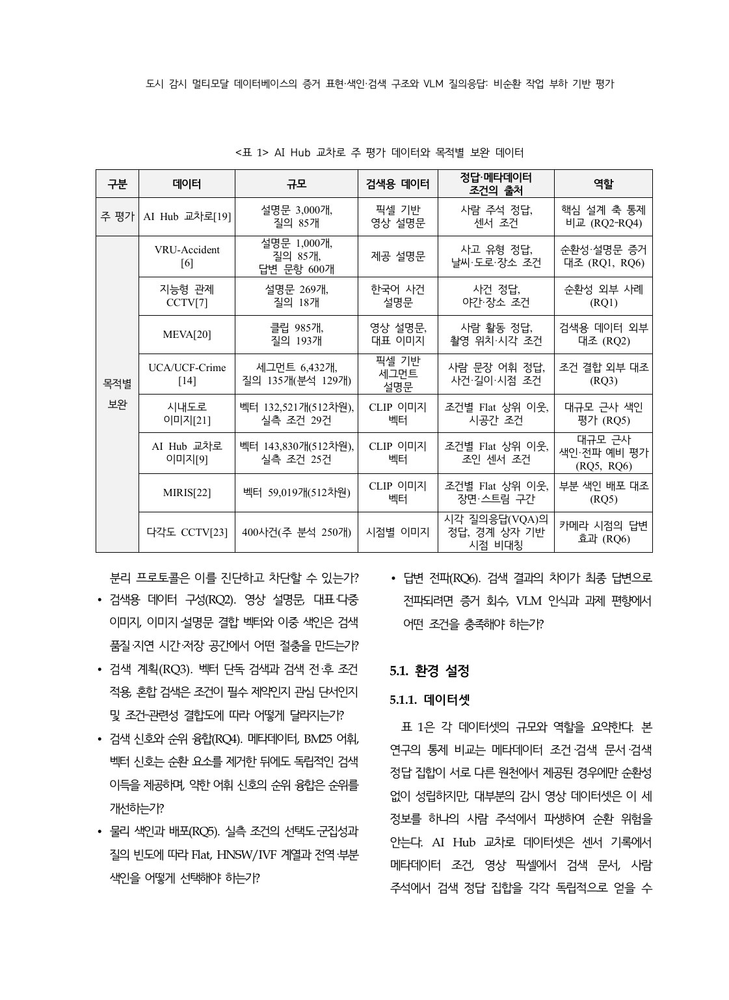
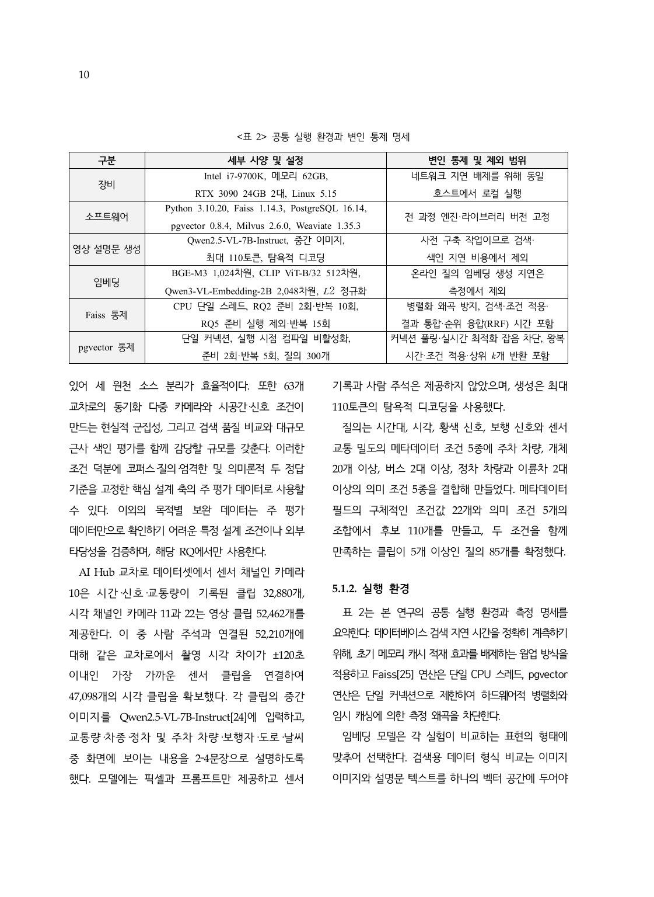
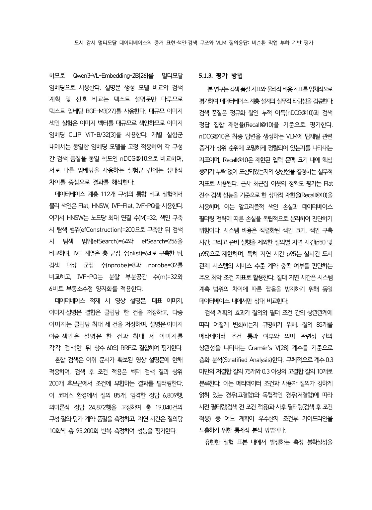
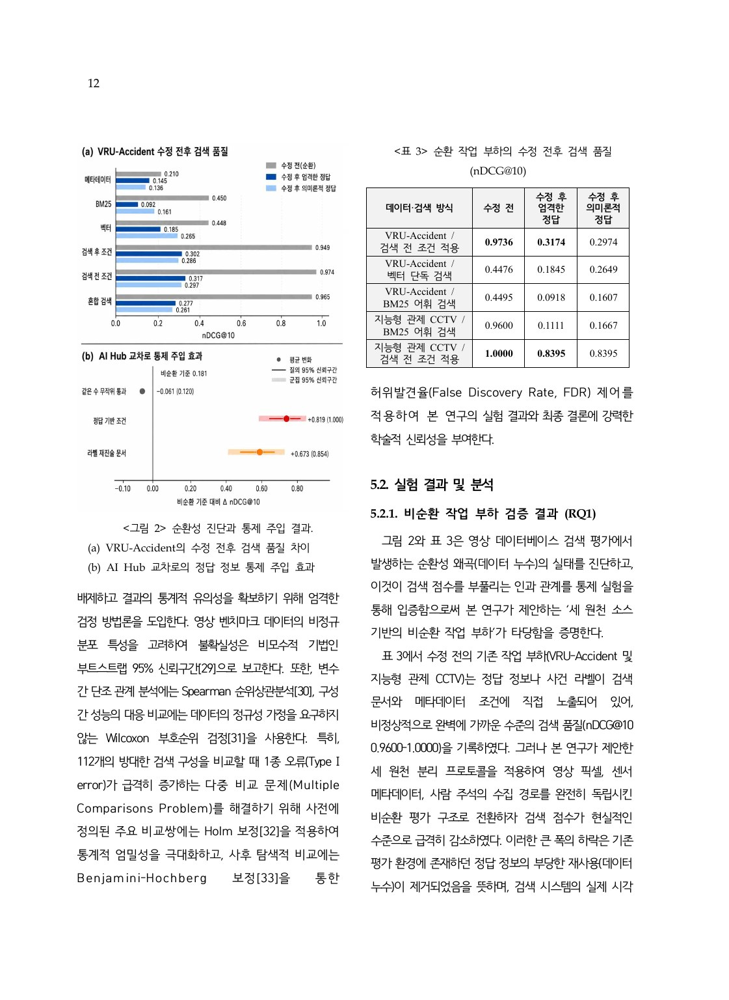

# 5.1 실험 환경, 평가 지표와 통계

## 공통 실행 환경

| 구분 | 사양·설정 | 통제 목적 |
|---|---|---|
| 장비 | Intel i7-9700K, RAM 62GB, RTX 3090 24GB 2대, Linux 5.15 | 같은 호스트에서 네트워크 차이 제거 |
| 소프트웨어 | Python 3.10.20, Faiss 1.14.3, PostgreSQL 16.14, pgvector 0.8.4, Milvus 2.6.0, Weaviate 1.35.3 | 엔진·라이브러리 버전 고정 |
| 설명문 생성 | Qwen2.5-VL-7B-Instruct, 중간 이미지, 최대 110토큰, greedy decoding | 오프라인 사전 구축이며 검색 지연에서 제외 |
| 임베딩 | BGE-M3 1,024차원, CLIP ViT-B/32 512차원, Qwen3-VL-Embedding-2B 2,048차원, L2 정규화 | 표현 유형에 맞는 고정 인코더 |
| Faiss | CPU 단일 스레드, RQ2 warm-up 2회·반복 10회, RQ5 warm-up 제외·반복 15회 | 병렬화·캐시 왜곡 통제 |
| pgvector | 단일 연결, JIT 비활성화, warm-up 2회·반복 5회, 질의 300개 | 왕복·실행계획을 포함한 동일 경계 계측 |

검색용 데이터 구성 비교에는 텍스트와 이미지를 같은 공간에 놓는 Qwen3-VL-Embedding-2B를 사용한다. 설명문 기반 계획·신호 비교에는 BGE-M3, 대규모 이미지 ANN에는 CLIP ViT-B/32를 사용한다. 서로 다른 인코더 실험의 절대 nDCG를 직접 비교하지 않고 각 실험군 안의 상대 차이를 해석한다.

## 온라인·오프라인 계측 경계

- 온라인 지연 포함: 검색, 조건 적용, 후보 통합, RRF, top-k 반환
- 온라인 지연 제외: 캡션 생성, 코퍼스 임베딩, 질의 임베딩 생성
- 오프라인 비용 별도 보고: 직렬화 색인 크기, 색인 구축 시간, 임베딩·문서 생성 비용

절대 지연 시간은 장비·스레드·API 왕복 범위에 민감하다. 따라서 같은 엔진과 같은 측정 경계 안에서 상대 비교해야 한다.

## nDCG@10

순위가 높은 관련 결과에 더 큰 가치를 주고, 이상적 순위로 정규화한 정보검색 지표다.

$$
DCG@k = \sum_{i=1}^{k}\frac{2^{rel_i}-1}{\log_2(i+1)}, \qquad
nDCG@k = \frac{DCG@k}{IDCG@k}
$$

- `1`에 가까울수록 관련 클립이 상위에 잘 정렬된다.
- 정답 후보만 남기는 오라클 필터에서는 구조상 `1.0`이 될 수 있으므로 모델 성능으로 해석하면 안 된다.
- 논문은 주로 이진 relevance이지만 정의는 graded relevance에도 적용된다.

## Recall@10

$$
Recall@10 = \frac{|\text{top-10 검색 결과} \cap \text{관련 클립}|}{|\text{관련 클립}|}
$$

VLM이 볼 수 있는 문맥이 top-10으로 제한될 때 관련 결과의 누락 정도를 나타낸다. RQ5에서는 별도로 Flat 정확 검색의 top-10을 기준으로 한 **상대 ANN recall/fidelity**를 사용해 의미 채점과 색인 손실을 분리한다.

## MRR과 Hit@k

- MRR: 첫 번째 관련 결과의 순위 역수 평균. 최초 관련 결과를 얼마나 빨리 보여주는지 측정한다.
- Hit@k: 상위 `k` 안에 관련 결과가 하나라도 있는 질의의 비율이다.

Note의 공통 지표로 이해할 필요가 있지만, 제출본의 핵심 표는 nDCG@10과 Recall@10을 중심으로 보고한다.

## p50과 p95 지연

- p50: 질의 지연의 중앙값. 전형적인 사용자 경험을 나타낸다.
- p95: 95%의 질의가 이 값 이하에서 끝난다. 꼬리 지연과 SLA 위험을 나타낸다.

평균만 보고하면 소수의 느린 질의를 숨길 수 있으므로 p50과 p95를 함께 본다.

## 효과량 Δ

두 방법의 대응 질의별 점수 차이 또는 처리군–기준선의 차이다.

$$
\Delta = metric(\text{treatment}) - metric(\text{baseline})
$$

양수인지 여부뿐 아니라 크기와 신뢰구간, 비교 단위가 질의인지 조건–의미 쌍인지 확인해야 한다.

## Bootstrap 95% 신뢰구간

정규분포를 강하게 가정하지 않고 관측 단위를 복원 추출하여 효과량의 표본 분포를 근사한다.

- query bootstrap: 질의를 재표집한다.
- cluster bootstrap: 같은 `relevance 정의 × facet`에 속한 질의의 의존성을 보존하기 위해 군집 단위로 재표집한다.

cluster CI가 0을 포함하면 query CI만으로 보편 효과를 확정하지 않는다. 신뢰구간은 “95% 확률로 참값이 이 안에 있다”는 베이지안 문장이 아니라, 같은 절차를 반복했을 때 구간 생성법의 장기 포함률을 뜻한다.

## Wilcoxon 부호순위 검정

같은 질의를 두 방법으로 평가한 대응 차이가 0을 중심으로 대칭인지 비모수적으로 검정한다. 정규성 가정이 어려운 검색 지표의 대응 비교에 사용한다. 효과량과 CI 없이 p-value만 보고하면 안 된다.

## Spearman 순위상관

두 변수 사이의 단조 관계를 순위로 측정한다. RQ3에서는 Cramér's `V`가 커질수록 사전 필터 효과 Δ가 증가하는 경향을 본다. 상관은 인과가 아니며, 군집 CI와 표본 분포를 함께 확인한다.

## Cramér's V

두 범주형 변수의 결합 강도를 `0`–`1` 범위로 나타낸다.

$$
V = \sqrt{\frac{\chi^2}{n\,\min(r-1,c-1)}}
$$

본 연구에서는 predicate 충족 여부와 의미 관련성의 결합도로 사용하며 `0.3`을 사전 층화 경계로 둔다. 경계값은 절대적 자연법칙이 아니라 이 연구의 분석 계약이다.

## 다중 비교 보정

112개 구성처럼 비교가 많으면 우연히 작은 p-value가 나올 확률이 커진다.

- Holm 보정: 사전에 정한 주요 비교에서 family-wise error rate를 강하게 제어한다.
- Benjamini–Hochberg(BH): 탐색적 비교에서 기대 거짓 발견 비율(FDR)을 제어한다.

“보정 전 유의”와 “보정 후 유의”를 구분해야 한다. 예를 들어 RQ2의 다중 이미지 점 추정치는 높지만 storage-family cluster BH `q=0.112`이므로 모든 환경의 보편 우위로 부르지 않는다.

## 파레토 최적과 SLA

어떤 구성이 다른 구성보다 품질은 낮고 비용은 더 크다면 지배당한다. 반대로 어느 한 축을 개선하려면 다른 축을 희생해야 하는 비지배 구성들의 경계가 파레토 전선이다.

실제 선택 순서는 다음과 같다.

1. strict 또는 semantic 정답 계약을 정한다.
2. 최소 품질과 p95 지연 상한을 SLA로 정한다.
3. 저장·구축 예산을 정한다.
4. 이를 만족하는 파레토 후보에서 선택한다.

---

## 논문 원문 — 5. 실험 및 5.1 환경 설정

> 출처: `paper_final.pdf` 9–12쪽. 연구 질문, 표 1 데이터셋, 표 2 실행 환경, 5.1.3 평가 방법과 표 3 시작을 포함한다.

[제출 PDF 9쪽부터 열기](../paper_final.pdf#page=9)

### 제출 PDF 9쪽

### 제출 PDF 10쪽

### 제출 PDF 11쪽

### 제출 PDF 12쪽

