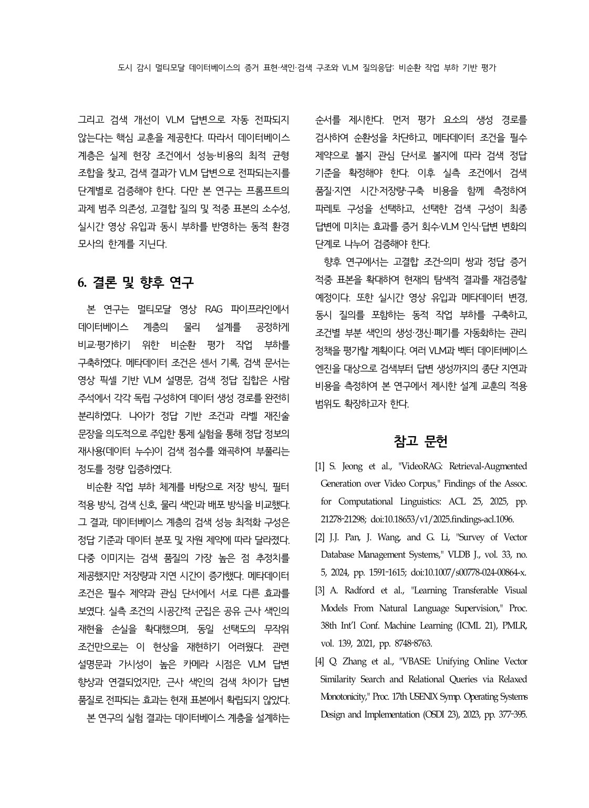

# 5.3–6. 교훈, 한계, 결론과 재현 주의

## 실무 설계 순서

1. 질의·조건·문서·qrels의 생성 계보를 감사해 순환성을 먼저 차단한다.
2. 메타데이터 조건이 필수 제약인지 관심 단서인지 정한다.
3. strict와 semantic 정답 계약을 분리해 측정한다.
4. 검색용 데이터 표현의 품질·p50/p95·저장량을 함께 비교한다.
5. 실제 predicate와 동일 선택도의 무작위 predicate를 짝지어 ANN 손실을 측정한다.
6. Flat 대비 recall과 SLA를 만족하는 전역 색인을 먼저 찾는다.
7. 실패하는 hot predicate에만 조건별 부분 색인을 배포한다.
8. 검색 결과가 실제 top-k와 VLM 입력, 최종 답변을 바꾸는지 단계별로 검증한다.

## 조건부 의사결정 표

| 상황 | 우선 후보 | 반드시 확인할 위험 |
|---|---|---|
| 낮은 비용, 일반 의미 검색 | 영상 설명문 또는 단일 결합 벡터 | 캡션 누락·인코더 의존성 |
| 의미 품질 우선, 저장·지연 여유 | 다중 이미지 | 2.8배 저장·3배 지연, 다중비교 보정 |
| 명시 조건을 반드시 준수 | 검색 전 조건 적용 | strict 정의상 자명한 이득인지 |
| 관심 단서, 저결합 | 벡터 단독 | 조건 위반을 UI/후처리로 처리할지 |
| 관심 단서, 고결합 | 사전 필터 후보 | 고결합 표본의 외적 타당성 |
| 약한 BM25 신호 | 융합 보류 | RRF가 dense 순위를 희석할 수 있음 |
| 반복 대규모 무필터 검색 | HNSW 또는 조정된 IVF-Flat | 구축·메모리·seed 안정성 |
| 강한 군집·낮은 선택도 hot 조건 | 조건별 부분 HNSW/Flat | 갱신비와 손익분기 |
| 저빈도 cold 조건 | 전역 경로 또는 정확 fallback | 꼬리 지연 |
| VLM 답변 개선 목적 | 관련성·가시성 높은 소수 검색 문맥 | 지각 한계·질문 편향·중복 |

## 연구의 핵심 교훈

- 정답 정보 누수가 있는 높은 점수보다 비순환 조건의 낮은 점수가 더 유용하다.
- 필터의 가치는 선택도 하나가 아니라 질의 계약과 조건–관련성 결합도에 달려 있다.
- 저장 표현의 품질 우위는 비용과 통계적 불확실성을 함께 보고 해석해야 한다.
- 실제 시공간 군집을 무시한 random-mask 벤치마크는 filtered-ANN 손실을 크게 과소평가할 수 있다.
- 검색 단계 최적화와 최종 답변 최적화는 같은 문제가 아니다.

## 타당성 위협

### 구성 타당성

- strict qrels는 메타데이터 조건을 정의에 포함하므로 사전 필터에 구조적 이점이 있다.
- semantic qrels도 사람 주석의 범위와 누락에 의존한다.
- VLM 설명문은 화면의 미세 객체·부정·시간 변화를 누락할 수 있다.

### 내적 타당성

- 인코더와 표현을 동시에 바꾸면 표현 효과와 모델 효과가 섞인다.
- warm-up, 캐시, 스레드, DB 왕복 경계가 지연 결과에 영향을 준다.
- 검색 문맥 자체가 답변 선택 편향을 만들 수 있다.

### 외적 타당성

- 주 평가 코퍼스는 3,000클립으로 실제 24시간 관제 규모보다 작다.
- UCA는 독립 센서 채널이 없어 완전한 tri-source가 아닌 2.5-channel 이식이다.
- 고결합 질의와 RQ6 증거 적중 표본이 적다.
- 엔진의 fallback·planner 정책은 버전과 데이터 분포에 따라 달라진다.

### 통계적 결론 타당성

- 질의들이 같은 조건–의미 쌍을 공유해 독립이 아닐 수 있다.
- 112개 구성의 다중 비교에서 1종 오류가 증가한다.
- 작은 RQ6 차이는 검정력이 부족해 “효과 없음”과 “미확립”을 구분해야 한다.

### 시스템 범위

- 실시간 스트리밍 적재, 동시 부하, 자동 부분 색인 생성·갱신·폐기는 구현하지 않았다.
- 캡션·임베딩 생성의 GPU 비용은 온라인 검색 지연에서 제외됐다.
- 원본 영상 보존과 개인정보·보안·감사 정책은 별도 운영 문제다.

## 향후 연구

- 고결합 조건–의미 쌍과 정답 증거 적중 표본 확대
- 실시간 영상 유입·메타데이터 변경·동시 질의가 포함된 동적 작업 부하
- 조건별 부분 색인의 생성·갱신·폐기 자동화
- 여러 VLM과 벡터 DB 엔진의 종단 지연·비용 비교
- 시간 관계를 포함하는 클립·프레임 패킷 설계와 답변 편향 통제

## 최종 결론

본 연구는 메타데이터 조건, 픽셀 기반 검색 문서, 사람 qrels를 독립 생성해 벡터 데이터베이스 평가의 순환성을 차단했다. 통제 주입으로 정답 정보 재사용이 nDCG를 심각하게 부풀림을 확인했다. 이 토대에서 검색용 데이터, 조건 계획, 신호, 물리 색인과 배포를 비교한 결과 최적 구성은 정답 계약·실제 데이터 분포·자원 제약에 따라 달라졌다. 관련 설명문과 좋은 시점은 VLM 답변에 도움이 됐지만 ANN 차이의 답변 전파는 아직 미확립이다.

따라서 핵심 설계 원칙은 다음 한 문장으로 정리된다.

> **먼저 비순환 평가 계약을 확립하고, 실제 predicate 분포에서 품질·지연·저장·구축 비용의 파레토 후보를 선택한 뒤, 그 선택이 최종 답변까지 전파되는지를 별도 단계로 검증하라.**

## 제출본과 후속 문서의 무결성 주의

- 제출 논문의 품질 평가 계약은 `19,040건`이다. `19,400건`이 아니다.
- `Llama-3-8B`는 RQ6 보완 실험의 답변 생성기다. 독립 judge 패널이라는 근거는 없다.
- 제출본에서 Qwen 정렬 통제 주입 기준선은 `0.181005`, 별도 BGE 트랙은 `0.170033`이다.
- 제출본 그림 2의 VRU 메타데이터 수정 후 semantic 막대는 `0.136`으로 표시되지만, Note PDF의 확장 표 B0 semantic에는 `0.1449`가 적혀 있다. 제출본 표 3은 B0 행을 싣지 않아 본 문서에서는 이 값을 핵심 결론에 사용하지 않는다. 원자산을 재실행하기 전 두 값을 임의로 통합하지 않는다.
- 본문 7쪽 이후 남은 구 제목 running head는 편집 잔존물이며 논문 제목·연구 범위를 바꾸지 않는다.
- “데이터베이스 계층”은 최신 용어 정리에서 “벡터 데이터베이스 계층”으로 명확화할 수 있다.
- 단위로서의 `클립`은 mp4 영상 파일 하나이고, 대문자 `CLIP`은 시각–언어 임베딩 모델이다.

---

## 논문 원문 — 5.3 교훈 및 한계·6. 결론 및 향후 연구

> 출처: `paper_final.pdf` 19쪽. 19쪽 후반에는 참고문헌이 시작된다.

[제출 PDF 19쪽 열기](../paper_final.pdf#page=19)

### 제출 PDF 19쪽

