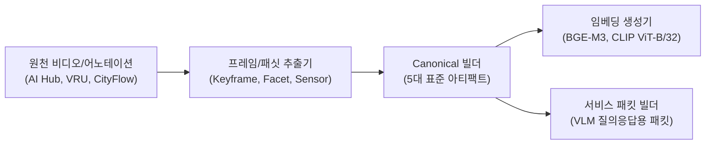

# [01] 데이터 구축 및 정규화 스크립트 (`01_dataset_canonicalization/`)

본 디렉터리는 다양한 원천 도메인(AI Hub 교차로/이상행동/다각도 CCTV, VRU 보행자 사고, CityFlow-NL 등)의 비디오 및 센서 데이터를 **단일한 표준 5대 Canonical 아티팩트**(`corpus.parquet`, `queries.parquet`, `qrels_strict.parquet`, `qrels_semantic.parquet`, `metadata_splits.json`)로 가공하고, 임베딩 및 멀티모달 서비스 패킷을 빌드하는 스크립트 모음(총 28개)을 관리합니다.

---

## 🧭 파이프라인 내 역할 및 아키텍처



---

## 📂 스크립트 카탈로그 및 상세 명세

### 1. 정본 아티팩트 빌더 (Canonical Builders)

| 파일명 | 대상 데이터셋 | 주요 출력 아티팩트 | 구현 목적 및 핵심 역할 |
|---|---|---|---|
| [`build_vru_canonical.py`](build_vru_canonical.py) | VRU 보행자 사고 | `Datasets/processed/vru_accident/20260706/canonical/` | VRU 사고 영상 클립에 대해 5대 정본 아티팩트(Corpus, Queries, Qrels Strict/Semantic)를 생성합니다. |
| [`build_aihub_cctv_canonical.py`](build_aihub_cctv_canonical.py) | AI Hub 지능형 CCTV | `Datasets/processed/aihub_intelligent_cctv/20260706/canonical/` | 이상행동/침입 CCTV 영상을 파싱하여 표준 질의 및 정답 쌍 아티팩트를 빌드합니다. |
| [`build_aihub_multi_angle_cctv_canonical.py`](build_aihub_multi_angle_cctv_canonical.py) | AI Hub 71953 (다각도) | `Datasets/processed/aihub_multi_angle/20260708/canonical/` | 동일 사건에 대한 다각도(Multi-view) CCTV 클립을 동기화하여 정본 데이터셋을 구축합니다. |
| [`build_cityflow_nl_canonical.py`](build_cityflow_nl_canonical.py) | CityFlow-NL | `Datasets/processed/cityflow_nl/staging/` | 도시 교차로 차량 추적 자연어 질의 데이터를 정규화하여 벤치마크 입력으로 변환합니다. |
| [`build_intersection_signal_canonical.py`](build_intersection_signal_canonical.py) | 교차로 신호체계 | `Datasets/processed/intersection_signal/canonical/` | 522개 교차로 센서 데이터를 시계열 스키마에 맞게 정규화하고 비순환 워크로드를 빌드합니다. |
| [`build_intersection_trisource_canonical.py`](build_intersection_trisource_canonical.py) | 교차로 Tri-Source | `Datasets/processed/intersection_trisource/canonical/` | 텍스트 설명문, 시각 키프레임, 센서 로그를 삼중 결합한 비순환 정본 아티팩트를 생성합니다. |

### 2. 비디오 프레임 추출 및 실체화 (Video & Frame Extraction)

| 파일명 | 주요 기능 | 구현 목적 및 핵심 역할 |
|---|---|---|
| [`prepare_aihub_cctv_raw.py`](prepare_aihub_cctv_raw.py) | 원천 zip 압축 해제 및 검증 | 원천 CCTV 아카이브의 체크섬을 확인하고 실험 디렉터리에 안전하게 배치합니다. |
| [`extract_keyframes.py`](extract_keyframes.py) | 대표 키프레임 추출 | 비디오 클립 내 주요 장면 전환 및 시간 축 균등 키프레임을 추출하여 이미지로 저장합니다. |
| [`extract_intersection_visual_sources.py`](extract_intersection_visual_sources.py) | 교차로 시각 소스 추출 | 522개 교차로 비디오에서 실험에 필요한 고해상도 시각 프레임을 일괄 추출합니다. |
| [`materialize_aihub_multi_angle_evidence_frames.py`](materialize_aihub_multi_angle_evidence_frames.py) | 정답 증거 프레임 실체화 | 다각도 CCTV 영상 중 사건 발생 구간의 핵심 증거 프레임을 실체화합니다. |
| [`materialize_aihub_multi_angle_context_frames.py`](materialize_aihub_multi_angle_context_frames.py) | 문맥/교란자 프레임 추출 | 이벤트 전후의 비사건 구간 및 교란(Distractor) 프레임을 추출하여 VLM 편향 평가용 세트를 준비합니다. |
| [`build_canonical_subset_from_frames.py`](build_canonical_subset_from_frames.py) | 공정 서브셋 필터링 | 프레임 실체화가 정상 완료된 클립들만 엄선하여 정본 부분집합을 재구성합니다. |
| [`sample_aihub_multi_angle_stratified_clips.py`](sample_aihub_multi_angle_stratified_clips.py) | 층화 무작위 샘플링 | 이벤트 유형, 카메라 각도, 시간대별 비율을 유지하는 결정론적 층화 샘플을 생성합니다. |

### 3. 멀티모달 특징 및 임베딩 생성 (Features & Embeddings)

| 파일명 | 인코더 / 모델 | 구현 목적 및 핵심 역할 |
|---|---|---|
| [`build_text_embeddings.py`](build_text_embeddings.py) | BAAI/bge-m3, e5-large-v2 | 텍스트 설명문 및 자연어 질의에 대한 밀집(Dense) 임베딩 벡터를 생성합니다. |
| [`build_intersection_frame_clip.py`](build_intersection_frame_clip.py) | OpenAI CLIP ViT-B/32 | 추출된 522개 교차로 프레임 전체에 대한 시각 임베딩 벡터를 빌드합니다. |
| [`build_intersection_captions.py`](build_intersection_captions.py) | VLM 고밀도 캡셔닝 | 비디오 클립의 핵심 행동 및 객체 관계를 포착하는 문서 레이어 설명문을 자동 생성합니다. |
| [`build_intersection_annotation_facets.py`](build_intersection_annotation_facets.py) | CVAT 라벨링 | 인간 어노테이터의 CVAT 라벨로부터 프레임/비디오 단위 시각적 연관성 패싯을 추출합니다. |
| [`build_intersection_signal_sensors.py`](build_intersection_signal_sensors.py) | 센서 시계열 | 교차로 루프 검지기 및 신호제어기 로그를 시계열 수치 패싯으로 실체화합니다. |
| [`build_visual_sensor_join.py`](build_visual_sensor_join.py) | 모달리티 결합 | 시각 프레임의 타임스탬프와 센서 로그 레코드를 클립 단위로 완전 조인합니다. |

### 4. 서비스 패킷 및 계층화 (Packets & Stratum)

| 파일명 | 출력 형식 | 구현 목적 및 핵심 역할 |
|---|---|---|
| [`build_bbox_asymmetry_stratum.py`](build_bbox_asymmetry_stratum.py) | 층화 메타데이터 | 카메라 간 시점 차이로 인해 객체 크기/시인성이 비대칭인 클립 계층을 구축합니다. |
| [`build_aihub_multi_angle_service_packets.py`](build_aihub_multi_angle_service_packets.py) | JSON 서비스 패킷 | 다각도 CCTV 검색 후보를 VLM 답변 추론용 표준 입력 패킷으로 포장합니다. |
| [`build_service_testbed_packets.py`](build_service_testbed_packets.py) | 종단 평가 패킷 | Top-k 검색 결과와 질문/보기 메타데이터를 결합한 종단 테스트베드 패킷을 생성합니다. |

### 5. 절제 진단 및 통합 검증 스위트 (Diagnostics & Full Suite)

| 파일명 | 실험 성격 | 구현 목적 및 핵심 역할 |
|---|---|---|
| [`analyze_prompt_target_ablation.py`](analyze_prompt_target_ablation.py) | 절제 분석 | Task-aware 질의와 Task-neutral 설명문 검색 간의 쌍대(Paired) 검색 성능 차이를 진단합니다. |
| [`evaluate_event_frame_grounding.py`](evaluate_event_frame_grounding.py) | 정밀 접지율 측정 | 회수된 프레임이 라벨링된 이벤트 구간에 실제로 위치하는지 접지 정밀도를 측정합니다. |
| [`export_multimodal_qualitative_examples.py`](export_multimodal_qualitative_examples.py) | 정성적 분석 | 논문 작성용 멀티모달 검색 성공/실패 사례 및 프레임-텍스트 정렬 예시를 추출합니다. |
| [`run_external_same_encoder_storage_control.py`](run_external_same_encoder_storage_control.py) | 동일 인코더 통제 | 동일 인코더 조건 하에서 설명문/단일프레임/다중프레임의 저장 단위 성능을 통제 비교합니다. |
| [`summarize_advanced_ablation_results.py`](summarize_advanced_ablation_results.py) | 논문 보강 요약 | 심사 리비전을 위해 추가된 고급 절제 실험 결과들을 표 형식으로 통합 요약합니다. |
| [`run_full_verification_suite.py`](run_full_verification_suite.py) | 원터치 통합 검증 | 전체 데이터 전처리 및 아티팩트 무결성 체인을 1-Pass로 전수 검사합니다. |

---

## 🚀 대표 실행 예시

```bash
# 1. VRU 보행자 사고 정본 아티팩트 빌드
python 04_scripts/01_dataset_canonicalization/build_vru_canonical.py

# 2. 비디오 키프레임 추출 (5개 프레임 균등 분할)
python 04_scripts/01_dataset_canonicalization/extract_keyframes.py --dataset vru_accident --num-frames 5

# 3. 텍스트 임베딩 생성 (BGE-M3)
python 04_scripts/01_dataset_canonicalization/build_text_embeddings.py \
  --workload-root /home/explorer/vectorDB/experiments/db/KIISE_datasociety/Datasets/processed/vru_accident/20260706/canonical \
  --model-name BAAI/bge-m3

# 4. 전체 데이터셋 정본 검증 스위트 실행
python 04_scripts/01_dataset_canonicalization/run_full_verification_suite.py
```

---

## 🔗 선후행 의존 관계

- **선행 조건**: `00_setup_and_resources/`의 가상환경 구축 및 사전학습 모델 캐싱 완료
- **후행 단계**: 본 디렉터리에서 생성된 정본 Parquet 파일과 임베딩은 `02_rq1_circularity/` ~ `05_rq5_filtered_ann_index/`의 모든 벤치마크 실험의 기반 데이터로 공급됩니다.
