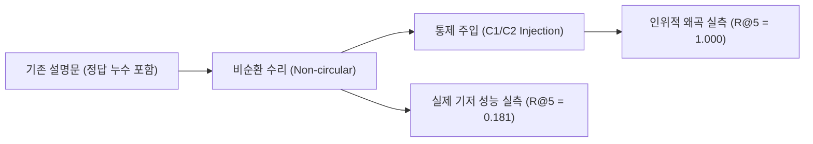

# [02] RQ1 메타데이터 순환성 통제 스크립트 (`02_rq1_circularity/`)

본 디렉터리는 KIISE-DBR 2026 논문의 **[RQ1] 정답 누수 순환성(Circularity) 진단 및 통제 주입 실험**을 총괄하는 스크립트 모음(총 6개)을 관리합니다.

논문 대응 위치: **제5장 §5.1 (순환성 진단 및 비순환 수리), 표 3 (C1/C2 통제 주입 및 성능 왜곡 실측)**

---

## 🧭 연구 가설 및 실험 배경

비디오 RAG 시스템에서 메타데이터나 정답 라벨(예: "보행자_무단횡단_사고")이 텍스트 설명문(Caption)에 그대로 노출되면, 실제 검색 모델의 시각적 식별 능력이 아닌 단순 키워드 일치에 의해 성능이 비정상적으로 과대평가되는 **정답 누수 순환성(Ground-Truth Circularity)**이 발생합니다.

- **원천 순환성 제거 (Non-circular Repair)**: 메타데이터 라벨 어휘를 제거한 순수 시각 묘사 기반 정본 구축
- **통제 주입 (Controlled Injection)**: 정답 레이블을 의도적으로 주입(C1: 정규 라벨 주입, C2: 의사 환문 라벨 주입)했을 때 Recall@k가 $0.181$에서 $1.000$까지 약 4.5배 인위적으로 급증함을 증명



---

## 📂 스크립트 카탈로그 및 상세 명세

| 파일명 | 유형 | 주요 입출력 아티팩트 | 구현 목적 및 핵심 역할 |
|---|:---:|---|---|
| [`build_aihub_cctv_noncircular_canonical.py`](build_aihub_cctv_noncircular_canonical.py) | 데이터 수리 | 입력: AI Hub 지능형 CCTV 원본<br>출력: `canonical_noncircular/` | 지능형 CCTV 설명문에서 사전 정의된 이벤트 클래스명 누수를 정규식 및 어휘 필터로 제거한 비순환 정본 워크로드를 구축합니다. |
| [`build_vru_noncircular_canonical.py`](build_vru_noncircular_canonical.py) | 데이터 수리 | 입력: VRU 사고 원본<br>출력: `vru_accident/.../canonical_noncircular/` | VRU 보행자 사고 설명문에서 사고 유형 태그 및 위치 단서를 제거하여 공정한 벤치마크 워크로드를 생성합니다. |
| [`run_circularity_controlled_injection.py`](run_circularity_controlled_injection.py) | 실험 벤치마크 | 출력: `results/circularity_injection_receipt.json` | 동결된 AIHub-522 워크로드에 C1(정규 클래스명) 및 C2(동의어/환문) 주입 실험을 수행하여 성능 왜곡 델타($\Delta Recall$)를 실측합니다. |
| [`run_qwen_aligned_circularity_control.py`](run_qwen_aligned_circularity_control.py) | 실험 벤치마크 | 출력: `results/qwen_aligned_circularity.json` | 5대 설계 축 결합 그리드와 동일한 Qwen2-VL 임베딩 공간에서 C1/C2 통제 주입을 실행하여 임베딩 모델에 무관한 순환성 효과를 입증합니다. |
| [`verify_circularity_controlled_injection.py`](verify_circularity_controlled_injection.py) | 독립 검증 | 입력: `circularity_injection_receipt.json` | C1/C2 통제 주입 결과 영수증(Receipt)의 해시, 재현 지표(R@1, R@5, MRR) 및 델타 값의 무결성을 독립 감사(Audit)합니다. |
| [`verify_qwen_aligned_circularity.py`](verify_qwen_aligned_circularity.py) | 독립 검증 | 입력: `qwen_aligned_circularity.json` | Qwen 정렬 공간에서의 통제 주입 결과 수치가 논문 표 3 기재 수치와 100% 일치하는지 자동 검증합니다. |

---

## 🚀 대표 실행 예시

```bash
# 1. AI Hub CCTV 비순환 정본 데이터셋 생성
python 04_scripts/02_rq1_circularity/build_aihub_cctv_noncircular_canonical.py

# 2. C1/C2 통제 주입 벤치마크 실행 (표 3 재현)
python 04_scripts/02_rq1_circularity/run_circularity_controlled_injection.py

# 3. 주입 실험 영수증 독립 검증
python 04_scripts/02_rq1_circularity/verify_circularity_controlled_injection.py
```

---

## 🔗 선후행 의존 관계

- **선행 조건**: `01_dataset_canonicalization/`에서 원천 데이터 파싱 및 기본 정본이 구축되어 있어야 합니다.
- **후행 단계**: 순환성이 제거된 공정 워크로드는 `03_rq2_storage_representation/` (저장 단위 비교) 및 `04_rq3_rq4_retrieval_fusion/` (검색 전략 비교)로 전달되어 객관적인 모델 평가의 기준선(Baseline)이 됩니다.
