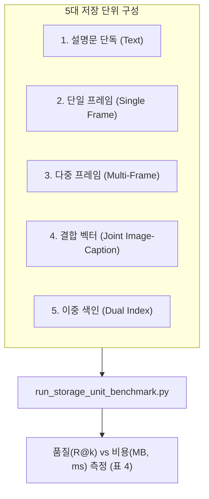

# [03] RQ2 증거 저장 단위 및 표현 비교 스크립트 (`03_rq2_storage_representation/`)

본 디렉터리는 KIISE-DBR 2026 논문의 **[RQ2] 벡터 데이터베이스 증거 저장 단위 및 멀티모달 표현 방식(Storage Representation) 비교 실험**을 총괄하는 스크립트 모음(총 17개)을 관리합니다.

논문 대응 위치: **제5장 §5.2 (저장 단위 및 표현 방식 비교), 표 4 (5대 저장 단위 품질-비용 평가)**

---

## 🧭 연구 가설 및 5대 저장 단위

비디오 데이터는 텍스트 설명문, 단일 이미지, 다중 프레임, 결합 벡터 등 다양한 형태로 벡터 DB에 저장될 수 있습니다. 본 연구는 검색 품질(Recall@k), 저장 공간(MB), 색인 생성 시간, 검색 지연시간(Latency) 간의 **품질-비용 트레이드오프(Quality-Cost Trade-off)**를 실측 비교합니다.

1. **설명문 단독 (Text Caption)**: VLM 고밀도 설명문을 텍스트 인코더(BGE-M3)로 벡터화
2. **단일 프레임 (Single Frame)**: 클립의 대표 키프레임을 시각 인코더(CLIP / Qwen-VL)로 벡터화
3. **다중 프레임 (Multi-Frame)**: 3~5개의 균등 시간 키프레임을 독립 벡터화 (다중 벡터 색인)
4. **결합 표현 (Joint Image-Caption)**: 이미지와 설명문을 동일 인코더 공간에서 단일 벡터로 융합
5. **이중 색인 (Dual Index)**: 텍스트 벡터 색인과 시각 벡터 색인을 물리적으로 분리 구축 후 RRF 융합



---

## 📂 스크립트 카탈로그 및 상세 명세

### 1. 5대 저장 단위 벤치마크 및 결합 실험

| 파일명 | 주요 역할 및 논문 대응 | 주요 입출력 아티팩트 |
|---|---|---|
| [`run_storage_unit_benchmark.py`](run_storage_unit_benchmark.py) | **[표 4 핵심]** 5개 저장 단위에 대해 동일 522 클립/85 질의 벤치마크를 수행하여 품질 및 비용 메트릭을 도출합니다. | 입력: `canonical/`<br>출력: `results/storage_unit_benchmark_results.json` |
| [`build_qwen3_joint_image_caption_assets.py`](build_qwen3_joint_image_caption_assets.py) | Qwen2/3-VL 멀티모달 공간에서 이미지+캡션을 동일 1개 벡터로 투영한 자산을 실체화합니다. | 출력: `assets/qwen3_joint_vectors.parquet` |
| [`build_qwen3_unified_assets.py`](build_qwen3_unified_assets.py) | 인코더 통제를 위해 동일 Qwen 모델에서 텍스트와 시각 임베딩을 통합 추출합니다. | 출력: `assets/qwen3_unified_assets.parquet` |
| [`evaluate_joint_image_caption_controls.py`](evaluate_joint_image_caption_controls.py) | 동일 벡터 용량 예산(Equal-budget) 하에서 결합 벡터의 검색 성능을 통제 평가합니다. | 출력: `results/joint_controls_eval.json` |
| [`verify_joint_image_caption_experiment.py`](verify_joint_image_caption_experiment.py) | 결합 이미지-캡션 임베딩 생성 및 검색 결과의 재현성 영수증을 독립 검증합니다. | 입력: 영수증 JSON 검증 |

### 2. 시각 프레임 임베딩 및 예산 통제

| 파일명 | 주요 역할 |
|---|---|
| [`build_visual_embeddings.py`](build_visual_embeddings.py) | 추출된 비디오 프레임에 대해 CLIP / Qwen 기반 시각 임베딩 및 크로스모달 질의 임베딩을 생성합니다. |
| [`make_visual_embedding_frame_subsets.py`](make_visual_embedding_frame_subsets.py) | 프레임 예산(1, 3, 5프레임)에 따른 부분집합을 분할 구성하여 다중 프레임 색인 실험을 준비합니다. |

### 3. 설명문 모델 절제 및 품질 감사 (Caption Model Ablation)

| 파일명 | 주요 역할 |
|---|---|
| [`run_caption_model_ablation.py`](run_caption_model_ablation.py) | 다양한 VLM 생성 모델(LLaVA, Qwen-VL 등)에 따른 설명문 생성 절제 실험을 수행합니다. |
| [`run_caption_ablation_downstream.py`](run_caption_ablation_downstream.py) | 생성된 설명문 모델별 다운스트림 검색 성능(Dual Qrels)을 자동 채점합니다. |
| [`evaluate_caption_ablation_dual_qrels.py`](evaluate_caption_ablation_dual_qrels.py) | 저장된 순위 결과를 Strict(정밀 6,809쌍) 및 Semantic(의미 24,872쌍) Qrels로 재평가합니다. |
| [`analyze_caption_model_ablation.py`](analyze_caption_model_ablation.py) | 설명문 모델 절제 결과를 통합 집계하고 무결성 게이트를 통과하는지 확인합니다. |
| [`finalize_caption_model_ablation.py`](finalize_caption_model_ablation.py) | 모든 절제 라인이 완료될 때까지 대기 후 최종 집계 파이프라인을 실행합니다. |
| [`audit_caption_ablation_output.py`](audit_caption_ablation_output.py) | 생성된 설명문의 텍스트 길이, 토큰 수 및 누락 여부를 감사(Audit)합니다. |
| [`build_caption_ablation_inputs.py`](build_caption_ablation_inputs.py) | 절제 실험에 투입되는 정확한 이미지 입력 세트를 동결(Freeze)합니다. |
| [`build_caption_quality_pilot.py`](build_caption_quality_pilot.py) | 522개 VLM 설명문에 대한 정성적 인간 신뢰성 검증 파일럿 데이터를 구축합니다. |
| [`aggregate_caption_quality.py`](aggregate_caption_quality.py) | 수집된 인간 평가 점수를 집계하여 신뢰도 지표를 산출합니다. |
| [`analyze_caption_content_diagnostics.py`](analyze_caption_content_diagnostics.py) | 생성된 설명문 내 어휘 다양성 및 정답 접지 어휘 분포를 진단합니다. |

---

## 🚀 대표 실행 예시

```bash
# 1. 5대 저장 단위 품질-비용 벤치마크 실행 (표 4 재현)
python 04_scripts/03_rq2_storage_representation/run_storage_unit_benchmark.py

# 2. Qwen 멀티모달 결합 벡터 생성 및 통제 평가
python 04_scripts/03_rq2_storage_representation/build_qwen3_joint_image_caption_assets.py
python 04_scripts/03_rq2_storage_representation/evaluate_joint_image_caption_controls.py

# 3. 캡션 생성 모델별 Dual Qrels 다운스트림 평가
python 04_scripts/03_rq2_storage_representation/evaluate_caption_ablation_dual_qrels.py
```

---

## 🔗 선후행 의존 관계

- **선행 조건**: `01_dataset_canonicalization/`의 키프레임 및 원천 설명문, `02_rq1_circularity/`의 비순환 워크로드
- **후행 단계**: 여기서 도출된 최적 저장 표현(이중 색인 및 고품질 설명문)은 `04_rq3_rq4_retrieval_fusion/` (검색 계획 및 신호 융합) 및 `05_rq5_filtered_ann_index/` (물리 색인 구축)에 투입됩니다.
