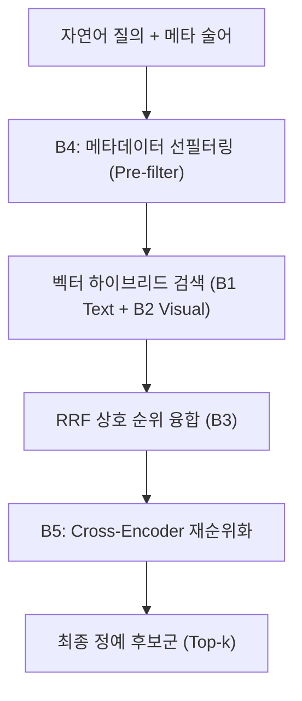

# [04] RQ3·4 검색 계획 및 신호 융합 스크립트 (`04_rq3_rq4_retrieval_fusion/`)

본 디렉터리는 KIISE-DBR 2026 논문의 **[RQ3] 다중 모달 검색 계획(Retrieval Planning) 비교** 및 **[RQ4] 이종 신호 융합(Signal Fusion)과 지식그래프(KG) 실효성 검증**을 총괄하는 스크립트 모음(총 9개)을 관리합니다.

논문 대응 위치:
- **제5장 §5.3 (다중 모달 검색 계획 및 고결합 필터링 효과), 표 5 (B0~B5 검색 전략 비교)**
- **제5장 §5.4 (이종 신호 융합 및 지식그래프 실효성 검증), 표 6 (RRF 가중치 및 KG 붕괴 실측)**

---

## 🧭 연구 가설 및 검색 전략 체계

1. **B0~B5 검색 베이스라인 체계**:
   - `B0`: 키워드 희소 검색 (BM25)
   - `B1`: 텍스트 밀집 검색 (BGE-M3 Dense)
   - `B2`: 시각 밀집 검색 (CLIP / Qwen-VL Frame)
   - `B3`: 단순 후결합 융합 (Late Fusion RRF: B1 + B2)
   - `B4`: **[제안 기법]** 메타데이터 선필터링 + 멀티모달 결합 검색 (Pre-filter + Hybrid)
   - `B5`: 교차 인코더 재순위화 (Cross-encoder Reranker: `bge-reranker-v2-m3`)
2. **고결합 메타데이터 선필터링 ($V \ge 0.3$)**:
   - 시간/공간/객체 클래스 메타데이터와 질의 간 결합도(Cramér's V)가 높을 때, 단순 벡터 후필터링(Post-filtering) 대비 선필터링(Pre-filtering)이 탐색 공간을 극적으로 압축하고 회수율을 보장함을 입증
3. **지식그래프(KG) 붕괴 영수증 (KG Collapse Receipt)**:
   - 비정형 CCTV 관제 환경에서 고비용 지식그래프(KG) 색인이 관계 추출 노이즈로 인해 벡터+관계형 하이브리드 검색 대비 성능이 역전(Collapse)됨을 실측 증명



---

## 📂 스크립트 카탈로그 및 상세 명세

| 파일명 | 유형 | 논문 대응 | 구현 목적 및 핵심 역할 |
|---|:---:|:---:|---|
| [`run_retrieval_baselines.py`](run_retrieval_baselines.py) | 벤치마크 | **표 5** | B0(BM25)부터 B5까지 6대 표준 검색 전략을 실행하고 Recall@k, MRR, nDCG를 측정합니다. |
| [`run_multimodal_fusion_baselines.py`](run_multimodal_fusion_baselines.py) | 융합 실험 | **표 6** | 텍스트 증거 순위와 시각 프레임 순위를 RRF(Reciprocal Rank Fusion)로 결합하는 융합을 수행합니다. |
| [`run_weighted_fusion_rerank_sweep.py`](run_weighted_fusion_rerank_sweep.py) | 파라미터 스윕 | **표 6** | 텍스트 대 시각 가중치 비율($\alpha : 1-\alpha$)을 0.0부터 1.0까지 0.1 단위로 탐색하여 최적 RRF 계수를 도출합니다. |
| [`run_reranker_selection.py`](run_reranker_selection.py) | 고도화 | B5 구현 | `bge-reranker-v2-m3` 모델을 사용하여 상위 50개 융합 후보군에 대한 정밀 재순위화를 수행합니다. |
| [`run_coupling_blocked_validation.py`](run_coupling_blocked_validation.py) | 강건성 검증 | §5.3 심층 분석 | 교차로 차단(Blocked) 및 고결합($V \ge 0.3$) 상황에서 B4 선필터링이 B2 순수 시각 대비 우수함을 교차 검증합니다. |
| [`run_visual_retrieval_baselines.py`](run_visual_retrieval_baselines.py) | 시각 벤치마크 | B2 상세 | 텍스트 질의와 비디오 프레임 임베딩 간 코사인 유사도 기반 단독 시각 검색 베이스라인을 구축합니다. |
| [`run_image_to_video_retrieval.py`](run_image_to_video_retrieval.py) | 확장 벤치마크 | 이미지 질의 | 자연어 질의 대신 고립된 대표 키프레임을 질의 이미지로 사용하여 유사 비디오 클립을 검색합니다. |
| [`kg_collapse_receipt.py`](kg_collapse_receipt.py) | 영수증 검증 | §5.4 (사전등록 판정 420) | 지식그래프 색인 기반 검색이 고유 노이즈로 인해 하이브리드 벡터 검색 대비 붕괴함을 증명하는 공식 영수증을 생성합니다. |
| [`analyze_retrieval_error_cases.py`](analyze_retrieval_error_cases.py) | 오류 진단 | 정성 분석 | 검색 순위가 낮게 나온 질의들을 전수 수집하여 메타 불일치, 어휘 불일치, 시각 가림 등 원인별 오류를 분류합니다. |

---

## 🚀 대표 실행 예시

```bash
# 1. B0~B5 표준 검색 전략 베이스라인 일괄 실행 (표 5 재현)
python 04_scripts/04_rq3_rq4_retrieval_fusion/run_retrieval_baselines.py

# 2. 텍스트/시각 RRF 가중치 그리드 스윕 (표 6 재현)
python 04_scripts/04_rq3_rq4_retrieval_fusion/run_weighted_fusion_rerank_sweep.py

# 3. Cross-Encoder 재순위화 파이프라인 구동
python 04_scripts/04_rq3_rq4_retrieval_fusion/run_reranker_selection.py

# 4. 사전등록 지식그래프(KG) 붕괴 영수증 확인
python 04_scripts/04_rq3_rq4_retrieval_fusion/kg_collapse_receipt.py
```

---

## 🔗 선후행 의존 관계

- **선행 조건**: `03_rq2_storage_representation/`에서 구축된 텍스트 및 시각 임베딩 파일
- **후행 단계**: 여기서 필터링 및 융합된 상위-k 검색 결과는 `06_rq6_vlm_qa_propagation/` (3관문 VLM QA 전파)로 전달되어 VLM의 최종 답변 생성 입력 문맥으로 공급됩니다.
