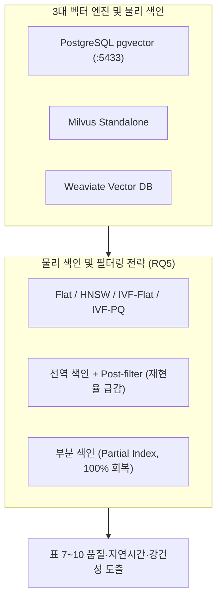

# [05] RQ5 Filtered-ANN 색인 및 엔진 벤치마크 스크립트 (`05_rq5_filtered_ann_index/`)

본 디렉터리는 KIISE-DBR 2026 논문의 핵심 데이터베이스 시스템 기여점인 **[RQ5] 메타데이터 결합 조건에서의 물리 색인 구조(Flat, HNSW, IVF)와 부분 색인(Partial Index) 최적화 및 3대 엔진 크로스 벤치마크**를 총괄하는 스크립트 모음(총 23개)을 관리합니다.

논문 대응 위치:
- **제5장 §5.5 (물리 색인 구조 및 필터링 전략), 표 7 (4대 색인 및 필터 결합 실측), 표 8 (부분 색인의 100% 회복 실측)**
- **제5장 §5.6 (3대 엔진 크로스 검증 및 대규모 강건성), 표 9 (pgvector vs Milvus vs Weaviate), 표 10 (143,830 벡터 5개 시드 강건성)**

---

## 🧭 핵심 연구 질문 및 시스템 기여

1. **Filtered-ANN 역설(Pitfall) 규명**:
   - 메타데이터 통과율(Selectivity)이 낮을 때, 전역 HNSW/IVF 인덱스에 후필터링(Post-filtering)을 적용하면 유효 경로 단절로 인해 ANN Recall이 급격히 붕괴하는 현상을 실측
2. **PostgreSQL pgvector 부분 색인(Partial Index) 기여 (P2)**:
   - 빈번한 메타데이터 술어에 대해 조건부 색인(`CREATE INDEX ... WHERE predicate`)을 구축함으로써 **전역 색인 대비 100% 재현율 회복 및 획기적인 검색 지연시간 단축**을 실증
3. **Hot/Cold 술어 색인 정책 (P3)**:
   - 접근 빈도와 선택도를 기반으로 부분 색인 생성 여부를 결정하는 시스템 최적화 정책 제안
4. **3대 벡터 엔진 크로스 검증 및 14.3만 규모 5-시드 강건성**:
   - PostgreSQL 16 pgvector(:5433), Milvus, Weaviate에서 동일한 현상이 재현됨을 입증하고, 143,830개 벡터 환경에서 5개 시드에 대한 통계적 안정성을 증명



---

## 📂 스크립트 카탈로그 및 상세 명세

### 1. PostgreSQL pgvector 물리 색인 및 부분 색인 (Core DB Contribution)

| 파일명 | 주요 기여 | 논문 대응 | 구현 목적 및 핵심 역할 |
|---|:---:|:---:|---|
| [`run_pgvector_partial_index.py`](run_pgvector_partial_index.py) | **[P2 핵심]** | **표 8** | PostgreSQL pgvector에서 `WHERE` 절 부분 색인을 생성하여 전역 HNSW 대비 100% 재현율 회복을 실측합니다. |
| [`run_pgvector_ann_benchmark.py`](run_pgvector_ann_benchmark.py) | 시스템 실측 | **표 7** | 실제 pgvector 인덱스(HNSW, IVF-Flat) 내부에서 메타데이터 필터링 결합 벤치마크를 수행합니다. |
| [`run_pgvector_retrieval.py`](run_pgvector_retrieval.py) | 기저선 | 기준값 | pgvector 환경에서 무색인 완전 탐색(Flat Exact) 검색 기준 성능을 측정합니다. |
| [`score_hotcold_policy.py`](score_hotcold_policy.py) | **[P3 정책]** | 최적화 규칙 | 질의 워크로드의 Hot/Cold 술어 분포에 따라 부분 색인을 추천하는 비용-편익 스코어링을 계산합니다. |
| [`build_p1_predicate_tables.py`](build_p1_predicate_tables.py) | 스키마 사전등록 | DB 테이블 | 두 원천 코퍼스에 대한 사전등록 P1 술어 테이블 및 복합 인덱스를 PostgreSQL에 생성합니다. |
| [`build_miris_pgvector.py`](build_miris_pgvector.py) | 벤치마크 코퍼스 | MIRIS 데이터 | SIGMOD 2020 MIRIS 교차로 비디오 데이터를 pgvector 테이블로 적재합니다. |
| [`build_miris_pgvector_rich.py`](build_miris_pgvector_rich.py) | 풍부한 술어 적재 | 공간/시간 술어 | MIRIS 데이터에 실제 시공간 술어(Spatial/Temporal/Class)를 부여하여 현실적 벤치마크 환경을 구축합니다. |

### 2. 물리 색인 구조 및 클러스터링 메커니즘 분석

| 파일명 | 주요 역할 |
|---|---|
| [`run_index_structure_benchmark.py`](run_index_structure_benchmark.py) | Flat, HNSW, IVF-Flat, IVF-PQ 4대 색인의 정확도 $\times$ 지연시간 $\times$ 메모리 비용을 전면 측정합니다 (**표 7**). |
| [`run_filtered_ann_benchmark.py`](run_filtered_ann_benchmark.py) | 선택도(Selectivity) 축에 따른 사전/사후 필터링과 색인 구조 간의 상호작용을 진단합니다. |
| [`run_filtered_ann_real_predicate.py`](run_filtered_ann_real_predicate.py) | 합성 선택도가 아닌 실제 관제 메타데이터 술어 상에서 Filtered-ANN 동작을 검증합니다. |
| [`run_filtered_ann_cluster_mechanism.py`](run_filtered_ann_cluster_mechanism.py) | 벡터 클러스터링 구조와 메타데이터 속성 간의 군집 상관 효과(Clustering Effects)를 통제 분석합니다. |
| [`analyze_filtered_ann_results.py`](analyze_filtered_ann_results.py) | 사전등록 선언서(Prereg 420)에 기재된 기준에 따라 Filtered-ANN 통계 지표를 확정 분석합니다. |

### 3. 3대 엔진 크로스 검증 및 대규모 강건성 (Table 9, 10)

| 파일명 | 주요 역할 | 논문 대응 |
|---|---|:---:|
| [`export_engine_bench_inputs.py`](export_engine_bench_inputs.py) | 엔진 독립적인 표준 벡터/술어/질의 벤치마크 입력 세트를 동결 익스포트합니다. | 공정 통제 |
| [`run_engine_filtered_bench.py`](run_engine_filtered_bench.py) | PostgreSQL pgvector, Milvus, Weaviate 3대 엔진에 동일 입력을 투입하여 벤치마크를 수행합니다. | **표 9** |
| [`analyze_engine_replication.py`](analyze_engine_replication.py) | 3대 엔진의 지연시간 및 검색 품질을 통계적으로 크로스 비교 분석합니다. | **표 9** |
| [`run_qwen2048_high_recall_robustness.py`](run_qwen2048_high_recall_robustness.py) | 143,830개 대규모 벡터 환경에서 HNSW/IVF 5개 시드 고재현율 강건성을 실측합니다. | **표 10** |
| [`run_qwen2048_ann_seed_robustness.py`](run_qwen2048_ann_seed_robustness.py) | 색인 생성 난수 시드에 따른 그래프 연결성 및 검색 지연시간 편차를 측정합니다. | **표 10** |
| [`analyze_qwen2048_scaled_index.py`](analyze_qwen2048_scaled_index.py) | 고정 시드 및 다중 시드 대규모 스케일 벤치마크 결과를 최종 집계합니다. | 요약 분석 |
| [`verify_qwen2048_high_recall_robustness.py`](verify_qwen2048_high_recall_robustness.py) | 대규모 5-시드 실험 결과 수치가 본문 표 10과 일치하는지 무결성을 검증합니다. | 감사 |

### 4. 112개 구성 결합 그리드 최적화 (Joint Optimization Grid)

| 파일명 | 주요 역할 |
|---|---|
| [`run_joint_storage_search_index.py`](run_joint_storage_search_index.py) | 5대 설계 축(저장단위 $\times$ 검색계획 $\times$ 신호융합 $\times$ 물리색인 $\times$ 배포전략) 호환 112개 구성을 전수 탐색 실행합니다. |
| [`analyze_joint_optimization_validation.py`](analyze_joint_optimization_validation.py) | 112개 구성에 대한 통계 분석, 파레토 최적점(Pareto Frontier) 및 SLA 적합성을 분석합니다. |
| [`verify_joint_optimization_independently.py`](verify_joint_optimization_independently.py) | 결합 최적화 산출물의 무결성 게이트 및 재현성 수치를 독립 재계산합니다. |
| [`build_sinnaedoro_visual.py`](build_sinnaedoro_visual.py) | 시내도로 CCTV 프레임의 스트리밍 임베딩을 빌드하여 추가 확장 벤치마크 데이터를 구성합니다. |

---

## 🚀 대표 실행 예시

```bash
# 1. PostgreSQL pgvector 부분 색인 재현율 회복 실험 (표 8 재현)
python 04_scripts/05_rq5_filtered_ann_index/run_pgvector_partial_index.py

# 2. 4대 물리 색인 구조 벤치마크 (표 7 재현)
python 04_scripts/05_rq5_filtered_ann_index/run_index_structure_benchmark.py

# 3. 3대 벡터 엔진 크로스 벤치마크 실행 (표 9 재현)
python 04_scripts/05_rq5_filtered_ann_index/run_engine_filtered_bench.py

# 4. 14.3만 대규모 5-시드 강건성 벤치마크 (표 10 재현)
python 04_scripts/05_rq5_filtered_ann_index/run_qwen2048_high_recall_robustness.py
```

---

## 🔗 선후행 의존 관계

- **선행 조건**: PostgreSQL pgvector 16 컨테이너 구동 (`01_infra/README.md`) 및 정본 임베딩 준비
- **후행 단계**: 여기서 도출된 최적 색인 및 필터링 검색 결과는 `06_rq6_vlm_qa_propagation/`으로 공급되어 VLM의 생성 품질 및 종단 응답 시간을 최종 결정합니다.
