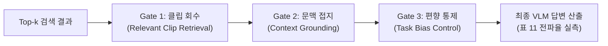

# [06] RQ6 3관문 VLM QA 답변 전파 스크립트 (`06_rq6_vlm_qa_propagation/`)

본 디렉터리는 KIISE-DBR 2026 논문의 **[RQ6] 벡터 데이터베이스의 검색 품질이 종단 멀티모달 거대언어모델(VLM)의 질의응답(VQA) 답변 정확도로 올바르게 전파되는지 진단하는 3단계 전파 검증 실험**을 총괄하는 스크립트 모음(총 11개)을 관리합니다.

논문 대응 위치: **제5장 §5.7 (종단 VLM QA 답변 전파 진단), 표 11 (3단계 전파 진단 및 인식의 벽 실측)**

---

## 🧭 연구 가설 및 3관문(Gate) 전파 진단 체계

단순히 검색 지표(Recall@k)가 높다고 해서 VLM이 항상 올바른 답변을 생성하는 것은 아닙니다. 본 논문은 검색에서 답변 생성에 이르는 과정을 **3개의 엄격한 관문(Three-Gate Diagnostic)**으로 분해하여 성능 감쇠 요인을 실측합니다.

1. **Gate 1: 관련 클립 회수 (Relevant Clip Retrieval)**: 벡터 검색 엔진이 실제 정답 증거를 포함하는 클립을 Top-k 내에 회수했는가?
2. **Gate 2: 검색 문맥 인식 (Context Grounding)**: VLM이 회수된 시각 프레임 및 설명문 문맥을 올바르게 인지하고 접지(Grounding)하는가?
3. **Gate 3: 과제 편향 통제 (Task Bias Control)**: VLM이 배경 지식이나 언어 편향(Prior Bias)으로 찍은 것이 아니라 오직 회수된 증거에 기반하여 답변하였는가?

> **핵심 발견: "인식의 벽(Perception Wall)"**  
> 검색 단계에서 정답 클립 회수율이 $0.65 \rightarrow 0.85$로 대폭 향상되더라도, VLM의 미세 객체 인지 한계와 질의 언어 편향으로 인해 종단 QA 정확도 개선 폭은 크게 감쇠(Attenuation)되는 "인식의 벽" 현상을 실측 입증했습니다.



---

## 📂 스크립트 카탈로그 및 상세 명세

| 파일명 | 유형 | 논문 대응 | 구현 목적 및 핵심 역할 |
|---|:---:|:---:|---|
| [`run_rag_vqa.py`](run_rag_vqa.py) | 종단 추론 | **표 11** | B0~B5 검색 결과로 회수된 증거 패킷을 VLM(Llama-3-Vision, Qwen2-VL) 프롬프트에 주입하여 다지선다 VQA 답변을 생성합니다. |
| [`run_s4_mcq_gate.py`](run_s4_mcq_gate.py) | 3단계 진단 | S4 Gate | 동결된 3-Class 지각 게이트(Perception Gate) 상에서 InternVL/Qwen 모델의 단계별 통과율을 측정합니다. |
| [`prepare_s4_mcq_gate.py`](prepare_s4_mcq_gate.py) | 평가 세트 구성 | S4 준비 | 클래스 불균형에 따른 편향을 배제하기 위해 엄격히 균형 잡힌 S4 3-Class 평가 셋을 동결 빌드합니다. |
| [`prepare_s4_retrieval_population.py`](prepare_s4_retrieval_population.py) | 감사 세트 | 감사 모집단 | Top-1 정확 검색 케이스와 유사 검색 케이스를 분리한 S4 감사 모집단을 구성합니다. |
| [`perception_wall_retest.py`](perception_wall_retest.py) | 한계 검증 | 인식의 벽 | 파라미터 수가 더 큰 고성능 VLM을 투입하더라도 검색 품질 대비 답변 전파율 감쇠(인식의 벽)가 유지됨을 재검증합니다. |
| [`perception_condition_b.py`](perception_condition_b.py) | 민감도 프로브 | Condition B | VLM 답변이 제공된 증거의 품질(노이즈/저화질/정확 프레임)에 통계적으로 유의미하게 반응하는지 검증합니다. |
| [`run_multiview_answer_vlm.py`](run_multiview_answer_vlm.py) | 다각도 추론 | 사전등록 410 | AI Hub 71953 다각도 CCTV 환경에서 카메라 각도별 증거에 따른 VLM 답변 정답률을 측정합니다. |
| [`eval_multiview_answer_vlm.py`](eval_multiview_answer_vlm.py) | 다각도 채점 | 사전등록 410 | 다각도 VLM 질의응답 결과를 공식 사전등록 채점 기준에 따라 평가 집계합니다. |
| [`run_multiview_evidence_selection.py`](run_multiview_evidence_selection.py) | 다각도 증거선택 | 시점 선택 | 다각도 영상 중 질문에 가장 결정적인 앵글의 프레임을 VLM이 올바르게 선별하는지 측정합니다. |
| [`evaluate_aihub71953_within_event_evidence_selection.py`](evaluate_aihub71953_within_event_evidence_selection.py) | 이벤트 내 평가 | 증거 선별 | 이벤트 발생 구간 내부에서 결정적 프레임을 고르는 정밀 선택 능력을 평가합니다. |
| [`evaluate_aihub71953_answer_grounding.py`](evaluate_aihub71953_answer_grounding.py) | 접지 위험도 평가 | 할루시네이션 | VLM이 제시한 답변이 회수된 시각 증거에 근거하지 않고 발생하는 환각(Hallucination) 위험을 정량화합니다. |

---

## 🚀 대표 실행 예시

```bash
# 1. RAG 기반 다지선다 VQA 종단 답변 생성 실행 (표 11 재현)
python 04_scripts/06_rq6_vlm_qa_propagation/run_rag_vqa.py \
  --retrieval-results /home/explorer/vectorDB/experiments/db/KIISE_datasociety/Datasets/processed/vru_accident/20260706/results/b4_hybrid_top5.json \
  --vlm-model Qwen/Qwen2-VL-7B-Instruct

# 2. S4 3-Class 지각 게이트 평가 실행
python 04_scripts/06_rq6_vlm_qa_propagation/run_s4_mcq_gate.py

# 3. 인식의 벽(Perception Wall) 강건성 재검증 프로브
python 04_scripts/06_rq6_vlm_qa_propagation/perception_wall_retest.py
```

---

## 🔗 선후행 의존 관계

- **선행 조건**: `04_rq3_rq4_retrieval_fusion/` 및 `05_rq5_filtered_ann_index/`의 Top-k 검색 랭킹 및 증거 패킷
- **후행 단계**: 도출된 Gate 통과율 및 답변 메트릭은 `08_verification_and_audit/`에서 사전등록 수치와 비교 감사되며, `09_paper_assets_and_build/`에서 최종 논문 표 11로 조판됩니다.
