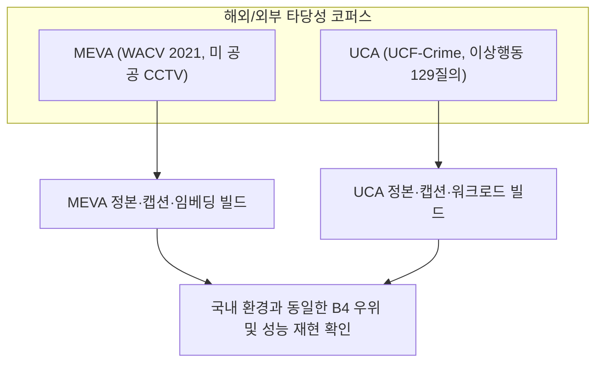

# [07] 외적 타당성 검증 스크립트 (`07_external_validity/`)

본 디렉터리는 KIISE-DBR 2026 논문의 **외적 타당성(External Validity) 및 해외·영어권 공공 CCTV 데이터셋 일반화 검증 실험**을 총괄하는 스크립트 모음(총 9개)을 관리합니다.

논문 대응 위치: **제5장 §5.8 (외적 타당성 검증), 부록 B (MEVA 및 UCA 일반화 벤치마크)**

---

## 🧭 연구 가설 및 해외/외부 벤치마크 2종

국내 공공 CCTV(AI Hub 교차로/이상행동) 데이터셋에만 편향된 연구가 아님을 입증하기 위해, 해외 공개 대규모 관제 데이터셋 2종을 대상으로 동일한 5대 설계 축 파이프라인을 재현했습니다.

1. **MEVA (Multimodal Video Activity, WACV 2021)**:
   - 해외 군사 기지 및 공공장소 관제 CCTV 영상
   - Tri-Source(캡션, 프레임, 시공간 메타데이터) 비순환 정본 구축 및 동일 인코더(Qwen-VL) 하에서의 B4(선필터링+융합) 우위 일반화 검증
2. **UCA (UCF-Crime Abnormal Activity)**:
   - 영어권 이상행동 129개 질의 워크로드
   - 사전등록 선언서(Prereg 420 Amendment 6+6a)에 따라 4개 기준 중 3개 이상 통과하는 확증적 결정 규칙(Decision Rule) 충족 실증



---

## 📂 스크립트 카탈로그 및 상세 명세

### 1. MEVA 해외 공공 CCTV 일반화 파이프라인

| 파일명 | 역할 | 입출력 아티팩트 |
|---|---|---|
| [`build_meva_facets.py`](build_meva_facets.py) | MEVA 비디오 클립의 시공간 메타데이터 및 어노테이션 패싯을 추출합니다. | 출력: `meva/facets.parquet` |
| [`build_meva_captions.py`](build_meva_captions.py) | 클립 중심 프레임에 대해 VLM 기반 고밀도 영문 설명문을 생성합니다. | 출력: `meva/captions.parquet` |
| [`build_meva_trisource_canonical.py`](build_meva_trisource_canonical.py) | 텍스트 캡션, 시각 프레임, 메타데이터를 결합한 MEVA 정본 워크로드를 구축합니다. | 출력: `meva/canonical/` |
| [`build_qwen3_meva_unified_assets.py`](build_qwen3_meva_unified_assets.py) | 인코더 바이어스를 통제하기 위해 동일 Qwen-VL 공간에서 MEVA 텍스트/이미지 벡터를 추출합니다. | 출력: `meva/assets/unified_vectors.parquet` |
| [`score_meva_semantic.py`](score_meva_semantic.py) | MEVA B0~B5 검색 결과 순위를 Semantic Soft-intent 기준으로 재평가하고 B4-B2 유의성을 검정합니다. | 출력: `meva/results/semantic_scores.json` |

### 2. UCA 영어권 이상행동 일반화 파이프라인

| 파일명 | 역할 | 입출력 아티팩트 |
|---|---|---|
| [`build_uca_corpus.py`](build_uca_corpus.py) | UCA 영상 세그먼트로부터 표준 코퍼스 메타데이터를 빌드합니다. | 출력: `uca/corpus.parquet` |
| [`caption_uca.py`](caption_uca.py) | Qwen2.5-VL을 사용하여 UCA 세그먼트 중심 프레임의 고밀도 행동 설명문을 생성합니다. | 출력: `uca/captions.parquet` |
| [`build_uca_workload.py`](build_uca_workload.py) | 사전등록 Amendment 6 규격에 맞추어 129개 영어권 질의-정답 워크로드를 동결 빌드합니다. | 출력: `uca/canonical/` |
| [`analyze_uca_external.py`](analyze_uca_external.py) | UCA 워크로드에서 B4 선필터링 검색을 구동하고 사전등록 결정 규칙(3/4 이상 재현) 충족 여부를 판정합니다. | 출력: `uca/results/decision_receipt.json` |

---

## 🚀 대표 실행 예시

```bash
# 1. MEVA 해외 정본 데이터셋 빌드 및 시맨틱 채점
python 04_scripts/07_external_validity/build_meva_trisource_canonical.py
python 04_scripts/07_external_validity/score_meva_semantic.py

# 2. UCA 이상행동 129질의 워크로드 빌드 및 판정 분석
python 04_scripts/07_external_validity/build_uca_workload.py
python 04_scripts/07_external_validity/analyze_uca_external.py
```

---

## 🔗 선후행 의존 관계

- **선행 조건**: `00_setup_and_resources/`의 모델 가중치 및 기본 라이브러리 환경
- **후행 단계**: MEVA 및 UCA 결과 영수증은 `08_verification_and_audit/`로 전달되어 사전등록 게이트 통과 여부를 전수 감사받습니다.
