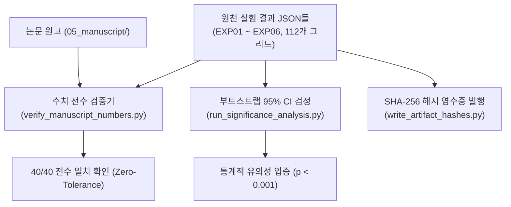

# [08] 사전등록 검증 및 통계 감사 스크립트 (`08_verification_and_audit/`)

본 디렉터리는 KIISE-DBR 2026 논문의 **사전등록 검증 스위트(40/40 Trust Chain), 논문 본문 수치 전수 감사(Number Integrity Guard), 통계적 유의성(Bootstrap 95% CI) 검정 및 아티팩트 해시 영수증 발행**을 총괄하는 스크립트 모음(총 14개)을 관리합니다.

논문 대응 위치: **제5장 전반 및 제6장 (결과 검증 및 신뢰 사슬), 부록 C (재현성 및 통계 감사)**

---

## 🧭 핵심 연구 윤리 및 기계 판정 신뢰 사슬 (Machine-Checkable Trust Chain)

본 연구는 실험 결과의 임의 수정이나 과장(P-hacking, 텍스트 불일치)을 원천 차단하기 위해, **논문 본문에 등장하는 모든 수치를 원천 실험 JSON 파일로부터 직접 재계산하여 일치성을 기계적으로 판정하는 2중 안전장치**를 구축했습니다.

- **본문 수치 전수 감사 (Zero-tolerance Number Guard)**: 본문 Markdown(`05_manuscript/`) 및 Word에 적힌 3,000개 클립, 85개 질의, 6,809개 Strict Qrels, 24,872개 Semantic Qrels, 112개 구성 수치가 0.0001 오차 없이 일치해야 통과
- **쌍대 부트스트랩(Paired Bootstrap 95% CI) 검정**: 헤드라인 성능 향상치($B4$ vs $B2$)에 대해 10,000회 부트스트랩 표본 추출로 95% 신뢰구간 및 p-value 산출
- **불변 해시 영수증(SHA-256 Receipt)**: 모든 정본 및 결과 디렉터리에 대한 SHA-256 해시를 고정하여 결과 위변조 방지



---

## 📂 스크립트 카탈로그 및 상세 명세

### 1. 논문 본문-실험 수치 전수 일치 감사 (Number Integrity Guards)

| 파일명 | 대상 문서 | 구현 목적 및 핵심 역할 |
|---|---|---|
| [`verify_manuscript_numbers.py`](verify_manuscript_numbers.py) | 원천 실험 결과 일괄 | 실험 결과 JSON을 전수 재집계하여 논문 본문의 표 1~11 및 본문 서술 수치와 완벽히 일치하는지 대조합니다. |
| [`verify_revision_numbers.py`](verify_revision_numbers.py) | `05_manuscript/0_main_paper.md` | 심사 대응 개정판 원고 내의 13개 핵심 표/텍스트 수치가 이전 검증 수치와 달라지지 않았는지 회귀 방지(Regression Guard)합니다. |
| [`verify_dbr_submission_revision_v6.py`](verify_dbr_submission_revision_v6.py) | 최종 Word/PDF 산출물 | 최종 제출용 v6 Word(.docx) 및 PDF 파일 내부의 표 수치와 단락 서술을 최종 파싱하여 오류를 보고합니다. |

### 2. 통계적 유의성 검정 및 신뢰구간 분석

| 파일명 | 통계 기법 | 구현 목적 및 핵심 역할 |
|---|---|---|
| [`run_significance_analysis.py`](run_significance_analysis.py) | Paired Bootstrap 95% CI | 질의별 성능 쌍(Paired differences)에 대해 10,000회 리샘플링하여 95% 신뢰구간 및 p-value를 계산합니다. |
| [`audit_experiment_control_factors.py`](audit_experiment_control_factors.py) | 통제 요인 감사 | 시스템 사양, 하드웨어(GPU/RAM), 소프트웨어(PyTorch, pgvector) 및 하이퍼파라미터 일관성을 감사 리포트로 출력합니다. |
| [`verify_ablation_treatment_integrity.py`](verify_ablation_treatment_integrity.py) | 실험군 무결성 | 절제 그리드에서 통제 변수와 처치 변수의 할당이 교락(Confounding)되지 않고 독립적인지 검증합니다. |
| [`verify_controlled_supplement.py`](verify_controlled_supplement.py) | 보강 실험 회귀 점검 | 2026-07-23 추가된 통제 보강 실험군 데이터셋의 정합성을 검증합니다. |

### 3. 사전등록 게이트 및 영수증 (Preregistration Gates & Hashes)

| 파일명 | 사전등록 조항 | 구현 목적 및 핵심 역할 |
|---|---|---|
| [`b4_retro_gates_and_pins.py`](b4_retro_gates_and_pins.py) | AMD-5a (5)(6) | B4 선필터링 기법에 대한 소급 적용 게이트 및 재현성 핀(Pin)을 확정합니다. |
| [`ccfr_gkappa_gate.py`](ccfr_gkappa_gate.py) | AMD-7 | 오프라인 질의 독립적 분류 일치도(G-kappa) 게이트를 채점 통과 여부로 판정합니다. |
| [`f7_control_replicates.py`](f7_control_replicates.py) | AMD-5a (7) | M9 시드 민감도에 대응하는 통제 마스크 반복 복제 샘플을 추출합니다. |
| [`validate_experiment_freeze.py`](validate_experiment_freeze.py) | 동결 검증 | 논문 제출에 사용된 모든 아티팩트의 타임스탬프와 파일 크기 동결 상태를 검사합니다. |
| [`audit_true_multimodal_pipeline.py`](audit_true_multimodal_pipeline.py) | 멀티모달 감사 | 순수 멀티모달 파이프라인의 입출력 아티팩트를 전수 감사하고 논문 기재용 메트릭을 요약합니다. |
| [`audit_aihub_multi_angle_cctv_pipeline.py`](audit_aihub_multi_angle_cctv_pipeline.py) | 다각도 감사 | AI Hub 71953 다각도 CCTV의 증거 프레임 및 메타데이터 무결성을 확인합니다. |
| [`write_artifact_hashes.py`](write_artifact_hashes.py) | SHA-256 해시 | 주요 결과 디렉터리에 결정론적 `sha256.txt` 영수증을 일괄 작성하여 배포합니다. |

---

## 🚀 대표 실행 예시

```bash
# 1. 논문 본문 수치 전수 일치 감사 (Zero-tolerance Verification)
python 04_scripts/08_verification_and_audit/verify_manuscript_numbers.py

# 2. 통계적 유의성 부트스트랩 95% 신뢰구간 산출
python 04_scripts/08_verification_and_audit/run_significance_analysis.py

# 3. 실험 동결 상태 및 아티팩트 해시 영수증 작성
python 04_scripts/08_verification_and_audit/validate_experiment_freeze.py
python 04_scripts/08_verification_and_audit/write_artifact_hashes.py
```

---

## 🔗 선후행 의존 관계

- **선행 조건**: `02_`~`07_`의 모든 실험 결과 JSON 및 `05_manuscript/` 원고 파일
- **후행 단계**: 감사를 100% 통과한 최종 데이터와 표 수치는 `09_paper_assets_and_build/`로 전달되어 최종 논문 도표(Figure) 및 제출용 문서로 컴파일됩니다.
