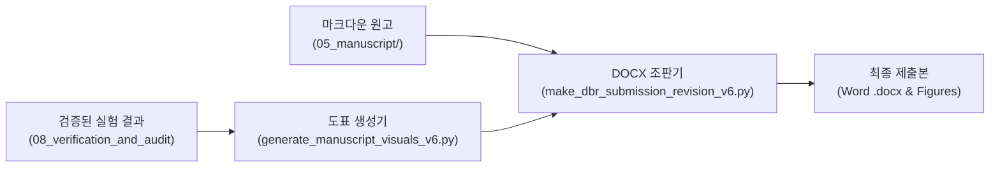

# [09] 논문 에셋 생성 및 최종 조판 스크립트 (`09_paper_assets_and_build/`)

본 디렉터리는 KIISE-DBR 2026 논문의 **최종 제출용 Figure 1~3 고해상도 벡터/인쇄용 시각 도표 생성, KIISE 2단 편집 규격 Word(.docx) 및 PDF 조판, 발표용 슬라이드(PPTX) 자동 빌더**를 총괄하는 스크립트 모음(총 11개)을 관리합니다.

논문 대응 위치: **최종 제출본 전체 (Figure 1~3, 수식, 표 1~11 및 Word 조판 아티팩트)**

---

## 🧭 논문 에셋 생성 및 컴파일 파이프라인

본 연구는 실험 데이터로부터 최종 제출용 논문 문서까지 **전 과정이 파이썬 코드로 자동 렌더링되는 완전 코드형 조판 파이프라인(Code-based Typesetting Pipeline)**을 구축했습니다.

1. **시각 도표 생성기 (Figure Generator)**: 원천 실험 결과 JSON을 읽어 논문 인쇄 규격(CMYK 대응, 고대비, 벡터 PDF/고해상도 300dpi PNG)의 그림 1(파이프라인), 그림 2(저장-검색 파레토 곡선), 그림 3(인식의 벽)을 생성
2. **KIISE 규격 Word/PDF 조판 빌더 (DOCX Compiler)**: 마크다운 원고를 한국정보과학회 논문지(DBR) 공식 2단 템플릿 규격에 맞추어 표, 각주, 참고문헌 및 글꼴(KoPub / 바탕체 / Times New Roman)이 적용된 편집 가능한 `.docx`로 컴파일
3. **발표용 자료 생성기 (Presentation Builder)**: 구두 발표를 위한 16:9 와이드 슬라이드(PPTX) 자동 생성



---

## 📂 스크립트 카탈로그 및 상세 명세

### 1. 논문 도표 및 시각 자료 생성기 (Visual Asset Generators)

| 파일명 | 산출물 | 구현 목적 및 핵심 역할 |
|---|---|---|
| [`generate_manuscript_visuals_v6.py`](generate_manuscript_visuals_v6.py) | **Figure 1, 2, 3** (`06_paper_assets/`) | 논문 본문에 수록되는 핵심 도표 3종(파이프라인 아키텍처, 5대 저장 단위 파레토 프론티어, 3관문 QA 답변 전파율)을 300dpi 고해상도로 일괄 렌더링합니다. |
| [`generate_s3_control_figure.py`](generate_s3_control_figure.py) | **Figure S3** (보충 자료) | 선택도 보존 통제(S3) 메커니즘을 시각화한 심사용 보충 그림을 생성합니다. |
| [`generate_presentation_figures.py`](generate_presentation_figures.py) | 발표용 도표 | 학술대회 구두 발표용 초심자 친화적 개념도 및 결과 차트를 생성합니다. |

### 2. KIISE 2단 규격 Word(.docx) 및 슬라이드 빌더

| 파일명 | 역할 | 구현 목적 및 핵심 역할 |
|---|---|---|
| [`make_dbr_submission_revision_v6.py`](make_dbr_submission_revision_v6.py) | **[최종 조판 핵심]** | 마크다운 원고와 생성된 도표를 결합하여 한국정보과학회 DBR 공식 2단 레이아웃을 갖춘 최종 심사용 Word 문서를 컴파일합니다. |
| [`make_dbr_editable_font_docx.py`](make_dbr_editable_font_docx.py) | 글꼴 안정화 | 한글(KoPub 바탕/돋움) 및 영문(Times New Roman) 글꼴이 OS 환경에 구애받지 않고 깨지지 않도록 통합된 편집용 DOCX를 생성합니다. |
| [`_dbr_complete_working_draft_base.py`](_dbr_complete_working_draft_base.py) | 조판 기본 엔진 | python-docx를 사용하여 2단 여백, 머리글, 꼬리글, 표 테두리 스타일을 정의하는 기본 클래스를 제공합니다. |
| [`_dbr_docx_primitives.py`](_dbr_docx_primitives.py) | XML 프리미티브 | 워드 문서의 XML 노드(수식, 인라인 스타일, 셀 여백 등)를 직접 제어하는 저수준 조판 헬퍼입니다. |
| [`build_deck_pptx.py`](build_deck_pptx.py) | 16:9 슬라이드 생성 | python-pptx를 활용하여 텍스트 넘침 없이 정렬된 공식 16:9 KIISE 발표용 프레젠테이션 파일을 생성합니다. |

### 3. 패키징 및 원고 마스터 파일

| 파일명 | 형식 | 구현 목적 및 핵심 역할 |
|---|:---:|---|
| [`package_manuscript_support_files.py`](package_manuscript_support_files.py) | 파이썬 | 심사위원용 외부 다운로드 보충자료 및 코드 번들을 zip 압축 패키지로 자동 포장합니다. |
| [`render_current_manuscript.py`](render_current_manuscript.py) | 파이썬 | 기존 결과 갱신 없이 현재 마크다운 원고의 변경점만을 빠르게 미리보기 렌더링합니다. |
| [`dbr_manuscript_build_source.md`](dbr_manuscript_build_source.md) | 마크다운 | DOCX 빌더가 직접 읽어들이는 본문 마스터 원고 소스 텍스트입니다. |

---

## 🚀 대표 실행 예시

```bash
# 1. 논문 본문 Figure 1~3 고해상도 생성
python 04_scripts/09_paper_assets_and_build/generate_manuscript_visuals_v6.py

# 2. 최종 한국정보과학회 2단 Word(.docx) 제출본 빌드
python 04_scripts/09_paper_assets_and_build/make_dbr_submission_revision_v6.py

# 3. 16:9 학술대회 발표용 PPTX 덱 생성
python 04_scripts/09_paper_assets_and_build/build_deck_pptx.py
```

---

## 🔗 선후행 의존 관계

- **선행 조건**: `08_verification_and_audit/`에서 40/40 검증 스위트를 통과하여 수치가 완전히 동결되어야 합니다.
- **후행 단계**: 여기서 산출된 Figure 파일들은 `06_paper_assets/`로 저장되며, 최종 Word 파일은 `05_manuscript/` 및 논문 제출 시스템으로 배포됩니다.
