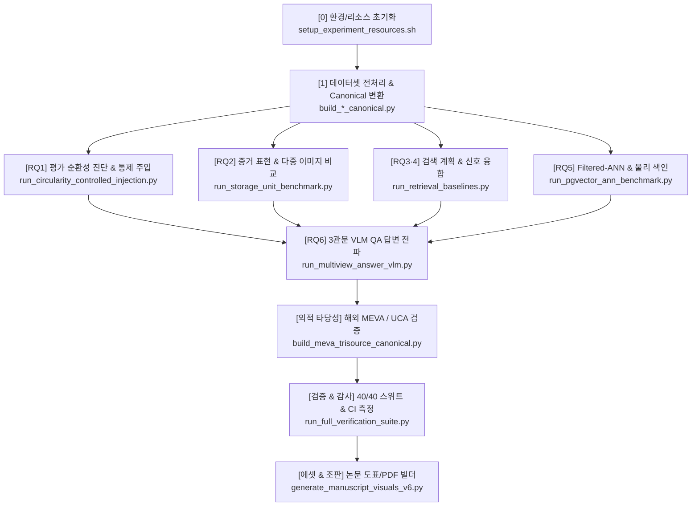

# [04] 실험 실행 스크립트 카탈로그 및 RQ 매핑 가이드 (`04_scripts/`)

본 디렉터리는 KIISE-DBR 2026 논문의 **데이터셋 전처리, 임베딩 생성, RQ1~RQ6 실험 벤치마크, 사전등록 검증 스위트 및 논문 도표 생성**을 총괄하는 실행 스크립트 모음(총 148개 파일)을 관리합니다.

---

## 🧭 파이프라인 단계 및 RQ별 스크립트 매핑 개요



---

## 📑 범주별 상세 스크립트 카탈로그

### 1. 환경 및 리소스 셋업 (Environment & Setup)
- [`setup_experiment_resources.sh`](setup_experiment_resources.sh): Conda 가상환경 생성, HuggingFace/PyTorch 캐시 디렉터리 바인딩 및 필수 의존성 일괄 설치 스크립트
- [`download_model_assets.py`](download_model_assets.py): 실험에 필요한 임베딩 및 VLM 모델 체크포인트 다운로드
- [`check_research_resources.py`](check_research_resources.py): 로컬 GPU, 스토리지(`/hdd2/`), 도커 컨테이너 가용성 진단

---

### 2. [RQ1] 평가 순환성 진단 및 통제 주입 실험 (Circularity Diagnosis & Control)
**목적**: 기존 벤치마크의 정답 누수(메타데이터 필터 $\subseteq$ 정답 라벨)를 실측하고, 비순환 수리 및 통제 주입(C1/C2)으로 왜곡 크기를 증명합니다.

| 스크립트 파일명 | 주요 역할 및 설명 |
|---|---|
| [`run_circularity_controlled_injection.py`](run_circularity_controlled_injection.py) | **[핵심]** 동결된 AI Hub-522 코퍼스에 정답 필터(C1) 및 라벨 재진술(C2)을 의도적으로 주입하여 성능 왜곡(nDCG $0.181 \rightarrow 1.000$) 실측 |
| [`verify_circularity_controlled_injection.py`](verify_circularity_controlled_injection.py) | 통제 주입 실험 결과의 사전등록 불변 규칙 및 수치 무결성 검증 |
| [`build_vru_noncircular_canonical.py`](build_vru_noncircular_canonical.py) | 순환 결함이 있던 기존 VRU-Accident 데이터셋을 수리하여 비순환 Canonical 정본 구축 ($0.9736 \rightarrow 0.3174$ 붕괴 실측) |
| [`build_aihub_cctv_noncircular_canonical.py`](build_aihub_cctv_noncircular_canonical.py) | AI Hub 지능형 관제 데이터셋의 순환 라벨 누수를 차단하여 비순환 수리판 구축 ($1.0000 \rightarrow 0.8395$) |
| [`run_e1_manipulation_pilot.py`](run_e1_manipulation_pilot.py) | E-1 조작 점검 파일럿 (VLM 호출 전 검색단 순환성 조작 판정) |
| [`run_e1a_manipulation_pilot.py`](run_e1a_manipulation_pilot.py) | E-1(a) 조작 점검 파일럿 (사전등록 규칙 420 Amd.3 기반) |
| [`run_e1a_vlm_minipilot.py`](run_e1a_vlm_minipilot.py) | 순환성 조작이 VLM 최소 표본 응답에 미치는 영향 파일럿 |

---

### 3. [RQ2] 증거 표현 및 멀티모달 저장 단위 벤치마크 (Evidence Representation & Multimodal Storage)
**목적**: 영상 설명문 단독, 단일 대표 프레임, 이미지-설명문 결합, 다중 이미지(클립당 3프레임), 이중 색인(Dual-index RRF)의 품질과 비용을 비교합니다 (**논문 표 4 대응**).

| 스크립트 파일명 | 주요 역할 및 설명 |
|---|---|
| [`run_storage_unit_benchmark.py`](run_storage_unit_benchmark.py) | **[핵심]** 5개 저장 단위별 nDCG@10, 지연시간(ms), 스토리지 크기(MB) 실측 벤치마크 |
| [`build_visual_embeddings.py`](build_visual_embeddings.py) | CLIP ViT-B/32 모델을 사용하여 비디오 프레임별 512차원 시각 임베딩 일괄 생성 |
| [`build_qwen3_unified_assets.py`](build_qwen3_unified_assets.py) | Qwen3-VL 기반 멀티모달 통일 임베딩 아티팩트 생성 |
| [`build_qwen3_joint_image_caption_assets.py`](build_qwen3_joint_image_caption_assets.py) | 단일 인코더로 이미지와 텍스트를 함께 결합 인코딩한 Joint 임베딩 벡터 생성 |
| [`evaluate_caption_ablation_dual_qrels.py`](evaluate_caption_ablation_dual_qrels.py) | 생성 캡션의 품질과 검색 성능 간의 이중 정답(Strict/Semantic) 어블레이션 평가 |
| [`evaluate_joint_image_caption_controls.py`](evaluate_joint_image_caption_controls.py) | Joint 임베딩 최적화 조건 통제 및 ablation 분석 |
| [`run_caption_model_ablation.py`](run_caption_model_ablation.py) | 캡션 생성 VLM 모델별(소형 vs 대형) 검색 품질 차이 어블레이션 |
| [`aggregate_caption_quality.py`](aggregate_caption_quality.py) | 생성된 영상 설명문의 신뢰도 및 어휘적 정합성 집계 |

---

### 4. [RQ3 & RQ4] 검색 계획 및 신호/모달리티 융합 실증 (Retrieval Plans & Fusion)
**목적**: B0~B5 검색 전략 비교, 메타데이터-자연어 결합도($V$)에 따른 검색 전/후 필터링 효과, BM25+벡터 융합, 지식그래프(KG) 융합 실효성 검증 (**논문 표 5, 6 대응**).

| 스크립트 파일명 | 주요 역할 및 설명 |
|---|---|
| [`run_retrieval_baselines.py`](run_retrieval_baselines.py) | **[핵심]** B0(메타단독), B1(BM25), B2(벡터), B3(사후필터), B4(사전필터), B5(RRF) 베이스라인 일괄 벤치마크 실행 |
| [`run_coupling_blocked_validation.py`](run_coupling_blocked_validation.py) | 결합도($V \ge 0.3$) 차단 및 B4-B2 성능 차이의 조건별 강건성 분석 |
| [`run_multimodal_fusion_baselines.py`](run_multimodal_fusion_baselines.py) | 텍스트 검색 결과와 시각 프레임 검색 결과 간의 가중치 융합 벤치마크 |
| [`run_weighted_fusion_rerank_sweep.py`](run_weighted_fusion_rerank_sweep.py) | 텍스트/이미지 가중치($\alpha$) 파라미터 및 재순위화 스위프 |
| [`run_reranker_selection.py`](run_reranker_selection.py) | 교차 인코더(`bge-reranker-v2-m3`)를 적용한 2단계 재순위화(Reranking) 성능 측정 |
| [`run_image_to_video_retrieval.py`](run_image_to_video_retrieval.py) | 이미지 질의 기반 비디오 검색 (Image-to-Video) 베이스라인 평가 |
| [`kg_collapse_receipt.py`](kg_collapse_receipt.py) | 지식그래프(KG) 재조합 인덱스의 실측 Lift(중앙값 0.002) 무이득 판정 및 CPU 실측 영수증 생성 |

---

### 5. [RQ5] Filtered-ANN 및 물리 색인 배포 (Filtered-ANN, Indexing & Deployment)
**목적**: PostgreSQL pgvector, Milvus, Weaviate 실측을 통해 실제 Predicate 군집 환경에서 전역 색인의 재현율 손실(최대 0.627)과 부분 색인(Partial Index)의 100% 회복 효과 실측 (**논문 표 7~10 대응**).

| 스크립트 파일명 | 주요 역할 및 설명 |
|---|---|
| [`run_pgvector_partial_index.py`](run_pgvector_partial_index.py) | **[핵심]** PostgreSQL 16 + pgvector (:5433) 환경에서 Predicate별 부분 HNSW 인덱스 구축 시간(50.4s), 크기(333.5MB), 재현율 실측 |
| [`run_pgvector_ann_benchmark.py`](run_pgvector_ann_benchmark.py) | pgvector HNSW 인덱스 파라미터($M, ef_{construction}, ef_{search}$)별 재현율/지연시간 벤치마크 |
| [`run_pgvector_retrieval.py`](run_pgvector_retrieval.py) | pgvector 실서버 대상 벡터 질의 및 필터링 검색 성능 측정 |
| [`run_filtered_ann_real_predicate.py`](run_filtered_ann_real_predicate.py) | 실제 시공간 Predicate 조건과 무작위 마스크 간의 재현율 손실 대조 분석 |
| [`run_filtered_ann_cluster_mechanism.py`](run_filtered_ann_cluster_mechanism.py) | 벡터 클러스터와 Predicate 분포 간의 상관성에 따른 인덱스 진입 경로 차단 메커니즘 분석 |
| [`run_engine_filtered_bench.py`](run_engine_filtered_bench.py) | 제3의 벡터 검색 엔진(Milvus, Weaviate) 대상 필터링 ANN 교차 벤치마크 |
| [`score_hotcold_policy.py`](score_hotcold_policy.py) | Hot/Cold 스토리지 분리 배치 정책 및 손익분기 질의수($N^*$) 계산 |
| [`build_miris_pgvector.py`](build_miris_pgvector.py) / [`build_miris_pgvector_rich.py`](build_miris_pgvector_rich.py) | MIRIS (SIGMOD 2020) 교통 영상 프레임을 pgvector DB에 적재하는 파이프라인 |

---

### 6. [RQ6] 3관문 VLM QA 답변 전파 진단 (Answer Propagation & VLM-QA)
**목적**: 검색 성능이 최종 VLM(Llama-3-Vision, Qwen2-VL) 답변 정확도로 전파되는지 **[관련 클립 회수 $\rightarrow$ 검색 문맥 인식 $\rightarrow$ 과제 편향 통제]** 3단계로 엄밀히 진단 (**논문 표 11 대응**).

| 스크립트 파일명 | 주요 역할 및 설명 |
|---|---|
| [`run_multiview_answer_vlm.py`](run_multiview_answer_vlm.py) | **[핵심]** AI Hub 다각도 CCTV 환경에서 다양한 검색 문맥 조건에 따른 VLM 최종 답변 정확도 실측 |
| [`eval_multiview_answer_vlm.py`](eval_multiview_answer_vlm.py) | 다각도 VLM 답변 로그 채점 및 조건별 정확도 통계 분석 (사전등록 410번 준용) |
| [`run_s4_mcq_gate.py`](run_s4_mcq_gate.py) | 3관문 과제 편향 통제 게이트: 무관 설명문 공급 시 편향 상승폭($+22.2\%p \sim +23.0\%p$) 실측 |
| [`prepare_s4_mcq_gate.py`](prepare_s4_mcq_gate.py) | 객관식 문항(MCQ) 및 무관 설명문 대조셋 생성 |
| [`run_rag_vqa.py`](run_rag_vqa.py) | VRU-Accident 기반 RAG-VQA 종단 파이프라인 질의응답 실행 |
| [`evaluate_aihub71953_within_event_evidence_selection.py`](evaluate_aihub71953_within_event_evidence_selection.py) | 사건 내 다중 카메라 시점 중 최적 증거 프레임 선택 평가 |
| [`perception_wall_retest.py`](perception_wall_retest.py) | VLM 모델 크기 확장에 따른 지각 한계(Perception Wall) 재검증 |

---

### 7. 외적 타당성 및 도메인 확장 (External Validity & Cross-Domain)
**목적**: 해외 공공 CCTV(MEVA) 및 영어권 이상행동(UCA) 데이터셋으로 연구 결과의 일반화 가능성을 입증합니다.

| 스크립트 파일명 | 주요 역할 및 설명 |
|---|---|
| [`build_meva_trisource_canonical.py`](build_meva_trisource_canonical.py) | MEVA (WACV 2021) 비디오 원천, 캡션, 메타데이터 tri-source Canonical 구축 |
| [`score_meva_semantic.py`](score_meva_semantic.py) | MEVA 데이터셋 대상 B0~B5 검색 전략 실행 및 의미론적 평가 지표 산출 |
| [`build_meva_captions.py`](build_meva_captions.py) / [`build_meva_facets.py`](build_meva_facets.py) | MEVA 중간 프레임 VLM 캡션 생성 및 비순환 패싯 추출 |
| [`analyze_uca_external.py`](analyze_uca_external.py) | UCA 이상행동 129개 질의 대상 검색 계획(B4 vs B2) 3/4 재현성 분석 |
| [`build_uca_workload.py`](build_uca_workload.py) | UCA 원천 데이터를 표준 작업 부하로 정규화 |

---

### 8. 검증 스위트 및 통계 감사 (Verification & Statistical Rigor)
**목적**: 사전등록된 규칙 및 통계적 유의성(부트스트랩 95% CI)을 자동으로 전수 검증합니다.

| 스크립트 파일명 | 주요 역할 및 설명 |
|---|---|
| [`run_full_verification_suite.py`](run_full_verification_suite.py) | **[핵심]** 40/40 사전등록 검증 스위트 일괄 실행 (모든 제약조건 통과 여부 판정) |
| [`run_significance_analysis.py`](run_significance_analysis.py) | **[핵심]** 논문 헤드라인 결과에 대한 페어드 부트스트랩 95% 신뢰구간 및 통계적 유의성 검정 |
| [`verify_manuscript_numbers.py`](verify_manuscript_numbers.py) | 논문 본문 원고와 실험 산출물 간의 모든 수치 일치 여부 전수 대조 |
| [`verify_revision_numbers.py`](verify_revision_numbers.py) | 8월 심사 대응 최종 수정본의 정정 수치 정합성 감사 |
| [`validate_experiment_freeze.py`](validate_experiment_freeze.py) | 실험 데이터셋 및 모델 산출물 해시(SHA-256) 동결 무결성 검증 |
| [`write_artifact_hashes.py`](write_artifact_hashes.py) | 전체 실험 아티팩트의 SHA-256 체크섬 매니페스트 기록 |

---

### 9. 논문 에셋 생성 및 원고 조판 빌더 (Paper Assets & Compilation)
- [`generate_manuscript_visuals_v6.py`](generate_manuscript_visuals_v6.py): 최종 논문 제출본(v6) 수록 그림(Figure 1~3) 인쇄용 고해상도 생성
- [`generate_paper_figures_v2.py`](generate_paper_figures_v2.py): 흑백 인쇄 및 부트스트랩 오차 막대 포함 도표 생성
- [`generate_retrieval_paper_assets.py`](generate_retrieval_paper_assets.py): 검색 베이스라인 결과로부터 논문용 LaTeX/Markdown 표 데이터 일괄 추출
- [`build_deck_pptx.py`](build_deck_pptx.py): 학술 발표용 16:9 슬라이드 덱 자동 생성
- [`make_dbr_submission_revision_v6.py`](make_dbr_submission_revision_v6.py) / [`make_dbr_editable_font_docx.py`](make_dbr_editable_font_docx.py): 최종 심사 통과본 2단 편집 Word(.docx) 문서 생성기

---

## 🚀 빠른 재현 실행 명령어 모음 (Quick Execution)

```bash
# 1. 40/40 검증 스위트 무결성 전체 실행
python 04_scripts/run_full_verification_suite.py

# 2. [RQ1] 순환성 통제 주입 검증
python 04_scripts/run_circularity_controlled_injection.py

# 3. [RQ2] 증거 표현 5개 저장 단위 벤치마크 (표 4)
python 04_scripts/run_storage_unit_benchmark.py

# 4. [RQ3·4] B0~B5 검색 베이스라인 일괄 실행 (표 5, 6)
python 04_scripts/run_retrieval_baselines.py

# 5. [RQ5] pgvector 부분 색인 성능 측정 (표 8)
python 04_scripts/run_pgvector_partial_index.py

# 6. [RQ6] VLM QA 3관문 전파 평가 (표 11)
python 04_scripts/eval_multiview_answer_vlm.py

# 7. 논문 수치 정합성 자동 감사
python 04_scripts/verify_manuscript_numbers.py
```
