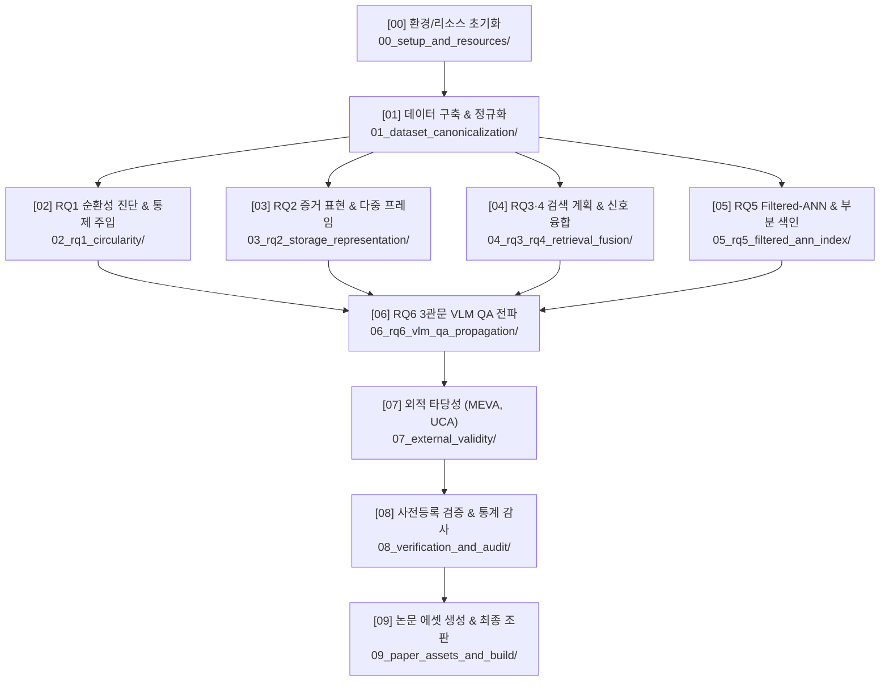

# [04] 실험 실행 스크립트 카탈로그 및 계층화 가이드 (`04_scripts/`)

본 디렉터리는 KIISE-DBR 2026 논문의 **데이터셋 전처리, 임베딩 생성, RQ1~RQ6 실험 벤치마크, 사전등록 검증 스위트 및 최종 논문 도표 생성**을 총괄하는 정본 실행 스크립트 모음(총 131개 파일)을 관리합니다.

과거 마일스톤(v1~v5)의 중복 생성기 및 일회성/제외 데이터셋 스크립트 16개를 정리하고, 최종 논문(v6) 재현에 필수적인 핵심 스크립트들을 **10개의 세부 주제별 하위 디렉터리(`00_` ~ `09_`)**로 구조화하여 관리합니다.

---

## 🧭 하위 디렉터리 구성 및 파이프라인 흐름도



---

## 📂 하위 디렉터리별 상세 카탈로그

| 디렉터리명 | 스크립트 수 | 핵심 목적 및 논문 대응 |
|---|:---:|---|
| [**`00_setup_and_resources/`**](00_setup_and_resources/) | 3개 | 가상환경 초기화, 모델 가중치 다운로드 및 GPU/리소스 진단 |
| [**`01_dataset_canonicalization/`**](01_dataset_canonicalization/) | 28개 | 원천 비디오 프레임 추출, 키프레임 추출, 패싯 결합 및 5대 Canonical 아티팩트 빌드 |
| [**`02_rq1_circularity/`**](02_rq1_circularity/) | 6개 | **[RQ1]** 메타데이터 정답 누수 차단, 비순환 수리, C1/C2 통제 주입으로 성능 왜곡($0.181 \rightarrow 1.000$) 실측 |
| [**`03_rq2_storage_representation/`**](03_rq2_storage_representation/) | 17개 | **[RQ2]** 5개 저장 단위(설명문, 단일 프레임, 다중 프레임, 결합, 이중 색인)의 품질-비용 비교 (**표 4**) |
| [**`04_rq3_rq4_retrieval_fusion/`**](04_rq3_rq4_retrieval_fusion/) | 9개 | **[RQ3·4]** B0~B5 검색 전략 비교, 고결합($V \ge 0.3$) 검색 전 필터링, 지식그래프(KG) 융합 실효성 검증 (**표 5, 6**) |
| [**`05_rq5_filtered_ann_index/`**](05_rq5_filtered_ann_index/) | 23개 | **[RQ5]** PostgreSQL pgvector(:5433), Milvus, Weaviate 실측, 부분 HNSW 색인의 100% 회복 실측 (**표 7~10**) |
| [**`06_rq6_vlm_qa_propagation/`**](06_rq6_vlm_qa_propagation/) | 11개 | **[RQ6]** [관련 클립 회수 $\rightarrow$ 검색 문맥 인식 $\rightarrow$ 과제 편향 통제] 3관문 VLM QA 답변 전파 진단 (**표 11**) |
| [**`07_external_validity/`**](07_external_validity/) | 9개 | 해외 공공 CCTV(MEVA) 및 영어권 이상행동(UCA 129질의 3/4 재현) 일반화 검증 |
| [**`08_verification_and_audit/`**](08_verification_and_audit/) | 14개 | 40/40 검증 스위트, 부트스트랩 95% 신뢰구간 측정, 본문-실험 수치 전수 일치 감사 |
| [**`09_paper_assets_and_build/`**](09_paper_assets_and_build/) | 11개 | 최종 제출본 Figure 1~3 고해상도 생성 및 2단 편집 Word(.docx)/PDF 조판 빌더 |

---

### 1. [`00_setup_and_resources/`](00_setup_and_resources/) (환경 및 자원 셋업)
- [`setup_experiment_resources.sh`](00_setup_and_resources/setup_experiment_resources.sh): Conda 가상환경 생성 및 모델 캐시 바인딩 스크립트
- [`download_model_assets.py`](00_setup_and_resources/download_model_assets.py): HuggingFace BGE-M3, CLIP 등 모델 가중치 사전 다운로드
- [`check_research_resources.py`](00_setup_and_resources/check_research_resources.py): 로컬 GPU(RTX 3090 x2), 스토리지 경로(`/hdd2/`) 및 필수 라이브러리 가용성 점검

### 2. [`01_dataset_canonicalization/`](01_dataset_canonicalization/) (데이터 구축 및 표준화)
- `build_intersection_signal_canonical.py` / `build_intersection_trisource_canonical.py`: AI Hub 522 교차로 tri-source Canonical 구축
- `build_aihub_cctv_canonical.py` / `build_vru_canonical.py`: 지능형 관제 및 VRU 원천 Canonical 빌더
- `extract_keyframes.py` / `extract_intersection_visual_sources.py`: 원천 비디오 프레임 추출
- `build_text_embeddings.py`: SentenceTransformers(BGE-M3 등) 기반 문서/질의 임베딩 일괄 생성

### 3. [`02_rq1_circularity/`](02_rq1_circularity/) (순환 결함 진단 및 통제 주입)
- [`run_circularity_controlled_injection.py`](02_rq1_circularity/run_circularity_controlled_injection.py): **[핵심]** 동결 코퍼스 대상 정답 필터(C1) 및 라벨 재진술(C2) 통제 주입으로 성능 왜곡(nDCG $0.181 \rightarrow 1.000$) 실측
- [`verify_circularity_controlled_injection.py`](02_rq1_circularity/verify_circularity_controlled_injection.py): 통제 주입 결과 무결성 검증
- [`build_vru_noncircular_canonical.py`](02_rq1_circularity/build_vru_noncircular_canonical.py): VRU-Accident 순환 결함 수리판 구축 ($0.9736 \rightarrow 0.3174$ 붕괴 실측)
- [`build_aihub_cctv_noncircular_canonical.py`](02_rq1_circularity/build_aihub_cctv_noncircular_canonical.py): 지능형 관제 순환 누수 수리판 구축 ($1.0000 \rightarrow 0.8395$)
- `run_qwen_aligned_circularity_control.py` / `verify_qwen_aligned_circularity.py`: Qwen 정렬 비순환 통제 검증

### 4. [`03_rq2_storage_representation/`](03_rq2_storage_representation/) (증거 표현 및 저장 단위 벤치마크)
- [`run_storage_unit_benchmark.py`](03_rq2_storage_representation/run_storage_unit_benchmark.py): **[핵심]** 5개 저장 단위별 nDCG@10, 지연시간, 스토리지 크기 실측 (**논문 표 4**)
- [`build_visual_embeddings.py`](03_rq2_storage_representation/build_visual_embeddings.py): CLIP ViT-B/32 프레임 시각 임베딩 생성
- [`build_qwen3_joint_image_caption_assets.py`](03_rq2_storage_representation/build_qwen3_joint_image_caption_assets.py): 이미지-텍스트 결합 Joint 임베딩 벡터 생성
- [`evaluate_caption_ablation_dual_qrels.py`](03_rq2_storage_representation/evaluate_caption_ablation_dual_qrels.py): 캡션 품질과 이중 정답(Strict/Semantic) 어블레이션 평가
- `run_caption_model_ablation.py` / `aggregate_caption_quality.py`: 캡션 모델별 품질 측정

### 5. [`04_rq3_rq4_retrieval_fusion/`](04_rq3_rq4_retrieval_fusion/) (검색 계획 및 신호 융합)
- [`run_retrieval_baselines.py`](04_rq3_rq4_retrieval_fusion/run_retrieval_baselines.py): **[핵심]** B0~B5 검색 베이스라인 일괄 벤치마크 실행 (**논문 표 5, 6**)
- [`run_coupling_blocked_validation.py`](04_rq3_rq4_retrieval_fusion/run_coupling_blocked_validation.py): 결합도($V \ge 0.3$) 차단 조건별 B4-B2 성능 비교
- [`run_multimodal_fusion_baselines.py`](04_rq3_rq4_retrieval_fusion/run_multimodal_fusion_baselines.py): 텍스트-시각 프레임 검색 결과 RRF 가중치 융합
- [`run_reranker_selection.py`](04_rq3_rq4_retrieval_fusion/run_reranker_selection.py): Cross-encoder(`bge-reranker-v2-m3`) 재순위화 성능 평가
- [`kg_collapse_receipt.py`](04_rq3_rq4_retrieval_fusion/kg_collapse_receipt.py): 지식그래프(KG) 융합 Lift(중앙값 0.002) 무이득 판정 영수증 생성

### 6. [`05_rq5_filtered_ann_index/`](05_rq5_filtered_ann_index/) (Filtered-ANN 및 물리 색인 배포)
- [`run_pgvector_partial_index.py`](05_rq5_filtered_ann_index/run_pgvector_partial_index.py): **[핵심]** PostgreSQL 16 + pgvector (:5433) 부분 HNSW 색인 성능 실측 (**논문 표 8**)
- [`run_pgvector_ann_benchmark.py`](05_rq5_filtered_ann_index/run_pgvector_ann_benchmark.py): pgvector 인덱스 파라미터($M, ef_{construction}, ef_{search}$) 스위프
- [`run_filtered_ann_real_predicate.py`](05_rq5_filtered_ann_index/run_filtered_ann_real_predicate.py): 실제 시공간 Predicate 조건의 전역 색인 재현율 손실(최대 0.627) 실측
- [`run_engine_filtered_bench.py`](05_rq5_filtered_ann_index/run_engine_filtered_bench.py): Milvus, Weaviate 대상 필터링 ANN 교차 벤치마크 및 자동 Flat Scan 전환 실측
- [`score_hotcold_policy.py`](05_rq5_filtered_ann_index/score_hotcold_policy.py): Hot/Cold 스토리지 분리 및 손익분기 질의수($N^*$) 계산

### 7. [`06_rq6_vlm_qa_propagation/`](06_rq6_vlm_qa_propagation/) (3관문 VLM QA 답변 전파 진단)
- [`run_multiview_answer_vlm.py`](06_rq6_vlm_qa_propagation/run_multiview_answer_vlm.py): **[핵심]** 다각도 CCTV 환경 VLM(Llama-3-Vision, Qwen2-VL) 종단 답변 정확도 측정 (**논문 표 11**)
- [`eval_multiview_answer_vlm.py`](06_rq6_vlm_qa_propagation/eval_multiview_answer_vlm.py): 다각도 VLM 답변 로그 채점 및 정확도 통계 산출
- [`run_s4_mcq_gate.py`](06_rq6_vlm_qa_propagation/run_s4_mcq_gate.py): 무관 설명문 공급 시 과제 편향 상승폭($+22.2\%p \sim +23.0\%p$) 실측
- `run_rag_vqa.py` / `perception_wall_retest.py`: VRU RAG-VQA 및 지각 한계(Perception Wall) 재검증

### 8. [`07_external_validity/`](07_external_validity/) (외적 타당성 검증)
- [`build_meva_trisource_canonical.py`](07_external_validity/build_meva_trisource_canonical.py): MEVA (WACV 2021) 비디오 tri-source Canonical 구축
- [`score_meva_semantic.py`](07_external_validity/score_meva_semantic.py): MEVA 데이터셋 대상 B0~B5 검색 전략 실행 및 의미론적 평가
- [`analyze_uca_external.py`](07_external_validity/analyze_uca_external.py): UCA 이상행동 129개 질의 대상 검색 계획 재현율 분석 (3/4 재현)

### 9. [`08_verification_and_audit/`](08_verification_and_audit/) (검증 스위트 및 통계 감사)
- [`run_full_verification_suite.py`](08_verification_and_audit/run_full_verification_suite.py): **[핵심]** 40/40 사전등록 검증 스위트 일괄 실행
- [`run_significance_analysis.py`](08_verification_and_audit/run_significance_analysis.py): **[핵심]** 페어드 부트스트랩 95% 신뢰구간 및 통계적 유의성 검정
- [`verify_manuscript_numbers.py`](08_verification_and_audit/verify_manuscript_numbers.py): 본문 수치와 실험 산출물 간 전수 대조
- [`verify_revision_numbers.py`](08_verification_and_audit/verify_revision_numbers.py): 8월 심사 대응 최종 수정본 수치 정합성 감사
- [`validate_experiment_freeze.py`](08_verification_and_audit/validate_experiment_freeze.py): 실험 데이터셋 동결 해시 무결성 검증

### 10. [`09_paper_assets_and_build/`](09_paper_assets_and_build/) (논문 에셋 및 조판 빌더)
- [`generate_manuscript_visuals_v6.py`](09_paper_assets_and_build/generate_manuscript_visuals_v6.py): **[핵심]** 최종 논문 제출본(v6) Figure 1~3 인쇄용 고해상도 생성
- [`make_dbr_submission_revision_v6.py`](09_paper_assets_and_build/make_dbr_submission_revision_v6.py): **[핵심]** 최종 심사 통과본 2단 편집 Word(.docx)/PDF 조판 빌더
- [`build_deck_pptx.py`](09_paper_assets_and_build/build_deck_pptx.py): 학술 발표용 16:9 슬라이드 덱 자동 생성
- [`make_dbr_editable_font_docx.py`](09_paper_assets_and_build/make_dbr_editable_font_docx.py): 제출용 폰트 편집 지원 docx 생성기
- [`package_manuscript_support_files.py`](09_paper_assets_and_build/package_manuscript_support_files.py): 논문 지원 결과물 패키징

---

## 🚀 빠른 재현 실행 명령어 모음 (Quick Execution)

```bash
# 1. 환경 및 자원 준비 진단
python 04_scripts/00_setup_and_resources/check_research_resources.py

# 2. [RQ1] 순환성 통제 주입 검증
python 04_scripts/02_rq1_circularity/run_circularity_controlled_injection.py

# 3. [RQ2] 증거 표현 5개 저장 단위 벤치마크 (표 4)
python 04_scripts/03_rq2_storage_representation/run_storage_unit_benchmark.py

# 4. [RQ3·4] B0~B5 검색 베이스라인 일괄 실행 (표 5, 6)
python 04_scripts/04_rq3_rq4_retrieval_fusion/run_retrieval_baselines.py

# 5. [RQ5] pgvector 부분 색인 성능 측정 (표 8)
python 04_scripts/05_rq5_filtered_ann_index/run_pgvector_partial_index.py

# 6. [RQ6] VLM QA 3관문 답변 전파 채점 및 통계 (표 11)
python 04_scripts/06_rq6_vlm_qa_propagation/eval_multiview_answer_vlm.py

# 7. 40/40 사전등록 검증 스위트 전체 실행
python 04_scripts/08_verification_and_audit/run_full_verification_suite.py

# 8. 8월 심사 대응 최종 원고 수치 일치 전수 자동 감사
python 04_scripts/08_verification_and_audit/verify_revision_numbers.py
```
