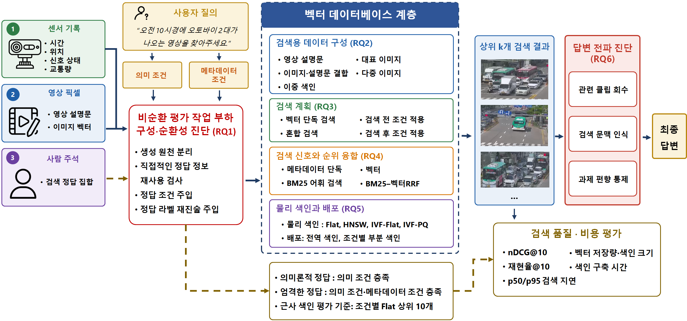
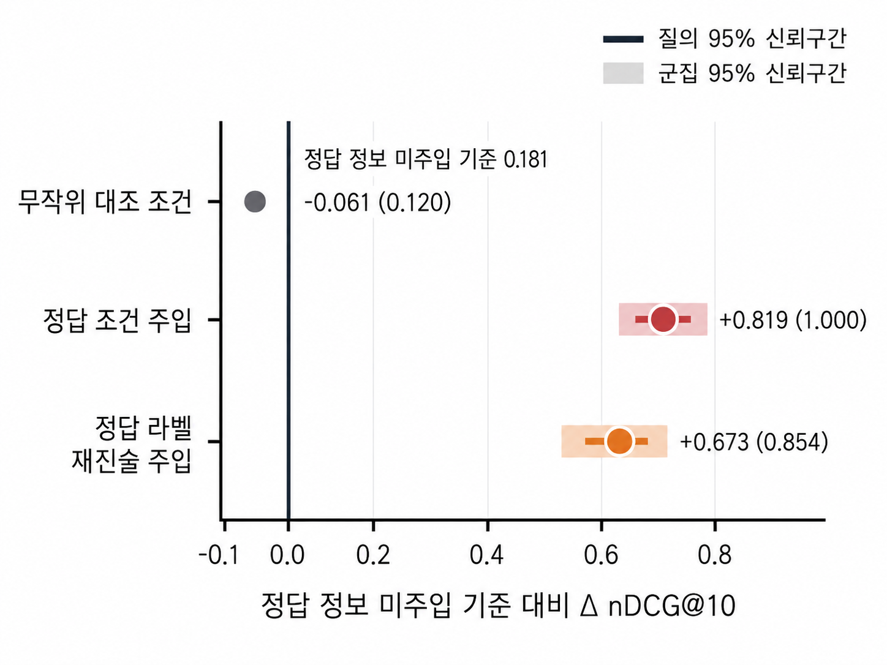
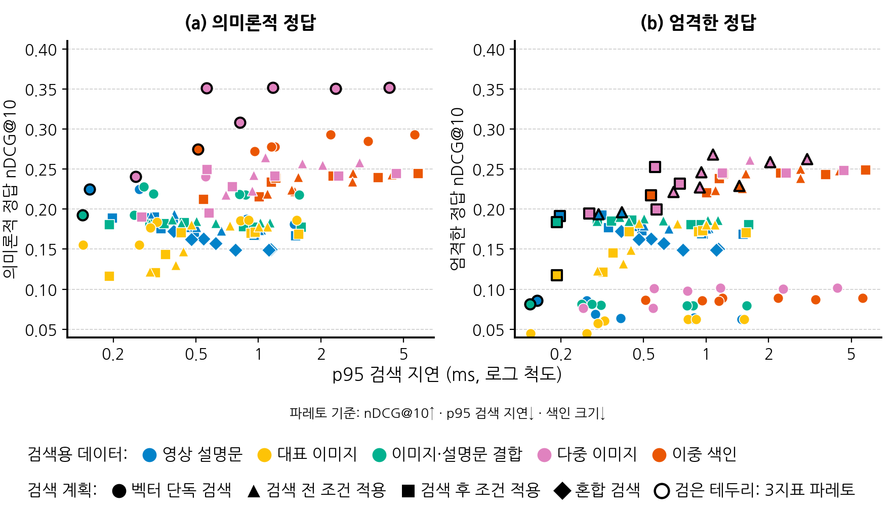

<!-- ▼▼▼ 용어 통일 정본 표 — 내부 편집용 구역. 조판(HWP/DOCX 변환) 시 이 구역 전체(다음 수평선까지)를 삭제할 것. ▼▼▼ -->

# 용어 통일 정본 표 (내부 편집용, 2026-08-10)

본문·표·그림·요약은 아래 정본 표기만 사용한다. 정본 외 변형(구용어·축약·외래어 음차)은 사용하지 않는다.
괄호 병기는 각 용어의 첫 등장 1회만 허용한다. 회귀 검사는 `../scripts/verify_revision_numbers.py`가 수행한다.

## 0. 연구 정체성과 서사 프레임

- 핵심 프레임 : 본 연구의 제안물은 새 검색 알고리즘이나 새 벡터 데이터베이스 아키텍처가 아니라 **평가 타당성 확보 → 설계 대안 비교 → 답변 전파 진단**을 잇는 **단계적 평가 방법론**이다. 국·영문 초록, 서론의 세 공헌, 4.1-4.3절, RQ1-RQ6, 5.3절과 결론은 이 순서와 위계를 유지한다.
- 단계 간 의존성 : 직접적인 정답 정보 재사용 검사를 통과한 뒤에만 설계 대안을 비교하고, 설계 차이가 과제 관련 상위 결과를 실제로 바꾼 뒤에만 최종 답변 차이를 추정한다. 앞 단계가 기준에 미달하면 후속 효과를 추정하지 않고 중단 사유와 진단 결과를 보고한다.
- 제목의 `종단형`·`성능 향상` 해석 : `종단형`은 검색부터 답변까지의 파이프라인 범위를, `성능 향상`은 설계 목표를 뜻한다. 종단 답변 향상 효과가 확립되었다는 의미로 확대하지 않는다. 본문에서는 결과의 성격에 맞춰 `답변 전파 진단`, `검색 품질`, `답변 정확도`로 구체화한다.
- 실험 위계 : `주 분석`은 RQ의 판단을 직접 산출하는 실험, `보강 분석`은 핵심 해석의 견고성·기전을 점검하는 실험, `보충 실험`은 모델 선택·구현 세부·외적 타당성을 지원하지만 RQ 결론을 단독으로 바꾸지 않는 실험이다. 보충 실험의 상세 매개변수와 원자료 표는 보충자료에 두고 본문에는 필요한 적용 범위만 남긴다.

## A. 평가 체계

- 평가 순환성(Evaluation Circularity) : 정답 영상을 가려내는 데 사용한 라벨이나 주석이 메타데이터 조건 또는 검색 문서로 되돌아와, 검색기가 장면을 이해하지 못해도 점수가 부풀려지는 현상.
- 데이터 누수(Data Leakage) : 목표(정답) 정보를 특징이나 평가 자료에 다시 사용하여 실제 운용보다 높은 성능이 나오는 현상.
- 작업 부하 : 검색 코퍼스·질의·검색 정답 집합으로 구성된 평가 데이터 묶음. [외래어 음차 표기 금지]
- 비순환 평가 작업 부하 : 메타데이터 조건은 센서 기록, 검색 문서는 영상 픽셀 기반 VLM 설명문, 검색 정답 집합은 사람 주석에서 얻어 세 원천의 생성 경로를 분리하고, 직접적인 정답 정보 재사용을 자동 검사로 차단한 작업 부하. '비순환성'은 직접적인 정답 정보 재사용의 차단만을 뜻한다(채널 간 통계적 독립·프롬프트 중립성 아님).
- 비순환 평가 작업 부하 구성 절차 : 메타데이터 조건·검색 문서·검색 정답 집합의 생성 원천을 각각 센서 기록·영상 픽셀 기반 VLM 설명문·사람 주석으로 분리하고, 직접적인 정답 정보 재사용을 금지하며, 준수 여부를 자동 검사하는 절차. 비순환 평가 작업 부하는 이 절차를 적용해 만든 산출물이다. ['세 원천 분리 프로토콜' 사용 금지]
- 절차와 산출물의 구분 : 방법을 가리킬 때는 `비순환 평가 작업 부하 구성 절차`, 그 결과로 구축한 데이터 묶음을 가리킬 때는 `비순환 평가 작업 부하`를 사용한다. `비순환 평가 체계`를 두 의미의 대용어로 사용하지 않는다.
- 통제 주입 : 순환성의 왜곡 효과를 정량화하기 위해 정답 정보를 의도적으로 되돌려 넣는 실험. 두 경로 = 정답 조건 주입(메타데이터 조건), 정답 라벨 재진술 주입(검색 문서).
- 통제 실험의 구분 : RQ1의 `통제 주입`, RQ5의 `선택도 보존 대조`, RQ6의 `검색 문맥 조작 실험`을 서로 바꾸어 부르지 않는다. 각각 정답 정보 재사용의 왜곡, 벡터 공간 군집 집중도의 영향, 답변 모델의 문맥 반응을 판정한다.
- 작업 부하 변경 서술 : '수리'·'수리판'·'수정 전후'를 사용하지 않는다. 문맥에 따라 '평가 순환성 진단', '정답 정보 재사용 제거 전후 비교', '정답 정보 재사용을 제거한 작업 부하'로 구체적으로 기술한다.
- 과제-인지 / 과제-중립 프롬프트 : 평가 대상 범주를 명시한 / 명시하지 않은 설명문 생성 프롬프트.
- 프롬프트 민감도 대조의 편집 범위 : 보강 한계 분석으로만 취급한다. 5.2.1절, 국·영문 초록과 결론에는 결과 수치와 상세 진단을 서술하지 않는다. 5.3절에는 설명문 기반 결과가 본 실험의 프롬프트와 VLM 생성 조건에 의존한다는 적용 범위만 간결하게 기록한다. 본문에서 '과제-인지 프롬프트'라는 실험 조건명은 5.1.1절에만 사용한다. 수치·평균 생성 토큰·토큰 상한 도달 건수·세부 신뢰구간·p값은 본문에 싣지 않는다.
- 생성 모델 민감도 대조 : 동일 프롬프트·디코딩·BGE-M3 검색 조건에서 Qwen2.5-VL-7B-Instruct와 Qwen3.5-9B의 설명문만 교체한 보충 실험. RQ2의 다섯 검색용 데이터 구성 비교와 구분하며, 생성 모델 선택의 적용 범위를 확인하는 근거로만 사용한다.
- 보강 분석 : 교차로 분리 분석(RQ3), 선택도 보존 군집 기전 분석(RQ5), 대형 코퍼스 답변 전파 진단(RQ6)을 뜻한다.

## B. 벡터 데이터베이스 계층과 다섯 설계 축

- 벡터 데이터베이스 계층 : 검색용 데이터와 메타데이터를 저장하고 의미 조건·메타데이터 조건·반환 수를 입력받아 상위 클립을 반환하는 계층. 다섯 설계 축으로 정의한다. ['벡터' 접두 생략 금지]
- 벡터 데이터베이스 : pgvector를 사용하는 PostgreSQL, Milvus, Weaviate와 같이 벡터를 저장·색인·검색하는 데이터베이스 시스템. ['엔진'·'벡터 데이터베이스 엔진' 사용 금지; Faiss까지 함께 지칭할 때는 '검색 시스템']
- 검색용 데이터 (축 1) : 클립의 시각 정보를 검색 가능한 형태로 저장하는 형식. 다섯 구성 = 영상 설명문, 대표 이미지, 이미지·설명문 결합, 다중 이미지, 이중 색인. [변형('저장 방식'·'데이터 구성' 단독) 금지; 실험 지칭은 '검색용 데이터 구성']
- 검색 계획 (축 2) : 메타데이터 조건을 언제 어떻게 적용할지의 방식. 네 종류 = 벡터 단독 검색, 검색 전 조건 적용, 검색 후 조건 적용, 혼합 검색.
- 검색 신호와 순위 융합 (축 3) : 순위를 매기는 근거와 순위 결합 방식. 네 신호 = 메타데이터 단독, BM25 어휘 검색, 벡터, BM25–벡터 RRF. [다섯 축 열거 시 '검색 신호'로 축약하지 않음]
- 물리 색인 (축 4) : 벡터 저장·탐색 자료구조 = Flat, HNSW, IVF-Flat, IVF-PQ.
- 배포 (축 5) : 색인 구축·운영 범위 = 전역 색인, 조건별 부분 색인.
- 설계 축 / 설계 대안 / 호환 구성 : `설계 축`은 비교 차원, `설계 대안`은 한 축 안의 후보, `호환 구성`은 함께 실행 가능한 대안들의 조합이다. 세 표현을 같은 의미로 사용하지 않는다.
- 설명문·이미지 이중 색인 : 설명문 색인과 다중 이미지 색인의 순위를 RRF로 결합하는 검색용 데이터 구성. 첫 정의 뒤에는 `이중 색인`으로 줄일 수 있다.
- 영문 설계 축 표기 : `retrieval-data configuration`, `retrieval plan`, `retrieval signals and rank fusion`, `physical index`, `deployment`로 통일한다. 검색용 데이터 구성을 `storage format`만으로 축약하지 않는다.

## C. 데이터·정답 단위

- 클립 : 데이터셋이 배포한 mp4 영상 파일 1개. 본 연구의 검색·답변 평가 단위.
- 영상 설명문 : 클립 내용을 요약 서술한 텍스트 검색 문서. [영어 음차('캡션') 금지]
- 검색 문서 : 검색 대상으로 색인되는 문서(본 연구에서는 영상 설명문). ['검색용 문서' 금지]
- 메타데이터 조건 : 센서 기록의 시간·신호·교통량 정보에 거는 구조화 조건. ['필터 조건'·'사전 필터링' 단독 표기 금지]
- 필수 제약 / 관심 단서 : 메타데이터 조건의 두 사용 의도 — 반드시 지켜야 하는 제약 / 검색을 돕는 보조 단서. 검색 계획 평가는 필수 제약을 엄격한 정답으로, 관심 단서를 의미론적 정답으로 채점한다.
- 엄격한 정답 : 의미 조건과 메타데이터 조건을 모두 만족하는 클립. / 의미론적 정답 : 의미 조건을 만족하는 모든 클립.
- 검색 정답 집합 : 질의별 정답 클립의 집합(엄격 6,809행, 의미론 24,872행).
- RQ3 질의 선정 표본 : 초기 수작업 표본 32질의 / 조건 조합 확장 표본 53질의 / 통합 표본 85질의. ['교차곱'을 표본명에 사용 금지]
- 검색 문맥(retrieved context) : VLM 입력으로 제공되는 설명문 묶음. 통상 상위 k개 검색 결과이며, 통제 실험에서는 그 자리에 대조용 설명문을 제공한다.
- 관련 클립 : 검색 정답 집합에 속하는 클립.
- 답변 전파 성립 조건 : 관련 클립 회수 → 검색 문맥 인식 → 과제 편향 통제. [열거 시 가운뎃점(·) 연결로 통일]
- 답변 전파 진단 : 검색 구성의 차이가 과제 관련 상위 결과와 최종 답변으로 이어지는 조건을 단계별로 판정하는 절차. `답변 효과`, `종단 효과`, `답변 개선`과 같은 확정적 표현은 실제 종단 비교가 성립한 경우에만 사용한다.
- RQ6 검색 문맥 조건 5종 : 검색 문맥 없음(0건), 무관 설명문(1건), 벡터 검색 설명문(상위 3건), 검색 전 조건 적용 설명문(상위 3건), 정답 설명문(1건).

## D. 지표·통계

- nDCG@10 : 상위 10개 결과의 순위 품질을 재는 정규화 할인 누적 이득. [첫 등장 후 기호만 사용]
- 검색 정답 집합 재현율@10(Recall@10) : 질의별 검색 정답 집합 가운데 상위 10개에서 회수한 비율. RQ2-RQ4의 의미 관련성 평가에 사용한다.
- Flat 기준 상대적 재현율@10 : 동일 질의·메타데이터 조건의 Flat 상위 10개 가운데 근사 검색이 회수한 비율. RQ5의 근사 색인 손실 평가에 사용하며 검색 정답 집합 재현율@10과 구분한다.
- 과제 라벨 일치율 : RQ6 대형 코퍼스에서 질의 프레임과 상위 1개 검색 프레임의 버스·이륜차 수 범주가 일치한 비율. 재현율@10 또는 답변 정확도로 부르지 않는다.
- p50 / p95 지연 : 질의당 검색 지연의 중앙값/95분위. [지연 단위는 본문과 표·그림 모두 'ms'로 통일 표기]
- 효과량 Δ : 표마다 정의를 병기 — 표 4=영상 설명문 기준선 대비, 표 5=검색 전 조건 적용−벡터 단독 검색, 표 7·9=무작위 대조−실측. 조판 정본 기준으로 표 9 머리글은 'Δ(무작위-실측)'로 축약 표기하고, 표 4의 기준 셀은 '기준 (0.000)'으로 표기한다.
- RQ3 결과 서술 순서 : 4개 검색 계획의 기본 성능 → 질의 선정 방식별 Δ → 조건–의미 결합도별 Δ → 외부 데이터셋 비교 → 조건부 설계 지침 순으로 전개한다. 검색 후 조건 적용의 반환 수 부족은 RQ3에서 직접 측정하지 않았으므로 원인으로 단정하지 않는다. 의미론적 정답의 통합 Δ 신뢰구간은 0을 포함하므로 벡터 단독 검색의 결과는 가장 높은 점 추정치로 서술한다.
- RQ3 외부 데이터셋 비교 : 표 5는 AI Hub 교차로와 UCA/UCF-Crime에서 필수 제약·관심 단서의 효과량 Δ 부호와 신뢰구간을 비교한다. 조판 정본 기준으로 표 5의 해당 행 이름은 '외부 방향 대조 (Δ)'이고, 그룹행 이름은 '질의 선정 방식 (의미론적 Δ)'과 '조건–의미 결합도 (의미론적 Δ)'이며, 본문 서술은 '외부 데이터셋 비교'와 '외부 비교'를 사용한다. 관심 단서는 AI Hub 교차로의 저결합 V<0.3인 23쌍·75질의와 UCA/UCF-Crime의 영상 길이 구간 30질의로 구성한다. 두 데이터셋의 관심 단서 층화 기준이 다르므로 결합도 효과의 직접 재현이나 일반화 검증으로 서술하지 않는다.
- 조건–의미 결합도 : 메타데이터 조건 충족과 장면 의미 관련성이 함께 나타나는 정도(Cramér's V). 저결합 V<0.3 / 고결합 V≥0.3. [연결 기호는 엔대시 '–']
- 조건–의미 쌍 : 메타데이터 조건의 종류와 의미 조건의 조합(전체 25쌍). 결합도 분석과 군집 부트스트랩의 표본 단위.
- 다중 비교 보정 : 동일한 연구 질문을 다루는 비교 집합별로 적용. Milvus·Weaviate의 실측 조건–무작위 대조 조건 비교에는 Holm 보정, 사후 탐색적인 검색용 데이터 4개 구성 비교에는 Benjamini–Hochberg 보정을 사용. ['보정 가족' 사용 금지]
- 무작위 대조 조건 : 실측 조건과 동일 선택도의 무작위 대조. [변형('무작위 조건' 등) 금지]
- 상충 관계 : 품질과 비용이 동시에 좋아지지 않는 현상. / 절충안 : 그 안에서 선택한 타협점. [영어 음차('트레이드오프') 금지]
- 검색 품질 : nDCG@10·검색 정답 집합 재현율@10·Flat 기준 상대적 재현율@10 등 지표값의 서술. / 검색 성능 : 품질·비용을 아우르는 총칭(개선·왜곡·최적화 문맥).
- 파레토 구성 : 품질·지연·저장을 동시에 지배당하지 않는 구성(그림 3 검은 테두리).
- 비용 지표의 구분 : `벡터 저장량`은 검색용 데이터의 float32 벡터 용량, `색인 크기`는 물리 색인 파일의 실제 용량, `손익분기 질의 수`는 부분 색인 구축 시간을 질의당 지연 절감량으로 회수하는 최소 질의 수다. 파레토 판정과 손익분기 계산을 합치지 않는다.

## E. 색인·실행 경로

- 정확 검색(Flat) : 전수 비교 검색. RQ5에서 근사 색인의 검색 손실을 측정하는 일반 기준이며, RQ6의 실험 역할명인 `정확 색인`과 구분한다.
- 근사 색인(ANN) : 근사 최근접 이웃 색인(HNSW, IVF 계열).
- 반복 스캔 : pgvector에서 조건 만족 결과가 채워질 때까지 탐색을 반복 확장하는 실행 경로.
- 전수 검색 전환 : 조건 통과 벡터가 임계 미만일 때 시스템이 자동으로 전수 검색 경로로 바꾸는 동작.
- 정확 색인(exact-search index) / 의도적 열화 색인(intentionally degraded approximate index) : 대형 코퍼스 답변 전파 진단에서 사용하는 Flat 전수 비교 색인 / IVF-PQ($nlist=1024$, $m=32$, 8비트, $nprobe=8$) 근사 색인. `exact-search index`는 Flat의 전수 비교 검색 역할을 나타내고, `intentionally degraded approximate index`는 일반 색인 계열명이 아니라 본 연구가 답변 전파 진단을 위해 고정한 비교군의 역할명이다. 조판 본문의 첫 등장인 5.1.3절에서만 `한글 용어(영어 용어)`로 병기하고, 이후에는 `정확 색인`과 `의도적 열화 색인`만 사용한다. `exact index`, `degraded index`, `strong degradation`, `강열화 색인`, 수식어 없는 `열화 색인`을 후속 대용어로 사용하지 않는다.
- 26개 근사 색인 구성 / 총 27개 색인 구성 : RQ6 소형 코퍼스(VRU-Accident)의 관련 클립 회수 진단에서 사용하는 전체 색인 조합. HNSW 10개 구성($M \in \{8, 32\} \times efSearch \in \{1, 2, 4, 8, 16\}$, $efConstruction=200$ 고정)과 IVF-PQ 16개 구성($nlist \in \{16, 25\} \times m \in \{4, 8\} \times nprobe \in \{1, 2, 4, 8\}$, 부분벡터당 8비트 고정)의 합인 26개 근사 색인과 Flat 기준선 1개를 합하여 총 27개 색인 구성으로 산정한다. 본문 5.1.3절에서 상세 조합을 1회 명시한 뒤 5.2.6절과 5.3절에서는 `26개 근사 색인 구성` 또는 `27개 색인 구성`으로 지칭한다. 조판 정본의 5.1.3절 RQ6 문단은 이 조합들을 원소 기호(∈) 대신 등호(예: $M=\{8,32\}$)로 표기하므로 본문 표기는 등호를 따른다(4.2절·RQ5 문단은 ∈ 유지).
- 실측 메타데이터 조건 : 실제 장소·날짜·시각·신호 값으로 구성한 조건. `실측 조건`으로 줄일 수 있으나 `자연 조건`으로 부르지 않는다.
- 벡터 공간 군집 집중도 : 메타데이터 조건을 통과한 벡터가 임베딩 공간의 일부 영역에 모이는 정도. 데이터의 일반적 `군집성`, 메타데이터 선택도, IVF의 군집 수와 구분한다.
- 무작위 라벨 재배치(uniform label shuffle) : 통과 벡터 수를 보존한 라벨 무작위화. [첫 병기 후 '재배치']
- 5겹(5-fold) / 평가 전용(held-out) : 교차 검증의 분리 표기. [첫 병기 후 한글만]

## F. 표기 규칙

- 장·절 지칭 : 최상위는 'N장', 하위는 'N.N절'. 표·그림은 '표 N'·'그림 N'.
- 열거 : 다섯 설계 축과 답변 전파 성립 조건은 정본 명칭 전체를 정본 순서대로 쓴다.
- 인용 병기 : 영문 원어·약어 병기는 용어의 첫 등장 1회.
- 범위 표현 : 수치나 연구 질문 등의 범위 표현은 물결표('~') 대신 하이픈('-')으로 표기한다. 단, 조판 정본이 유지한 '기울기 +0.349~+0.521'과 저자 약력의 연도 범위(예: 2016년~2023년)는 물결표를 따르고, 표 1의 '(RQ1–RQ4)'·표 2의 '(전역–부분)'·표 8의 '시각 06–18'은 엔대시를 따른다.
- 음수·대비 부호 : 본문과 표의 음수 값과 대비(빼기) 표기는 하이픈('-')을 사용하며, 특수 마이너스 기호(U+2212 '−')는 사용하지 않는다.
- 참고문헌 표기 : 각 참고문헌 항목의 끝에는 마침표를 찍지 않는다(조판 정본 기준). 항목 안의 쪽 범위는 엔대시('–')를 유지한다.
- 지연 단위 표기 : 밀리초는 'ms'로 표기한다.
- 모델명 표기 : 본 연구의 실험에 사용한 모델은 첫 언급과 이후 언급을 구분하지 않고 체크포인트의 전체 명칭으로 표기하며, 축약형이나 계열명으로 줄이지 않는다. 정본 표기는 Qwen2.5-VL-7B-Instruct, Qwen3.5-9B, Qwen3-VL-Embedding-2B, Qwen2.5-7B-Instruct, Llama-3-8B-Instruct, Qwen2-VL-7B-Instruct, InternVL3-8B, BGE-M3, CLIP ViT-B/32이다. 참고문헌의 논문·보고서 제목은 원문 표기를 유지한다.
- 부정 대조형 문장 금지 : 본문·요약·표·그림 설명의 모든 문장은 핵심 판단을 긍정문으로 직접 서술한다. `A가/은/는 아니라 B다`, `A가/은/는 아닌 B다`, `A가/은/는 아니며 B다`와 같은 부정 대조형 구문은 연구 정체성·기여·결과·한계·인과 해석을 포함한 모든 문맥에서 사용하지 않는다.
- 비채택 용어 금지 : '힌트'(검색 힌트, 검색된 힌트 등), '배경 편향'(데이터셋 배경 편향 등) 등 본 연구에서 채택하지 않은 비정형 대용어는 절대로 사용하지 않으며, 반드시 정본 용어('검색 문맥', '검색 문맥 관련성', '질문 형식의 표면적 단서', '코퍼스 장면 통계')만 사용한다.

<!-- ▲▲▲ 용어 통일 정본 표 끝 — 조판 시 여기까지 삭제 ▲▲▲ -->

---

# 『데이타베이스연구』 논문지 접수 양식

## 논문 정보

**논문 제목 (한글)**
종단형 멀티모달 RAG 파이프라인 성능 향상을 위한 비순환 평가 및 검색 품질-비용에 대한 실증 연구

**논문 제목 (영문)**
An Empirical Study of Non-circular Evaluation and Retrieval Quality-Cost for Enhancing the Performance of End-to-End Multimodal RAG Pipeline

**저자명**
박천복1), Eduardo Linares1), 김승현1), 서영균2)†
(Cheonbok Park, Eduardo Linares, Seunghyun Kim, Young-Kyoon Suh†)

**소속 및 직위**
경북대학교 컴퓨터학부 석사과정1)
경북대학교 컴퓨터학부, 교수2)

**세부 분야**
데이터베이스, 정보검색, 멀티모달 데이터 관리

**E-mail**
박천복 cheonbok55@knu.ac.kr; Eduardo Linares edulinaro@knu.ac.kr;
김승현 seunghyeonkim010312@knu.ac.kr; 서영균 yksuh@knu.ac.kr

## 교신저자 정보 †

**성명**
서영균

**주소**
대구 북구 대학로 80 IT-5호관 520호 (우편 41566)

**연락처**
053-950-6372

### 본 논문에 사용되는 주요 용어에 대한 정의

- **평가 순환성(Evaluation Circularity)**: 정답 영상을 가려내는 데 사용한 라벨이나 주석이 메타데이터 조건 또는 검색 문서로 되돌아와, 시스템이 장면을 이해하지 못해도 검색 점수가 부풀려지는 현상.
- **비순환 평가 작업 부하**: 메타데이터 조건은 센서 기록에서, 검색 문서는 영상 픽셀 기반 VLM 설명문에서, 검색 정답 집합은 사람 주석에서 구성하여 세 원천의 생성 경로를 분리하고, 직접적인 정답 정보 재사용을 자동 검사로 차단한 검색 평가 데이터.
- **벡터 데이터베이스 계층**: 영상 클립의 검색용 데이터와 메타데이터를 저장하고 의미 조건과 메타데이터 조건을 입력받아 상위 클립을 반환하는 계층. 본 연구는 이 계층을 검색용 데이터, 검색 계획, 검색 신호와 순위 융합, 물리 색인, 배포의 다섯 설계 축으로 정의한다.
- **클립**: 데이터셋이 배포한 mp4 영상 파일 1개. 본 연구의 검색과 답변 평가 단위다.
- **검색 문맥(retrieved context)·관련 클립**: VLM 입력으로 제공되는 설명문 묶음을 검색 문맥으로 부른다. 통상 벡터 데이터베이스 계층이 반환한 상위 k개 검색 결과이며, 통제 실험에서는 그 자리에 대조용 설명문을 제공한다. 검색 정답 집합에 속하는 클립은 관련 클립으로 부른다.
- **엄격한 정답·의미론적 정답**: 의미 조건과 메타데이터 조건을 모두 만족하는 클립을 엄격한 정답으로, 의미 조건을 만족하는 모든 클립을 의미론적 정답으로 정의하는 두 가지 검색 정답 기준.
- **검색 전 조건 적용·검색 후 조건 적용**: 메타데이터 조건을 벡터 검색 전에 적용하여 후보를 줄이는 검색 계획과, 벡터 검색 상위 후보에서 조건 불일치 결과를 제거하는 검색 계획.

# 종단형 멀티모달 RAG 파이프라인 성능 향상을 위한 비순환 평가 및 검색 품질-비용에 대한 실증 연구

## An Empirical Study of Non-circular Evaluation and Retrieval Quality-Cost for Enhancing the Performance of End-to-End Multimodal RAG Pipeline

**박천복(Cheonbok Park)¹ · Eduardo Linares¹ · 김승현(Seunghyun Kim)¹ · 서영균(Young-Kyoon Suh)²**

¹ 경북대학교 컴퓨터학부, 석사과정.
² 경북대학교 컴퓨터학부, 교수.
+ 이 논문은 정부(과학기술정보통신부)의 재원으로 한국연구재단의 지원을 받아 수행된 연구임(RS-2025-16067408).

## 요 약

대규모 영상 RAG 시스템은 벡터 데이터베이스의 데이터 저장 형태, 색인, 필터 조건 설계에 따라 검색 품질과 자원 비용이 결정되며 서로 상충 관계에 있다. 따라서 검색 품질-비용 효율을 왜곡 없이 입증하려면 데이터 저장부터 최종 모델의 답변 전파에 이르는 다차원적 통합 평가가 선행되어야 한다. 또한 데이터셋에 내재된 평가 순환성 문제를 정답 정보 유출을 차단함으로써 해결해야 한다. 이에 본 연구는 메타데이터, 영상 설명문, 사람 주석의 생성 경로를 분리한 비순환 평가 체계를 구축하고, 벡터 데이터베이스 설계 축에 따른 품질-비용 상충 관계를 비교한 뒤 검색 결과의 VLM 답변 전파 조건을 단계적으로 진단하였다. 실험 결과, 정답 주입 시 nDCG@10이 0.181에서 1.000까지 부풀려지는 왜곡을 규명하였다. 또한 다중 이미지 저장 시 검색 성능 대비 저장량(2.8배)과 지연 시간(3배)의 상충을 보였으며, 조건별 부분 색인은 상대적 재현율@10 0.9812-0.9952를 달성하였다. 다만 시험한 색인 구성은 과제 관련 상위 검색 결과를 충분히 바꾸지 못해 색인별 최종 답변 차이는 확립되지 않았다. 본 연구는 평가 타당성, 검색 품질 및 자원 제약에 따라 벡터 데이터베이스 구성을 선택하고 답변 전파 여부를 단계적으로 검증하는 실증적 근거를 제시한다.

**주제어:** 도시 교통 감시, 멀티모달, 벡터 데이터베이스, 시각 언어 모델, 검색 증강 생성

## Abstract

In large-scale video RAG systems, search quality and system cost depend on how data is stored, indexed, and filtered in the vector database, creating a clear trade-off. Therefore, fair evaluation requires an integrated assessment from data storage to answer propagation, while preventing ground-truth leakage caused by circular benchmark construction. To address these challenges, we build a non-circular evaluation setup by separating the sources of metadata, video descriptions, and human annotations. We compare quality-cost trade-offs across vector database design choices and then diagnose the conditions under which retrieval differences propagate to VLM answers. Our experiments show that injecting ground-truth-based filter conditions inflates nDCG@10 from 0.181 to 1.000. Furthermore, multi-frame storage requires 2.8× more storage space and 3.0× greater latency, while condition-specific partial indexes achieved relative Recall@10 values of 0.9812–0.9952. However, the tested index configurations did not sufficiently change the top task-relevant retrieval results, so differences in final answers across indexes could not be established. Overall, this study provides empirical evidence for selecting vector database configurations according to evaluation validity, retrieval quality, and resource constraints and for diagnosing answer propagation in stages.

**Keywords:** Urban Traffic Surveillance, Multimodal, Vector Database, Vision-Language Model, Retrieval-Augmented Generation

# 1. 서 론

대규모 영상 데이터 집합에서 필요한 정보를 효율적으로 탐색하기 위해 영상의 시각 정보와 자연어 질의를 결합하는 멀티모달 영상 검색 증강 생성(Retrieval-Augmented Generation, RAG) 파이프라인이 현대 검색 시스템의 핵심 구조로 자리 잡았다. 이 파이프라인은 데이터베이스에서 사용자 질의와 관련된 소수의 핵심 영상 구간을 먼저 검색하고, 이를 시각 언어 모델(Vision-Language Model, VLM)에 참고 정보로 제공하여 생성 답변의 정확도를 높인다. 그러나 영상을 각 질의마다 VLM에 직접 입력하는 방식은 문맥 길이 상한 초과와 GPU 연산 비용 폭증을 유발한다[1]. 따라서 영상을 어떠한 형태로 적재하고 어떠한 색인과 검색 계획을 적용하는지에 따라 시스템의 검색 품질과 물리적 자원 비용이 결정되므로, '벡터 데이터베이스 계층'의 물리 설계 최적화가 핵심 병목으로 부각된다[2].
데이터 저장 형태와 색인·검색 방식은 여러 분야에서 파편화되어 연구되었다. VideoRAG[1]는 질의 관련 영상과 대표 이미지를 검색해 생성 모델에 제공하고, CLIP[3]과 같은 시각·언어 임베딩 모델은 영상 이미지와 자연어 질의 간의 벡터 유사도 검색에 사용된다. VBASE[4]와 ACORN[5]은 벡터 데이터베이스 시스템에서 구조화 조건과 벡터 유사도 검색을 결합하되, 주로 검색 실행 경로와 물리 색인의 성능에 초점을 맞추었다. 그러나 이러한 선행 연구들은 영상 질의 처리, 조건 결합 벡터 검색, 영상 언어 이해 기술을 개별 단위로만 발전시켰으며, 데이터 적재부터 물리 색인, 배포 비용 및 최종 답변 효과까지 하나의 통합 파이프라인에서 측정하지 못했다.
더 근본적인 한계는 평가의 순환성이다. 기존 영상 벤치마크 데이터셋[6,7]들은 검색 성능 평가 단계에서의 '평가 순환성(Evaluation Circularity)[8]'과 '데이터 누수(Data Leakage)[9]'가 발생할 수 있다. 이는 질의, 메타데이터 조건, 영상 설명문, 검색 정답 집합이 하나의 동일한 사람 주석에서 파생함으로써 나타나는 구조적인 문제이다. 본 연구는 RAG 파이프라인에서 평가 순환성 실험을 재현했다. 그 결과, 정답 라벨을 검색 문서에 재진술하는 것만으로도 nDCG@10[10]이 0.181에서 0.854로 상승함을 보였다. 이는 실제 장면 이해보다 주석 재사용이 성능 향상으로 오인되고 있음을 시사한다.
본 연구는 평가 타당성 확보, 설계 대안 비교, 답변 전파 진단을 잇는 단계적 평가 방법론을 제시한다. 센서 메타데이터·영상 픽셀 기반 VLM 설명문·사람 정답 주석의 생성 경로를 분리하고 자동 검사와 통제 주입으로 정답 정보 유출 여부와 점수 왜곡 크기를 확인한다. 그리고 같은 작업 부하에서 비교 대상 축만 바꾸어 벡터 데이터베이스 계층의 품질-비용 상충을 측정하고, 검색 결과의 VLM 답변 전파를 별도로 진단한다. 이를 통해 활용 목적에 부합하는 정답 기준과 자원 제약 조건에 맞는 설계안 선택 지침을 제시한다.
실험 결과, 통제 주입에서 정답 조건은 의미론적 nDCG@10을 0.181에서 1.000으로 높여 직접적인 정답 정보 재사용에 따른 지표 왜곡을 확인하였다. 다중 이미지 구성은 의미론적 nDCG@10을 0.181에서 0.352로 높였지만, 벡터 저장량(24.6MB→68.4MB)과 p50 검색 지연(1.15ms→3.65ms)이 증가했다. 또한 전역 근사 색인에서 실측 시공간 조건의 상대적 재현율은 동일 선택도의 무작위 대조 조건보다 최대 0.627 낮았고, 조건별 부분 색인은 상대적 재현율@10 0.9812-0.9952를 달성하였다. 다만 시험한 색인 구성은 과제 관련 상위 검색 결과를 사전 기준만큼 바꾸지 못해 색인별 최종 답변 차이를 확립하지 못했다.
본 연구의 공헌은 다음과 같다.

- 본 연구는 메타데이터, 영상 설명문, 사람 주석의 생성 경로를 분리하고 직접적인 정답 정보 재사용을 자동 검사하는 비순환 평가 체계를 수립하여, 검색 품질 지표의 부풀림 현상을 정량화한다.
- 본 연구는 검색용 데이터, 검색 계획, 검색 신호와 순위 융합, 물리 색인, 배포의 다섯 설계 축을 동일한 평가 원칙과 공통 측정 절차 아래 비교하여 검색 품질과 자원 비용을 정량적으로 측정한다.
- 본 연구는 관련 클립 회수·검색 문맥 인식·과제 편향의 단계별 검증으로 답변 전파 조건을 진단하여, 벡터 데이터베이스 계층의 개선과 종단 간 답변 효과 사이의 적용 경계를 밝힌다.

본 논문의 구성은 다음과 같다. 2장은 관련 연구를 정리하고, 3장은 벡터 데이터베이스 계층의 비순환 조건부 설계 선택 문제를 정의한다. 4장은 비순환 평가 작업 부하와 벡터 데이터베이스 계층 설계 공간을 포함한 방법론을 설명한다. 5장은 여섯 연구 질문에 따라 실험 결과를 분석하고, 6장은 결론과 향후 연구를 제시한다.

# 2. 관련 연구

데이터 누수는 목표 정보를 특징이나 평가 자료에 다시 사용하여 실제 운용보다 높은 성능을 만드는 현상이다[9]. 다른 분야의 예측 도구 평가에서도 자료 구성 과정의 순환성이 도구 간 비교를 왜곡하는 문제가 보고되었다[8]. 벡터 데이터베이스 검색에서 정답 라벨이나 이를 풀어 쓴 문장이 메타데이터 조건 또는 검색 문서에 포함되면, 높은 검색 점수가 영상과 질의의 실제 관련성을 포착한 결과인지, 재사용된 정답 단서를 맞힌 결과인지 구분하기 어렵다. 본 연구는 센서 기록·영상 설명문·사람 주석의 생성 경로를 분리한 비순환 평가 작업 부하를 구성하고, 정답 조건 주입과 정답 라벨 재진술 주입의 통제 실험으로 직접적인 정답 정보 재사용의 영향을 측정한다.

VideoRAG는 질의와 관련된 영상 및 대표 이미지를 검색하여 생성 모델의 문맥으로 제공한다. CLIP은 이미지와 텍스트를 공통 벡터 공간에 배치하여 자연어 기반 이미지 검색의 토대를 제공한다. 이러한 연구는 영상 RAG의 검색 단계와 멀티모달 검색용 데이터 구성을 뒷받침한다. 본 연구는 영상 설명문, 대표 이미지, 이미지·설명문 결합, 다중 이미지와 이중 색인을 데이터베이스에 저장되고 검색되는 실체적 대상으로 정의한다. 그리고 동일한 질의와 정답 기준에서 검색 품질·지연 시간·저장량을 비교한다. 검색용 데이터가 최종 VLM 답변에 미치는 효과는 별도의 답변 전파 실험에서 검증한다.

조건 결합 벡터 검색의 성능은 메타데이터 조건의 통과 비율뿐 아니라 통과 벡터의 공간 분포와 색인 탐색 구조에 좌우된다[11]. VBASE는 관계형 질의처리와 벡터 검색을 통합하고, pgvector[12]는 조건 만족 결과를 채우기 위한 반복 스캔을 제공한다. Milvus[13]는 벡터 데이터 관리 및 검색 실행을 시스템 수준에서 다루며, ACORN은 HNSW 탐색에 구조화 조건을 결합한다. 본 연구는 메타데이터 조건을 필수 제약과 관심 단서로 구분하고, 같은 선택도의 실측 장소·시간 조건과 무작위 대조 조건을 비교하여 군집 분포가 검색 품질과 근사 색인 재현율에 미치는 영향을 분석한다.

도시 영상 분야에서 VRU-Accident[6]는 사고 영상을 객관식 질의응답 및 밀집 설명문과 연결한다. UCA[14]는 이상행동 영상에 문장 주석과 시간 구간을 제공하여 영상–텍스트 검색, 시간 구간 탐색 및 설명문 생성 과제를 지원한다. Spatialyze[15]는 시공간 조건으로 영상 분석 대상을 축소하는 질의처리 시스템이다. 이들 연구는 도시 감시 장면의 영상-언어 이해와 시공간 질의처리를 발전시켰다. 본 연구는 이 기반 위에서 검색용 데이터, 검색 계획, 검색 신호와 순위 융합, 물리 색인, 배포를 비순환 평가 원칙에 따라 비교하고, 검색 결과의 차이가 최종 답변으로 전파되는 조건을 별도로 진단한다.

기존 연구는 영상 검색과 생성, 조건 결합 벡터 검색, 도시 영상 이해를 개별 연구 흐름으로 발전시켰다. 본 연구는 직접적인 정답 정보 재사용을 차단·검사하는 비순환 평가 작업 부하, 벡터 데이터베이스 계층의 다섯 설계 축에 대한 품질-비용 비교, VLM 답변 전파 진단을 하나의 단계적 평가 방법론으로 연결하여 정답 기준과 자원 제약에 따른 조건부 설계 선택 근거를 제시한다.

# 3. 문제 정의

본 연구가 다루는 문제는 세 가지다. 첫째, 도시 감시 영상 검색 평가에서 질의, 메타데이터 조건, 검색 문서와 검색 정답 집합을 동일한 사람 주석에서 모두 파생하고, 정답 라벨이나 그 재진술을 메타데이터 조건 또는 검색 문서에 직접 재사용하면 평가 순환성이 발생할 수 있다. 단일 출처만으로 누수가 필연적인 것은 아니지만, 이러한 재사용은 검색기가 영상과 질의의 실제 관련성을 포착하지 못하더라도 점수를 높여 벡터 데이터베이스 계층 간 비교의 타당성을 훼손한다[8,9].

둘째, 순환성을 차단하더라도 검색용 데이터·검색 계획·검색 신호와 순위 융합·물리 색인·배포의 적합한 구성은 정답 기준과 자원 제약에 따라 달라진다. 벡터 데이터베이스 계층은 영상에서 생성한 영상 설명문과 이미지 임베딩, 센서 메타데이터를 저장·색인한다. 그리고 의미 조건·메타데이터 조건·반환 수를 입력받아 조건 적용과 벡터·어휘 검색 및 순위 융합을 거쳐 상위 클립을 반환한다. 이 정의는 전용 벡터 시스템과 벡터 확장을 갖춘 관계형 시스템을 함께 포괄한다[2,11]. 각 반환 결과에는 클립 식별자·원본 위치·검색 점수·메타데이터가 포함된다. 동일한 메타데이터 조건도 사용자 의도에 따라 반드시 지켜야 하는 필수 제약이거나 검색을 돕는 관심 단서가 될 수 있다. 필수 제약에서는 의미 조건과 메타데이터 조건을 모두 만족하는 클립을 ‘엄격한 정답’으로 정의하고, 관심 단서에서는 의미 조건을 만족하는 모든 클립을 ‘의미론적 정답’으로 정의한다.

본 연구는 비순환 평가 작업 부하에서 검색 품질을 높이고 검색 지연과 색인 크기를 줄이는 목표를 함께 고려한다. 그리고 세 지표(nDCG@10, p95 지연, 색인 크기) 모두에서 현재 구성보다 동등 이상이면서 적어도 한 지표가 우수한 다른 대안이 존재하지 않을 때, 해당 구성을 파레토(Pareto) 구성으로 정의한다. 이러한 후보 전체를 파레토 구성 집합이라 하며, 엄격한 정답과 의미론적 정답에 대해 각각 산정한다. 검색 신호와 순위 융합에서는 각 신호가 제공하는 검색 이득을 비교하고, 배포에서는 색인 구축 시간과 질의 지연을 바탕으로 조건별 부분 색인의 손익분기 질의 수를 계산한다.

셋째, 벡터 데이터베이스 계층의 검색 품질 차이가 최종 VLM 답변 정확도로 자동 전파되지는 않으므로 별도의 종단 검증이 필요하다[16]. 본 연구는 답변 전파의 성립 조건을 관련 클립 회수·검색 문맥 인식·과제 편향 통제의 세 요소로 구분한다. 관련 클립 회수는 색인 또는 검색 계획의 변경이 VLM에 제공되는 과제 관련 검색 결과를 실제로 변화시키는지를 평가한다. 검색 문맥 인식은 VLM이 제공된 설명문이나 카메라 시점에서 문항 해결에 필요한 정보를 식별하고 답변에 활용하는지를 평가한다. 과제 편향 통제는 답변 정확도의 변화가 검색 문맥의 관련성에 따른 효과인지, 질문 형식·선택지 분포·코퍼스 장면 통계에 따른 효과인지 구분한다. 이 구분은 시각 정보보다 질문과 답변의 표면적 규칙에 의존할 수 있는 VQA의 과제 편향을 검색 문맥의 효과와 분리하기 위한 것이다[17].

# 4. 방법론

그림 1은 세 원천 자료의 분리부터 벡터 데이터베이스 계층의 설계 비교와 답변 효과 검증까지 이어지는 본 연구의 전체 절차를 나타낸다. 그림의 RQ 표기는 5장에서 정의하는 연구 질문과 각 방법 단계의 대응 관계를 나타낸다. 본 장은 비순환 평가 작업 부하의 구성과 순환성 진단(4.1절), 검색용 데이터·검색 계획·검색 신호와 순위 융합·물리 색인·배포의 다섯 설계 축과 호환 구성의 정의(4.2절), 검색 개선의 답변 전파 성립 조건을 검증하는 진단 절차(4.3절)로 이루어진 평가 방법론을 구체화한다. 이 절차는 먼저 비순환 평가 작업 부하를 통해 평가 타당성을 확보하고, 다음으로 벡터 데이터베이스 계층의 설계 항목들을 비교한다. 마지막으로 검색 결과의 차이가 최종 VLM 답변으로 전파되는지를 검증한다.

**&lt;그림 1&gt; 비순환 평가 작업 부하, 벡터 데이터베이스 계층 설계 및 VLM 답변 전파 분석 파이프라인**

## 4.1. 비순환 평가 작업 부하 구성과 순환성 진단

데이터 누수와 평가 순환성이 있으면 시스템이 영상 픽셀을 실제로 이해하지 못해도 성능 지표가 실제보다 높게 나올 수 있다[8,9]. 본 연구는 이 문제를 데이터베이스 검색 평가에 적용하여 기존 데이터셋을 그대로 재사용하지 않고 정답 정보의 유입을 차단한 비순환 평가 작업 부하를 설계한다. 이를 위해 메타데이터 조건은 센서 기록에서, 검색 문서는 영상 픽셀과 고정 프롬프트만을 입력받은 VLM이 생성한 설명문에서, 의미 검색 정답 집합은 사람 주석에서 각각 구성하여 세 원천의 생성 경로를 분리한다.

본 연구는 정답 영상을 가려내는 데 사용한 라벨이나 주석을 메타데이터 조건 또는 검색 문서에 다시 사용하는 경우를 평가 순환성으로 정의한다. 순환성 검사는 메타데이터 조건과 검색 정답 집합의 생성 원천이 분리되었는지, 사람 주석에서 얻은 정답 정보가 메타데이터 조건에 사용되지 않았는지, 검색 문서에 정답 라벨이 직접 포함되지 않았는지를 자동으로 확인한다.

비순환 평가 작업 부하를 구축한 뒤에는 정답 정보를 의도적으로 다시 주입하여 순환성이 검색 품질을 얼마나 왜곡하는지 진단한다. 첫 번째 통제 주입인 정답 조건 주입은 정답 정보를 메타데이터 조건에 반영하여 정답 영상만 검색 후보로 남긴다. 두 번째 통제 주입인 정답 라벨 재진술 주입은 정답 정보의 의미를 문장 형태로 풀어 정답 영상과 대응하는 검색 문서에 추가한다. 두 실험은 정답 정보가 각각 메타데이터 조건과 검색 문서를 통해 유입될 때 발생하는 검색 품질 지표의 상승을 측정한다.

정답 조건 주입에서는 질의별 정답 영상만 통과시키는 메타데이터 조건을 적용한다. 그러나 이 조건은 검색 후보 수를 줄이는 동시에 정답 영상만 남기므로, 검색 품질 지표의 상승이 후보 수 감소에서 비롯된 것인지 정답 정보의 사용에서 비롯된 것인지 그 결과만으로 구분하기 어렵다. 이를 구분하기 위해 각 질의의 정답 영상 수와 동일한 수의 영상을 전체 코퍼스에서 무작위로 선택하는 대조 조건을 구성한다. 본 연구에서는 이러한 무작위 선택을 1,000회 반복하여 동일한 선택도에서 나타나는 검색 품질 지표의 분포를 산출하고, 이를 정답 조건 주입 결과와 비교한다.

정답 라벨 재진술 주입에서는 각 정답 영상의 설명문에 해당 영상이 정답인 이유를 직접 설명하는 문장을 추가한다. 이를 통해 원본 설명문을 사용한 결과와 정답을 재진술한 문장을 추가한 결과를 비교하여 정답을 암시하는 텍스트가 검색 문서에 포함될 때 검색 품질 지표가 얼마나 상승하는지 측정한다. 각 통제 주입에서는 질의, 코퍼스, 검색 정답 집합과 임베딩 모델을 동일하게 유지하고 주입 대상만 변경한다.

## 4.2. 벡터 데이터베이스 계층 설계 및 비교 축 정의

본 연구는 벡터 데이터베이스 계층의 설계 대안을 검색용 데이터, 검색 계획, 검색 신호와 순위 융합, 물리 색인, 배포의 다섯 축으로 구분한다. 이 다섯 축은 각각 무엇을 검색 대상으로 저장할지, 메타데이터 조건을 어느 단계에서 적용할지, 어떤 정보로 결과의 순위를 정할지, 벡터를 어떤 자료구조로 탐색할지, 색인을 어느 범위로 구축할지를 규정한다.

‘검색용 데이터’는 영상 클립의 시각 정보를 검색 가능한 형태로 변환하여 벡터 데이터베이스에 저장하는 형식이다. 클립 전체를 텍스트로 요약한 영상 설명문, 클립을 대표하는 한 프레임을 사용하는 대표 이미지, 이미지와 설명문을 하나의 벡터로 결합한 이미지·설명문 결합, 한 클립에서 추출한 여러 주요 프레임을 각각 저장하는 다중 이미지, 설명문 색인과 다중 이미지 색인을 독립적으로 구축한 뒤 두 순위를 역순위 융합(Reciprocal Rank Fusion, RRF)[18]으로 결합하는 설명문·이미지 이중 색인의 다섯 가지로 구성한다.

‘검색 계획’은 메타데이터 조건의 적용 시점과 후보의 순위화 경로를 정하는 방식이다. 메타데이터 조건을 적용하지 않고 임베딩 유사도로 순위를 정하는 벡터 단독 검색, 조건을 먼저 적용한 부분집합에서 벡터를 검색하는 검색 전 조건 적용, 벡터 상위 후보를 검색한 뒤 조건에 맞지 않는 결과를 제거하는 검색 후 조건 적용, 조건을 먼저 적용한 부분집합에서 BM25와 벡터 순위를 RRF로 결합하는 혼합 검색의 네 가지로 구성한다. 각 계획은 메타데이터 조건을 필수 제약으로 해석하는 엄격한 정답과 관심 단서로 해석하는 의미론적 정답에서 각각 평가한다.

‘검색 신호와 순위 융합’은 결과의 순위를 정하는 정보와 서로 다른 순위를 결합하는 방식을 다룬다. 메타데이터 단독은 조건을 통과한 클립을 별도의 의미 순위화 없이 식별자 순서로 반환하는 기준선이다. BM25 어휘 검색[19]은 영상 설명문과 질의의 어휘 일치로, 벡터는 임베딩 유사도로 순위를 정한다. BM25–벡터 RRF는 동일한 후보 집합에서 얻은 BM25 순위와 벡터 순위를 역순위 점수로 합산한다. 본 연구는 이 네 구성을 비교하여 조건 선택, 어휘 일치, 임베딩 유사도와 순위 융합이 검색 품질에 미치는 영향을 구분한다.

‘물리 색인’은 벡터를 저장하고 탐색하는 자료구조다. 모든 벡터를 전수 비교하는 정확 검색(Flat), 이웃 그래프를 따라 탐색 범위를 좁히는 HNSW[20], 벡터를 여러 군집으로 나눈 뒤 일부 군집만 탐색하는 IVF-Flat, IVF 구조에 곱 양자화를 적용하여 벡터 저장량을 줄이는 IVF-PQ로 구성한다[21,22].

‘배포’는 색인을 구축하고 운영하는 범위를 뜻한다. 전체 데이터를 하나로 색인하는 전역 색인과 자주 사용하는 조건을 만족하는 데이터만 별도로 색인하는 조건별 부분 색인으로 구분한다. 두 방식은 색인 구축 시간과 질의 지연을 이용하여 조건별 부분 색인의 추가 구축 비용을 회수하는 데 필요한 손익분기 질의 수로 비교한다.

혼합 검색은 메타데이터 조건 적용 시점(검색 계획)과 어휘–벡터 순위 융합(검색 신호와 순위 융합)이 결합된 복합 계획이다. 따라서 본 연구는 이를 두 가지 관점으로 분리하여 통제 비교한다. 검색 계획 비교에서는 혼합 검색을 검색 전 조건 적용 후 BM25 어휘 순위와 벡터 유사도 순위를 RRF로 결합하는 하나의 실행 계획으로 평가한다.

반면 검색 신호와 순위 융합 비교에서는 검색 전 조건 적용으로 추출된 동일 후보 집합 내에서 순수 벡터 순위와 BM25–벡터 RRF 융합 순위를 직접 비교하여 융합의 독립적 기여를 검증한다.

이 정의에 따라 혼합 검색은 영상 설명문 구성에만 적용한다. 영상 설명문은 벡터 단독 검색, 검색 전 조건 적용, 검색 후 조건 적용, 혼합 검색의 네 가지 검색 계획을 모두 지원한다($1 \times 4 = 4$개). 다른 네 가지 검색용 데이터(대표 이미지, 이미지·설명문 결합, 다중 이미지, 설명문·이미지 이중 색인)는 본 실험 설계에서 혼합 검색을 제외한 세 가지 검색 계획을 지원한다($3 \times 4 = 12$개). 따라서 유효한 검색용 데이터–검색 계획 조합은 총 16개다.

이 16개 유효 조합을 7개 물리 색인 설정(Flat, HNSW $efSearch \in \{64, 256\}$ 2개, IVF-Flat $nprobe \in \{8, 32\}$ 2개, IVF-PQ $nprobe \in \{8, 32\}$ 2개)과 결합하여 총 $16 \times 7 = 112$개 호환 구성을 정의한다. 본 연구는 112개 호환 구성 전체에 85개 질의와 두 가지 정답 기준(엄격한 정답·의미론적 정답)을 적용하여 총 19,040건($112 \times 85 \times 2$)의 질의별 검색 품질 평가에서 nDCG@10과 재현율@10을 측정한다. 또한 각 구성과 질의의 검색 지연을 10회씩 총 95,200회 측정하고, 각 구성의 색인 크기를 기록한다. nDCG@10·p95 검색 지연·색인 크기를 파레토 판정 지표로 사용하여 검색 품질과 물리적 비용의 상충 관계를 평가한다.

## 4.3. VLM 답변 전파 진단

검색 품질(nDCG@10·재현율@10)의 개선이 VLM의 최종 답변 정확도(Correctness)를 실제로 높이는지 검증하기 위해, 관련 클립 회수·검색 문맥 인식·과제 편향 통제의 세 단계 진단을 수행한다. 세 단계는 각각 검색 결과가 정답에 필요한 관련 정보를 제대로 포함했는지, VLM이 제시된 검색 결과를 실제 답변에 활용하는지, 그리고 관찰된 정확도 향상이 코퍼스 공통의 배경·장소 정보나 질문 형식에서의 표면적 단서보다 검색 문맥의 직접적인 기여에서 비롯된 것인지를 판별한다.

'관련 클립 회수'는 검색 방식을 바꾸었을 때, 정답을 맞히는 데 필요한 핵심 영상이 VLM에 제공되는 상위 결과 안으로 실제로 잘 찾아 들어왔는지를 확인하는 단계다. 검색 지표가 향상되더라도 VLM에 제공되는 관련 클립이 달라지지 않으면 검색 개선과 답변 정확도의 관계를 후속 단계에서 검증할 수 없다.

‘검색 문맥 인식’은 질문과 답변 모델을 동일하게 고정한 채 검색 문맥의 관련성과 시각 정보의 가시성만 바꾸었을 때, VLM의 답변 정확도가 향상되는지를 확인하는 단계다. 이 단계는 답변 문장의 근거 충실성(Faithfulness)을 직접 평가하지 않으며, 과제 관련 검색 정보의 제공이 정답률(Correctness) 향상으로 이어지는지를 평가한다.

‘과제 편향 통제’는 VLM이 관련 검색 결과를 이용해 정답을 맞힌 것인지, 아니면 질문 형식이나 데이터셋에 반복되는 장소·배경 정보만으로 정답을 추측한 것인지 구분하는 단계다. 이를 위해 검색 문맥이 없는 경우, 질문과 무관한 문맥을 제공한 경우, 질문과 관련된 문맥을 제공한 경우의 답변 정확도를 비교한다. 무관 설명문 조건에서 나타난 상승은 검색 문맥 관련성의 효과와 구분한다. 관련 설명문 조건과 무관 설명문 조건의 정확도 차이는 답변 모델이 검색 문맥 변화에 반응하는지를 확인하는 진단값으로 사용한다. 다만 두 조건의 설명문 수가 다르므로 그 차이 전체를 검색 문맥 관련성의 독립적 기여로 해석하지 않는다. 관련 클립 회수 단계가 사전 기준을 충족한 경우에만 검색 개선의 최종 답변 전파를 후속 평가한다.

# 5. 실험

본 장은 실험에 사용한 여섯 연구 질문(RQ)을 정의하고, 이를 실제 데이터에 적용하여 검증한다. 평가 타당성부터 답변 전파까지의 의존 순서에 따라 RQ1을 먼저 검증한 뒤 RQ2–RQ5의 설계 축을 비교하고, 마지막으로 RQ6의 답변 전파를 진단한다.

- 비순환 평가 타당성(RQ1). 같은 주석의 재사용은 검색 점수를 얼마나 왜곡하며, 본 연구의 비순환 평가 작업 부하 구성 절차는 직접적인 정답 정보 재사용을 진단하고 차단할 수 있는가?
- 검색용 데이터 구성(RQ2). 영상 설명문, 대표 이미지, 이미지·설명문 결합, 다중 이미지와 이중 색인은 검색 품질·지연 시간·저장량에서 상충 관계를 형성하는가?
- 검색 계획(RQ3). 벡터 단독 검색, 검색 전 조건 적용, 검색 후 조건 적용과 혼합 검색의 효과는 메타데이터 조건의 사용 목적(필수 제약·관심 단서)과 조건–의미 결합도에 따라 어떻게 달라지는가?
- 검색 신호와 순위 융합(RQ4). 직접적인 정답 정보 재사용을 차단한 평가에서 메타데이터 단독, BM25 어휘 검색과 벡터는 어떤 검색 품질을 보이며, BM25–벡터 RRF는 벡터 순위에 독립적인 이득을 제공하는가?
- 물리 색인과 배포(RQ5). 실측 조건의 선택도·군집성과 질의 빈도에 따라 정확 검색(Flat), HNSW·IVF 계열과 전역 색인·조건별 부분 색인을 어떻게 선택해야 하는가?
- 답변 전파(RQ6). 검색 결과의 차이가 최종 답변으로 전파되려면 관련 클립 회수·검색 문맥 인식·과제 편향 통제에서 어떤 조건을 충족해야 하는가?

## 5.1. 실험 설정

본 절은 데이터셋, 실행 환경과 조건, 평가 방법의 순서로 실험 설정을 설명한다.

### 5.1.1. 데이터셋

표 1은 본 연구에서 사용한 데이터셋의 규모와 역할을 요약한다. 본 연구가 검토한 감시 영상 데이터셋 중에는 메타데이터 조건·검색 문서·검색 정답 집합이 동일 제공자의 주석에서 파생된 사례가 있어, 직접적인 정답 정보의 재사용 가능성을 점검해야 한다[6,7,14]. AI Hub 교차로 데이터셋은 센서 기록에서 메타데이터 조건을, 영상 픽셀에서 검색 문서를, 사람 주석에서 검색 정답 집합을 각각 얻을 수 있어 세 원천의 생성 경로를 분리할 수 있다. 또한 이 데이터셋은 63개 교차로의 동기화 다중 카메라와 시공간·신호 조건이 만드는 현실적인 군집성을 지니며, 검색 품질 비교와 대규모 근사 색인 평가를 함께 수행할 수 있는 규모를 갖춘다. 이러한 특성에 따라 이 데이터셋을 코퍼스와 질의, 두 정답 기준(엄격한 정답·의미론적 정답)을 고정한 핵심 설계 축 비교의 주 평가 데이터로 사용한다. 목적별 보완 데이터는 주 평가 데이터만으로 확인하기 어려운 설계 조건이나 외부 타당성을 해당 RQ에서 검증하는 데 사용한다.

| 구분        | 데이터                   | 규모                                       | 검색·답변 입력                  | 정답, 조건의 출처                            | 사용 목적                                        |
| ----------- | ------------------------ | ------------------------------------------ | -------------------------------- | -------------------------------------------- | ------------------------------------------------ |
| 주 평가     | AI Hub 교차로[23]        | 설명문 3,000개, 질의 85개                  | 설명문·대표 이미지·다중 이미지 | 사람 주석 정답, 센서 조건                    | 비순환성 검증·통제 주입·설계 축 비교 (RQ1–RQ4) |
| 목적별 보완 | VRU-Accident[6]          | 설명문 1,000개, 질의 85개, 답변 문항 600개 | 외부 설명문·4지선다 문항        | 동일 VQA 정답, 날씨·도로·장소 조건         | 평가 순환성 진단, 검색 문맥 비교 (RQ1, RQ6)      |
|             | 지능형 관제 CCTV[7]      | 설명문 269개, 질의 18개                    | 외부 사건 설명문                 | 동일 JSON 정답, 야간·장소 조건              | 평가 순환성 진단 (RQ1)                           |
|             | UCA/UCF-Crime[14,24]     | 세그먼트 6,432개, 질의 135개 중 129개 분석 | 픽셀 기반 설명문                 | 문장 주석 정답, 사건·길이·구간 조건        | 검색 계획 대조 (RQ3)                             |
|             | 시내도로 이미지[25]      | 벡터 132,521개(512차원), 실측 조건 29건    | CLIP ViT-B/32 이미지 벡터        | Flat 상위 이웃, 장소·날짜·시각 조건        | 근사 색인·배포 (RQ5)                            |
|             | AI Hub 교차로 이미지[23] | 벡터 143,830개(512차원), 실측 조건 25건    | CLIP ViT-B/32 이미지 벡터        | Flat 상위 이웃, 센서 조건, 주석 객체 수 정답 | 근사 색인·관련 클립 회수 (RQ5, RQ6)             |
|             | MIRIS[26]                | 벡터 59,019개(512차원)                     | CLIP ViT-B/32 이미지 벡터        | Flat 상위 이웃, 장면·검출 객체·구간 조건   | 조건별 부분 색인 배포 대조 (RQ5)                 |
|             | 다각도 CCTV[27]          | 400사건(주 분석: 시점 비대칭 250개)        | 시점별 이미지·11지선다 문항     | 사건 범주 정답, 경계 상자 시점 구분          | 시점 가시성 비교 (RQ6)                           |

**&lt;표 1&gt; 주 평가 데이터와 목적별 보완 데이터의 규모 및 사용 목적**

AI Hub 교차로 데이터셋에서 센서 채널인 카메라 10은 시간·신호·교통량이 기록된 클립 32,880개, 시각 채널인 카메라 11과 22는 영상 클립 52,462개를 제공한다. 이 중 사람 주석이 부여된 영상 클립 52,210개를 대상으로, 각 클립의 촬영 시각 전후 120초 안에 같은 교차로에서 수집된 센서 클립을 찾는다. 그중 시간 간격이 가장 짧은 한 개를 연결해 센서 정보와 연관된 영상 클립 47,098개를 확보한다. 이 영상 클립 47,098개 중 교차로와 시간대별 분포를 유지하도록 3,000개를 비례 층화 표집하여 검색 코퍼스를 구성한다.

각 영상 클립의 중앙 프레임을 Qwen2.5-VL-7B-Instruct[28]에 입력하고, 교통량·차종·정차 및 주차 차량·보행자·도로·날씨 등 평가 대상 범주 가운데 화면에서 확인되는 내용을 2–4문장으로 기술하도록 하는 과제-인지 프롬프트를 사용한다. 모델에는 픽셀과 프롬프트만 제공하고 센서 기록과 사람 주석은 제공하지 않았으며, 생성은 최대 110토큰의 탐욕적 디코딩을 사용한다.

질의는 시간대, 시각, 황색 신호, 보행 신호와 센서 교통 밀도의 메타데이터 조건 5종에 주차 차량, 개체 20개 이상, 버스 2대 이상, 정차 차량과 이륜차 2대 이상의 의미 조건 5종을 결합해 구성한다. 메타데이터 조건은 시간대 3개, 시각 12개, 황색 신호 여부와 보행 신호 여부 각 2개, 센서 교통 밀도 3개의 총 22개 조건값으로 구체화한다. 이 22개 조건값을 다섯 가지 의미 조건과 조합해 110개 후보를 만들고, 메타데이터 조건값과 의미 조건을 동시에 만족하는 클립, 즉 엄격한 정답 클립이 5개 이상인 85개 조합을 최종 질의로 확정한다.

5.2.3절에서는 85개 질의의 선정 방식이 검색 계획 비교 결과에 미치는 영향을 분석한다. 질의문은 ‘오전’과 ‘버스 2대 이상’처럼 사전에 정한 메타데이터 조건값과 의미 조건을 일정한 문장 형식에 넣어 자동 생성함으로써 표현을 통일한다. 의미 조건과 검색 정답 집합은 사람 주석에서 구성하며, 분석 범위는 엄격한 정답 클립이 5개 이상인 질의로 한정한다.

### 5.1.2. 실행 환경

표 2는 본 연구의 공통 실행 환경과 실험군별 검색 지연 측정 조건을 요약한다. 검색과 색인 구축은 동일 호스트에서 수행하며, 준비 실행은 지연 통계에서 제외한다. 검색 지연에는 벡터 탐색, 조건 적용, 결과 통합, 순위 융합과 상위 k개 반환을 포함하고, 설명문 생성·색인 구축·질의 임베딩 생성은 제외한다.

| 구분                        | 실행 환경 및 측정 조건                                                                                                                                                      |
| --------------------------- | --------------------------------------------------------------------------------------------------------------------------------------------------------------------------- |
| 하드웨어                    | Intel Core i7-9700K(8코어), 메모리 62GB, NVIDIA RTX 3090 24GB 2대, Linux 5.15                                                                                               |
| 소프트웨어                  | Python 3.10.20, PyTorch 2.12.1+cu130, Transformers 5.13.0, Sentence Transformers 5.6.0, Faiss 1.14.3[21]                                                                    |
| 벡터 데이터베이스           | PostgreSQL 16.14·pgvector 0.8.4[12], Milvus 2.6.0·pymilvus 3.0.0[13], Weaviate 1.35.3·클라이언트 4.22.0[29]                                                              |
| Faiss 지연 측정             | CPU 단일 스레드, 구성·질의별로 112개 통합 비교는 준비 실행 2회 후 10회, RQ5 조건 적용 비교는 5회 후 15회, RQ5 조건 없는 비교는 5회 후 20회 측정(준비 실행은 통계에서 제외) |
| 벡터 데이터베이스 지연 측정 | pgvector: 단일 커넥션, JIT 비활성화, 질의 300개(전역 조건)·200개(전역–부분), Milvus·Weaviate: 단일 클라이언트, 질의 100개, 공통 준비 2회+측정 5회                         |

**&lt;표 2&gt; 공통 실행 환경 및 실험군별 검색 지연 측정 조건**

각 연구 질문(RQ)의 영상 설명문 생성 모델과 임베딩 모델은 역할별로 고정한다. 새로 구축하는 영상 설명문의 기본 생성 모델은 Qwen2.5-VL-7B-Instruct이며, RQ1의 통제 주입과 RQ2의 통합 설계에는 Qwen3.5-9B[30] 생성 설명문을 사용한다. 설명문 검색에는 동일한 BGE-M3[31]를 사용하며, 적용 대상은 RQ1의 보완 데이터 진단, RQ3·RQ4 및 RQ6의 VRU-Accident 실험이다. 시각·텍스트 통합 표현을 사용하는 RQ1의 통제 주입과 RQ2의 통합 설계에는 Qwen3-VL-Embedding-2B[32], 이미지 전용 대규모 색인을 다루는 RQ5에는 CLIP ViT-B/32를 배정한다. 모든 임베딩은 L2 정규화하며, 임베딩 모델이 다른 실험군의 절대 nDCG@10은 직접 비교하지 않는다.

4.2절에서 정의한 112개 호환 구성에는 다음의 세부 실행값을 적용한다. 물리 색인은 HNSW의 *M* = 32와 *efConstruction* = 200, IVF 계열의 *nlist* = 64, IVF-PQ의 *m* = 32와 부분공간당 6비트를 사용한다. 다중 이미지와 이중 색인의 이미지 부분은 클립당 최대 3개 벡터를 저장한다. 이중 색인과 혼합 검색은 RRF 상수를 60으로 고정하고, 검색 후 조건 적용은 벡터 상위 200개를 검색한 뒤 조건에 맞지 않는 결과를 제거한다.

RQ5의 조건 없는 물리 색인에는 코퍼스별 질의 1,000개와 Flat, HNSW(*efConstruction* = 200, *M* ∈ {16, 32}, *efSearch* ∈ {16, 64, 256}), IVF-PQ(*nlist* = 1024, *m* ∈ {32, 64}, 부분공간당 8비트, *nprobe* ∈ {8, 32}), IVF-Flat(*nlist* ∈ {256, 1024, 4096}, *nprobe* ∈ {1, 8, 32, 128})을 사용한다.

RQ5의 메타데이터 조건 적용에는 다음의 고정값을 사용한다. Faiss의 전역 HNSW는 $M=32$, $efConstruction=200$, $efSearch=64$로 설정한다. 검색 후 조건 적용에서는 최종 결과 10개를 확보하기 위해 후보 확장 계수 $\alpha\in\{1,2,4\}$를 적용한다. 전체 벡터 수를 $N$, 조건 선택도를 $s$로 두고, 후보 수는 $K'=\min(N,\ \alpha\times[10/s])$로 설정한다. 주 비교에서는 후보 예산이 가장 큰 $\alpha=4$를 사용한다. IVF-Flat은 $nlist=1024$, $nprobe\in\{8,32\}$와 조건 통과 식별자를 사용하며, 조건별 부분 색인은 동일 설정의 HNSW 또는 Flat으로 구축한다. pgvector에는 HNSW($M=16$, $efSearch=64$, $efConstruction=200$)의 기본 탐색·반복 스캔·조건별 부분 색인을 적용한다. Milvus에는 HNSW($M=32$, $efSearch=64$, $efConstruction=200$)의 조건 결합 탐색과 전수 검색 전환, Weaviate에는 기본 설정(`flatSearchCutoff=40000`)의 전수 검색 전환과 `flatSearchCutoff=0`으로 전환을 비활성화한 HNSW 탐색 확대 및 ACORN을 적용한다.

### 5.1.3. 평가 방법

본 연구는 검색 품질과 물리적 비용을 함께 평가한다. 검색 품질은 정규화 할인 누적 이득(nDCG@10)과 검색 정답 집합 재현율@10(Recall@10)으로 측정한다. nDCG@10은 관련 클립의 순위 품질을, 재현율@10은 질의별 검색 정답 집합 가운데 상위 10개 결과에서 회수된 관련 클립의 비율을 나타낸다. 근사 색인과 메타데이터 조건 적용 방식의 검색 손실은 Flat 전수 검색 대비 상대적 재현율@10으로 측정한다. 물리적 비용은 검색용 데이터 구성의 float32 벡터 저장량, 물리 색인의 크기와 구축 시간, 준비 실행을 제외한 질의별 검색 지연(p50 및 p95)으로 한정한다. 원본 영상 저장, 설명문 생성, 질의 임베딩, 네트워크 전송과 최종 답변 생성의 시간·비용은 제외하므로 본 연구의 비용 결과는 벡터 데이터베이스 검색·색인 계층의 부분 비용으로 한정된다. 절대 검색 지연은 동일 벡터 데이터베이스와 실행 환경 안에서만 비교한다. 통합 설계 비교의 파레토 판정은 3장에서 정의한 지배 관계[33]를 적용하여 엄격한 정답과 의미론적 정답별로 수행한다.

RQ3은 메타데이터 조건과 장면 의미의 결합 정도에 따라 검색 전 조건 적용의 효과량 ‘Δ’(검색 전 조건 적용과 벡터 단독 검색의 nDCG@10 차이)가 어떻게 달라지는지 평가한다. 메타데이터 조건과 장면 의미의 연관 강도는 Cramér's V[34]로 측정하며, $V=0.3$을 기준으로 저결합($V<0.3$)과 고결합($V\geq0.3$)으로 구분한다. 신뢰구간은 질의 간 종속성을 통제하기 위해 조건–의미 쌍(메타데이터 조건 종류와 의미 조건의 조합) 단위의 군집 부트스트랩으로 산출한다.

RQ4는 메타데이터 단독·BM25 어휘 검색·벡터·BM25–벡터 RRF의 nDCG@10을 엄격한 정답과 의미론적 정답으로 각각 평가한다. 순위 융합의 독립적 기여는 4.2절에서 정의한 대로 검색 전 조건 적용으로 얻은 동일 후보 집합에서 벡터 순위와 BM25–벡터 RRF 순위를 비교하여 판정한다.

RQ5는 먼저 메타데이터 조건을 적용하지 않은 상태에서 Flat·HNSW·IVF-Flat·IVF-PQ의 상대적 재현율@10, 검색 지연, 색인 크기와 구축 시간을 비교한다. 다음으로 메타데이터 조건을 적용하는 방식별로 상대적 재현율@10과 검색 지연을 비교한다. 검색 후 조건 적용에서는 검색 후보의 범위를 결정하는 확장 계수 $\alpha\in\{1,2,4\}$를 통해 후보 수 증가에 따른 재현율과 검색 지연의 변화를 분석한다. 실측 조건의 영향을 분리하기 위해 Faiss·Milvus·Weaviate의 결과를 조건 통과 비율이 동일한 무작위 대조 조건과 짝지어 비교한다. 또한 조건 통과 비율을 고정한 상태에서 실제 조건과 무작위 라벨 재배치 조건, 그리고 군집 정도를 조절한 합성 조건을 비교하여 벡터 군집이 재현율 손실에 미치는 영향을 분석한다. 재현율 손실을 줄이는 실행 방식으로 반복 스캔과 전수 검색 전환, 그리고 조건별 부분 색인으로 상대적 재현율@10과 검색 지연을 비교한다. 배포 판정에서는 상대적 재현율@10의 목표를 0.95로 정하고, 조건별 부분 색인의 구축 시간을 전역 실행 방식 대비 질의당 지연 절감량으로 나눈 손익분기 질의 수를 산출한다.

RQ6은 4.3절에서 정의한 관련 클립 회수·검색 문맥 인식·과제 편향 통제의 세 단계로 평가한다. 첫째, 관련 클립 회수 진단은 색인 변경이 VLM에 제공되는 과제 관련 검색 결과를 실제로 바꾸었는지 확인한다. 평가 단위는 후속 답변 실험의 입력 형식에 맞춘다. VRU-Accident 설명문 실험은 설명문 1,000개와 VQA 문항 6,000개를 사용하여 Flat 기준선과 HNSW 10개 구성, IVF-PQ 16개 구성의 상위 3개 관련 클립 회수율을 비교한다. HNSW 10개 구성은 그래프의 최대 이웃 연결 수 $M=\{8,32\}$의 두 값과 검색 시 탐색 후보 수 $efSearch=\{1,2,4,8,16\}$의 다섯 값을 모두 조합하며, $efConstruction$은 200으로 고정한다. IVF-PQ 16개 구성은 군집 수 $nlist=\{16,25\}$의 두 값, 부분벡터 수 $m=\{4,8\}$의 두 값과 검색할 군집 수 $nprobe=\{1,2,4,8\}$의 네 값을 모두 조합하며, 부분벡터당 코드는 8비트로 고정한다. 따라서 Flat 1개와 근사 색인 26개를 합한 총 27개 색인 구성을 평가한다.

동일한 관련 클립 회수 진단을 AI Hub 교차로 이미지 코퍼스에도 적용한다. 상위 1개 결과를 VLM에 제공하므로, 질의 프레임을 제외한 133,977개 후보에서 두 색인의 상위 1개 결과를 비교한다. 정규화한 CLIP ViT-B/32 벡터를 전수 비교하는 Flat을 정확 색인으로, IVF-PQ(nlist=1024, m=32, 부분공간당 8비트, nprobe=8)를 의도적 열화 색인으로 사용한다. 상위 1개 검색 결과의 과제 라벨 일치 여부는 검색된 프레임과 질의 프레임의 버스 또는 이륜차 수 범주(0대·1대·2대 이상)가 같은지로 판정한다. 후속 답변 생성은 범주별 과제 라벨 일치율 차이가 5%포인트 이상이고 정확 색인만 일치한 사례가 200건 이상인 경우에만 진행한다.

둘째, 검색 문맥 인식 진단은 설명문 관련성과 시각 정보의 가시성을 나누어 평가한다. 설명문 관련성 실험은 VRU-Accident의 6개 문항 범주에서 각 100개씩 추출한 4지선다 600문항을 사용한다. 질문과 선택지를 고정하고 검색 문맥 없음(0건)·무관 설명문(1건)·벡터 검색 설명문(상위 3건)·검색 전 조건 적용 설명문(상위 3건)·정답 설명문(1건)을 Qwen2.5-7B-Instruct[35]와 Llama-3-8B-Instruct[36]에 제공한다. 프롬프트는 A–D 기호 하나만 출력하도록 지시한다. 최대 신규 6토큰의 탐욕적 디코딩을 조건별로 한 번 수행하고, 처음 출력한 A–D를 정답 기호와 정확 일치로 채점한다. 조건별 답변 정확도의 대응 차이는 문항 부트스트랩 10,000회와 McNemar 정확 검정[37]으로 평가한다.

검색 문맥 인식 진단의 시각 정보 실험은 다각도 CCTV 400사건에 이미지 없음·경계 상자 평균 면적이 작은 카메라 이미지(열세) 시점·평균 면적이 큰 카메라 이미지(우수) 시점·두 카메라 이미지를 함께 제공한 조건(양측) 시점을 제공하여 Qwen2.5-VL-7B-Instruct, Qwen2-VL-7B-Instruct[38], InternVL3-8B[39]의 답변 정확도를 비교한다. 시점 비대칭 250사건을 주 분석 대상으로 삼고, 최대 신규 256토큰의 탐욕적 디코딩을 조건별로 한 번 수행한 뒤 JSON 사건 범주를 정답과 정확 일치로 채점한다. 우수–열세 시점은 문항 대응 부트스트랩으로, 우수–양측 시점은 5%포인트 등가 한계의 두 단측 검정(Two One-Sided Tests, TOST)[40]으로 평가한다.

셋째, 과제 편향 통제에서는 검색 문맥 없음·무관 설명문·질의 관련 설명문 조건의 답변 정확도를 비교하고, 선택지별 응답 분포와 문항 범주별 정확도를 함께 분석한다.

RQ1–RQ6의 공통 통계 분석에서 유한한 표본의 측정 불확실성은 비모수 부트스트랩 95% 신뢰구간[41]으로 보고한다. 변수 간 단조 관계에는 Spearman 순위상관분석[42], 구성 간 대응 비교에는 Wilcoxon 부호순위 검정[43]을 사용한다. 별도 표기가 없으면 양측 유의수준은 0.05이다. 다중 비교 보정은 동일한 연구 질문을 다루는 비교 집합별로 적용한다. Milvus·Weaviate의 실측 조건–무작위 대조 조건 비교에는 Holm 보정[44], 사후 탐색적인 검색용 데이터 4개 구성 비교에는 Benjamini–Hochberg 보정[45]을 적용한다. 보강 분석은 결과를 확인하기 전에 분석 대상 자료, 주요 평가 지표, 제외 기준과 후속 실험의 중단 조건을 정한다. 후속 실험을 진행하지 않은 경우에도 그 판정 근거와 중단 시점까지의 분석 결과를 보고한다.

## 5.2. 실험 결과 및 분석

### 5.2.1. 비순환 평가 작업 부하 검증 결과 (RQ1)

자동 순환성 검사 결과, 메타데이터 조건과 검색 정답 집합의 사용 정보는 분리되었고 메타데이터 조건에 검색 정답 정보가 포함되지 않았다. 검색 문서에서 정답 라벨이 직접 검출된 사례는 0건이었다. 이에 따라 비순환 평가 작업 부하는 모든 검사 항목을 통과했다.

| 데이터·검색 방식                    | 제거 전 기존 정답 | 제거 후 엄격한 정답 | 제거 후 의미론적 정답 |
| ------------------------------------ | ----------------: | ------------------: | --------------------: |
| VRU-Accident / 검색 전 조건 적용     |  **0.9736** |    **0.3174** |                0.2974 |
| VRU-Accident / 벡터 단독 검색        |            0.4476 |              0.1845 |                0.2649 |
| VRU-Accident / BM25 어휘 검색        |            0.4495 |              0.0918 |                0.1607 |
| 지능형 관제 CCTV / 검색 전 조건 적용 |  **1.0000** |    **0.8395** |                0.8395 |
| 지능형 관제 CCTV / BM25 어휘 검색    |            0.9600 |              0.1111 |                0.1667 |

**&lt;표 3&gt; 정답 정보 재사용 제거 전후 작업 부하의 진단적 검색 품질 비교 (nDCG@10)**

표 3에서 정답 정보나 사건 라벨을 직접 재사용한 작업 부하의 검색 전 조건 적용 nDCG@10은 VRU-Accident 0.9736, 지능형 관제 CCTV 1.0000이었고, BM25 어휘 검색도 지능형 관제 CCTV에서 0.9600을 기록했다. 정답 정보 재사용을 제거한 작업 부하의 엄격한 정답 기준에서는 검색 전 조건 적용이 각각 0.3174와 0.8395, BM25 어휘 검색이 0.0918과 0.1111로 낮아졌다. 표 3은 개발 과정에서 발견한 순환 경로와 그 제거 뒤의 점수 양상을 보고하는 진단 사례이며, 열 사이의 차이를 동일 작업 부하에서 추정한 효과량으로 사용하지 않는다. 정답 정보 재사용의 인과 효과는 이어지는 통제 주입 실험에서 다른 요인을 고정하여 검증한다.

**&lt;그림 2&gt; AI Hub 교차로의 정답 정보 통제 주입에 따른 의미론적 nDCG@10 변화**

그림 2의 통제 주입에서는 질의·코퍼스·검색 정답 집합·모델·검색 절차를 고정했다. 정답 정보 미주입 기준의 의미론적 nDCG@10은 0.1810이었고, 정답 조건 주입은 1.0000, 정답 라벨 재진술 주입은 0.8537을 기록했다. 검색 품질은 정답 조건 주입 시 5.5배, 정답 라벨 재진술 주입 시 4.7배로 부풀려졌다. 동일한 선택도의 무작위 대조 조건을 1,000회 반복한 평균은 0.1200으로 미주입 기준 0.1810보다 낮았다. 이 대조 결과에 따라 통제 주입의 상승을 정답 정보 재사용의 효과로 판정한다.

### 5.2.2. 검색용 데이터 구성 평가 (RQ2)

그림 3과 표 4는 검색용 데이터 구성이 검색 품질·검색 지연·저장 비용을 함께 변화시키며, 정답 기준과 자원 제약에 따라 선택할 파레토 구성이 달라짐을 보여준다. 표 4는 다섯 가지 검색용 데이터 구성의 nDCG@10, p50/p95 검색 지연, float32 벡터 저장량을 비교한다. 평가는 AI Hub 교차로의 Qwen3.5-9B 설명문 코퍼스와 85개 질의를 사용했으며, Qwen3-VL-Embedding-2B 임베딩·검색 방식(벡터 단독)·물리 색인(Flat 정확 검색)은 동일하게 유지했다. 그림 3은 검색 계획과 물리 색인까지 확장한 구성들의 nDCG@10–p95 검색 지연 분포를 제시하며, 파레토 판정의 저장 비용에는 float32 벡터 저장량 대신 실제 색인 크기를 사용한다.

**&lt;그림 3&gt; 검색용 데이터·검색 계획·물리 색인에 따른 검색 품질–p95 지연 상충과 파레토 구성 (a) 의미론적 정답, (b) 엄격한 정답**

| 검색용 데이터       | 엄격한 정답 nDCG@10 | 의미론적 정답 nDCG@10 | 설명문 대비 Δ [군집 95% 신뢰구간] | p50 / p95 검색 지연(ms) | float32 벡터 저장량(MB) |
| ------------------- | ------------------: | --------------------: | ---------------------------------: | ----------------------: | ----------------------: |
| 영상 설명문         |               0.063 |                 0.181 |                       기준 (0.000) |             1.15 / 1.49 |                    24.6 |
| 대표 이미지         |               0.063 |                 0.186 |           +0.005 [-0.075, +0.079] |             1.21 / 1.53 |                    24.6 |
| 이미지·설명문 결합 |               0.079 |                 0.218 |           +0.037 [-0.005, +0.074] |             1.24 / 1.57 |                    24.6 |
| 다중 이미지         |               0.101 |                 0.352 |            +0.171 [+0.018, +0.316] |             3.65 / 4.27 |                    68.4 |
| 이중 색인           |               0.089 |                 0.293 |           +0.112 [-0.004, +0.228] |             4.96 / 5.66 |                    93.0 |

**&lt;표 4&gt; 검색용 데이터별 품질·p50/p95 지연·벡터 저장량 비교 (벡터 단독 검색, Flat, 질의 85개)**

표 4에서 다중 이미지는 영상 설명문 대비 의미론적 nDCG@10을 0.181에서 0.352로 높여 가장 높은 검색 품질 점수를 보였다(Δ = +0.171, 군집 95% 신뢰구간 [+0.018, +0.316]). 이때 p95 검색 지연은 1.49ms에서 4.27ms로 2.9배, 벡터 저장량은 24.6MB에서 68.4MB로 2.8배 증가해 품질과 자원 비용의 상충을 보였다. Benjamini–Hochberg 보정 q값은 0.112로 확증 기준을 충족하지 못했으며, 이중 색인은 더 큰 지연·저장 비용과 낮은 품질로 다중 이미지에 지배되었다.

그림 3은 검색용 데이터–검색 계획 16개 조합과 7개 물리 색인 설정으로 구성한 112개 호환 구성의 nDCG@10–p95 검색 지연 분포를 나타낸다. nDCG@10·p95 검색 지연·색인 크기로 판정한 파레토 구성은 의미론적 정답에서 9개, 엄격한 정답에서 19개였다. 이 가운데 다중 이미지 구성은 각각 6개와 10개를 차지했다. 낮은 검색 지연과 색인 크기를 제공하는 다른 검색용 데이터 구성도 파레토 집합에 포함되었으므로, 최종 구성은 정답 기준과 자원 제약에 맞춰 선택해야 한다.

### 5.2.3. 검색 계획 평가 (RQ3)

본 절은 메타데이터 조건의 적용 시점과 순위화 방식에 따라 벡터 단독 검색, 검색 전 조건 적용, 검색 후 조건 적용과 혼합 검색의 품질을 비교한다. AI Hub 교차로의 영상 설명문 3,000개와 질의 85개를 사용하고, BGE-M3 임베딩과 정확 검색을 동일하게 유지했다. 필수 제약은 엄격한 정답으로, 관심 단서는 의미론적 정답으로 채점한다. 표 5는 이 두 사용 목적의 기본 검색 품질과 검색 전 조건 적용의 효과량 Δ를 질의 선정 방식, 조건–의미 결합도 및 외부 데이터셋 비교로 나누어 제시한다. Δ는 검색 전 조건 적용 nDCG@10에서 벡터 단독 검색 nDCG@10을 뺀 값이다.

| 분석 단계                                  | 비교 범위                                                             | nDCG@10 또는 Δ [95% 신뢰구간]                                                |
| ------------------------------------------ | --------------------------------------------------------------------- | ----------------------------------------------------------------------------- |
| **기본 계획 비교**                   | 필수 제약 (엄격한 정답, 85질의)                                       | 벡터 단독 0.059 · 검색 전 0.157 · 검색 후 0.152 · 혼합 0.135               |
|                                            | 관심 단서 (의미론적 정답, 85질의)                                     | 벡터 단독 0.170 · 검색 전 0.154 · 검색 후 0.150 · 혼합 0.133               |
| **질의 선정 방식 (의미론적 Δ)**    | 초기 수작업 표본 (32질의)                                             | -0.0745 [-0.136, -0.014] (질의)                                            |
|                                            | 조건 조합 확장 표본 (53질의)                                          | +0.0197 [-0.008, +0.050] (질의)                                              |
|                                            | 통합 표본 (85질의)                                                    | -0.0158 [-0.047, +0.015] (질의)                                             |
| **조건–의미 결합도 (의미론적 Δ)** | 저결합 V<0.3 (23쌍·75질의)                                           | -0.0357 [-0.094, +0.010] (쌍)                                               |
|                                            | 고결합 V≥0.3 (2쌍·10질의)                                           | +0.1335 [+0.078, +0.356] (쌍)                                                 |
| **외부 방향 대조 (Δ)**          | 필수 제약 (AI Hub 85질의, UCA/UCF-Crime 129질의)                      | AI Hub +0.0983 [+0.068, +0.133] · UCA/UCF-Crime +0.1501 [+0.124, +0.179]     |
|                                            | 관심 단서 (AI Hub 저결합 75질의, UCA/UCF-Crime 영상 길이 조건 30질의) | AI Hub -0.0357 [-0.094, +0.010] · UCA/UCF-Crime -0.0485 [-0.130, +0.021] |

**&lt;표 5&gt; 메타데이터 조건의 사용 목적별 검색 계획 품질과 효과량 Δ**

표 5에서 괄호 안의 ‘질의’와 ‘쌍’은 각각 질의 단위와 조건–의미 쌍 군집 단위의 부트스트랩 재표집을 의미한다.

표 5의 핵심은 조건의 사용 목적에 따라 최적 검색 계획이 달라진다는 점이다. 필수 제약(엄격한 정답)에서는 검색 전 조건 적용이 가장 높은 nDCG@10(0.157)을 기록하며 벡터 단독 검색보다 점수가 높았다(차이 Δ = +0.0983, 95% 신뢰구간 [+0.068, +0.133]). 반면 관심 단서(의미론적 정답)에서는 벡터 단독 검색이 가장 높은 nDCG@10(0.170)을 보였고, 검색 전 조건 적용과의 통합 차이(Δ = -0.0158, 95% 신뢰구간 [-0.047, +0.015])는 유의하지 않았다. 검색 후 조건 적용(0.150)과 혼합 검색(0.133)의 nDCG@10 점수도 모두 벡터 단독 검색보다 낮았다.

관심 단서에서 검색 전 조건 적용의 효과는 조건–의미 결합도에 따라 달라졌다. 저결합 조건에서는 음의 점 추정치가, 고결합 조건에서는 양의 점 추정치가 관찰되었다. 다만 고결합 표본은 2개 조건–의미 쌍에 포함된 10개 질의에 불과하므로 탐색적 결과로 한정한다.

UCA/UCF-Crime 외부 비교에서도 필수 제약에서는 검색 전 조건 적용의 이득이 확인되었다. 관심 단서에서는 AI Hub 교차로와 UCA/UCF-Crime 모두 음의 점 추정치를 보였지만 신뢰구간이 0을 포함했다. 또한 두 데이터셋의 관심 단서 구성 기준이 다르고 UCA/UCF-Crime에서 고결합 조건의 추가 이득이 재현되지 않았으므로, 외부 비교를 고결합 효과의 일반화 근거로 사용하지 않는다.

### 5.2.4. 검색 신호와 순위 융합 평가 (RQ4)

메타데이터 단독, BM25 어휘 검색, 벡터, BM25–벡터 RRF를 비교하여 각 검색 신호와 순위 융합이 독립적인 이득을 제공하는지 분석한다. 직접적인 정답 정보 재사용을 차단한 작업 부하에서 nDCG@10을 측정하고, 엄격한 정답과 의미론적 정답으로 각각 채점한다.

기준선인 메타데이터 단독 검색의 nDCG@10 점수는 엄격한 정답 0.218, 의미론적 정답 0.217을 기록했다. 이는 조건을 충족한 영상을 단순 ID 순으로 반환하므로, 검색기 자체의 순위화 능력보다 조건–의미 결합도를 반영한다. 한편, BM25 어휘 검색은 엄격한 정답 0.017, 의미론적 정답 0.050에 그쳤지만, 벡터 단독 검색은 각각 0.059와 0.170을 기록했다. 의미론적 정답 기준에서 두 검색 방식 간의 검색 품질 격차는 현재의 어휘 신호 변별력이 벡터 신호보다 낮았음을 보여준다.

순위 융합의 독립적인 기여 또한 검색 전 조건 적용 상태를 거친 부분집합을 바탕으로 검증했다. 조건 없는 기본 벡터 단독 검색의 의미론적 정답 nDCG@10은 0.170이었으나, 검색 전 조건 적용을 거친 동일 후보군 안에서 벡터 순위만 사용했을 때는 0.154를 기록했다. 여기에 BM25 어휘 검색 순위를 RRF로 결합한 혼합 검색의 점수는 0.133이었다. 입력 후보군과 검색 전 조건 적용 상태를 동일하게 통제한 이 비교에서 순위 융합에 따른 개선은 관찰되지 않았다.

본 실험 설정에서는 BM25 어휘 검색이 벡터보다 높은 검색 품질을 보이지 않았고, BM25 순위를 결합한 RRF도 동일한 후보 집합의 벡터 순위보다 검색 품질을 개선하지 못했다. 따라서 어휘 신호나 순위 융합을 실제 운영에 적용하기 전에는 대상 작업 부하에서 벡터 기준선 대비 독립적인 이득이 있는지 검증해야 한다.

### 5.2.5. 물리 색인과 배포 평가 (RQ5)

본 절은 메타데이터 조건이 없는 기본 환경에서의 물리 색인 품질–비용 비교, 실측 시공간 조건 적용 시 발생하는 근사 검색 손실, 이를 복구하는 다양한 실행 경로, 그리고 조건별 부분 색인의 배포 기준을 순차적으로 평가한다. 먼저 조건이 없는 기본 검색 환경에서 5.1.2절의 색인 매개변수를 평가했으며, 표 6은 구조 간 공정한 비교를 위해 HNSW($efSearch=64$)와 IVF 계열($nlist=1024$, $nprobe=8$)의 대표 설정을 요약한 결과다. 평가에 사용된 시내도로(131,000개)와 AI Hub 교차로(142,000개)는 전체 벡터 집합(각각 132,521개, 143,830개)에서 추출하여 고정한 대규모 실측 벤치마크이다.

| 코퍼스                           | 구성                                           | 상대적 재현율@10 | p50 / p95(ms) | 구축(초) | 크기(MB) |
| -------------------------------- | ---------------------------------------------- | ---------------: | ------------: | -------: | -------: |
| 시내도로 벤치마크 131,000개      | Flat                                           |           1.0000 | 13.43 / 14.37 |     0.11 |    268.0 |
|                                  | HNSW($M=16$, $efSearch=64$)                |           0.9970 | 0.041 / 0.055 |     34.8 |    287.0 |
|                                  | HNSW($M=32$, $efSearch=64$)                |           0.9970 | 0.044 / 0.062 |     36.5 |    304.0 |
|                                  | IVF-Flat($nlist=1024$, $nprobe=8$)         |           0.9940 | 0.113 / 0.144 |     13.9 |    271.0 |
|                                  | IVF-PQ($nlist=1024$, $m=64$, $nprobe=8$) |           0.4810 | 0.135 / 0.158 |     26.1 |     12.0 |
|                                  | IVF-PQ($nlist=1024$, $m=32$, $nprobe=8$) |           0.3340 | 0.129 / 0.153 |     25.9 |      8.0 |
| AI Hub 교차로 벤치마크 142,000개 | Flat                                           |           1.0000 | 14.18 / 15.34 |     0.12 |    290.8 |
|                                  | HNSW($M=16$, $efSearch=64$)                |           0.9994 | 0.044 / 0.061 |     44.3 |    311.3 |
|                                  | HNSW($M=32$, $efSearch=64$)                |           0.9992 | 0.047 / 0.069 |     47.1 |    329.5 |
|                                  | IVF-Flat($nlist=1024$, $nprobe=8$)         |           0.9971 | 0.116 / 0.165 |     15.1 |    294.1 |
|                                  | IVF-PQ($nlist=1024$, $m=64$, $nprobe=8$) |           0.4938 | 0.134 / 0.172 |     27.9 |     12.9 |
|                                  | IVF-PQ($nlist=1024$, $m=32$, $nprobe=8$) |           0.3489 | 0.131 / 0.157 |     27.1 |      8.3 |

**&lt;표 6&gt; 조건이 없는 두 실측 코퍼스의 대표 물리 색인 설정별 품질·비용**

표 6은 메타데이터 조건을 적용하기 전, 기본 순수 벡터 검색 환경에서 세 가지 근사 색인 구조(HNSW, IVF-Flat, IVF-PQ)가 보이는 품질–비용 상충 관계를 명확히 보여준다. HNSW는 두 코퍼스 모두에서 Flat 대비 0.997 이상의 압도적인 상대적 재현율을 유지하면서, p50 검색 지연을 13-14ms에서 0.04ms대로 300배 이상 대폭 단축시켰다. IVF-Flat 역시 0.994 이상의 높은 재현율을 보존하며 Flat 대비 약 100배 빠른 0.11ms대의 안정적인 검색 속도를 기록했다. 반면 IVF-PQ는 벡터 양자화를 통해 색인 크기를 8.0-12.9MB로 95% 이상 극단적으로 줄였으나, 압축 손실로 인해 상대적 재현율이 0.334-0.494로 급격히 저하되었다. 따라서 조건을 적용하지 않은 기본 환경에서도 물리 색인의 선택은 검색 지연 단축(HNSW), 메모리 절감(IVF-PQ), 그리고 검색 품질 보존(HNSW·IVF-Flat) 간의 명확한 상충 관계를 수반한다.

다음으로 Faiss에서 실측 메타데이터 조건의 선택도와 벡터 공간 분포가 근사 색인의 재현율에 미치는 영향을 분석한다. 각 실측 메타데이터 조건마다 통과 데이터 수가 동일한 무작위 대조 조건을 1:1로 짝지었다. 시내도로 29개 조건에는 질의 1,000개, 교차로 25개 조건에는 이미지 질의 200개를 사용한다. 각 쌍의 재현율 차이 Δ를 ‘무작위 대조 조건 재현율 - 실측 조건 재현율’로 산출했다.

| 조건 적용 방식                              |     시내도로 (n=29쌍) |       교차로 (n=25쌍) |
| ------------------------------------------- | --------------------: | --------------------: |
| 전역 HNSW 검색 후 적용($\alpha=4$)        | +0.611 [0.554, 0.661] | +0.289 [0.219, 0.359] |
| IVF 탐색 중 메타데이터 조건 적용(nprobe=8)  | +0.627 [0.550, 0.699] | +0.217 [0.144, 0.294] |
| IVF 탐색 중 메타데이터 조건 적용(nprobe=32) | +0.498 [0.407, 0.585] | +0.116 [0.072, 0.159] |
| 조건별 부분 색인(HNSW)                      | +0.017 [0.012, 0.023] | +0.004 [0.002, 0.006] |
| 조건별 부분 색인(Flat)                      |      Δ=0 (검정 불능) |      Δ=0 (검정 불능) |

**&lt;표 7&gt; Faiss 실행 방식별 실측 메타데이터 조건과 무작위 대조 조건의 재현율 차이**

표 7에서 전역 HNSW와 IVF의 실측 조건 재현율은 동일 선택도의 무작위 대조 조건보다 낮았으며, 차이는 최대 0.627이었다. 이는 선택도만 일치시킨 무작위 대조 조건이 실제 시공간 조건의 탐색 난이도를 충분히 반영하지 못함을 보여준다. 반면 조건별 부분 색인을 적용하면 손실이 크게 줄어들었다. HNSW 방식에서는 손실 차이가 시내도로 0.017, 교차로 0.004로 전역 색인 대비 대폭 축소되었고, Flat 방식(전수 검색)은 부분집합 내 손실 자체가 없어 차이가 0이었다.

검색 후 조건 적용에서 후보 확장 계수(α)의 민감도를 분석한 결과, α가 1에서 4로 커짐에 따라 재현율과 검색 지연이 동시에 증가했다. 시내도로 데이터의 경우 α가 1, 2, 4로 증가함에 따라 상대적 재현율은 0.2415에서 0.2791, 0.3062로 개선되었으나, p50 검색 지연 역시 0.0648ms에서 0.0817ms, 0.1017ms로 함께 늘어났다. 교차로 데이터에서도 마찬가지로 재현율이 0.5196에서 0.6138, 0.6667로 향상되는 동안, p50 지연 시간 또한 0.0542ms에서 0.0653ms, 0.0817ms로 증가했다. 따라서 α = 4는 시험한 범위 내에서 가장 높은 재현율을 제공하여 주 비교 설정으로 채택했으나, 이는 제한된 탐색 범위 내의 선택일 뿐 더 큰 확장 계수를 포괄하는 전역 최적값을 뜻하지는 않는다.

표 7의 재현율 차이가 단순한 조건 통과 비율 때문인지, 조건을 통과한 벡터가 특정 영역에 집중된 공간 분포 때문인지 구분하기 위해 두 가지 대조 실험을 수행했다.

첫째, 조건을 만족하여 추출되는 데이터 개수는 동일하고, 조건 라벨만 전체 공간에 무작위로 분포시킨 라벨 무작위 배치 검증(100회 반복)을 수행했다. 그 결과, 검색 후 조건 적용 HNSW(M = 32, efConstruction = 200, efSearch = 64) 환경에서 실측 조건과 무작위 대조군 사이의 재현율 손실 차이는 시내도로에서 +0.639(95% 신뢰구간 [0.592, 0.686]), 교차로에서 +0.305([0.231, 0.381]) 수준으로 발생했다. IVF-Flat (nlist = 1024, nprobe = 8)에서도 각각 0.677과 0.234의 손실 차이를 보여, 데이터 개수가 같더라도 실제 시공간 데이터가 뭉쳐 있다는 사실 자체만으로 탐색 손실이 급증함을 입증했다.

둘째, 데이터가 한곳에 밀집된 정도(군집 강도)를 단계별로 점차 높여가며 손실 변화를 측정했다. 그 결과, 데이터 통과율이 같더라도 데이터들이 공간상에 뭉쳐 있는 군집 집중도가 커질수록 검색 손실이 뚜렷한 양의 상관관계를 보이며 증가했다(기울기 +0.349~+0.521).

이처럼 근사 색인의 재현율 손실이 시공간 데이터의 군집 현상에서 비롯됨이 확인됨에 따라, 이를 복구하기 위해 상위 10건 확보 시까지 HNSW 탐색 범위를 점진적으로 확장하는 pgvector의 반복 스캔(Iterative Scan)을 평가했다. 표 8은 시내도로 코퍼스를 대상으로 메타데이터 조건별 기본 탐색과 반복 스캔의 재현율, 부족률(요청한 상위 10건을 채우지 못한 미달 비율), 그리고 p50 지연 시간을 비교한 결과이다.

| 메타데이터 조건 (선택도) | 재현율 (기본 → 반복스캔) | 부족률 | p50 지연(ms) |
| ------------------------ | ------------------------: | -----: | -----------: |
| 장소 BC2000801 (0.086)   |             0.121→ 0.658 |   5.8% |         19.0 |
| 장소 중동사거리 (0.049)  |             0.034→ 0.302 |  50.8% |         29.5 |
| 시각 06 (0.183)          |             0.310→ 0.984 |   0.0% |         1.01 |
| 시각 06–18 (0.774)      |             0.876→ 0.994 |   0.0% |         0.44 |

**&lt;표 8&gt; pgvector 반복 스캔의 메타데이터 조건별 재현율·부족률·지연**

시간 조건에서는 반복 스캔 후 상대적 재현율@10이 0.984-0.994였고 부족률은 0.0%, p50 지연은 0.44-1.01ms였다. 장소 조건에서는 상대적 재현율@10이 0.302-0.658, 부족률이 5.8-50.8%, p50 지연이 19.0-29.5ms였다. 따라서 반복 스캔의 효과와 비용은 조건 벡터의 공간 분포에 따라 달랐으며, 시험한 장소 조건에서는 요청 결과 수와 검색 품질을 충분히 확보하지 못했다.

표 9는 Milvus와 Weaviate에서 실측 조건과 무작위 대조 조건의 재현율 차이를 비교한다. 이 분석은 시내도로 24개와 교차로 22개의 실측 메타데이터 조건을 사용하며, 각 조건마다 통과 데이터 수가 동일한 무작위 대조 조건을 1:1로 짝지어 총 24쌍과 22쌍을 평가했다. Weaviate는 모든 조건을 조건 결합 HNSW로 탐색하지만, Milvus는 조건의 필터링 비율에 따라 실행 경로를 자동으로 분기한다. 그 결과 Milvus에서는 시내도로 24쌍 중 6쌍이 조건 결합 탐색, 18쌍이 전수 검색 전환으로 나뉘어 실행되었으며, 교차로 22쌍은 각각 18쌍과 4쌍으로 나뉘어 실행되었다.

| 실행 방식             | 데이터   | n쌍 | 재현율 Δ(무작위-실측) [95% 신뢰구간] | 판정                     |
| --------------------- | -------- | --: | ------------------------------------------: | ------------------------ |
| Weaviate 탐색 확대    | 시내도로 |  24 |                    +0.0098 [0.0049, 0.0159] | Holm 보정 뒤 유의        |
| Milvus 그래프 탐색    | 교차로   |  18 |                    +0.0028 [0.0009, 0.0049] | Holm 보정 뒤 유의        |
| Milvus 그래프 탐색    | 시내도로 |   6 |                    +0.0140 [0.0079, 0.0220] | 방향만 일치              |
| Weaviate 탐색 확대    | 교차로   |  22 |                    +0.0006 [0.0000, 0.0015] | 방향만 일치, 효과는 작음 |
| Milvus 전수 검색 전환 | 시내도로 |  18 |                    +0.0006 [0.0004, 0.0008] | 전수 검색에서 손실 제거  |
| Milvus 전수 검색 전환 | 교차로   |   4 |                재현율 ≥0.9986, Δ≤+0.0014 | 관측값만 보고 (n<5)      |
| Weaviate ACORN        | 교차로   |  22 |                  -0.0181 [-0.046, +0.003] | 부호 역전 경향, 0 포함   |

**&lt;표 9&gt; Milvus와 Weaviate의 조건 적용 방식에 따른 실측 조건–무작위 대조 조건 재현율 차이**

Milvus와 Weaviate의 조건 결합 탐색에서는 실행 방식과 데이터셋에 따라 실측 조건의 재현율 손실 정도가 달랐다. Holm 보정 후 통계적으로 유의한 재현율 차이는 Weaviate 시내도로 +0.0098과 Milvus 교차로 +0.0028이었으며, Milvus 시내도로(+0.0140, 6쌍)에서도 동일한 손실 경향이 나타났다. 반면 상용 벡터 데이터베이스의 전수 검색으로 자동 전환된 구간에서는 재현율 차이가 0.0014 이하로 대폭 축소되어 검색 품질 손실이 효과적으로 억제되었다. 이러한 전수 검색 전환은 Milvus 2.6.0에서 조건의 필터링 비율이 약 92.3%를 넘을 때, Weaviate 1.35.3에서는 조건을 만족하는 벡터가 40,000개 미만일 때 관찰되었다.

pgvector에서 조건별 부분 색인 6개를 구축한 결과, 시내도로의 선택도 0.011-0.774 조건에서 동일 조건 정확 검색 대비 재현율 0.9812-0.9952와 p50 검색 지연 0.407-0.454ms를 기록했다. 색인 구축 시간은 0.38-39.15초, 색인 크기는 3.77-257.61MB였다. 이 결과의 적용 범위는 측정한 시내도로 조건이며, MIRIS의 확장 장면 조건에서는 일부 조건별 부분 색인의 재현율이 0.951-0.952로 낮아졌다.

RQ5의 배포 판정에서는 재현율 목표를 0.95로 두었다. 전역 색인의 재현율이 이 값에 미달하면 조건별 부분 색인 또는 전수 검색으로 검색 품질을 복구한다. 전역 색인이 목표를 충족한 시내도로 조건 중, 선택도가 낮은 0.1829와 0.2601에서는 색인 구축 시간을 상쇄하는 데 필요한 손익분기 질의 수(최소 질의 처리 건수)가 각각 10,594건과 21,509건으로 나타나 부분 색인 도입의 실익이 컸다. 반면 선택도가 높은 0.4734와 0.7737에서는 질의당 지연 절감이 각각 0.010ms와 0.033ms에 그쳐, 초기 구축 시간을 회수하기 위한 손익분기 질의 수가 2,112,000건과 1,186,364건으로 급증했다. 따라서 조건별 부분 색인은 다음 색인 갱신 전까지 예상되는 질의 수가 이 손익분기 질의 수를 넘는 경우에만 선별적으로 배포한다. 이는 정적 작업 부하에서 도출한 설계 기준이며, 실시간 갱신과 동시 질의를 포함한 운영 정책으로 검증된 결과는 아니다.

RQ2–RQ5는 벡터 데이터베이스 계층의 설계 차이가 검색 품질과 비용을 어떻게 바꾸는지를 규명했다. RQ6은 이 검색 단계의 차이를 곧바로 최종 답변 차이로 간주하지 않고, 관련 클립 회수·검색 문맥 인식·과제 편향 통제의 세 단계를 차례로 적용하여 답변 전파의 성립 범위를 진단한다.

### 5.2.6. 답변 전파 진단 결과 (RQ6)

RQ6에서는 4.3절과 5.1.3절에서 정의한 관련 클립 회수·검색 문맥 인식·과제 편향 통제의 세 단계 진단을 모두 적용했다. 각 단계는 검색 구성의 차이가 과제 관련 검색 결과를 변화시키는지, 답변 모델이 변화한 검색 문맥을 활용하는지, 관찰된 답변 차이를 검색 문맥의 관련성 효과로 볼 수 있는지를 순서대로 판정한다. 이 중 설명문 검색 문맥의 관련성과 과제 편향 통제에 따른 답변 모델별 정확도 및 주요 대비는 표 10에 요약하여 제시한다.

첫째, 관련 클립 회수 단계는 색인 변경이 답변 모델에 전달되는 질의 관련 검색 결과를 실제로 변화시키는지를 소형 설명문 코퍼스인 VRU-Accident(1,000건)와 대형 이미지 코퍼스인 AI Hub 교차로(약 13.4만 건)에서 각각 평가했다. VRU-Accident에서 상위 3개 관련 클립 회수율(Recall@3)은 Flat 전수 검색(51.62%) 대비 26개 근사 색인 구성에서 50.28%-54.33%에 머물렀다. AI Hub 교차로(2,739개 평가 모집단, 133,977개 검색 후보)에서도 정확 색인과 의도적 열화 색인의 상위 1개 과제 라벨 일치율 차이는 버스 +0.8%포인트(95% 신뢰구간 [-1.0, +2.7])와 이륜차 –1.1%포인트([-3.1, +0.8])에 그쳤다. 두 범주 모두 정확 색인만 일치한 사례 수 기준은 충족했지만, 과제 라벨 일치율 차이가 5%포인트 기준에 미달하여 후속 답변 생성을 진행하지 않았다.

둘째, 검색 문맥 인식 단계에서는 색인 간 차이가 미미했던 점을 보완하기 위해 검색 문맥을 직접 조작하는 통제 실험을 수행했다. 이를 통해 답변 모델이 설명문의 관련성과 영상 시점의 가시성 변화에 실제로 반응하는지를 검증했다. 설명문 기반의 다섯 가지 검색 문맥 조건별 답변 정확도와 주요 대비는 표 10과 같다.

| 검색 문맥 조건 (제공 설명문 수)              |                  Qwen2.5-7B-Instruct (정확도 %, 95% 신뢰 구간) |                  Llama-3-8B-Instruct (정확도 %, 95% 신뢰 구간) |
| -------------------------------------------- | -------------------------------------------------------------: | -------------------------------------------------------------: |
| 검색 문맥 없음 (0건)                         |                                              30.8 [27.2, 34.5] |                                              30.7 [26.8, 34.5] |
| 무관 설명문 (1건)                            |                                              53.8 [49.8, 57.8] |                                              52.8 [48.8, 56.8] |
| 벡터 검색 설명문 (상위 3건)                  |                                              66.5 [62.7, 70.2] |                                              66.5 [62.7, 70.2] |
| 검색 전 조건 적용 설명문 (상위 3건)          |                                              68.0 [64.3, 71.8] |                                              66.7 [62.8, 70.3] |
| 정답 설명문 (1건)                            |                                              74.7 [71.2, 78.0] |                                              69.0 [65.3, 72.7] |
| **주요 대비**                          | **Qwen2.5-7B-Instruct (Δ%포인트 [95% 신뢰 구간], p값)** | **Llama-3-8B-Instruct (Δ%포인트 [95% 신뢰 구간], p값)** |
| 무관 설명문 - 검색 문맥 없음                |                                    +23.0 [17.8, 28.2], p<0.001 |                                    +22.2 [16.8, 27.5], p<0.001 |
| 벡터 검색 설명문 - 무관 설명문              |                                     +12.7 [8.3, 17.0], p<0.001 |                                     +13.7 [8.8, 18.3], p<0.001 |
| 검색 전 조건 적용 설명문 - 벡터 검색 설명문 |                                     +1.5 [-2.0, 5.0], p=0.448 |                                     +0.2 [-3.2, 3.5], p=1.000 |
| 정답 설명문 - 벡터 검색 설명문              |                                     +8.2 [3.5, 12.7], p=0.0006 |                                     +2.5 [-1.7, 6.8], p=0.279 |

**&lt;표 10&gt; 설명문 검색 문맥 조건별 답변 정확도와 주요 대비 (상단은 정확도 %, 하단은 대비 Δ%포인트)**

표 10에서 무관 설명문 조건의 답변 정확도는 Qwen2.5-7B-Instruct 53.8%, Llama-3-8B-Instruct 52.8%였고, 벡터 검색 설명문 조건에서는 두 모델 모두 66.5%였다(모두 p<0.001). 검색 전 조건 적용 설명문 조건의 정확도는 각각 68.0%와 66.7%로, 벡터 검색 설명문 조건과의 차이에 대한 두 신뢰구간은 모두 0을 포함했다(Qwen2.5-7B-Instruct p=0.448, Llama-3-8B-Instruct p=1.000). 정답 설명문 조건의 정확도는 각각 74.7%와 69.0%였다. 벡터 검색 설명문 조건과 비교했을 때 Qwen2.5-7B-Instruct의 신뢰구간은 0을 제외했고(p=0.0006), Llama-3-8B-Instruct의 신뢰구간은 0을 포함했다(p=0.279). 별도의 시각 정보 실험에서는 대상 객체의 경계 상자 평균 면적이 큰 카메라 이미지를 제공했을 때 작은 카메라 이미지를 제공했을 때보다 세 모델의 답변 정확도가 높았다(모두 p<0.005). 세 모델의 정확도는 평균 면적이 큰 카메라 이미지만 제공한 조건과 두 카메라 이미지를 함께 제공한 조건에서 사전에 정한 등가 범위 안에 있었다. 이 통제 결과는 시험한 답변 모델들이 설명문의 관련성과 시각 정보의 가시성 변화에 반응했음을 보여준다.

셋째, 과제 편향 통제 단계에서는 무관 설명문 조건이 검색 문맥 없음 조건보다 약 22%포인트 높은 정확도를 보인 양상을 응답 분포와 문항 범주별로 분석했다. 검색 문맥이 없을 때 Qwen2.5-7B-Instruct는 전체 600문항 중 42.0%에서 네 선택지 중 같은 위치의 답을 골랐다. 그 위치의 답이 정답인 문항은 21.2%였으며, 무관 설명문을 제공하자 같은 위치의 답을 고른 비율은 23.8%로 낮아졌다. 장소·도로 유형 문항의 정확도는 Qwen2.5-7B-Instruct와 Llama-3-8B-Instruct에서 상승했고, 사고 유형 문항의 정확도는 두 모델에서 하락했다. 이 결과는 질문·선택지 형식에 따른 응답 편향과 데이터셋에 반복되는 장소·도로 장면 패턴이 정확도 상승에 개입했을 가능성을 보여준다. 무관 설명문 대비 벡터 검색 설명문 조건에서 약 13%포인트의 정확도 차이가 관찰되었다. 다만 두 조건에서 제공한 설명문 수가 각각 1건과 3건이므로, 이 차이 전체를 설명문 관련성만의 효과로 분리해 해석할 수는 없다.

종합하면, 색인별 최종 답변 차이를 확립하지 못한 직접적인 이유는 시험한 색인 구성들이 과제 관련 상위 검색 결과를 사전 기준만큼 다르게 만들지 못했기 때문이다. 별도의 검색 문맥 조작 실험에서는 답변 모델이 관련 설명문과 시각 정보의 가시성 변화에 반응함을 확인했다. 세 단계 진단은 관련 클립 회수의 성립 여부, 답변 모델의 문맥 반응과 과제 편향을 구분하여 검색 결과와 최종 답변 사이에서 허용되는 해석 범위를 정한다.

## 5.3. 설계 시사점 및 한계

본 연구의 결과는 벡터 데이터베이스 계층을 설계할 때 따라야 할 세 가지 원칙을 제시한다. 첫째, 검색 대안을 평가하기 전에 정답 정보의 직접 재사용을 완전히 차단하고 검증하여 지표 왜곡 없는 평가 타당성을 확보해야 한다. 둘째, 검색용 데이터부터 물리 색인과 배포에 이르는 설계 축들은 품질·지연 시간·색인 크기 간의 상충 관계를 유발하므로, 단일 성능 지표에 매몰되지 않고 실측 조건과 시스템 자원 제약에 부합하는 최적의 절충안을 선택해야 한다. 셋째, 검색 지표의 수치적 향상만으로 최종 생성 답변의 개선을 미리 보장된 것으로 판단하면 안 되며, 관련 영상 회수·문맥 인식·과제 편향 통제로 이어지는 3단계 진단을 통해 실제 답변 전파 여부를 단계별로 검증해야 한다.

RQ6의 설계 시사점은 세 단계의 판정 결과를 연결하는 데 있다. 관련 클립 회수 단계에서는 소형·대형 코퍼스 실험을 통해, 색인 간의 차이가 상위 정답 영상의 회수율을 실제로 유의미하게 바꾸는지 먼저 판정했다. 검색 문맥 인식 단계에서는 관련 설명문이 무관 설명문보다 Qwen2.5-7B-Instruct와 Llama-3-8B-Instruct에서 높은 정확도를 보였고, 가시성이 높은 카메라 시점도 Qwen2.5-VL-7B-Instruct, Qwen2-VL-7B-Instruct, InternVL3-8B에서 일관된 정확도 향상을 보였다. 과제 편향 통제 단계에서는 무관 설명문만으로도 약 22%포인트의 상승이 발생하여, 관련 검색 문맥의 효과를 평가할 때 무관 설명문 기준선이 필요함을 확인했다. 이 결과는 관련 클립 회수 단계의 성립을 확인한 뒤 검색 문맥 인식과 과제 편향 통제로 진행해야 한다는 실행 순서를 제공하며, 앞 단계의 판정 없이 답변 정확도 차이를 검색 구성의 효과로 단정하는 오류를 방지한다.

본 연구의 결론은 몇 가지 적용 범위를 전제로 한다. 첫째, 설명문 기반 검색 결과는 본 실험의 프롬프트와 VLM 생성 조건에 의존하며, 자동 순환성 검사 역시 자연어의 의미 중첩을 완전히 배제하지는 못한다. 둘째, 조건-의미 결합도 및 벡터 공간 군집 집중도의 영향은 본 연구에서 사용한 교통 영상 코퍼스와 특정 근사 색인 설정에서 확인된 결과이다. 셋째, 대형 코퍼스에서는 두 색인 간의 상위 검색 결과 차이가 사전 기준(5%)에 미달하여 후속 답변 생성 실험을 조기 중단했으므로, 이 결과를 색인별 최종 답변 정확도의 직접적인 차이로 해석해서는 안 된다.

운영 비용 평가는 실시간 영상 유입·색인 갱신·동시 부하를 반영하지 않은 정적 환경에서 수행했으며, 원본 영상 저장·설명문 생성·최종 답변 생성 비용을 포함하지 않는다. 또한 기존 배포 데이터와 제공 주석만 사용하고 신규 인체 대상 자료를 수집하지 않았으며 개인 식별·재식별을 평가 목표로 삼지 않았다. 실제 관제 배포에서는 동적 부하·종단 비용·개인정보 보호·접근 통제를 함께 검토해야 한다.

# 6. 결론 및 향후 연구

본 연구는 멀티모달 영상 RAG 파이프라인의 벡터 데이터베이스 계층을 검증하는 단계적 평가 방법론을 제시했다. 이 방법론은 직접적인 정답 정보 재사용을 차단한 비순환 평가 작업 부하를 구축하고, 검색용 데이터·검색 계획·검색 신호와 순위 융합·물리 색인·배포를 비교한 뒤, 검색 결과의 차이가 최종 답변으로 전파되는지를 진단한다. 주 평가 작업 부하는 메타데이터 조건을 센서 기록, 검색 문서를 영상 픽셀 기반 VLM 설명문, 검색 정답 집합을 사람 주석에서 구성하고 직접적인 정답 정보 재사용 여부를 자동 검사한다. 통제 주입은 직접적인 정답 정보 재사용이 검색 품질 지표를 부풀리는 정도를 정량화했다.

이 작업 부하를 바탕으로 검색용 데이터, 검색 계획, 검색 신호와 순위 융합, 물리 색인, 배포를 비교했다. 그 결과, 벡터 데이터베이스 계층의 적합한 구성은 정답 기준과 데이터 분포 및 자원 제약에 따라 달라졌다. 다중 이미지는 평균 검색 품질 점수(nDCG@10)에서 가장 높은 수치를 기록했지만, 저장량과 지연 시간이 증가했다. 메타데이터 조건은 필수 제약과 관심 단서에서 서로 다른 효과를 보였다. 메타데이터 조건 통과율(선택도)을 동일하게 통제한 대조 실험 결과, CLIP ViT-B/32로 임베딩한 시내도로 및 교차로 영상 프레임 코퍼스에서 HNSW와 IVF-Flat에 검색 후 조건 적용 방식을 사용했을 때, 벡터 공간의 군집 집중도가 높을수록 재현율 손실이 증가하였다. 이는 본 실험 범위에서 재현율 손실이 단순한 조건 통과 비율만으로 설명되지 않으며, 벡터 공간의 군집 집중도 역시 손실을 키우는 요인임을 보여준다.

답변 전파 진단은 세 단계로 수행했다. 첫째, 관련 클립 회수 단계에서는 색인 변경이 질문과 관련된 상위 영상 결과를 실제로 바꾸는지 검증했다. 둘째, 검색 문맥 인식 단계에서는 벡터 검색 설명문 조건이 무관 설명문 조건보다 높은 답변 정확도를 보였고, 사건이 잘 보이는 카메라 시점에서도 정확도 향상이 관찰되었다. 셋째, 과제 편향 통제 단계에서는 검색 문맥이 없는 조건과 무관 설명문 조건을 비교해, 질문과 무관한 설명문을 제공해도 정확도가 상승하는 현상을 확인했다. 이 단계적 실증은 벡터 데이터베이스 계층의 검색 성능 차이가 최종 답변으로 전파되는 조건과 차단되는 지점을 함께 제시한다.

본 연구의 실험 결과는 벡터 데이터베이스 계층을 설계하는 순서를 제시한다. 먼저 평가 요소의 생성 경로를 검사하여 순환성을 차단하고, 메타데이터 조건을 필수 제약으로 볼지 관심 단서로 볼지에 따라 검색 정답 기준을 확정해야 한다. 이후 실측 조건에서 검색 품질·지연 시간·저장량·구축 비용을 함께 측정하여 파레토 구성을 선택한다. 마지막으로 선택한 검색 구성의 차이가 과제 관련 상위 결과를 바꾸는지, 답변 모델이 그 검색 문맥을 활용하는지, 답변 차이에 과제 편향이 개입하는지를 순차적으로 검증해야 한다. 이 절차에서 각 단계의 판정은 다음 단계의 해석 가능 범위를 결정한다.

향후 연구에서는 첫째, 고결합 조건–의미 질의 표본을 확대하고 범주 열거 및 생성 길이를 요인별로 분리한 프롬프트 실험으로 설명문 의존 기전을 정밀 검증할 계획이다. 둘째, 실시간 영상 유입과 메타데이터 변경 및 동시 질의를 포함하는 동적 작업 부하를 구축하여 조건별 부분 색인의 자동화 관리 정책을 평가할 예정이다. 셋째, 여러 답변 모델과 벡터 데이터베이스를 대상으로 검색부터 답변 생성까지의 종단 지연과 비용을 측정하여 본 연구에서 제시한 설계 시사점의 적용 범위를 체계적으로 확장하고자 한다.

# 참고 문헌

[1] S. Jeong et al., "VideoRAG: Retrieval-Augmented Generation over Video Corpus", Findings of the Assoc. for Computational Linguistics: ACL'25, pp. 21278–21298, 2025
[2] J.J. Pan, J. Wang, and G. Li, "Survey of Vector Database Management Systems", The VLDB Journal, vol. 33, no. 5, pp. 1591–1615, 2024
[3] A. Radford et al., "Learning Transferable Visual Models From Natural Language Supervision", Proc. 38th Int’l Conf. Machine Learning (ICML 21), PMLR, vol. 139, pp. 8748–8763, 2021
[4] Q. Zhang et al., "VBASE: Unifying Online Vector Similarity Search and Relational Queries via Relaxed Monotonicity", Proc. 17th USENIX Symp. Operating Systems Design and Implementation (OSDI 23), pp. 377–395, 2023
[5] L. Patel et al., "ACORN: Performant and Predicate-Agnostic Search Over Vector Embeddings and Structured Data", Proc. ACM Management of Data, vol. 2, no. 3, article 120, pp. 1–27, 2024
[6] Y. Kim et al., "VRU-Accident: A Vision-Language Benchmark for Video Question Answering and Dense Captioning for Accident Scene Understanding", Proc. IEEE/CVF Int’l Conf. Computer Vision Workshops (ICCVW 25), pp. 772–782, 2025
[7] 한국지능정보사회진흥원, "지능형 관제 서비스 CCTV 영상 데이터", AI Hub, https://www.aihub.or.kr/aihubdata/data/view.do?dataSetSn=71850, 2024
[8] D.G. Grimm et al., "The Evaluation of Tools Used to Predict the Impact of Missense Variants Is Hindered by Two Types of Circularity", Human Mutation, vol. 36, no. 5, pp. 513–523, 2015
[9] S. Kaufman et al., "Leakage in Data Mining: Formulation, Detection, and Avoidance", ACM Trans. Knowledge Discovery from Data, vol. 6, no. 4, article 15, pp. 1–21, 2012
[10] K. Järvelin and J. Kekäläinen, "Cumulated Gain-Based Evaluation of IR Techniques", ACM Trans. Information Systems, vol. 20, no. 4, pp. 422–446, 2002
[11] Y. Chronis et al., "Filtered Vector Search: State-of-the-art and Research Opportunities", Proc. VLDB Endowment, vol. 18, no. 12, pp. 5488–5492, 2025
[12] pgvector, "pgvector v0.8.4", software release, 30 June 2026, https://github.com/pgvector/pgvector/tree/v0.8.4
[13] J. Wang et al., "Milvus: A Purpose-Built Vector Data Management System", Proc. 2021 Int’l Conf. Management of Data (SIGMOD 21), pp. 2614–2627, 2021
[14] T. Yuan et al., "Towards Surveillance Video-and-Language Understanding: New Dataset, Baselines, and Challenges", Proc. IEEE/CVF Conf. Computer Vision and Pattern Recognition (CVPR 24), pp. 22052–22061, 2024
[15] C. Kittivorawong et al., "Spatialyze: A Geospatial Video Analytics System with Spatial-Aware Optimizations", Proc. VLDB Endowment, vol. 17, no. 9, pp. 2136–2148, 2024
[16] A. Salemi and H. Zamani, "Evaluating Retrieval Quality in Retrieval-Augmented Generation", Proc. 47th Int’l ACM SIGIR Conf. Research and Development in Information Retrieval (SIGIR 24), pp. 2395–2400, 2024
[17] S. Ramakrishnan, A. Agrawal, and S. Lee, "Overcoming Language Priors in Visual Question Answering with Adversarial Regularization", Advances in Neural Information Processing Systems, vol. 31, pp. 1548–1558, 2018
[18] G.V. Cormack et al., "Reciprocal Rank Fusion Outperforms Condorcet and Individual Rank Learning Methods", Proc. 32nd Int’l ACM SIGIR Conf. Research and Development in Information Retrieval (SIGIR 09), pp. 758–759, 2009
[19] S. Robertson and H. Zaragoza, "The Probabilistic Relevance Framework: BM25 and Beyond", Foundations and Trends in Information Retrieval, vol. 3, no. 4, pp. 333–389, 2009
[20] Y.A. Malkov and D.A. Yashunin, "Efficient and Robust Approximate Nearest Neighbor Search Using Hierarchical Navigable Small World Graphs", IEEE Trans. Pattern Analysis and Machine Intelligence, vol. 42, no. 4, pp. 824–836, 2020
[21] M. Douze et al., "The Faiss Library", arXiv preprint arXiv:2401.08281, 2024
[22] H. Jégou, M. Douze, and C. Schmid, "Product Quantization for Nearest Neighbor Search", IEEE Trans. Pattern Analysis and Machine Intelligence, vol. 33, no. 1, pp. 117–128, 2011
[23] 한국지능정보사회진흥원, "교차로 신호 체계, 보행자, 차량 이동 복합 데이터", AI Hub, https://www.aihub.or.kr/aihubdata/data/view.do?dataSetSn=522, 2021
[24] W. Sultani, C. Chen, and M. Shah, "Real-World Anomaly Detection in Surveillance Videos", Proc. IEEE/CVF Conf. Computer Vision and Pattern Recognition (CVPR 18), pp. 6479–6488, 2018
[25] 한국지능정보사회진흥원, "교통문제 해결을 위한 CCTV 교통 영상(시내도로)", AI Hub, https://www.aihub.or.kr/aihubdata/data/view.do?dataSetSn=165, 2020
[26] F. Bastani et al., "MIRIS: Fast Object Track Queries in Video", Proc. 2020 ACM SIGMOD Int’l Conf. Management of Data (SIGMOD 20), pp. 1907–1921, 2020
[27] 한국지능정보사회진흥원, "다각도 CCTV 생활안전 데이터", AI Hub, https://www.aihub.or.kr/aihubdata/data/view.do?dataSetSn=71953, 2025
[28] S. Bai et al., "Qwen2.5-VL Technical Report", arXiv preprint arXiv:2502.13923, 2025
[29] Weaviate, "Weaviate v1.35.3", software release, 15 Jan 2026, https://github.com/weaviate/weaviate/releases/tag/v1.35.3
[30] Qwen, "Qwen3.5-9B", Hugging Face model card, https://huggingface.co/Qwen/Qwen3.5-9B, 2026
[31] Beijing Academy of Artificial Intelligence, "BGE-M3", Hugging Face model card, https://huggingface.co/BAAI/bge-m3, 2024
[32] M. Li et al., "Qwen3-VL-Embedding and Qwen3-VL-Reranker: A Unified Framework for State-of-the-Art Multimodal Retrieval and Ranking", arXiv preprint arXiv:2601.04720, 2026
[33] K. Miettinen, Nonlinear Multiobjective Optimization, Kluwer Academic Publishers, 1999
[34] H. Cramér, Mathematical Methods of Statistics, Princeton University Press, p. 282, 1946
[35] Qwen et al., "Qwen2.5 Technical Report", arXiv preprint arXiv:2412.15115, 2024
[36] A. Grattafiori et al., "The Llama 3 Herd of Models", arXiv preprint arXiv:2407.21783, 2024
[37] Q. McNemar, "Note on the Sampling Error of the Difference between Correlated Proportions or Percentages", Psychometrika, vol. 12, no. 2, pp. 153–157, 1947
[38] P. Wang et al., "Qwen2-VL: Enhancing Vision-Language Model's Perception of the World at Any Resolution", arXiv preprint arXiv:2409.12191, 2024
[39] J. Zhu et al., "InternVL3: Exploring Advanced Training and Test-Time Recipes for Open-Source Multimodal Models", arXiv preprint arXiv:2504.10479, 2025
[40] D.J. Schuirmann, "A Comparison of the Two One-Sided Tests Procedure and the Power Approach for Assessing the Equivalence of Average Bioavailability", J. Pharmacokinetics and Biopharmaceutics, vol. 15, no. 6, pp. 657–680, 1987
[41] B. Efron, "Bootstrap Methods: Another Look at the Jackknife", The Annals of Statistics, vol. 7, no. 1, pp. 1–26, 1979
[42] C. Spearman, "The Proof and Measurement of Association between Two Things", American J. Psychology, vol. 15, no. 1, pp. 72–101, 1904
[43] F. Wilcoxon, "Individual Comparisons by Ranking Methods", Biometrics Bulletin, vol. 1, no. 6, pp. 80–83, 1945
[44] S. Holm, "A Simple Sequentially Rejective Multiple Test Procedure", Scandinavian J. Statistics, vol. 6, no. 2, pp. 65–70, 1979
[45] Y. Benjamini and Y. Hochberg, "Controlling the False Discovery Rate: A Practical and Powerful Approach to Multiple Testing", J. Royal Statistical Society: Series B (Methodological), vol. 57, no. 1, pp. 289–300, 1995

# 저자 약력

**박 천 복**

2016년~2023년: 대구가톨릭대학교 컴퓨터소프트웨어학부 사이버보안전공 졸업(학사).
2023년~2025년: 대구가톨릭대학교병원 데이터 연구원.
2025년~현재: 경북대학교 컴퓨터학부 석사과정.
관심 분야는 데이터베이스, 데이터 엔지니어링

**서 영 균**

2005년: 한국과학기술원 전산학과 졸업(석사).
2015년: 애리조나대학교 전산학과 졸업(박사).
2015년~2017년: KISTI 선임연구원.
2017년~현재: 경북대학교 컴퓨터학부 교수.
관심 분야는 데이터베이스, 인공지능, 빅데이터

**Eduardo Linares**

2017년~2022년: 파나마 공과대학교 시스템 및 컴퓨팅 공학과 졸업(학사).
2021년~2022년: 데이터 엔지니어.
2025년~현재: 경북대학교 컴퓨터학부 석사과정.
관심 분야는 인공지능, 데이터 엔지니어링

**김 승 현**

2020년~2026년: 경북대학교 컴퓨터학부 졸업(학사).
2026년~현재: 경북대학교 컴퓨터학부 석사과정.
관심 분야는 인공지능, 대형 언어 모델
