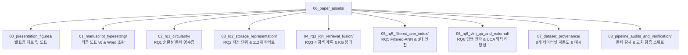

# [06] 논문 도표 에셋 및 실험 아티팩트 (`06_paper_assets/`)

본 디렉터리는 KIISE-DBR 2026 논문의 **최종 제출용 Figure 1~3 고해상도 시각 에셋, 공식 2단 Word 조판 산출물, 핵심 연구 질문(RQ1~RQ6)별 벤치마크 실험 결과 영수증(Receipts), 사전등록 검증 아티팩트 및 데이터셋 계통도**를 보관·관리합니다.

과거 마일스톤(v1~v3)의 중간/초기 도표 폴더 4곳(`20260706/`, `20260707_submission_figures/`, `20260711_v2_figures/`, `20260712_v3_figures/`)을 영구 삭제하고, 보존된 33개 아티팩트 디렉터리를 **9개의 주제별 상위 폴더(`00_` ~ `08_`)**로 범주화하여 구조화했습니다.  
*(기존 스크립트 및 문서 호환성을 위해 최상단에 상대 심볼릭 링크를 유지하여 모든 이전 경로가 100% 정상 작동합니다.)*

---

## 🧭 9대 주제별 디렉터리 구성 및 상세 매핑

---

## 📂 주제별 세부 아티팩트 카탈로그

### 1. [`00_presentation_figures/`](00_presentation_figures/) (구두 발표용 시각 자료)
| 디렉터리 | 주요 내용 |
|---|---|
| [`20260707_presentation_figures/`](00_presentation_figures/20260707_presentation_figures/) | 학술대회 구두 발표 슬라이드(`08_presentations/`)에 임베딩되는 16:9 와이드 개념도 및 결과 차트 |

### 2. [`01_manuscript_typesetting/`](01_manuscript_typesetting/) (최종 도표 및 조판 산출물)
| 디렉터리 | 주요 내용 |
|---|---|
| [`20260717_manuscript_visuals_v6/`](01_manuscript_typesetting/20260717_manuscript_visuals_v6/) | **[도표 정본]** Figure 1~3, Figure S3 등 본문 게재용 300dpi PNG 및 벡터 PDF 플롯 |
| [`20260718_editable_docx/`](01_manuscript_typesetting/20260718_editable_docx/) | 한국정보과학회 공식 2단 규격 Word(`.docx`) 문서 조판 검증 보고서 및 통합 글꼴 레이아웃 산출물 |
| [`20260718_manuscript_build_support/`](01_manuscript_typesetting/20260718_manuscript_build_support/) | 마크다운 $\rightarrow$ Word 컴파일러용 템플릿 참조 파일 및 저자/사사 메타데이터 |
| [`20260718_manuscript_content/`](01_manuscript_typesetting/20260718_manuscript_content/) | 원고 임베디드 이미지 리소스 및 참조 단락 |
| [`20260723_controlled_supplement/`](01_manuscript_typesetting/20260723_controlled_supplement/) | 심사 대응 통제 보강 실험(선택도 보존 S3 통제 등) 결과 도표 및 프로토콜 매니페스트 |

### 3. [`02_rq1_circularity/`](02_rq1_circularity/) (RQ1 순환성 통제 영수증)
| 디렉터리 | 주요 내용 |
|---|---|
| [`20260710_noncircular_collapse/`](02_rq1_circularity/20260710_noncircular_collapse/) | 정답 누수 제거(비순환 수리) 전후 성능 붕괴($1.000 \rightarrow 0.181$) 실측 CSV 및 유의성 |
| [`20260716_circularity_controlled_injection/`](02_rq1_circularity/20260716_circularity_controlled_injection/) | C1(정규 라벨) 및 C2(의사 환문) 통제 주입 실험의 쿼리별 상세 결과 및 독립 검증 JSON |

### 4. [`03_rq2_storage_representation/`](03_rq2_storage_representation/) (RQ2 저장 단위 & 112개 파레토)
| 디렉터리 | 주요 내용 |
|---|---|
| [`20260715_caption_model_ablation/`](03_rq2_storage_representation/20260715_caption_model_ablation/) | VLM 캡션 생성 모델별(LLaVA, Qwen-VL 등) 다운스트림 검색 품질 절제 결과 |
| [`20260717_joint_image_caption_pilot/`](03_rq2_storage_representation/20260717_joint_image_caption_pilot/) | Qwen-VL 멀티모달 결합 벡터(1개 벡터) 표현 파일럿 실험 데이터 |
| [`20260717_joint_image_caption_controls/`](03_rq2_storage_representation/20260717_joint_image_caption_controls/) | 동일 용량 예산(Equal-budget) 하에서 단일 프레임 대 결합 벡터 비교 통제 결과 |
| [`20260717_joint_image_caption_validation/`](03_rq2_storage_representation/20260717_joint_image_caption_validation/) | **[표 4 핵심]** 5대 저장 단위 품질-비용 요약표(`configuration_summary.csv`) 및 부트스트랩 CI |
| [`20260717_joint_optimization_validation/`](03_rq2_storage_representation/20260717_joint_optimization_validation/) | 112개 호환 설계 구성 전수 평가 및 28개 파레토 최적점(`pareto_front.csv`) |

### 5. [`04_rq3_rq4_retrieval_fusion/`](04_rq3_rq4_retrieval_fusion/) (RQ3·4 검색 계획 & KG 붕괴)
| 디렉터리 | 주요 내용 |
|---|---|
| [`20260713_kg/`](04_rq3_rq4_retrieval_fusion/20260713_kg/) | 사전등록 판정 420: 지식그래프(KG) 색인 붕괴 공식 영수증(`collapse_receipt.json`) |
| [`20260712_codex_crosscheck_fixes/`](04_rq3_rq4_retrieval_fusion/20260712_codex_crosscheck_fixes/) | 군집 추론 검정(`t3_cluster_inference.json`) 및 캡션 교차표 |

### 6. [`05_rq5_filtered_ann_index/`](05_rq5_filtered_ann_index/) (RQ5 Filtered-ANN & 3대 엔진 크로스)
| 디렉터리 | 주요 내용 |
|---|---|
| [`20260710_pillarB/`](05_rq5_filtered_ann_index/20260710_pillarB/) | **[표 7 핵심]** Filtered-ANN 역설 및 선택도 축에 따른 4대 색인 실측 데이터 |
| [`20260712_engine_replication/`](05_rq5_filtered_ann_index/20260712_engine_replication/) | **[표 9 핵심]** PostgreSQL pgvector, Milvus, Weaviate 3대 엔진 크로스 벤치마크 결과 CSV |
| [`20260713_db_design/`](05_rq5_filtered_ann_index/20260713_db_design/) | **[표 8 핵심]** pgvector 부분 색인(`WHERE`) vs 전역 색인 비교 실측 데이터 |

### 7. [`06_rq6_vlm_qa_and_external/`](06_rq6_vlm_qa_and_external/) (RQ6 답변 전파 & 외적 타당성)
| 디렉터리 | 주요 내용 |
|---|---|
| [`20260711_e1a/`](06_rq6_vlm_qa_and_external/20260711_e1a/) | 매개변수 벽(Mediator Wall) 파일럿 진단 데이터 |
| [`20260712_perception_retest/`](06_rq6_vlm_qa_and_external/20260712_perception_retest/) | 대형 VLM 투입 시 인식의 벽(Perception Wall) 재검증 결과 |
| [`20260713_index_answer/`](06_rq6_vlm_qa_and_external/20260713_index_answer/) | 색인 근사의 답변 전파 게이트 판정 JSON |
| [`20260712_uca_external/`](06_rq6_vlm_qa_and_external/20260712_uca_external/) | **[표 6 핵심]** UCA 영어권 이상행동 129개 질의 외적 타당성 3/4 재현 영수증 |

### 8. [`07_dataset_provenance/`](07_dataset_provenance/) (데이터셋 계통도 & 정성적 분석)
| 디렉터리 | 주요 내용 |
|---|---|
| [`20260715_dataset_provenance/`](07_dataset_provenance/20260715_dataset_provenance/) | 8개 데이터셋의 데이터 계통도(Lineage Overview) 다이어그램 |
| [`20260707_true_multimodal_examples/`](07_dataset_provenance/20260707_true_multimodal_examples/) | 텍스트 질의와 시각 프레임 간 검색 정합/실패 사례를 담은 정성적 분석 예시 CSV |
| [`20260707_advanced_ablation/`](07_dataset_provenance/20260707_advanced_ablation/) | 시각 인코더 및 질의 난이도별 세부 절제 결과 요약표 |

### 9. [`08_pipeline_audits_and_verification/`](08_pipeline_audits_and_verification/) (통제 감사 & 교차 검증)
| 디렉터리 | 주요 내용 |
|---|---|
| [`20260707_pipeline_audit/`](08_pipeline_audits_and_verification/20260707_pipeline_audit/) | 필수 파일 존재 여부 및 논문 메트릭 요약 감사 리포트 |
| [`20260707_control_factor_audit/`](08_pipeline_audits_and_verification/20260707_control_factor_audit/) | 하드웨어 사양, CUDA 버전, 모델 파라미터 일관성 감사 JSON |
| [`20260708_aihub71953_pipeline_audit/`](08_pipeline_audits_and_verification/20260708_aihub71953_pipeline_audit/) | AI Hub 71953 다각도 CCTV 파이프라인 무결성 리포트 |
| [`20260708_aihub71953_stratified_pipeline_audit/`](08_pipeline_audits_and_verification/20260708_aihub71953_stratified_pipeline_audit/) | 층화 무작위 샘플링 클립의 분포 일관성 감사 리포트 |
| [`20260712_ccfr/`](08_pipeline_audits_and_verification/20260712_ccfr/) | CC-FR G-kappa 오프라인 분류 일치도 게이트 판정 결과 |
| [`codex_crosscheck_20260712/`](08_pipeline_audits_and_verification/codex_crosscheck_20260712/) | 독립 에이전트 간 수치 재계산 교차 검증 로그 |
| [`20260717_ablation_agent_crosscheck/`](08_pipeline_audits_and_verification/20260717_ablation_agent_crosscheck/) | 절제 실험 처리 무결성(Treatment Integrity) 및 독립 검증 영수증 |
| [`verification_suite_20260711/`](08_pipeline_audits_and_verification/verification_suite_20260711/) | 40/40 기계 검증 스위트 실행 환경 매니페스트 및 결과 리포트 |

---

## 🔗 연관 파이프라인 및 문서

- **도표 생성 스크립트**: [`04_scripts/09_paper_assets_and_build/generate_manuscript_visuals_v6.py`](../04_scripts/09_paper_assets_and_build/generate_manuscript_visuals_v6.py)
- **Word 조판 스크립트**: [`04_scripts/09_paper_assets_and_build/make_dbr_submission_revision_v6.py`](../04_scripts/09_paper_assets_and_build/make_dbr_submission_revision_v6.py)
- **정본 원고 및 증거 패키지**: [`05_manuscript/`](../05_manuscript/) (표 1~11 및 그림 1~3 기계 검증)
- **통계 감사 및 수치 일치 검증기**: [`04_scripts/08_verification_and_audit/verify_manuscript_numbers.py`](../04_scripts/08_verification_and_audit/verify_manuscript_numbers.py)
