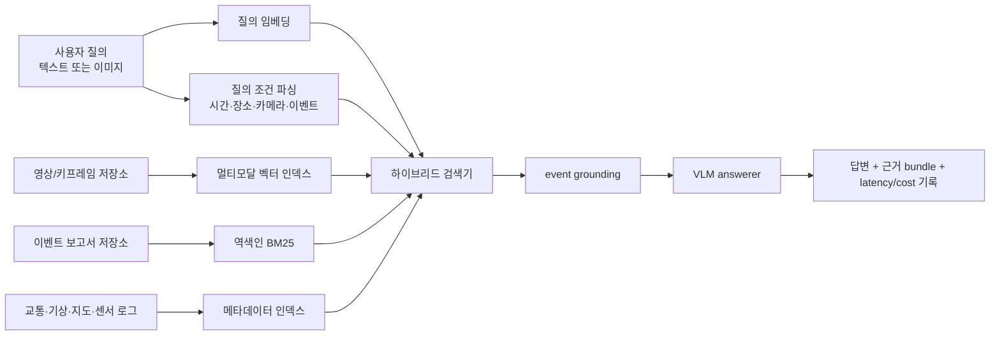
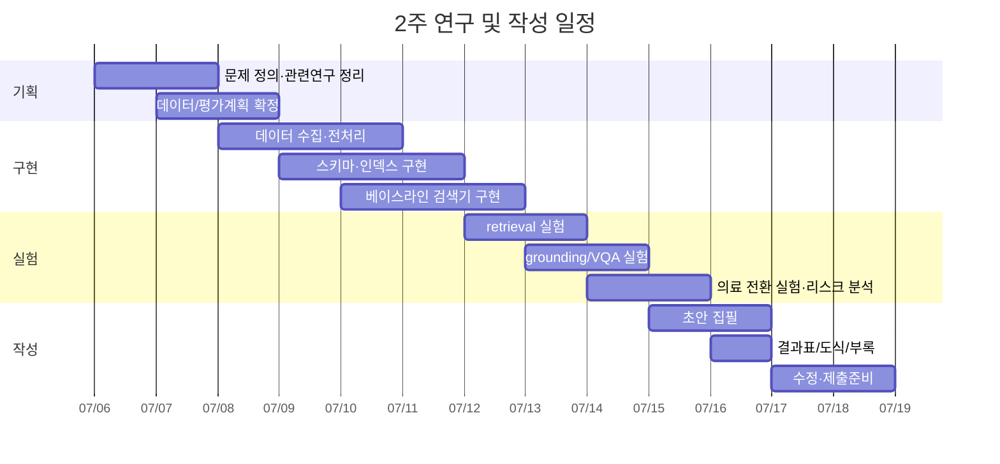

# 대한민국 데이터베이스 소사이어티와 국내 데이터베이스 연구 동향 분석 및 의료 도메인 전환 타당성 평가

## Executive Summary

대한민국 데이터베이스 소사이어티는 데이터베이스·빅데이터·데이터사이언스·데이터 마이닝 및 AI 분야 연구 성과를 공유하는 커뮤니티로 자신을 소개하고 있으며, KDBC를 대표 학술대회로 운영하고 있다. 동시에 DBR(데이타베이스연구)은 KCI 등재 학술지로 한국정보과학회가 발행하고, 연 3회 발행된다. 2025–2026년에 확인되는 게재물들을 보면, 국내 DB 연구의 관심축은 전통적 저장·질의 최적화에서 끝나지 않고 **RAG 설계/청킹**, **벡터 인덱싱과 PGvector**, **Text-to-SQL**, **VLM/멀티모달 벤치마킹**, **공공·의료 도메인 응용**으로 빠르게 확장되고 있다. 즉, 지금의 국내 DB 연구는 “DBMS 자체”보다 **DB + IR + LLM/VLM + 도메인 워크로드**를 함께 다루는 방향으로 이동 중이라고 보는 편이 더 정확하다. citeturn38search0turn38search2turn38search18turn11search1turn10view0turn8view1turn16view1turn15view0turn41search2turn42search0

사용자가 제안한 연구안인 **멀티모달 도시 감시 데이터용 VLM-DB 벤치마크**는 현재 국내 동향과 잘 맞는다. 특히 DBR 2025–2026에 실제로 등장한 주제들인 RAG 질의응답, 벡터 인덱스 최적화, Text-to-SQL, VLM 기반 추론, LLM 기반 사건 탐지와 직접적으로 연결된다. 따라서 국내 학회/학술지 투고용 프레이밍은 “새 모델 제안”보다 **멀티모달 DB/IR 통합 워크로드 정의와 벤치마크 설계**, 그리고 **저장·색인 구조 선택이 정확도·지연시간·비용에 미치는 영향 분석**으로 잡는 것이 유리하다. citeturn8view0turn8view1turn16view1turn15view0turn16view0turn41search2turn42search0

의료 도메인으로의 전환은 **원칙적으로 가능**하지만, **완전한 환자 수준 멀티모달 벤치마크를 “국내 공개 데이터만으로” 2주 안에 끝내는 것은 현실적으로 어렵다**는 결론이 더 타당하다. 이유는 한국의 공개 의료 데이터가 주로 지역·집계 통계나 제한적 메타데이터 중심이고, 실제 환자 수준의 이미지·임상 텍스트·시계열 로그를 함께 외부 반출 가능하게 제공하는 공개 자원이 매우 제한적이기 때문이다. 반면 HIRA는 환자표본자료와 의료영상자료를 보유하고 있고, 의료영상 연구용 GPU 환경까지 제공하지만, 자료 신청·심의·분석센터/원격분석 이용 절차와 비용이 있으며 데이터 반출 없이 활용하도록 설계되어 있다. 따라서 2주 내 제출을 목표로 한다면, **공개형 의료 통계/공공보건 벤치마크**와 **승인 필요형 임상 멀티모달 확장안**을 분리해서 설계하는 것이 가장 실무적이다. citeturn26view0turn21view0turn22view0turn25view0turn26view1turn26view2turn19search1

### 논문 목록 요약 표

| 저자 | 연도 | 제목 | 핵심 기여 | 데이터셋/도메인 | 코드·재현성 | 공식 페이지 |
|---|---:|---|---|---|---|---|
| 주상욱, 이상준 | 2025 | 오픈소스 RAG 아키텍처를 활용한 도메인 지식 문서 질의응답 시스템의 설계 및 구현 | 임베딩, ANN, 재순위화, 로컬 LLM, 경량 DB를 통합한 RAG QA 시스템 구현 | 도메인 문서 QA | 공개 확인 못함 | KCI citeturn8view0 |
| 파흐미 리잘디, 권준호 | 2025 | 약전 문서의 효과적인 검색을 위한 하이브리드 RAG 기반 챗봇 | dense+sparse 검색과 compound-level segmentation을 결합한 PharmacoBot 제안 | 제약/약전 문서 | 공개 확인 못함 | KCI citeturn14search2 |
| 김동후, 이수안 | 2025 | 강화학습을 활용한 소규모 언어 모델 기반 Text-to-SQL 성능 향상 | SLM에 GRPO 기반 정책학습 적용, Spider/Bird-SQL 실험 | 텍스트 질의–스키마 질의 | 공개 확인 못함 | KCI citeturn16view1 |
| 김진영, 이기용 | 2025 | METIS를 활용한 PGvector HNSW 색인의 디스크 I/O 감소 기법 | HNSW의 낮은 데이터 지역성을 METIS 그래프 파티셔닝으로 개선 | PGvector/HNSW | 공개 확인 못함 | KCI citeturn41search2 |
| 이근우, 이상준 | 2025 | 시각 언어 모델을 활용한 약지도 학습 기반 인구 밀집도 추정 | VLM을 이용한 공공 장면 해석 응용 | 도시/영상 | 공개 확인 못함 | KCI citeturn7view3 |
| 백승용, 길명선, 문양세 | 2025 | 자폐 스펙트럼 장애 분류를 위한 fMRI 기반 GNN 모델 비교 분석 | 의료 영상/그래프 분석을 DB 응용 맥락에서 비교 | fMRI/의료 | 공개 확인 못함 | KCI citeturn13search5 |
| 윤태금 외 | 2026 | 대기오염 관련 사건 탐지를 위한 LLM 기반 뉴스 기사 분류 | 6,000건 뉴스 골드셋 구축, class imbalance 하 사건 탐지 | 뉴스/이벤트 탐지 | 공개 확인 못함 | KCI citeturn16view0 |
| 박상혁, 최동희 | 2026 | 다국어 환경에서 VLM의 의료 시각 성능 및 언어 간 일관성 분석 | 의료 VQA에서 정확도 외 cross-lingual consistency 지표 제안 | 다국어 의료 VQA | 출판 결정 후 공개 예정 | KCI citeturn15view0 |
| 주상욱, 이상준 | 2026 | RAG 시스템에서의 경계 정보 손실 완화를 위한 하이브리드 의미 기반 윈도우 청킹 기법 | 청킹 전략과 경계 정보 손실 문제를 정식화 | RAG 청킹 | 공개 확인 못함 | KCI citeturn8view1 |
| 김산, 안대철, 최종현 | 2026 | Vision-Language Models 평가를 위한 멀티모달 RTS 게임 벤치마크 | 동적 환경에서 VLM 추론을 평가하는 벤치마크 제안 | 멀티모달 게임 환경 | 공개 확인 못함 | KCI citeturn7view6 |
| 이종근 외 | 2025 | 자동차 데이터 플랫폼: 자동차 산업 데이터를 활용한 RAG 시스템 구축을 위한 Retrieval 성능 개선 | 파인튜닝에 따라 검색 정확도 20%, 생성 정확도 6% 향상 보고 | 산업 문서/RAG | 공개 확인 못함 | KCI citeturn42search0 |
| 부하영, 배수빈, 이정훈 | 2026 | 구급 활동을 위한 FHIR 기반 정보 교환 메커니즘 | FHIR + 안면인식 + 언어모델 + ECG 우선순위 정보교환 프로토타입 | 응급/임상 데이터 | 공개 확인 못함 | KCI citeturn42search3 |

### 데이터셋 목록 요약 표

| 구분 | 데이터셋/소스 | 유형 | 접근성 | 연구 적합성 | 공식 근거 |
|---|---|---|---|---|---|
| 도시 감시 | AI City Challenge / CityFlow | 다중 CCTV 비디오 | 신청/공개 접근 혼합 | 멀티카메라 검색·추적·리트리벌에 적합 | citeturn36search4turn36search9turn40search21 |
| 도시 감시 | nuScenes | 카메라+LiDAR+Radar+GPS/IMU | 연구용 공개 | 센서 융합·메타데이터 필터에 적합 | citeturn34search2turn34search6turn34search10 |
| 도시 감시 | 서울 TOPIS / 서울 교통량 API | 교통 링크·속도·교통량 | 공개 API | 시계열 메타데이터 필터 | citeturn35search0turn35search7turn35search11 |
| 도시 감시 | 국토교통부 돌발상황정보 | 이벤트 리포트/상황 | 공개 API | event grounding 정답 생성에 유용 | citeturn35search3 |
| 도시 감시 | 기상청 / VWorld | 기상·지도 메타데이터 | 공개 | 외생 변수 결합 | citeturn35search8turn35search2turn35search13 |
| 의료 | HIRA 환자표본자료 | 환자 수준 진료내역 표본 | 신청·심의·유료 | 구조화 임상 DB 실험에 매우 적합 | citeturn26view0turn22view0 |
| 의료 | HIRA 의료영상데이터 | CT/MRI/X-ray 및 라벨 메타데이터 | 신청·심의·GPU 환경·반출 제한 | 의료 VLM/검색 실험에 적합 | citeturn21view0turn22view0 |
| 의료 | KDCA 국민건강영양조사 | 전국 단위 건강·검진·영양 통계/원시자료 | 공개 | 공개형 의료 통계 QA에 적합 | citeturn26view1 |
| 의료 | NMC 헬스맵 | 지역 의료수요·자원·이용·건강결과 | 무료/제한 없음 | 지역 의료 이벤트/정책 QA에 적합 | citeturn25view0 |
| 의료 | MOHW 의료인력 통계 | 시도별 의료인력 | 무료 | 자원 메타데이터 조인에 적합 | citeturn26view2 |

### 저장·색인 구조 비교 표

| 옵션 | 개념 | 장점 | 약점 | 예상 지연/비용 | 적합도 |
|---|---|---|---|---|---|
| PostgreSQL + pgvector + JSONB/GIN | 관계형 메타데이터와 벡터를 한 DB에 저장 | 구현 간단, SQL 친화적, Text-to-SQL 연계 용이 | HNSW 필터는 사후 필터링 성격이 강해 recall 손실 위험 | 지연 중간 / 비용 낮음~중간 | 2주 프로토타입 최우선 |
| Elastic 계열 하이브리드 | BM25 + dense vector + 필터 통합 | 키워드+의미 결합에 강함, 하이브리드 검색 자연스러움 | 운영 복잡도 증가 | 지연 중간 / 비용 중간 | 문서·리포트 비중 큰 경우 |
| Milvus 등 전용 벡터 DB + RDBMS | 벡터/스칼라 필터를 전용 엔진으로 처리 | 메타데이터 필터와 ANN 결합이 강함 | 따로 트랜잭션/조인 계층 필요 | 지연 낮음~중간 / 비용 중간~높음 | 벡터 중심 대규모 실험 |
| 객체저장소 + 별도 인덱스 계층 + 이벤트 테이블 | 미디어 원본, 벡터, 역색인, 이벤트 로그를 분리 | 멀티모달 확장성과 재현성이 좋음 | 초기 설계 비용 큼 | 지연 중간~높음 / 비용 높음 | 논문화용 정식 벤치마크 | 
|  |  |  |  | 추정치는 구조적 특성과 공식 문서/국내 실험을 바탕으로 한 사전 추정이다. citeturn28search0turn28search1turn28search2turn28search3turn41search2turn42search0 |  |

### 2주 일정 마일스톤 표

| 기간 | 목표 | 산출물 |
|---|---|---|
| 1–2일 | 문제 정의·관련연구 정리·데이터 소스 확정 | 연구 질문 1p, 관련연구 표, 데이터 명세 |
| 3–4일 | 도시 감시 데이터 수집·스키마 설계 | 인제스트 스크립트, 테이블/인덱스 스키마 |
| 5–6일 | 1차 베이스라인 구현 | 벡터 검색, BM25, 하이브리드 검색 |
| 7–8일 | VLM 질의응답 및 event grounding 파이프라인 | QA 파이프라인, grounding 정답 포맷 |
| 9–10일 | 도시 감시 실험 실행 | recall/latency/cost 결과표 |
| 11–12일 | 의료 전환 실험 또는 시뮬레이션 | 의료 데이터 맵핑 표, 리스크 분석, 가능성 실험 |
| 13일 | 논문 초안 작성 | 초록, 서론, 방법, 실험, 결과 |
| 14일 | 수정·도표·윤리/재현성 점검 | 제출판 PDF/부록 체크리스트 |

## 국내 데이터소사이어티와 데이터베이스 연구 동향

데이터소사이어티 공식 정보에 따르면 이 커뮤니티는 데이터베이스·빅데이터·데이터사이언스·데이터 마이닝 및 AI 분야 연구 성과를 공유하는 장을 운영하고 있으며, KDBC와 데이터지능 워크샵을 중심 행사로 둔다. 이 설명 자체가 현재 국내 DB 커뮤니티가 “DB 전통 영역”만이 아니라 “데이터 지능” 전체를 포괄하는 방향으로 외연을 확장하고 있음을 보여준다. 특히 2025년 데이터지능 워크샵과 KDBC 2025 안내는 이 확장이 일회성 구호가 아니라 실제 행사 구조에 반영되고 있음을 시사한다. citeturn38search0turn38search1turn38search2turn38search3turn38search18

DBR은 KCI 등재 학술지이며 최근 발행 정보는 2026년 4월호 42권 1호이고, 발행 간기는 연 3회다. 최신호 42권 1호 논문 목록에는 **LLM 기반 뉴스 기사 분류**, **의료 VLM의 다국어 일관성 분석**, **RAG 청킹 기법**, **교통 표지 인식**, **균열 분류 퓨샷 러닝**이 함께 포함되어 있다. 이는 국내 DB 계열 저널에서 이미 **RAG/LLM/VLM/도시 영상/의료 시각 질의응답**이 동시적으로 수용되고 있음을 뜻한다. citeturn11search1turn10view0turn13search6

2025년 게재물에서도 같은 흐름이 더 선명하다. 확인 가능한 DBR 논문들에는 **오픈소스 RAG 기반 문서 QA 시스템**, **강화학습 기반 Text-to-SQL**, **PGvector HNSW 최적화**, **약전 문서용 하이브리드 RAG**, **VLM 기반 인구 밀집도 추정**, **fMRI 기반 GNN 의료 분석**이 포함된다. 즉 2025–2026년 국내 DB 연구의 실제 중심 화두는 다음 다섯 축으로 요약된다: **지식 접근형 RAG**, **벡터 검색 인덱싱**, **자연어 질의 인터페이스**, **멀티모달/VLM**, **도메인 특화 응용**이다. citeturn8view0turn16view1turn41search2turn14search2turn7view3turn13search5

이 관찰은 사용자의 연구안과 매우 잘 맞는다. “멀티모달 도시 감시 데이터용 VLM-DB 벤치마크”는 국내 동향에서 아직 드문 조합이지만, 그 구성 요소들인 **검색 증강**, **벡터 인덱스**, **멀티모달 추론**, **이벤트 탐지**, **도메인 데이터셋 구축**은 이미 각각 독립적으로 축적되고 있다. 다시 말해, 이 연구안의 참신성은 “완전히 새로운 컴포넌트”가 아니라, **국내 DB 문맥에서 이 컴포넌트들을 하나의 재현 가능한 벤치마크로 통합한다는 점**에 있다. citeturn8view0turn8view1turn16view0turn15view0turn7view6turn42search0

## 핵심 문제 정의와 연구안의 청사진

사용자의 연구안은 본질적으로 “VLM 시대에 DB와 IR이 어떤 저장·색인 구조로 통합되어야 하는가”라는 질문이다. 기술적으로는 단순 QA가 아니라, **이미지·문서·센서 로그가 함께 들어오는 멀티모달 컬렉션**에서, **벡터 검색만으로는 부족한 조건 필터와 시간·공간 제약**을 동시에 만족해야 한다는 점이 핵심이다. 이는 최근 RAG 시스템이 청킹 전략과 검색 품질에 의해 크게 좌우된다는 국내 연구 결과와, PGvector HNSW가 메타데이터 필터와 결합될 때 구조적 trade-off를 보인다는 연구 및 공식 문서와 정확히 맞물린다. citeturn8view1turn41search2turn28search0

### 핵심 문제 정의 표

| 항목 | 내용 |
|---|---|
| 문제 | 이미지·문서·센서 로그가 결합된 도시 감시 데이터에서, VLM 질의응답을 위해 어떤 저장/색인 구조가 정확도·지연시간·비용 측면에서 가장 효율적인가 |
| 주가설 | 단일 벡터 스토어보다 **하이브리드 색인**이 더 높은 retrieval recall과 grounding 품질을 낸다 |
| 부가설 | 사전 필터가 약한 구조에서는 메타데이터 조건이 강해질수록 recall 손실이 커진다 |
| 워크로드 | DB/IR 통합, multimodal retrieval, vector+metadata filter, event grounding, retrieved-evidence VQA |
| 입력 단위 | 영상 클립/키프레임, 이벤트 보고서, 교통량·날씨·지도·위치·시간 메타데이터 |
| 출력 단위 | top-k evidence bundle, grounded time span, 답변 텍스트, 근거 링크 |
| 평가 | Recall@k, nDCG@k, grounding IoU/F1, VQA accuracy/F1, p50/p95 latency, cost/query |

이 문제를 논문 구조로 전환하면, 가장 설득력 있는 형태는 다음과 같다. 첫째, **워크로드 정의 논문**으로써 질의 유형과 데이터 스키마를 명시한다. 둘째, **시스템 논문**으로써 저장·색인 옵션을 비교한다. 셋째, **벤치마크 논문**으로써 멀티모달 retrieval, event grounding, evidence-aware VQA를 함께 평가한다. 국내 DBR 흐름상 이 세 요소를 결합했을 때 논문 메시지가 가장 선명해진다. 단순 응용 시스템 소개에 머무르면 차별성이 약해지고, 반대로 모델 제안만 하면 DB 저널과의 접점이 약해질 수 있다. citeturn8view0turn8view1turn16view1turn7view6

위 흐름의 설계 근거는 세 갈래다. 문서 시각 정보까지 직접 임베딩하는 ColPali 계열 연구는 OCR 중심 파이프라인을 우회하는 retrieval 가능성을 보여주고, RAG 원 논문은 비모수 메모리 접근의 장점을 보여준다. 또 이벤트 grounding 계열 연구인 MultiVENT-G와 OpenEvents V1은 “정답 생성”과 “이벤트 근거 찾기”를 분리 평가해야 한다는 점을 시사한다. 즉, 이 연구안에서 가장 중요한 것은 **답변 정확도만이 아니라, 어떤 근거를 어떤 순서로 찾아왔는가**까지 평가하는 것이다. citeturn32search0turn31search0turn32search1turn40search6turn40search10turn40search4

## 관련 논문과 필수 참고문헌

### 국내 관련 논문 목록과 요약

아래 표는 데이터소사이어티/DBR 및 국내 관련 학회에서 2025–2026년 확인 가능한 논문 가운데, 사용자의 연구 주제와 직접 맞닿는 것들을 추려 요약한 것이다.

| 저자 | 연도 | 제목 | 핵심 기여 | 데이터셋/도메인 | 코드/재현성 | 근거 |
|---|---:|---|---|---|---|---|
| 주상욱, 이상준 | 2025 | 오픈소스 RAG 아키텍처를 활용한 도메인 지식 문서 질의응답 시스템의 설계 및 구현 | 의미 임베딩, ANN, re-ranking, 로컬 LLM, lightweight DB 결합. 벡터 스토어 기반 문서 ingestion 설계 | 조직/도메인 문서 QA | 공개 확인 못함 | citeturn8view0 |
| 파흐미 리잘디, 권준호 | 2025 | 약전 문서의 효과적인 검색을 위한 하이브리드 RAG 기반 챗봇 | dense+sparse 검색, compound-level segmentation, 제약 문서 질의응답 | 약전/제약 문서 | 공개 확인 못함 | citeturn14search2 |
| 김동후, 이수안 | 2025 | 강화학습을 활용한 소규모 언어 모델 기반 Text-to-SQL 성능 향상 | SLM+GRPO로 자원 제약 환경에서도 Text-to-SQL 성능 향상 | Spider, Bird-SQL | 공개 확인 못함 | citeturn16view1 |
| 김진영, 이기용 | 2025 | METIS를 활용한 PGvector HNSW 색인의 디스크 I/O 감소 기법 | HNSW 데이터 지역성 향상, 디스크 I/O 최적화 | PGvector/HNSW | 공개 확인 못함 | citeturn41search2 |
| 이근우, 이상준 | 2025 | 시각 언어 모델을 활용한 약지도 학습 기반 인구 밀집도 추정 | 도시 장면 해석에 VLM 적용 | 도시 영상 | 공개 확인 못함 | citeturn7view3 |
| 백승용, 길명선, 문양세 | 2025 | 자폐 스펙트럼 장애 분류를 위한 fMRI 기반 GNN 모델 비교 분석 | 의료 영상 기반 그래프 신경망 비교 | fMRI/의료 | 공개 확인 못함 | citeturn13search5 |
| 윤태금, 양영욱, 김병욱, 장홍준 | 2026 | 대기오염 관련 사건 탐지를 위한 LLM 기반 뉴스 기사 분류 | 6,000건 골드셋, class imbalance 상황의 사건 분류 | 뉴스/환경 이벤트 | 공개 확인 못함 | citeturn16view0 |
| 박상혁, 최동희 | 2026 | 다국어 환경에서 VLM의 의료 시각 성능 및 언어 간 일관성 분석 | cross-lingual consistency 지표 제안, 5개 언어 비교 | 의료 VQA | 출판 결정 후 공개 예정 | citeturn15view0 |
| 주상욱, 이상준 | 2026 | RAG 시스템에서의 경계 정보 손실 완화를 위한 하이브리드 의미 기반 윈도우 청킹 기법 | boundary information loss 문제를 정식화하고 HSWC 제안 | RAG 청킹 | 공개 확인 못함 | citeturn8view1 |
| 김산, 안대철, 최종현 | 2026 | Vision-Language Models 평가를 위한 멀티모달 RTS 게임 벤치마크 | 정적 이미지가 아닌 동적 게임 환경의 VLM 벤치마크 | RTS 멀티모달 환경 | 공개 확인 못함 | citeturn7view6 |
| 이종근, 강병수, 임헌정, 곽수진 | 2025 | 자동차 데이터 플랫폼: 자동차 산업 데이터를 활용한 RAG 시스템 구축을 위한 Retrieval 성능 개선 | 인코더 파인튜닝이 retrieval accuracy와 generation accuracy를 함께 끌어올림 | 산업 문서/RAG | 공개 확인 못함 | citeturn42search0 |
| 부하영, 배수빈, 이정훈 | 2026 | 구급 활동을 위한 FHIR 기반 정보 교환 메커니즘 | FHIR, 안면인식, 언어모델, ECG 우선순위화 결합 | 응급/임상 | 공개 확인 못함 | citeturn42search3 |

이 표에서 특히 사용자의 연구안과 직접 이어지는 축은 네 가지다. 첫째, **RAG 설계와 청킹**은 evidence retrieval의 기반이 된다. 둘째, **PGvector/HNSW 최적화**는 벡터+메타데이터 검색 구조의 핵심이다. 셋째, **Text-to-SQL**은 질의를 DB 실행 문제로 환원하는 전략을 제공한다. 넷째, **의료 VLM과 FHIR 응용**은 도시 감시 연구안을 의료 도메인으로 옮길 때 가장 직접적인 국내 선례가 된다. citeturn8view0turn8view1turn41search2turn16view1turn15view0turn42search3

### 필수 참고문헌과 왜 중요한지

| 문헌 | 핵심 요약 | 왜 필수인가 | 재현성 근거 |
|---|---|---|---|
| Lewis et al., RAG | 파라메트릭 모델과 비모수 검색 메모리를 결합한 RAG 프레임워크 제안 | 이 연구안의 “retrieval 후 reasoning” 구조의 정전(定典) | 논문 citeturn32search1turn32search5 |
| Faysse et al., ColPali | 문서 페이지 이미지를 직접 다중 벡터 임베딩해 retrieval | OCR 의존을 줄이는 멀티모달 retrieval 핵심 참고 | 논문·코드 citeturn32search0turn31search0turn32search17 |
| Sanders et al., MultiVENT-G | partially-defined event를 멀티모달 span retrieval로 정식화 | event grounding 평가 프로토콜 설계에 직접 유용 | 논문·코드 citeturn40search6turn40search10turn40search2 |
| OpenEvents V1 | 이벤트 중심 이미지-텍스트 grounding/retrieval 벤치마크 | “사건 설명 기반 검색” 평가 설계에 유용 | 논문 citeturn40search4turn40search12 |
| HEAL-MedVQA / LoBA | localization before answering이 의료 VQA 신뢰성 향상 | 의료 전환 시 grounded medical QA 지표 설계의 핵심 | 논문·코드 citeturn33search0turn33search2turn33search12 |
| MIMIC-CXR / MIMIC-CXR-JPG | 영상과 보고서가 결합된 공개 의료 멀티모달 자원 | 의료 실험 설계의 국제 기준선 | 데이터셋 citeturn32search2turn32search6turn31search6turn32search10 |
| 국내 DBR RAG·청킹 논문 | 국내 저널 문맥에서 RAG retrieval 품질을 직접 다룸 | 국내 투고 시 related work의 핵심 앵커 | KCI citeturn8view0turn8view1 |
| 국내 DBR PGvector·의료 VLM 논문 | 벡터 인덱스/의료 VLM이 이미 국내 DB 문맥에 진입했음을 보여줌 | “왜 이 주제가 DBR 범주인가”를 정당화 | KCI citeturn41search2turn15view0 |

## 도시 감시 도메인 베이스라인과 실험 설계

도시 감시용 프로토타입은 “완전히 새로운 데이터 수집”보다 **기존 공개 비디오 + 한국 공공 메타데이터 + 사건 리포트**를 조합하는 편이 2주 내 연구 수행에 맞다. 비디오 본체는 CityFlow/AI City Challenge 같은 멀티카메라 자료를 두고, 센서성 메타데이터는 서울 TOPIS 속도/교통량 API와 국토교통부 돌발상황정보, 기상청 예보, VWorld 지도를 조합하면 된다. nuScenes는 실제 CCTV는 아니지만 센서 융합 및 시간·위치 메타데이터 설계를 시험하는 데 매우 유용한 참조 자원이다. citeturn36search4turn36search9turn40search21turn35search0turn35search7turn35search11turn35search3turn35search8turn35search2turn34search2turn34search10

### 도시 감시 데이터 구성 제안

| 계층 | 구성 요소 | 예시 소스 | 저장 형태 | 주 용도 |
|---|---|---|---|---|
| 영상 | CCTV/교통 카메라 클립, 키프레임 | CityFlow, AI City Challenge | 객체저장소 + 프레임 임베딩 | visual retrieval, VQA |
| 문서 | 사고/돌발 상황 리포트, 뉴스/운영 로그 | 국토교통부 돌발상황정보, 서울 돌발 링크 정보 | 원문 + 청크 + 역색인 | sparse retrieval, event description |
| 시계열 | 교통량, 링크 속도, 날씨 | TOPIS, 서울시 교통량, 기상청 | 시계열 테이블 | metadata filter, event context |
| 공간 | 지도 타일, 도로 링크/좌표 | VWorld, 링크 ID 메타데이터 | 공간 인덱스/metadata | geo filter |
| 라벨 | 이벤트 구간, 차량·행동 라벨 | CityFlow annotations + 리포트 정합 | 정답 테이블 | retrieval/grounding 평가 |

### 도시 감시 실험 과제

| 과제 | 입력 | 출력 | 기본 베이스라인 | 권장 고도화 |
|---|---|---|---|---|
| 멀티모달 retrieval | “비 오는 날 오전에 사고 난 교차로 영상” | 관련 영상/문서 top-k | BM25만 / CLIP만 | hybrid BM25 + vector + metadata |
| vector+metadata filter | 질의 + cam_id/time/weather 조건 | 조건 만족 후보 top-k | pgvector 후처리 필터 | prefilter 강한 하이브리드 구조 |
| event grounding | 사건 설명 텍스트 | 관련 시간 구간/span | sliding-window retrieval | retrieval→rerank→span grounding |
| evidence-aware VQA | 질의 + 검색 근거 | 답변 + 근거 묶음 | VLM 단독 | retrieved evidence + constrained prompting |

### 평가 지표 설계

| 지표 | 정의 | 사용 이유 |
|---|---|---|
| Recall@k / nDCG@k | 정답 evidence가 top-k에 얼마나 포함되는가 | 검색 품질의 1차 지표 |
| Grounding IoU / span F1 | 예측 구간이 실제 사건 시간구간과 얼마나 일치하는가 | event grounding 전용 |
| VQA accuracy / token F1 | 최종 답변 정확도 | 최종 사용자 품질 |
| Evidence precision@k | 답변에 실제 사용 가능한 근거 비율 | hallucination 억제 여부 |
| p50 / p95 latency | 검색+재순위화+생성 end-to-end 지연 | 실용성 |
| cost/query | 임베딩, 검색, 생성 비용 | 시스템 논문 관점의 핵심 |

이 설계에서 중요한 것은 **retrieval과 reasoning을 분리 측정**하는 것이다. 국내 RAG 논문들이 보여주듯 retrieval 품질은 최종 생성 품질과 밀접히 연결되며, 자동차 RAG 논문도 검색 정확도와 생성 정확도의 상관을 직접 보고했다. 따라서 사용자의 논문은 “정답률 하나”보다 **retrieval recall → grounding 품질 → VQA 정확도 → latency/cost**의 인과 사슬을 보여주는 편이 더 강하다. citeturn8view0turn8view1turn42search0

## 의료 도메인 전환 가능성 평가

도시 감시 연구안을 의료에 그대로 대응시키면 다음과 같이 맵핑된다. **CCTV/키프레임**은 X-ray/CT/MRI 대표 이미지나 슬라이스가 되고, **교통·기상·지도 메타데이터**는 환자 인구통계, 병원/진료과, 입원·외래 구분, 시간 창(window), 지역 자원 변수로 바뀐다. **센서 로그**는 활력징후, ECG, 검사값 시계열이 되며, **이벤트 보고서**는 판독문, 응급기록, 퇴원요약, 의무기록 요약이 된다. 따라서 개념적으로는 완전한 1:1 전환이 가능하다. citeturn42search3turn15view0turn20search7

그러나 “데이터 가용성”에서는 차이가 매우 크다. 공개 한국 의료 데이터 중 바로 접근 가능한 것은 KDCA 국민건강영양조사, NMC 헬스맵, MOHW 의료인력 통계처럼 주로 **통계·지역·집계 자료**다. 반면 환자 수준의 진료내역 표본(HIRA 환자표본자료)과 의료영상 데이터(HIRA 의료영상데이터)는 존재하지만, 신청과 심의가 필요하고 유료이며, 의료영상의 경우 **데이터 반출 없이 GPU 환경에서 연구하도록 제공**된다. 즉, 한국 의료 데이터는 “없다”가 아니라 **있지만 승인 중심 구조**라고 보는 편이 정확하다. citeturn26view1turn25view0turn26view2turn26view0turn21view0turn22view0

### 국내 공개 의료 데이터와 접근성·제약

| 데이터 | 내용 | 접근성 | 제약 | 연구 적합성 |
|---|---|---|---|---|
| KDCA 국민건강영양조사 | 건강설문·검진·영양조사, 약 400여 보건 지표 | 공개, 원시자료 무료 활용 가능 | 이미지/임상노트 부족 | 공개형 통계 QA에 적합 citeturn26view1 |
| NMC 헬스맵 | 의료수요·자원·이용·건강결과, 유입·유출, 취약지 | 무료/제한 없음 | 환자 수준 멀티모달 아님 | 지역 의료 event QA 적합 citeturn25view0 |
| MOHW 의료인력 통계 | 시도별 의료인 수 | 무료 | 집계 수준 | 자원 메타데이터 조합용 citeturn26view2 |
| HIRA 환자표본자료 | 전국민 의료이용 표본 진료내역 | 신청·심의·유료 | 즉시 입수 불가, 분석센터/원격 이용 | 구조화 DB 실험 핵심 citeturn26view0turn22view0 |
| HIRA 의료영상데이터 | CT/MRI/X-ray + 라벨 메타데이터 | 신청·심의·유료 | 반출 제한, GPU 인프라 기반 | 의료 VLM 핵심 데이터 citeturn21view0turn22view0 |
| NMC 공공보건의료통계 | 지역별 공공의료 통계 보고서 | 공개 | 비개인 수준 | 정책/공공의료 질의응답에 적합 citeturn19search7 |
| AI Hub 보건의료 데이터 | 의료 AI 학습 데이터 | 안심존 접근 | 다운로드·일반 공개 제한 가능 | 협업·장기 연구용 보조 자원 citeturn20search0turn20search4 |

### 전환 가능성 판정

| 시나리오 | 가능성 | 판단 |
|---|---|---|
| 공개 데이터만으로 2주 내 “의료 통계·정책 멀티모달 QA 벤치마크” 구축 | 높음 | 가능 |
| 공개 데이터만으로 2주 내 “환자 수준 이미지+노트+시계열 임상 VLM-DB 벤치마크” 구축 | 낮음 | 사실상 어려움 |
| HIRA/기관 승인 보유 상태에서 2주 내 제한적 임상 프로토타입 구현 | 중간 | 접근권한이 이미 있으면 가능 |
| 새로 신청해서 2주 안에 승인 포함 완주 | 매우 낮음 | 비현실적 |

이 차이는 윤리·법제 요구 때문이기도 하다. 개인정보보호위원회는 가명정보를 통계작성·과학적 연구·공익적 기록보존 목적에 활용할 수 있도록 하고 있으며, 서로 다른 개인정보처리자 간 결합은 전문기관이 수행하도록 한다. 동시에 생명윤리 및 안전에 관한 법률은 인간대상연구를 연구 전에 IRB 심의를 받도록 정하고, 시행규칙은 공개 정보를 이용하는 일부 연구에 대해 면제 가능성을 둔다. 따라서 공개 통계·완전 비식별 자료만 쓰는 경우에는 기관별 면제 가능성이 있지만, 환자 수준 영상·기록·연계 데이터로 가면 **IRB와 데이터 이용허가를 먼저 확인**하는 것이 안전하다. citeturn23search2turn23search1turn23search14turn24search0turn24search4

### 의료 도메인으로 옮길 때 필요한 실험 설계 변경

| 도시 감시 원안 | 의료 전환안 | 변경 이유 |
|---|---|---|
| CCTV 샘플 | X-ray/CT/MRI 대표 이미지 | 환자 단위 사건이 질병/병변으로 바뀜 |
| 교통·기상·지도 메타데이터 | 병원/진료과/입원여부/검사시점/지역/자원지표 | 조건 필터의 의미가 임상 맥락으로 이동 |
| 이벤트 보고서 | 판독문, 응급기록, 요약문, FHIR note | event grounding의 근거 텍스트가 임상 문서가 됨 |
| 센서 로그 | ECG, vital sign, lab trend | 시계열 evidence 필요 |
| event grounding | lesion/abnormality grounding + clinical timeline grounding | 의료에서는 시공간 대신 병변 위치와 시간경과가 중요 |
| VQA accuracy | 진단 답변 정확도 + 근거 위치 일치 | 의료에서는 grounded reliability가 핵심 |

가장 현실적인 의료판 벤치마크는 두 단계 구조다. **단기형**은 NMC 헬스맵, KDCA 국민건강영양조사, MOHW 통계를 이용해 “지역 의료 사건/자원 질의응답 벤치마크”를 구성하는 것이다. 여기서는 이미지 대신 지도/차트/표 이미지 또는 공개 의료시설 이미지를 넣어도 된다. **확장형**은 접근 승인이 있는 경우 HIRA 의료영상과 환자표본자료, 기관 내부 기록을 가명처리·안전영역에서 연동하여 “임상 멀티모달 evidence retrieval + grounded medical QA”로 발전시키는 것이다. 후자는 사용자의 원안과 훨씬 유사하지만, 승인과 환경이 핵심 병목이다. citeturn25view0turn26view1turn26view2turn21view0turn22view0turn33search0

의료 성능 차이는 대체로 다음처럼 예상된다. retrieval 자체는 구조화 메타데이터가 풍부한 만큼 좋아질 수 있지만, 최종 VQA와 grounding은 의료영상의 전문성 때문에 더 어렵다. HEAL-MedVQA가 보여주듯 의료 VQA에서는 localization failure와 hallucination이 큰 문제이며, 국내 DBR 의료 VLM 논문도 정확도와 언어 간 일관성이 다르게 움직일 수 있음을 보여준다. 따라서 의료판에서는 일반 accuracy보다 **evidence precision, localization 일치도, refusal rate, uncertainty handling**의 비중을 높여야 한다. citeturn33search0turn33search2turn15view0

## 저장·색인 구조, 2주 일정, 재현성·윤리 체크리스트

### 권장 저장·색인 구조 옵션 비교

아래 비교에서 핵심 쟁점은 **메타데이터 필터를 언제 적용할 수 있는가**다. pgvector 공식 문서는 근사 인덱스에서 filtering이 인덱스 스캔 후 적용되어 결과 수가 줄어들 수 있다고 설명한다. 반대로 Milvus 문서는 filtering condition으로 search scope를 제한하는 filtered search를 지원한다고 명시한다. Elastic은 BM25와 semantic vector를 한 ranked list로 합치는 hybrid search를 전면에 둔다. 따라서 사용자의 워크로드처럼 “벡터 + 필터 + 문서”가 섞이면, 구조 선택이 정확도와 지연시간을 동시에 바꾼다. citeturn28search0turn28search3turn28search2

| 옵션 | 추천 구현 | 장점 | 위험 | 예상 p50 retrieval 지연 | 예상 비용 범주 | 판단 |
|---|---|---|---|---|---|---|
| PostgreSQL + pgvector + JSONB/GIN | 영상/문서 메타데이터와 벡터를 한 스키마에 적재 | SQL 통합, 재현성 높음, DB 논문에 설명하기 쉬움 | 필터 강한 질의에서 recall 저하 가능 | 0.1–0.4초 수준 추정 | 낮음~중간 | **기본 선택** citeturn28search0turn28search1turn41search2 |
| Elastic/OpenSearch 하이브리드 | BM25 + vector + metadata | 문서 질의 품질 우수, sparse+dense 결합 자연스러움 | 운영 스택 이원화 | 0.15–0.5초 수준 추정 | 중간 | 문서 비중이 큰 경우 유력 citeturn28search2 |
| Milvus + RDBMS | vector DB와 관계형 메타데이터 분리 | 메타데이터 필터 + ANN에 강함 | 조인, 트랜잭션, 운영 복잡도 | 0.05–0.3초 수준 추정 | 중간~높음 | 벡터 중심 평가용 citeturn28search3turn28search13 |
| 객체저장소 + specialized index + event store | 미디어 원본은 분리, 벡터/역색인/이벤트 테이블은 별도 | 장기적으로 가장 확장 가능 | 2주 내 구현 부담 큼 | 0.2–1.0초 이상 추정 | 높음 | 논문화 완성판용 |
| Multimodal page/image retriever + late interaction | ColPali/ColQwen류를 페이지/프레임 단위에 적용 | 시각 정보 손실 최소화 | 인덱스 크기·late interaction 비용 증가 | 재순위화 포함 시 중간~높음 | 중간~높음 | 문서 이미지/의료 판독지에는 강점 citeturn32search0turn31search0 |

이 비교를 바탕으로 한 제 권고는 단순하다. **2주 제출형 프로토타입**은 `PostgreSQL + pgvector + JSONB/GIN + BM25 보조 인덱스`가 가장 안전하다. 같은 스택 안에서 스키마, 필터, Text-to-SQL, HNSW 파라미터를 모두 설명할 수 있기 때문이다. 다만 논문에서는 반드시 “pgvector의 post-filtering 성격이 필터 강도가 높을수록 recall을 떨어뜨릴 수 있다”는 점을 실험으로 확인해야 한다. 이 한계를 보여주는 것이 오히려 논문의 기여가 된다. citeturn28search0turn28search1turn41search2

### 2주 연구·작성 일정

실행 우선순위는 다음이 좋다. 첫째, 도시 감시 프로토타입을 먼저 완성한다. 둘째, 의료 전환은 “실제 데이터 실험”이 아니라도 **데이터 가용성·윤리·실험 변경점·리스크 분석 표**를 완성해 논문의 논의 섹션을 강화한다. 셋째, HIRA 접근권한이 이미 있다면 확장 실험을 붙이고, 없다면 공개형 의료 통계 QA 시나리오로 대체한다. 이렇게 하면 2주 내 논문형 산출물이 나온다. citeturn26view0turn21view0turn22view0turn25view0

### 재현성·윤리 체크리스트

| 항목 | 체크 포인트 | 필요 승인/조치 | 근거 |
|---|---|---|---|
| 데이터 출처 명시 | 모든 데이터의 기관, 버전, 수집일 명시 | 필수 | 재현성 기본 원칙 |
| 스키마 공개 | 엔터티, 관계, 인덱스 파라미터, 청킹 규칙 공개 | 필수 | RAG/DB 재현성 향상 citeturn8view0turn8view1 |
| 질의셋 공개 | 질의 템플릿, 정답 기준, grounding 기준 공개 | 권장 | 벤치마크 재사용성 |
| 비용 기록 | 임베딩·검색·생성 비용과 쿼리당 지연 기록 | 권장 | 시스템 논문 가치 |
| 공개 의료통계만 사용 | 비식별 공공자료인지 확인 | 기관별 IRB 면제 여부 확인 | citeturn24search4turn23search14 |
| 환자 수준 자료 사용 | 가명정보/민감정보 여부 확인 | IRB + 데이터 이용허가 + 필요 시 결합전문기관 절차 | citeturn24search0turn23search2turn23search1 |
| HIRA 환자표본자료 | 신청·심의·유료·분석센터/원격 이용 | HIRA 신청 필수 | citeturn26view0turn22view0 |
| HIRA 의료영상자료 | 반출 없는 GPU 환경, 사전협의 필요 | HIRA 신청 필수 | citeturn21view0turn22view0 |
| 익명화/가명화 | 식별자 제거, 희귀 조합 억제, 날짜·기관 처리 원칙 정의 | 기관 가이드라인 준수 | citeturn23search14turn23search5 |
| 의학적 안전성 | 임상결정 지원용으로 오해되지 않도록 고지 | 필수 | 의료 VQA 환각 위험 고려 citeturn33search0turn15view0 |

최종적으로, 사용자의 원안은 **국내 DB 학술 맥락에서 충분히 설득력 있는 주제**다. 다만 논문 메시지는 “VLM이 똑똑하다”가 아니라, **멀티모달 evidence retrieval와 벡터+메타데이터 인덱싱을 어떤 워크로드 정의로 평가할 것인가**에 두는 것이 좋다. 그리고 의료 전환은 **공개형 정책·통계 벤치마크는 즉시 가능**, **환자 수준 임상 멀티모달 벤치마크는 승인 전제하에 가능**이라는 이중 구조로 제시해야 현실성과 엄밀성이 함께 살아난다. 이 포지셔닝이 2025–2026년 국내 DB 연구 동향과 가장 잘 맞는다. citeturn38search0turn11search1turn8view1turn41search2turn15view0turn42search3turn21view0turn26view0