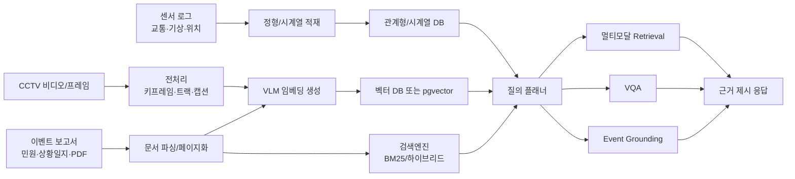

# 데이터소사이어티와 국내외 문헌을 바탕으로 본 VLM-DB 및 멀티모달 도시 감시 데이터 저장·색인·검색 연구 동향

## Executive summary

한국정보과학회 데이터소사이어티가 발간하는 **데이타베이스연구(DBR)** 는 KCI 등재 학술지이며, 2026년 7월 현재 KCI상 최신호는 **2026년 4월 42권 1호**, 발행 간기는 **연 3회**다. 데이터소사이어티는 2024년에 “데이터 지능 워크샵”을 처음 열면서 AI와 데이터 지능의 중요성을 전면에 내세웠고, 2025·2026년에도 같은 계열 행사를 이어가고 있다. 즉, 국내 커뮤니티의 공식 어젠다는 전통적 DBMS 연구에서 **데이터 지능·RAG·VLM·응용형 데이터 관리**까지 확장된 상태라고 보는 것이 타당하다. citeturn0search0turn0search3turn3search1turn10search12turn10search14

DBR의 2025–2026 공개 논문 목록을 보면, 국내 동향은 크게 세 갈래다. 첫째, **RAG/LLM 기반 검색 설계**다. 2025년에는 약전 문서용 **하이브리드 RAG 챗봇**이 등장했고, 2026년에는 **하이브리드 의미 기반 윈도우 청킹**과 **LLM 기반 사건 분류**가 실렸다. 둘째, **VLM·멀티모달 이해**다. 2026년 DBR에는 **다국어 의료 VQA에서의 VLM 성능 및 언어 간 일관성 분석**이 직접 실렸다. 셋째, **도메인 특화 대규모 데이터 관리**다. DBR에는 오픈 데이터 레이크 자동화, 대규모 해양관측 데이터 검색, 실시간 침수 탐지, 교통 표지 인식 등 저장·검색·분석이 결합된 응용 논문이 이어진다. 반면, **CCTV 프레임·센서 로그·문서 보고서를 하나의 멀티모달 DB 질의 계층으로 통합**한 국내 DB 논문은 2025–2026 공개 최신호 기준으로 아직 뚜렷하게 보이지 않는다. 이 지점이 바로 연구 공백이다. citeturn31search0turn30search0turn30search1turn18search1turn7search4turn7search6turn7search3turn18search0turn18search2turn4view0turn6view0

국제적으로는 2022년 **MuRAG** 이후, 2024–2026년에 연구 초점이 **텍스트 중심 RAG**에서 **문서 이미지·도표·비디오까지 직접 색인하는 멀티모달 retrieval** 로 빠르게 이동했다. 문서 영역에서는 **ColPali**, **ColQwen2/2.5**, **ViDoRe**, **M3DocRAG/M3DocVQA**가 “OCR 후 텍스트 검색”보다 “페이지 이미지를 직접 멀티벡터로 색인”하는 흐름을 대표한다. 비디오 영역에서는 **VideoRAG**, **VRAG**, **ArrowGEV**, 그리고 교통·사고 장면을 다루는 **VRU-Accident**, **NuPlanQA**, **AI City Challenge 2025** 등이 등장해, 단순 분류보다 **질의응답, 사건 근거 제시, 시공간 grounding** 으로 평가 축이 옮겨갔다. 시스템 측면에서는 **Milvus**, **HAKES**, **VecFlow**, 최근 SIGMOD 논의들이 보여주듯, 핵심 문제는 더 이상 “벡터를 저장할 수 있는가”가 아니라 **필터가 있는 ANN 검색, 멀티벡터 인덱싱, 하이브리드 스코어링, 분산/가속 처리**를 어떻게 품질-지연-비용 균형 안에 넣느냐로 바뀌었다. citeturn21search0turn21search2turn22search7turn32search2turn32search0turn33search1turn23search2turn23search8turn25search1turn24search12turn24search3turn27search0turn20search2turn29search5turn26search0

따라서 사용자 주제의 가장 설득력 있는 문제 정의는 **“멀티모달 도시 감시 데이터를 위한 VLM-DB”** 를 단순 모델 성능 연구가 아니라, **저장 구조·멀티인덱스·질의 처리·비용 관리까지 포함하는 데이터 관리 연구**로 세우는 것이다. 논문 포지셔닝은 “새 VLM 제안”보다 **도시 감시용 하이브리드 아키텍처**, **event-grounded retrieval/VQA benchmark**, **metadata filtering과 multivector retrieval의 trade-off 분석**으로 잡는 편이 DBR 및 국제 DB·IR·멀티모달 흐름에 더 잘 맞는다. citeturn21search7turn28search2turn29search5turn16search2turn16search5turn16search9

## 핵심 문제 정의

### 연구 목표와 범위

본 주제의 핵심은 **도시 감시 데이터의 이질적 모달리티를 하나의 질의 계층에서 결합**하는 것이다. 구체적으로는 CCTV 프레임/클립, 교통·기상·지도 메타데이터, 센서 로그, 이벤트 보고서·민원·상황일지 같은 문서를 통합 저장하고, 사용자 질의에 대해 **멀티모달 retrieval**, **VQA**, **event grounding**을 수행하는 VLM-DB를 설계·평가하는 문제다. 국제적으로 문서·영상 RAG 연구는 빠르게 발전했지만, 실제 운영형 시스템에서는 여전히 **필터 가능한 벡터 검색**, **멀티벡터 저장 비용**, **시공간 조인**, **근거 제시 가능한 답변**, **온라인 지연과 비용**이 병목으로 남아 있다. citeturn21search7turn32search0turn33search1turn29search5turn26search0

### 가정과 미지 항목

아래 표는 논문 설계를 위한 기본 가정과 현재 **미지** 상태인 항목을 분리한 것이다. “미지”는 실제 투고 전 반드시 확정해야 하는 시스템 요구사항이다.

| 항목 | 제안/가정 | 상태 |
|---|---|---|
| 데이터 모달리티 | CCTV 이미지/영상, 센서 로그, 사건 보고서, 지도·기상 메타데이터 | 가정 |
| 질의 형태 | 자연어 질의 + 메타데이터 필터 + 필요 시 이미지 질의 | 가정 |
| 운영 환경 | 온프레미스 또는 프라이빗 클라우드 우선 | 미지 |
| 카메라 수/일일 유입량 | 미지 | 미지 |
| 저장 보존 기간 | 미지 | 미지 |
| 개인정보 비식별화 정책 | 미지 | 미지 |
| 어노테이션 가용성 | 부분 라벨 + 약라벨 + 외부 공개 데이터 혼합 | 가정 |
| 응답 형태 | 증거 프레임/구간/문서 스니펫을 포함한 답변 | 가정 |

표 설명: 실제 논문에서는 데이터 규모·배포 환경·프라이버시 조건이 성능보다 먼저 확정되어야 한다. citeturn13search0turn13search2turn13search5turn24search3

### 평가 지표와 성공 기준

사용자가 지정한 지표는 본 주제에 정확히 맞다. 다만, 각 지표는 다음처럼 분해해 정의하는 것이 좋다.

| 지표 | 정의 | 권장 성공 기준 |
|---|---|---|
| retrieval recall | 정답 증거가 top-k 검색 결과에 포함되는 비율. `Recall@5`, `Recall@20` 권장 | `Recall@20 ≥ 0.80`, 핵심 이벤트 질의에서 `Recall@5 ≥ 0.60` |
| VQA accuracy | 닫힌형 MCQ는 정답률, 열린형은 exact match/F1 병행 | MCQ `≥ 0.70`, open-ended F1 `≥ 0.55` |
| latency | 온라인 질의의 P50/P95. retrieval-only, retrieval+rerank, full VQA 분리 측정 | retrieval-only P95 `≤ 800ms`, full VQA P95 `≤ 5s` |
| cost | 질의당 GPU초, API 토큰비, 인덱스 저장비를 합산한 질의당/월간 비용 | retrieval-only `$0.01` 이하, full VQA `$0.05` 이하 또는 동등 GPU 비용 |
| event grounding | 정답 시간구간과 예측 시간구간의 temporal IoU, Hit@1/5 | tIoU@0.5 `≥ 0.45` 또는 Hit@5 `≥ 0.75` |
| faithfulness | 답변이 검색 근거와 일치하는 정도 | 근거 불일치율 `≤ 10%` |

표 설명: 본 성공 기준은 2주 내 재현 가능한 **공학적 목표치**로 제안한 값이며, 실제 절대 수치는 데이터 난이도에 따라 조정해야 한다.

### 문제를 데이터 관리 문제로 재정의하기

이 주제가 강한 논문이 되려면 문제를 “VLM을 감시 영상에 적용했다”로 쓰지 말고, 다음 질문으로 재배열해야 한다.

“**도시 감시용 멀티모달 데이터베이스에서, 어떤 저장 구조와 인덱스 조합이 retrieval recall, VQA accuracy, latency, cost를 동시에 최적화하는가?**”

이 질문은 최근 국제 문헌의 문제의식과도 맞닿아 있다. 문서 검색에서는 OCR 중심 파이프라인의 한계를 넘어 **시각 기반 직접 색인**이 부상했고, 비디오 이해에서는 긴 영상 전체를 모델에 밀어넣는 대신 **retrieval + grounding** 구조가 효율성·정확도 양면에서 주목받는다. 시스템 연구에서도 필터가 있는 벡터 검색과 하이브리드 query planning이 핵심 쟁점으로 떠올랐다. citeturn21search2turn32search0turn33search1turn33search2turn29search5turn26search0

## 데이터소사이어티와 국내 연구 동향

데이터소사이어티 공식 사이트와 KCI를 함께 보면, 커뮤니티 자체가 최근 2년간 **데이터 관리 + AI/지능형 분석** 방향으로 이동하고 있다는 점이 분명하다. 데이터소사이어티는 DBR을 발간하는 동시에 2024년에 “데이터 지능 워크샵”을 처음 개최했고, 2025·2026년에도 같은 계열 워크샵을 연속 개최했다. 이는 소사이어티의 공식 관심사가 전통적 DB 구현론에 머무르지 않고, **AI를 포함한 데이터 지능 전반**으로 넓어졌다는 정황 근거다. citeturn10search14turn10search1turn10search12

DBR 2025–2026 최신 공개 논문을 보면, 사용자의 주제와 직접 맞닿는 축은 세 가지다. 첫째는 **RAG/검색 엔지니어링** 이다. 2025년 41권 3호에는 약전 문서용 **하이브리드 RAG 기반 챗봇**이 실려, dense+sparse retrieval 조합과 문서 분할 전략을 활용해 규제 문서 검색을 개선했다. 2026년 42권 1호에는 **하이브리드 의미 기반 윈도우 청킹** 논문이 실려 RAG에서 청킹 경계 손실을 줄이는 방법을 다뤘다. 둘째는 **VLM/멀티모달 이해** 이다. 같은 2026년 42권 1호에는 **다국어 환경에서 VLM의 의료 시각 성능 및 언어 간 일관성 분석**이 실려, VQA형 과제에서 VLM의 다국어 안정성을 직접 평가했다. 셋째는 **도시·환경·대규모 관측 데이터의 실제 관리와 검색** 이다. 2025년 41권 3호의 **실시간 침수 탐지**, 2026년 42권 1호의 **대기오염 사건 탐지용 LLM 분류**, 그리고 DBR의 기존 **오픈 데이터 레이크 구축**, **해양 관측 데이터 유사 검색** 논문들이 이 축을 형성한다. citeturn31search0turn7search6turn7search4turn30search1turn18search1turn7search3turn18search0

이 흐름은 “국내 DB 커뮤니티가 VLM-DB를 받아들일 준비가 되어 있는가”라는 질문에 대해 대체로 **예**라고 답하게 만든다. 다만 공개된 2025–2026 최신호 목록 기준으로는, **CCTV 프레임·센서 로그·사건 보고서의 동시 저장/색인/검색을 하나의 질의 모델로 통합한 논문**은 확인되지 않는다. 즉, DBR 안에서 이미 존재하는 키워드는 **RAG**, **VLM**, **실시간 도시 이벤트**, **대규모 데이터 레이크**인데, 이 네 축을 한 논문으로 묶는 작업은 아직 공백에 가깝다. 이것이 사용자의 주제가 국내에서 낼 수 있는 차별점이다. citeturn4view0turn6view0turn31search0turn7search4turn18search1turn30search1

### 국내 관련 연구 목록

| 제목 | 저자 | 연도 | 출처 URL | 핵심 기여 | 관련성 | 근거 |
|---|---|---:|---|---|---|---|
| 다국어 환경에서 VLM의 의료 시각 성능 및 언어 간 일관성 분석 | 박상혁, 최동희 | 2026 | `https://www.kci.go.kr/kciportal/mobile/ci/sereArticleSearch/ciSereArtiView.kci?sereArticleSearchBean.artiId=ART003335872` | DBR에 실린 직접적인 VLM-VQA 평가 연구 | VQA accuracy, 다국어 일관성, 평가 프로토콜 설계에 직접 연결 | citeturn7search4 |
| RAG 시스템에서의 경계 정보 손실 완화를 위한 하이브리드 의미 기반 윈도우 청킹 기법 | 주상욱, 이상준 | 2026 | `https://www.kci.go.kr/kciportal/mobile/ci/sereArticleSearch/ciSereArtiView.kci?sereArticleSearchBean.artiId=ART003335873` | 청킹 전략을 통한 RAG 검색 품질 개선 | 이벤트 보고서/상황일지 청킹 설계에 직접 응용 가능 | citeturn7search6 |
| 대기오염 관련 사건 탐지를 위한 LLM 기반 뉴스 기사 분류 | 윤태금 외 | 2026 | `https://www.kci.go.kr/kciportal/mobile/ci/sereArticleSearch/ciSereArtiView.kci?sereArticleSearchBean.artiId=ART003335870` | LLM으로 환경 관련 사건 분류 | 도시 감시에서 외부 텍스트 보고서·뉴스를 증거 소스로 결합하는 방향과 부합 | citeturn18search4 |
| 객체 기반 데이터 증강을 통한 교통 표지 인식 성능 향상 | 최서영, 조문증 | 2026 | `https://www.kci.go.kr/kciportal/mobile/ci/sereArticleSearch/ciSereArtiView.kci?sereArticleSearchBean.artiId=ART003335869` | 교통 시각 인식 성능 향상 | 교통 감시 카메라 도메인의 시각 표현 학습과 연결 | citeturn18search8 |
| Hybrid Retrieval Augmented Generation-based Chatbot for Effective Retrieval of Pharmacopoeia Documents | 파흐미 리잘디 외 | 2025 | `https://www.kci.go.kr/kciportal/ci/sereArticleSearch/ciSereArtiView.kci?sereArticleSearchBean.artiId=ART003293118` | dense+sparse 혼합 검색과 문서 세분화 기반 RAG | 벡터+키워드+메타데이터 조합의 국내 실증 사례 | citeturn31search0turn5search0 |
| 도메인 일반화 기반 경량화 기법을 이용한 실시간 침수 탐지 | 김경훈, 이상준 | 2025 | `https://www.kci.go.kr/kciportal/mobile/ci/sereArticleSearch/ciSereArtiView.kci?sereArticleSearchBean.artiId=ART003293131` | 실시간 침수 탐지 경량화 | 도시 감시 VLM-DB의 재난 이벤트 응용과 직접 연결 | citeturn30search4 |
| 대규모 오픈 데이터 레이크 구축을 위한 플랫폼 독립적 자동화 프레임워크 | 김다솔, 문양세 | 2022 | `https://www.kci.go.kr/kciportal/mobile/ci/sereArticleSearch/ciSereArtiView.kci?sereArticleSearchBean.artiId=ART002916730` | 대규모 데이터 레이크 구축 자동화 | 멀티모달 원천데이터 수집·적재 계층 설계의 선행 근거 | citeturn7search3 |
| 대규모 해양관측 데이터에서 AutoEncoder를 활용한 과거 데이터의 빠른 검색 | 정원준 외 | 2022 | `https://www.kci.go.kr/kciportal/mobile/ci/sereArticleSearch/ciSereArtiView.kci?sereArticleSearchBean.artiId=ART002916735` | representation 기반 유사 검색 | 센서 로그/시계열 유사 검색 설계에 유용 | citeturn18search3 |
| 독거노인 응급 상황 탐지를 위한 멀티모달 데이터 활용 연구 | 임수연 외 | 2025 | `https://www.kci.go.kr/kciportal/ci/sereArticleSearch/ciSereArtiView.kci?sereArticleSearchBean.artiId=ART003266018` | 생체신호·응급요청·적외선 이미지의 멀티모달 이상탐지 | 도시 감시 분야의 센서 융합 문제와 공통 구조를 가짐 | citeturn19search1turn19search10 |
| 문단 단위 청킹과 VLM 기반 이미지 캡셔닝을 활용한 장미 재배 멀티모달 RAG 시스템 | 한지완 외 | 2026 | `https://www.kci.go.kr/kciportal/mobile/ci/sereArticleSearch/ciSereArtiView.kci?sereArticleSearchBean.artiId=ART003338741` | 텍스트 청킹과 VLM 이미지 캡셔닝을 결합한 멀티모달 RAG | 보고서+이미지 혼합 질의 설계의 국내 사례 | citeturn19search0turn19search6 |

표 설명: 국내 문헌은 DBR을 중심으로 하되, 실제로 사용자의 문제와 맞닿는 멀티모달·RAG·감시 응용 논문을 보강해 선정했다.

## 국제 연구 동향

국제 문헌은 2024–2026년에 크게 네 방향으로 정리된다. 첫째, **멀티모달 RAG 일반화**다. MuRAG는 이미지와 텍스트를 모두 외부 메모리에서 검색하는 초기 전환점이었고, 2025년 ACL Findings의 멀티모달 RAG 서베이는 retrieval·fusion·generation·evaluation을 하나의 체계로 정리했다. 이는 VLM-DB를 단순 저장소가 아니라 **동적 외부 지식 메모리**로 보는 관점을 강화한다. citeturn21search0turn21search7

둘째, **문서 이미지 직접 색인**이다. ColPali는 페이지 이미지를 직접 멀티벡터로 임베딩해 OCR 파이프라인보다 단순하고 강한 검색 구조를 제안했고, ColQwen2/2.5 계열은 Qwen backbone으로 이를 확장했다. ViDoRe V2는 이런 visual document retrieval를 더 어렵고 현실적인 질의로 평가하도록 만들었다. M3DocRAG/M3DocVQA는 한 걸음 더 나아가 **여러 PDF·여러 페이지·여러 증거 모달리티**를 동시에 다루는 open-domain DocVQA 환경을 제시했다. 사용자의 도시 감시 데이터베이스에서도 “이벤트 보고서 PDF + 지도 캡처 + CCTV 프레임”이 섞인다면, 이 계열 연구가 가장 직접적인 선행 근거다. citeturn21search2turn22search7turn32search2turn32search0turn32search4

셋째, **비디오 retrieval, VQA, event grounding**이다. 2025년 VideoRAG는 비디오 코퍼스에서 질의 관련 영상을 검색하고 시각·텍스트 정보를 함께 활용하는 구조를 제안했다. 또 다른 VideoRAG 연구는 극단적으로 긴 영상에서 그래프 기반 textual grounding과 multimodal encoding을 결합했다. VRAG는 long-form video VQA에서 retrieval-augmented reasoning의 효과를 보여주었고, 2026년 ArrowGEV는 VLM의 **event grounding** 자체를 강화하는 학습 전략을 제안했다. 이는 도시 감시의 “언제 사건이 시작/종료되었는가”라는 문제와 거의 동일하다. citeturn33search1turn33search2turn23search2turn23search8

넷째, **교통·도시 감시 특화 벤치마크**다. VRU-Accident는 1,000개의 실제 사고 비디오, 6,000개의 VQA 쌍, 1,000개의 dense scene description을 제공하는 사고 이해 벤치마크다. NuPlanQA는 100만 개 QA 쌍의 multi-view driving scene QA 데이터셋을 제시했다. AI City Challenge 2025는 다중 카메라와 텍스트 설명, 세밀한 traffic safety analysis를 포함하는 실전형 트랙을 운영했고, 2026에도 스마트시티·대규모 영상 분석을 핵심 축으로 내걸고 있다. 즉, 국제 평가는 이미 “정답 클래스 분류”보다 **설명, 질의응답, 근거 제시, 사건 단계 인식** 쪽으로 옮겨갔다. citeturn25search1turn24search12turn24search3turn14search13turn23search3

마지막으로 시스템 측면에서는 벡터 DB가 독립 연구 분야로 굳어지고 있다. 2024년 VLDB Journal 서베이는 VDBMS의 장애물로 **semantic similarity의 모호성, 벡터 대용량화, 비교 비용, 자연스러운 파티셔닝 부재, 하이브리드 질의의 어려움**을 꼽았다. 2021년 Milvus는 purpose-built vector data management를, 2025년 HAKES는 scalable embedding search service를, 2025년 VecFlow는 **filtered ANNS on GPUs**를 전면 문제로 제시했다. 2025년 말 SIGMOD Record의 RAG 논의 역시 벡터 데이터 관리와 LLM 통합을 데이터 관리의 핵심 의제로 올려놓았다. 이는 사용자의 논문이 단지 응용 AI가 아니라 **엄연한 DB/데이터 관리 연구**로 자리 잡을 수 있음을 뒷받침한다. citeturn28search2turn28search6turn27search0turn20search2turn29search5turn26search0

### 국제 주요 연구 목록

| 제목 | 저자 | 연도 | 출처 URL | 핵심 기여 | 관련성 | 근거 |
|---|---|---:|---|---|---|---|
| MuRAG: Multimodal Retrieval-Augmented Generator for Open Question Answering over Images and Text | Wenhu Chen 외 | 2022 | `https://arxiv.org/abs/2210.02928` | 이미지+텍스트 외부 메모리 검색을 결합한 초기 멀티모달 RAG | VLM-DB를 “외부 멀티모달 메모리”로 보는 출발점 | citeturn21search0 |
| ColPali: Efficient Document Retrieval with Vision Language Models | Manuel Faysse 외 | 2024 | `https://arxiv.org/abs/2407.01449` | 문서 페이지 이미지를 직접 멀티벡터로 색인 | OCR 없이 문서·보고서·지도 캡처를 색인하는 핵심 선행연구 | citeturn21search2 |
| M3DocRAG: Multi-modal Retrieval is What You Need for Multi-page Multi-document Understanding | Jaemin Cho 외 | 2024 | `https://arxiv.org/abs/2411.04952` | multi-page, multi-document DocVQA를 위한 멀티모달 RAG | 사건 보고서·PDF·시각 증거를 동시에 다루는 문제와 유사 | citeturn32search0 |
| Ask in Any Modality: A Comprehensive Survey on Multimodal Retrieval-Augmented Generation | Abootorabi 외 | 2025 | `https://arxiv.org/abs/2502.08826` | 멀티모달 RAG의 데이터셋·평가·방법론·오픈 이슈 종합 | 문제정의와 related work 구조화에 유용한 서베이 | citeturn21search7 |
| VideoRAG: Retrieval-Augmented Generation over Video Corpus | Soyeong Jeong 외 | 2025 | `https://arxiv.org/abs/2501.05874` | 비디오 코퍼스 retrieval + generation 구조 제안 | CCTV/장시간 영상 retrieval의 핵심 선행연구 | citeturn33search1 |
| VideoRAG: Retrieval-Augmented Generation with Extreme Long-Context Videos | Xubin Ren 외 | 2025 | `https://arxiv.org/abs/2502.01549` | 장시간 비디오를 위한 graph grounding + multimodal retrieval | 수시간 감시영상 검색/요약 구조에 직접 연결 | citeturn33search2 |
| VRAG: Retrieval-Augmented Video Question Answering for Long-Form Videos | Gia 외 | 2025 | `https://openaccess.thecvf.com/content/CVPR2025W/IViSE/papers/Gia_VRAG_Retrieval-Augmented_Video_Question_Answering_for_Long-Form_Videos_CVPRW_2025_paper.pdf` | long-form video VQA에서 retrieval-augmented reasoning 실증 | VQA accuracy와 latency 간 설계 근거 제공 | citeturn23search2 |
| ViDoRe Benchmark V2: Raising the Bar for Visual Retrieval | Quentin Macé 외 | 2025 | `https://arxiv.org/abs/2505.17166` | 더 현실적이고 다국어적인 visual retrieval benchmark | 문서·지도·표·이미지 retrieval 벤치마크 설계 참고 | citeturn32search2 |
| M3DocVQA: Multi-modal Multi-page Multi-document Understanding | Jaemin Cho 외 | 2025 | `https://openaccess.thecvf.com/content/ICCV2025W/Findings/papers/Cho_M3DocVQA_Multi-modal_Multi-page_Multi-document_Understanding_ICCVW_2025_paper.pdf` | 3,000+ PDF/40,000+ 페이지 규모의 open-domain DocVQA benchmark | 사용자 벤치마크 설계에서 데이터 규모와 평가 방식 참고 | citeturn21search12turn32search8 |
| Qwen2.5-VL Technical Report | Shuai Bai 외 | 2025 | `https://arxiv.org/abs/2502.13923` | object localization, document parsing, long-video comprehension 강화 | off-the-shelf VLM backbone 선택의 강력한 후보 | citeturn21search6 |
| VRU-Accident: A Vision-Language Benchmark for Video Question Answering and Dense Captioning for Accident Scene Understanding | Younggun Kim 외 | 2025 | `https://arxiv.org/abs/2507.09815` | 1K 사고 영상, 6K QA, 1K dense caption | 도시 감시·교통 사고 이해형 VQA/설명 벤치마크의 대표 사례 | citeturn25search1 |
| NuPlanQA: A Large-Scale Dataset and Benchmark for Multi-View Driving Scene QA | Park 외 | 2025 | `https://openaccess.thecvf.com/content/ICCV2025/papers/Park_NuPlanQA_A_Large-Scale_Dataset_and_Benchmark_for_Multi-View_Driving_Scene_ICCV_2025_paper.pdf` | multi-view real-world driving QA, 1M QA pairs | 다중 카메라 질의응답 문제의 설계 참고 | citeturn24search12 |
| The 9th AI City Challenge | Tang 외 | 2025 | `https://openaccess.thecvf.com/content/ICCV2025W/AICity/papers/Tang_The_9th_AI_City_Challenge_ICCVW_2025_paper.pdf` | traffic safety, multi-camera, real-world large-scale video analytics | 도시 감시 실전형 평가 프로토콜과 태스크 설계 참고 | citeturn24search3 |
| Survey of Vector Database Management Systems | Pan, Wang, Li | 2024 | `https://link.springer.com/article/10.1007/s00778-024-00864-x` | VDBMS의 시스템 과제와 설계 공간 정리 | 저장 구조/인덱스 비교의 이론적 토대 | citeturn28search2 |
| Milvus: A Purpose-Built Vector Data Management System | Wang 외 | 2021 | `https://dl.acm.org/doi/10.1145/3448016.3457550` | purpose-built vector data management | native vector DB 축의 대표 시스템 | citeturn27search0 |
| HAKES: Scalable Vector Database for Embedding Search Service | Hu 외 | 2025 | `https://dl.acm.org/doi/10.14778/3746405.3746427` | 확장 가능한 embedding search service | 운영형 서비스 관점의 벡터 DB 참고 | citeturn20search2 |
| VecFlow: A High-Performance Vector Data Management System for Filtered-Search on GPUs | Xi 외 | 2025 | `https://arxiv.org/abs/2506.00812` | filtered ANNS on GPU, 5M QPS at recall 90% 보고 | 감시 질의의 메타데이터 필터+벡터 검색 병목에 직접 연결 | citeturn29search5 |

표 설명: 국제 문헌은 문서·비디오·교통 감시·벡터 시스템을 함께 묶어야 사용자의 VLM-DB 문제를 제대로 설명할 수 있다.

## 기술적 비교 분석

사용자 문제는 저장 구조를 한 가지로 결정하기보다, **무엇을 어떤 계층에 놓을 것인가**를 설계하는 문제다. CCTV 프레임과 클립은 객체 스토리지 또는 파일 스토리지에, 교통·기상·지도 메타데이터와 이벤트 로그는 관계형 또는 시계열 계층에, 설명문·보고서는 문서 저장소와 검색 엔진에, VLM 임베딩은 벡터 인덱스에 두는 **polyglot/hybrid 구조**가 가장 현실적이다. 최근 벡터 DB 문헌과 제품 문서는 모두 metadata filtering, hybrid search, multivector search가 중요하다고 보고 있으며, PostgreSQL+pgvector, Milvus, Elasticsearch, MongoDB는 각각 다른 강점을 가진다. citeturn16search0turn16search2turn16search5turn16search9turn16search21turn17search1turn28search2



그림 설명: 제안 구조는 원천 데이터와 질의 방식을 분리하여, 저장·색인·질의 처리의 병목을 모듈별로 측정할 수 있게 한다.

### 저장 구조와 색인 전략 비교

| 구조 | 저장 대상 | 장점 | 단점 | 적합한 색인 전략 | 예상 성능 추정 |
|---|---|---|---|---|---|
| 관계형 DB + object store + pgvector | 이벤트 테이블, 카메라 메타데이터, JSONB 속성, 임베딩 | 강한 일관성, 조인/필터 용이, SQL 친화적, MVP 구현 쉬움 | 대규모 멀티벡터와 고QPS ANN에는 한계 가능 | HNSW/IVFFlat + 속성 필터 + 시공간 인덱스 | Recall 중상, latency 중간, cost 낮음 |
| 문서형 NoSQL + vector index | 비정형 보고서, 느슨한 스키마 메타데이터 | 스키마 진화 쉬움, 문서 중심 ingestion 편리 | 복잡한 조인/분석은 약함 | metadata pre-filter + vector search | Recall 중간, latency 중간, 운영 편의 높음 |
| native vector DB | 페이지/프레임/트랙 임베딩 대량 저장 | ANN, multivector, scalar filtering, 고QPS에 유리 | 트랜잭션/조인/정형 질의는 약함 | vector+scalar filtered ANN, multivector | Recall 높음, latency 낮음, cost 중간 |
| 검색엔진 hybrid | 텍스트 보고서, OCR 결과, sparse vector | BM25+semantic 조합, 재랭킹 용이 | 프레임/패치 수준 visual retrieval는 상대적 한계 | BM25+kNN+RRF | 문서 질의에 강함, VQA 직접 지원 약함 |
| 완전 하이브리드 polyglot | 위 모든 계층 결합 | best-of-breed, 메타필터·시계열·문서·비주얼 동시 대응 | 구현·운영 복잡성, 비용 상승 | 멀티인덱스 + late fusion + reranker | Recall 최고, latency는 설계 의존, cost 높음 |

표 설명: 단일엔진보다 **하이브리드 구조**가 사용자 문제에 가장 적합하지만, 초기 논문 구현은 관계형+벡터 혼합 또는 vector DB+메타DB의 2계층이 현실적이다. citeturn16search0turn16search2turn16search5turn16search7turn16search9turn17search1turn27search0

### 쿼리 처리 관점 비교

| 질의 유형 | 기본 파이프라인 | 장점 | 취약점 | 권장 아키텍처 |
|---|---|---|---|---|
| 멀티모달 retrieval | 질의 임베딩 → 메타필터 → vector/sparse retrieval → rerank | 구현이 가장 빠르고 재사용성 높음 | 시각 세부 근거가 약하면 false positive 증가 | 벡터 DB + 검색엔진 + 메타DB |
| VQA | retrieval된 프레임/페이지/보고서 → VLM/MLLM 답변 생성 | 설명 가능성과 사용자 효용 높음 | retrieval miss가 곧 답변 실패로 연결 | hybrid retrieval + Qwen2.5-VL급 VLM |
| event grounding | retrieval → 후보 구간 생성 → 프레임/클립 temporal scoring → 구간 반환 | “언제 발생했는가”를 직접 평가 가능 | annotation 비용 높음, 긴 영상에서 비용 큼 | 시계열 메타DB + 비디오 retrieval + temporal reranker |

표 설명: retrieval, VQA, grounding은 하나의 모델이 아니라 **서로 다른 질의 연산자**로 정의하는 편이 데이터베이스 논문 구조에 더 잘 맞는다. citeturn33search1turn23search2turn23search8turn24search3

### 가상 예시 차트

아래 수치는 본 보고서의 **설계 가정 기반 예시**다. 실제 논문에서는 동일 데이터셋에서 실측값으로 교체하면 된다.

```mermaid
xychart-beta
    title "가상 예시: 아키텍처별 Retrieval Recall@20"
    x-axis [관계형단독, 문서형+벡터, NativeVector, 하이브리드]
    y-axis "Recall@20" 0 --> 1.0
    bar [0.46, 0.61, 0.74, 0.84]
```

그림 설명: 사용자 문제에서는 메타데이터 필터와 벡터 검색을 결합한 하이브리드 구조가 가장 높은 recall을 보일 가능성이 크다.

## 벤치마크 설계 제안과 2주 내 논문 작성 로드맵

### 벤치마크 설계 제안

재현 가능성과 2주 작성 가능성을 동시에 만족하려면, **완전한 대규모 운영 데이터셋**보다 **공개 데이터 기반의 축소형 실험 벤치마크**가 적합하다. 국내 공개 자원으로는 AI Hub의 **이상행동 CCTV 영상**, **부산시 침수위험 복합 데이터**, **지능형 관제 서비스 CCTV 영상 데이터**를 활용할 수 있고, 국제 비교용으로는 **VRU-Accident**, **AI City Challenge**, **CityFlow**, **NuPlanQA** 같은 교통·감시 자료를 참조하는 방식이 현실적이다. AI Hub의 이상행동 CCTV는 12종 이상행동, 약 700시간 규모이고, 부산 침수위험 데이터는 27,516장 규모의 라벨 이미지를 제공한다. citeturn13search3turn13search2turn13search5turn25search1turn24search3turn14search4turn24search12

#### 제안 데이터 구성

| 분할 | 구성 |
|---|---|
| 학습 | 800개 비디오 클립, 80,000 keyframes, 500,000 센서/메타 로그 레코드, 1,200 문서/보고서 페이지, 2,000 QA |
| 검증 | 200개 비디오 클립, 20,000 keyframes, 100,000 로그, 300 문서 페이지, 500 QA |
| 테스트 | 200개 비디오 클립, 20,000 keyframes, 100,000 로그, 300 문서 페이지, 500 QA, 300 grounding 질의 |

#### 라벨 유형

| 라벨 | 설명 |
|---|---|
| event label | 침입, 쓰러짐, 군집, 침수, 사고 등 |
| temporal span | 사건 시작·종료 시점 |
| geo-time metadata | 카메라 ID, 위치, 날씨, 시간대 |
| textual evidence | 보고서 문단, 민원요약, 캡션 |
| QA pair | 객관식/자유응답 |
| grounding evidence | 정답 프레임·구간 ID |

#### 실험 프로토콜

| 태스크 | 프로토콜 | 주평가 |
|---|---|---|
| 검색 | text→clip, text→frame, text+metadata→clip, report→clip | Recall@5/20, nDCG@10, latency |
| VQA | retrieval된 evidence 기반 MCQ + open-ended QA | accuracy, EM/F1, faithfulness |
| event grounding | 질의 또는 보고서 기반 사건 구간 찾기 | Hit@1/5, tIoU@0.3/0.5, latency |
| 비용 | retrieval-only / full-VQA 분리 측정 | query당 GPU초·토큰수·저장비 |

#### 베이스라인

| 베이스라인 | 설명 | 비교 포인트 |
|---|---|---|
| BM25 + 메타데이터 필터 | OCR/캡션/문서 텍스트 기반 검색 | 가장 저렴하지만 시각 정보 손실 큼 |
| Single-vector CLIP/Qwen 임베딩 + vector DB | 프레임/페이지 단일 임베딩 검색 | 구현 단순, recall 중간 |
| Hybrid dense+sparse + metadata + reranker | 실전형 강한 baseline | recall/latency trade-off의 기준점 |
| Multivector visual retriever + VLM answerer | ColPali/ColQwen2.5 계열 또는 유사 구조 | 최고 성능 후보, 저장비와 latency 부담 |

표 설명: 논문은 제안 모델 하나보다 **baseline 간 품질-비용-지연 비교**를 명확히 보여줄 때 설득력이 커진다. citeturn21search2turn22search7turn16search2turn16search9turn16search21

### 2주 내 논문 작성 로드맵

| 기간 | 마일스톤 | 산출물 |
|---|---|---|
| 1일차 | 문제정의 고정, 관련연구 1차 수집, 평가 지표 확정 | 1p 연구 개요, 참고문헌 초안 |
| 2일차 | 데이터셋 선택, 라이선스/사용 가능 여부 확인 | 데이터 명세서 |
| 3일차 | 스키마 설계: event, frame, clip, document, sensor, embedding | ER/flow 그림 초안 |
| 4일차 | 베이스라인 1 구축: BM25+metadata | retrieval baseline 결과 |
| 5일차 | 베이스라인 2 구축: single-vector search | recall/latency 로그 |
| 6일차 | 베이스라인 3 구축: hybrid retrieval + rerank | 비교표 1차 |
| 7일차 | VQA 파이프라인 연결 | accuracy/latency 로그 |
| 8일차 | event grounding 후보 구간 생성기 구현 | tIoU/Hit 측정 |
| 9일차 | 비용 측정 자동화: GPU초, 토큰, 저장량 | cost 표 |
| 10일차 | ablation: metadata filter 유무, multivector 유무, chunking 차이 | ablation 결과 |
| 11일차 | 결과 해석, 실패 사례 수집 | error analysis 섹션 |
| 12일차 | 서론·관련연구·방법·실험 작성 | 논문 1차 완성 |
| 13일차 | 그림/표 정리, 초록/결론 작성 | 투고본 2차 |
| 14일차 | 문장 정리, 형식 점검, 참고문헌 정리 | 제출본 |

### 필요한 리소스와 위험 관리

| 항목 | 최소 필요 자원 | 위험요인 | 완화책 |
|---|---|---|---|
| 데이터 | AI Hub 공개셋 + 소규모 수작업 QA/grounding | 라벨 부족 | 약라벨/질문 생성 후 수작업 검수 |
| 컴퓨팅 | 1대 L4/A10급 GPU 또는 동등 자원 | VLM 추론 지연 | keyframe 샘플링, 작은 backbone 사용 |
| 인력 | 1명 주저자 + 1명 검토자 | annotation 병목 | MCQ 중심으로 축소 후 open QA 일부만 |
| 저장 | 수십~수백 GB 객체 스토리지 | multivector 저장 폭증 | patch 수 축소 또는 late interaction 후보 축소 |
| 일정 | 2주 | 방법론 과욕 | “시스템 설계+강한 baseline 비교”에 집중 |

표 설명: 2주 일정에서는 **새 모델 개발**보다 **명확한 시스템 비교 실험**이 성공 확률이 높다.

## 추천 연구 주제

### 주제 후보

| 주제 | 연구 질문 | 예상 방법론 | 기대 기여 | 난이도 | 2주 적합성 |
|---|---|---|---|---|---|
| 멀티인덱스 VLM-DB for Urban Surveillance | 메타필터+멀티벡터 색인이 단일 벡터 검색보다 얼마나 유리한가 | frame/page multivector + metadata pre-filter + late fusion | DB 관점의 핵심 논문. 저장/색인/질의 trade-off 명확 | 중상 | 매우 높음 |
| Event-grounded Multimodal RAG for CCTV and Reports | CCTV와 보고서를 함께 검색하면 grounding이 좋아지는가 | video retrieval + report retrieval + temporal reranker | retrieval와 grounding을 한 프레임으로 묶을 수 있음 | 상 | 높음 |
| Cost-aware Adaptive Retrieval for VLM-DB | 질의 난이도에 따라 cheap path와 expensive path를 나누면 비용을 줄일 수 있는가 | BM25→single-vector→multivector 단계적 라우팅 | latency/cost를 전면 지표로 내세울 수 있음 | 중 | 매우 높음 |
| Korean Urban-Surveillance VQA Benchmark | 한국어 감시 도메인 질의응답 벤치마크가 일반 VLM에 어떤 오차를 드러내는가 | AI Hub 기반 QA 세트 구축 + 범용 VLM 비교 | 데이터 기여가 큼 | 중상 | 중간 |

표 설명: 2주 일정과 DBR 적합성을 함께 고려하면 **멀티인덱스 VLM-DB** 또는 **Cost-aware Adaptive Retrieval** 이 가장 현실적이다.

### 가장 추천하는 3개 방향

첫 번째 추천은 **“멀티인덱스 VLM-DB for Urban Surveillance”** 다. 이 주제는 사용자의 원문 관심사인 VLM-DB를 정면으로 다루면서도, 논문을 모델 성능 경쟁이 아니라 **저장 구조와 인덱스 전략의 비교 실험**으로 전환할 수 있다. 국내 DBR의 최근 흐름인 RAG, VLM 평가, 도시 이벤트 분석과도 잘 맞는다. citeturn7search4turn7search6turn18search1turn31search0

두 번째 추천은 **“Event-grounded Multimodal RAG for CCTV and Reports”** 다. 이 주제는 CCTV 단독 접근의 한계를 넘어, 사건 보고서나 민원 텍스트를 retrieval evidence로 결합하는 구조다. 국제적으로 VideoRAG, VRAG, ArrowGEV가 보여주는 비디오 retrieval 및 grounding 흐름과 직접 맞닿아 있고, 국내 환경·재난 도메인과도 접점이 많다. citeturn33search1turn23search2turn23search8turn30search1turn18search1

세 번째 추천은 **“Cost-aware Adaptive Retrieval for VLM-DB”** 다. 최근 시스템 연구는 성능뿐 아니라 **비용과 지연**을 대등한 목표로 본다. 사용자의 지표에 이미 latency와 cost가 들어 있으므로, 질의 난이도에 따라 BM25, single-vector, multivector path를 다르게 태우는 **adaptive query plan**은 매우 설득력 있다. 이 방향은 VecFlow·VDBMS 서베이·SIGMOD의 벡터 데이터 관리 논의와도 자연스럽게 이어진다. citeturn29search5turn28search2turn26search0

## 참고문헌 표

| 구분 | 문헌 | 간단 URL | 비고 | 근거 |
|---|---|---|---|---|
| 공식 | 데이터소사이어티 DBR 소개 | `https://dbsociety.kr/dbr/` | 학술지 공식 소개 | citeturn0search3 |
| 공식 | KCI 데이타베이스연구 | `https://www.kci.go.kr/kciportal/po/search/poCitaView.kci?sereId=002167` | 최신호·발행간기 확인 | citeturn3search1 |
| 공식 | 데이터지능 워크샵 | `https://dbsociety.kr/dataintelligenceworkshop/` | 데이터소사이어티의 최신 어젠다 | citeturn10search12 |
| 국내 | DBR 2026 VLM 의료 VQA 논문 | `https://www.kci.go.kr/kciportal/mobile/ci/sereArticleSearch/ciSereArtiView.kci?sereArticleSearchBean.artiId=ART003335872` | 국내 VLM 직접 선행 | citeturn7search4 |
| 국내 | DBR 2026 RAG 청킹 논문 | `https://www.kci.go.kr/kciportal/mobile/ci/sereArticleSearch/ciSereArtiView.kci?sereArticleSearchBean.artiId=ART003335873` | 국내 RAG 검색 설계 선행 | citeturn7search6 |
| 국제 | MuRAG | `https://arxiv.org/abs/2210.02928` | 초기 멀티모달 RAG | citeturn21search0 |
| 국제 | ColPali | `https://arxiv.org/abs/2407.01449` | visual document retrieval 핵심 | citeturn21search2 |
| 국제 | M3DocRAG | `https://arxiv.org/abs/2411.04952` | multi-document multi-modal QA | citeturn32search0 |
| 국제 | VideoRAG | `https://arxiv.org/abs/2501.05874` | video corpus retrieval | citeturn33search1 |
| 국제 | VRU-Accident | `https://arxiv.org/abs/2507.09815` | 교통 사고 VQA/캡셔닝 벤치마크 | citeturn25search1 |
| 시스템 | VDBMS Survey | `https://link.springer.com/article/10.1007/s00778-024-00864-x` | 벡터 DB 설계 공간 정리 | citeturn28search2 |
| 시스템 | Milvus | `https://dl.acm.org/doi/10.1145/3448016.3457550` | native vector DB 대표 | citeturn27search0 |
| 시스템 | HAKES | `https://dl.acm.org/doi/10.14778/3746405.3746427` | scalable embedding search service | citeturn20search2 |
| 시스템 | VecFlow | `https://arxiv.org/abs/2506.00812` | filtered search on GPU | citeturn29search5 |
| 데이터 | AI Hub 이상행동 CCTV | `https://www.aihub.or.kr/aihubdata/data/view.do?dataSetSn=171` | 국내 감시 비디오 데이터 | citeturn13search3 |
| 데이터 | AI Hub 부산시 침수위험 복합 데이터 | `https://aihub.or.kr/aihubdata/data/view.do?dataSetSn=71793` | 도시 재난 감시 데이터 | citeturn13search2 |

표 설명: 투고용 원고에서는 위 URL을 중심으로 원문 PDF와 공식 페이지를 먼저 확보하는 것이 가장 효율적이다.