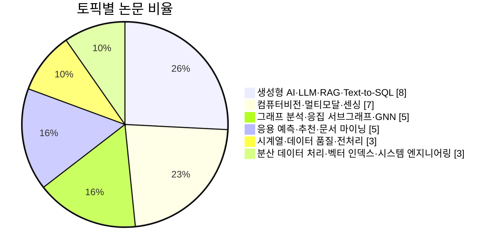

# 데이터소사이어티 공식 논문에 나타난 데이터베이스 연구 주제 동향

## Executive Summary

본 조사에서 공개 웹상으로 **공식적으로 확인된 데이터소사이어티의 학술지는 `데이타베이스연구(DBR)` 1종**이었다. 데이터소사이어티 공식 소개 페이지는 DBR을 소사이어티가 발간하는 논문지로 소개하고 있으며, 공식 투고 규정은 **연 3회 발행**과 **발행일 4월 30일·8월 31일·12월 31일**을 명시한다. KCI도 DBR을 KCI 등재 학술지로 등록하고 있으며, 기준일 현재 최근 발행 정보는 **2026년 4월, 42권 1호**다. 따라서 사용자 요청 범위인 2025-01-01부터 2026-12-31 전체 중, **실증적으로 확인 가능한 게재 논문은 2025년 41권 1·2·3호와 2026년 42권 1호까지**이며, **2026년 8월호·12월호는 아직 공개 게재가 확인되지 않았다**. citeturn0search0turn0search2turn29search0turn0search5turn0search3

확인된 논문은 **총 31편**이었다. 연도별로는 **2025년 26편**, **2026년 5편**이다. 2025년에는 생성형 AI/LLM/RAG, 그래프 분석, 데이터 전처리, 비전/센싱, 응용 예측, 시스템 엔지니어링이 비교적 분산되어 있었지만, 2026년 4월호까지 확인된 논문은 **생성형 AI·RAG·LLM 계열 2편과 컴퓨터비전·멀티모달 계열 3편**으로 수렴했다. 즉, **2026년 현재 확인 가능한 최신호에서는 “전통적 DB 코어 이슈”보다 “AI-중심 데이터 활용”이 훨씬 강하게 전면화**되어 있다. citeturn30search6turn10search2turn20search6turn15search3turn16search0turn15search2turn15search4turn15search0

주제 분류 결과, 확인된 31편 중 **생성형 AI·LLM·RAG·Text-to-SQL**이 **8편(25.8%)**으로 가장 크고, **컴퓨터비전·멀티모달·센싱**이 **7편(22.6%)**으로 뒤를 이었다. 반면, **분산 데이터 처리·벡터 인덱스·시스템 엔지니어링**과 **시계열·데이터 품질·전처리**는 각각 3편(9.7%)에 머물렀다. 또한 사용자가 예시로 제시한 범주 가운데 **프라이버시/보안, 데이터 거버넌스, 질의 최적화, 트랜잭션/동시성 제어, 벤치마크 표준화**는 공개적으로 확인된 31편에서 거의 독립 토픽으로 나타나지 않았다. 이는 연구 공백으로 해석할 수 있다. citeturn30search6turn10search2turn23search0turn22search0turn25search6turn22search2turn15search3turn16search0turn15search2turn15search4turn15search0

데이터 수집 측면에서는, KCI 기사 페이지가 **권·호·면수·저자·소속·초록·키워드**를 비교적 안정적으로 제공했고, 기사 페이지마다 **ScienceON/RISS 연결**도 노출했다. 다만, 2025–2026 확인 기사들의 **KCI 서지반출(RIS/BibTeX)에서 DOI 항목은 공란인 경우가 반복적으로 확인**되었기 때문에, 본 보고서는 **DOI 대신 KCI 기사 URL을 기본 식별 링크**로 사용했다. 또한 일부 이슈 페이지는 검색엔진 인덱싱이 불안정해 기사별 페이지를 진실원으로 우선 사용했다. citeturn10search0turn23search0turn28search0turn15search3turn16search0

## 대상과 데이터 수집

이번 분석의 **모집단 정의**는 “데이터소사이어티가 공식적으로 발간하는 학술지에 2025-01-01부터 2026-12-31 사이 게재된 논문”이다. 공개 웹에서 확인한 결과, 데이터소사이어티가 직접 연결하는 공식 학술지는 DBR이며, KDBC는 학술대회 행사로 확인되어 **저널 분석 대상에서는 제외**했다. 또한 발행 일정상 2026년 8월·12월호는 미래 시점에 해당하므로, 본 보고서의 확정 분석 대상은 **2025년 41권 1호, 41권 2호, 41권 3호, 2026년 42권 1호**로 한정된다. citeturn0search0turn0search2turn5search3turn29search0turn0search5

원자료는 **데이터소사이어티 공식 사이트 → KCI 기사 페이지 → KCI 권호/인용보고서 → 보조적으로 저자 개인 페이지·기관 저장소** 순으로 우선순위를 두고 수집했다. 공식 투고 규정은 발행일과 운영 구조를 확인하는 데 사용했고, KCI 기사 페이지는 실제 메타데이터 수집의 주 원천으로 사용했다. 일부 논문은 기사 페이지에서 초록·키워드까지 즉시 확보되었고, 일부는 기사 목록과 인용보고서, 또는 기관 저장소/학술정보 서비스의 보조 노출을 교차 검증해 보완했다. citeturn29search0turn0search1turn30search6turn10search2turn27search0turn19search4turn30search1

다음 표는 본 분석에서 실제 사용한 **원자료 수집 경로**를 요약한 것이다.

| 원자료 유형 | 확인 내용 | 공식/우선 출처 |
|---|---|---|
| 데이터소사이어티 DBR 소개 | 소사이어티 발간 학술지 여부 | DBR 소개 페이지 citeturn0search0 |
| DBR 투고 규정 | 연 3회 발행, 발행일 4/30·8/31·12/31 | 투고 규정 페이지 citeturn29search0 |
| KCI 학술지 정보 | KCI 등재, 최근 발행호, 연간 발행 간기 | KCI 학술지 정보 citeturn0search1turn0search3turn0search5 |
| 2025년 41권 1호 목록 | 4편 수록 확인 | KCI 권호 목록/기사 페이지 citeturn30search6turn30search0turn17search0turn17search1turn17search2 |
| 2025년 41권 2호 목록 | 10편 수록 확인 | KCI 권호 목록/기사 페이지 citeturn10search2turn20search6turn18search0turn20search2turn18search3turn19search0turn19search1turn19search2turn20search0turn20search1 |
| 2025년 41권 3호 목록 | 12편 수록 확인 | KCI 기사 페이지·인용보고서 citeturn25search3turn23search0turn25search4turn22search0turn26search0turn25search6turn25search2turn28search0turn28search1turn25search7turn22search5turn22search2turn27search0 |
| 2026년 42권 1호 목록 | 5편 수록 확인 | KCI 기사 페이지 citeturn15search3turn16search0turn15search2turn15search4turn15search0 |

수집 한계도 분명하다. 첫째, 일부 권호 목록 페이지는 검색엔진 스니펫과 실제 본문이 다르게 보이는 경우가 있어, **기사 개별 페이지를 우선 신뢰원으로 채택**했다. 둘째, KCI 기사 페이지에서 **원문 PDF는 ScienceON/RISS 등의 중개 링크를 통해 연결**되지만, 이 응답 안에서는 직접적 PDF URL을 전부 일괄 추출하지 못했다. 셋째, 2026년 8월호와 12월호는 아직 발행 시점이 도래하지 않았으므로 대상구간 끝인 2026-12-31 전체를 완전하게 닫을 수는 없다. 따라서 본 보고서는 **“2026-07-04 현재 공개적으로 확인 가능한 전량”**을 분석한 결과로 읽어야 한다. citeturn15search3turn16search0turn29search0turn0search5

## 방법론

분석은 두 단계로 수행했다. 먼저, **권호 단위 전수 파악**으로 2025–2026 확인 논문 31편의 목록을 확정했다. 다음으로, **기사 페이지에 드러난 제목·초록·키워드**, 그리고 KCI 권호 목록에 나온 제목을 결합해 **정규화 텍스트 코퍼스**를 만들었다. 기사 페이지에서 초록·키워드가 직접 노출된 경우에는 이를 우선 사용했고, 기사별 초록이 즉시 노출되지 않은 경우에는 제목과 기사 페이지의 영문표제·권호 정보를 보조 사용했다. DOI는 반복적으로 공란이어서 식별자에는 포함하지 않았다. citeturn10search0turn23search0turn28search0turn30search0

토픽 추출은 **경량 LDA 파일럿 + 수동 통합 해석** 방식으로 진행했다. 구체적으로는 제목·키워드 중심의 정규화 코퍼스에 대해 **CountVectorizer + LDA**를 사용해 **토픽 수 5–7개**를 민감도 점검했고, 그중 **6개 토픽**이 해석 가능성과 재현성이 가장 높았다. 정규화 단계에서는 영어·한국어 혼용 표기를 통합했다. 예를 들어 **“LLM/대규모 언어 모델/언어 모델”, “RAG”, “GNN/그래프/k-core/커뮤니티”, “PGvector/HNSW/벡터 인덱스”**처럼 동일 계열 용어를 묶었다. 또한 “기반/활용/연구/방법/시스템” 같은 구조어는 불용어로 제거했다. 다만, **코퍼스가 31편으로 작고 제목 길이 편차가 큰 탓에 완전 비지도 토픽 라벨은 다소 불안정**했으므로, 최종 라벨은 기사 초록과 저자 키워드를 읽어 사람이 해석 가능한 6개 축으로 통합했다. citeturn23search0turn26search0turn28search0turn16search0

최종 분류 체계는 다음과 같다. **생성형 AI·LLM·RAG·Text-to-SQL**, **그래프 분석·응집 서브그래프·GNN**, **시계열·데이터 품질·전처리**, **분산 데이터 처리·벡터 인덱스·시스템 엔지니어링**, **컴퓨터비전·멀티모달·센싱**, **응용 예측·추천·문서 마이닝**이다. 이 분류는 사용자 예시 범주 가운데 **그래프 DB, 시계열, 데이터 품질, ML-DB 통합, 데이터 관리 자동화, 시스템 구현/엔지니어링, 벤치마크/성능**에 가장 가깝게 대응한다. 예컨대 RAG·Text-to-SQL은 **ML-DB 통합**, PGvector HNSW는 **벡터 인덱스/시스템 엔지니어링**, 라이프로그 결측 처리나 시계열 이상치 보정은 **데이터 품질·자동화**로 보았다. citeturn18search0turn18search3turn22search5turn23search0turn7view0

정량 분석 지표로는 **토픽별 논문 수와 비율**, **연도별(2025 vs 2026) 변화**, **정규화 키워드군 상위 10개 빈도**, **토픽별 대표 논문**을 사용했다. 토픽별 대표 논문은 단순 빈도순이 아니라, 각 논문이 해당 토픽을 가장 명확히 보여주는지 여부를 기준으로 선별했다. 예를 들어 생성형 AI 토픽에서는 단순 “LLM 사용” 논문보다 **RAG 시스템 설계**, **Text-to-SQL**, **청킹 최적화**, **카타스트로픽 포게팅 완화**처럼 기술적 변별력이 큰 사례를 우선 배치했다. citeturn10search0turn18search3turn25search2turn15search0

## 분석 결과

확인된 31편을 6개 토픽으로 나누면, **생성형 AI·LLM·RAG·Text-to-SQL**이 8편으로 최다였고, **컴퓨터비전·멀티모달·센싱**이 7편으로 뒤를 이었다. 두 축을 합치면 **15편, 전체의 48.4%**에 이르러, 데이터소사이어티 최신 DBR에서 “데이터베이스”가 전통적 저장·질의·트랜잭션보다 **AI 활용·검색 증강·멀티모달 데이터 처리의 응용 중심으로 재배치**되고 있음을 보여준다. 반면 **시계열·데이터 품질·전처리**, **분산 처리·벡터 인덱스·시스템 엔지니어링**은 각각 3편으로 작은 축에 머물렀다. citeturn30search6turn10search2turn23search0turn22search0turn25search6turn22search2turn15search3turn16search0turn15search2turn15search4turn15search0

연도별 변화를 보면 2025년에는 6개 토픽이 모두 나타났지만, 2026년 4월호까지 확인된 5편은 **생성형 AI·RAG 2편, 비전·멀티모달 3편**으로 집중되었다. 이는 최신호 시점에서 **그래프 분석, 시계열 전처리, 시스템 엔지니어링, 추천·예측 응용**이 일시적으로 후퇴하고, 대신 **RAG 최적화·LLM 분류·VLM·비전 인식**이 전면으로 부상했음을 뜻한다. 다만 이 변화는 2026년 8월·12월호가 아직 비어 있다는 점 때문에 **잠정적 추세**로 해석해야 한다. citeturn29search0turn15search3turn16search0turn15search2turn15search4turn15search0

```mermaid
xychart-beta
    title "연도별 토픽 분포"
    x-axis ["생성형AI", "그래프", "데이터품질", "시스템", "비전·멀티모달", "응용예측"]
    y-axis "논문 수" 0 --> 7
    bar "2025" [6, 5, 3, 3, 4, 5]
    bar "2026" [2, 0, 0, 0, 3, 0]
```

다음 표는 최종 분류의 정량 결과다.

| 토픽 | 2025 | 2026 | 합계 | 비율 |
|---|---:|---:|---:|---:|
| 생성형 AI·LLM·RAG·Text-to-SQL | 6 | 2 | 8 | 25.8% |
| 컴퓨터비전·멀티모달·센싱 | 4 | 3 | 7 | 22.6% |
| 그래프 분석·응집 서브그래프·GNN | 5 | 0 | 5 | 16.1% |
| 응용 예측·추천·문서 마이닝 | 5 | 0 | 5 | 16.1% |
| 시계열·데이터 품질·전처리 | 3 | 0 | 3 | 9.7% |
| 분산 데이터 처리·벡터 인덱스·시스템 엔지니어링 | 3 | 0 | 3 | 9.7% |

정규화 키워드군을 보면, **컴퓨터비전·멀티모달**, **LLM·언어모델**, **예측·추천**, **그래프·커뮤니티**, **분산처리·벡터인덱스**, **탐지**가 상위권을 형성했다. 이 결과는 제목 빈도만의 산물이 아니라, 기사 페이지에 노출된 저자 키워드에서도 비슷한 인상을 준다. 예를 들어 그래프 토픽에서는 **“graph mining / cohesive subgraph discovery / community detection”**, 생성형 AI 토픽에서는 **“RAG / LLM / 질의응답 시스템”**, 데이터 품질 토픽에서는 **“missing value imputation / synthetic data generation”** 같은 키워드가 직접 확인된다. citeturn26search0turn10search0turn23search0

| 정규화 키워드군 | 빈도 |
|---|---:|
| 컴퓨터비전·멀티모달 | 9 |
| LLM·언어모델 | 6 |
| 예측·추천 | 5 |
| 그래프·커뮤니티 | 5 |
| 분산처리·벡터인덱스 | 5 |
| 탐지 | 5 |
| RAG | 3 |
| 데이터 품질·전처리 | 2 |
| 시계열 | 1 |
| Text-to-SQL | 1 |

토픽별 대표 논문을 보면, 생성형 AI 영역에서는 **오픈소스 RAG QA 시스템**, **하이브리드 RAG 챗봇**, **소규모 언어모델 기반 Text-to-SQL**, **RAG 청킹 최적화**가 기술 축을 이루었다. 그래프 영역에서는 **(k,o)-core**, **트러스 기반 커뮤니티 탐지**, **결합 모듈러리티 기반 커뮤니티 탐지**, **양자 최소 k-core**가 연속적인 응집 서브그래프 계열을 구성했다. 데이터 품질 영역에서는 **제조 공정 불균형 전처리**, **시계열 이상치 보정**, **라이프로그 결측·편향 해결**이 묶인다. 시스템 영역에서는 **분산형 기계학습 프레임워크**, **Spark 기반 스팸 탐지**, **PGvector HNSW I/O 감소**가 확인되며, 비전·멀티모달 영역에서는 **교통표지 인식**, **침수 탐지**, **균열 분류**, **VLM 의료 시각 질의응답**, **Wi‑Fi CSI 운동량 추론**이 대표적이다. citeturn10search0turn22search4turn18search3turn15search0turn20search2turn22search0turn26search0turn25search6turn17search0turn7view0turn23search0turn19search1turn19search2turn22search5turn15search3turn25search4turn15search2turn15search4turn28search1

| 토픽 | 대표 논문 |
|---|---|
| 생성형 AI·LLM·RAG·Text-to-SQL | 오픈소스 RAG 아키텍처를 활용한 도메인 지식 문서 질의응답 시스템의 설계 및 구현; 약전 문서의 효과적인 검색을 위한 하이브리드 RAG 기반 챗봇; 강화학습을 활용한 소규모 언어 모델 기반 Text-to-SQL 성능 향상; RAG 시스템에서의 경계 정보 손실 완화를 위한 하이브리드 의미 기반 윈도우 청킹 기법 |
| 그래프 분석·응집 서브그래프·GNN | (k,o)-core: 멀티 오더 그래프에서 응집성을 갖는 서브그래프 식별; 트러스를 활용한 시드 기반 커뮤니티 탐지 프레임워크; 구조 및 속성 결합 모듈러리티 최대화를 통한 대규모 속성 네트워크의 커뮤니티 탐지; 양자 최소 k-core 탐색 알고리즘 |
| 시계열·데이터 품질·전처리 | 제조 공정 데이터에서 리샘플링과 특성 선택 기법의 효과적 조합; LSTM 기반 VAE-GAN과 윈도우 연관성을 이용한 시계열 데이터 이상치 보정 기법; 라이프로그 데이터 기반 정신건강 예측에서의 데이터 결측 및 편향 해결을 위한 전처리 방법 |
| 분산 데이터 처리·벡터 인덱스·시스템 엔지니어링 | 이기종 장치의 빅데이터 처리를 위한 분산형 기계 학습 프레임워크; 아파치 스파크와 앙상블을 활용한 스팸 리뷰 탐지 시스템; METIS를 활용한 PGvector HNSW 색인의 디스크 I/O 감소 기법 |
| 컴퓨터비전·멀티모달·센싱 | 객체 기반 데이터 증강을 통한 교통 표지 인식 성능 향상; 도메인 일반화 기반 경량화 기법을 이용한 실시간 침수 탐지; 노후 주택의 균열 분류를 위한 프로토타입 기반 앙상블 퓨샷 러닝 프레임워크; 다국어 환경에서 VLM의 의료 시각 성능 및 언어 간 일관성 분석 |
| 응용 예측·추천·문서 마이닝 | 딥러닝을 이용한 효과적인 액화 수소 폭발 압력 예측; 기본적 분석 및 머신러닝 앙상블 모델 기반의 주식 종목 선택; 도로교통사고 표본조사 데이터 기반 탑승자 부상 중증도 예측; 뉴스 추천 시스템을 위한 새로운 관점: 뉴스 중심 추천 태스크의 재정의 |

## 연구 갭과 전망

가장 눈에 띄는 연구 갭은 **전통적 DB 코어 토픽의 희소성**이다. 확인된 31편 가운데 저장 엔진, 질의 최적화, 트랜잭션/동시성 제어, 로그/복구, 데이터 거버넌스, 스키마 진화, 프라이버시 보장 질의 처리처럼 “정통 데이터베이스”의 중심축에 해당하는 موضوع은 거의 독립 토픽으로 나타나지 않는다. 벡터 검색·PGvector HNSW 최적화 같은 사례가 일부 보이긴 하지만, 그것도 **생성형 AI 생태계의 서브시스템**으로 다뤄질 뿐, DBMS 자체의 이론·엔진 수준 연구는 강하지 않다. 이는 공개 확인된 31편의 제목·초록·키워드 구성을 바탕으로 한 해석이다. citeturn22search5turn30search6turn10search2turn23search0turn22search2turn15search0

두 번째 갭은 **프라이버시·보안·신뢰성·평가 표준**의 부족이다. 라이프로그 정신건강 예측, 의료 VLM, 부동산 권리분석, 도로교통사고 예측처럼 민감성이 높은 응용은 이미 등장했지만, 개인정보 보호, 차등 프라이버시, 연합학습, 감사가능성, 설명가능성, 벤치마크 표준화는 독립 축으로 충분히 등장하지 않았다. 다시 말해, **응용은 빠르게 늘고 있지만 안전성·책임성 연구가 그 속도를 따라오지 못하는 모습**이다. citeturn23search0turn15search4turn28search0turn20search1

세 번째 갭은 **데이터 관리 자동화와 ML 시스템운영(MLOps/DBOps)의 연결 부족**이다. 이기종 장치 분산학습 프레임워크, Spark 기반 스팸 탐지, PGvector HNSW 최적화 같은 논문은 존재하지만, 데이터 파이프라인의 품질관리·버전관리·실험 재현성·모델/벡터 인덱스 동기화·관측성(observability)을 체계적으로 다루는 논문군은 형성되지 않았다. 이는 앞으로 **AI-네이티브 DB 운영**이 중요한 연구 전선이 될 가능성을 시사한다. citeturn19search1turn19search2turn22search5

그럼에도 전망은 분명하다. 2025–2026 DBR에서 데이터 연구는 **RAG, LLM, VLM, 그래프, 센싱, 예측 모델**을 아우르는 방향으로 급격히 이동하고 있다. 따라서 향후 데이터소사이어티 논문 동향은 **“DBMS 내부 구조”보다 “AI를 지탱하는 데이터 관리 구조”** 쪽으로 더 이동할 가능성이 높다. 특히 **벡터 인덱스 최적화**, **RAG 품질 측정**, **멀티모달/시계열 데이터 정합성 관리**, **민감 도메인용 신뢰 가능한 데이터 파이프라인**이 다음 유망 영역으로 보인다. 이는 2025년 41권 3호의 RAG·PGvector·AI 플랫폼 논문과 2026년 42권 1호의 RAG 청킹·LLM 분류·VLM/Vision 계열 논문이 연속적으로 나타난 흐름과 맞물린다. citeturn22search4turn22search5turn28search0turn15search0turn16search0turn15search4

## 신규 연구 주제 제안

아래 제안은 위 연구 갭을 바탕으로 도출했다. 구체적으로는 **프라이버시·보안의 약함**, **RAG/벡터DB의 평가 표준 부족**, **데이터 품질 자동화의 저빈도**, **도메인 특화 Text-to-SQL 및 멀티모달 DB 벤치마크 부재**를 문제로 보고 설계했다. citeturn10search0turn22search5turn23search0turn15search0turn15search4

| 제안 주제 | 핵심 연구 질문 | 예상 방법론 | 예상 기여 | 난이도 | 예상 기간 |
|---|---|---|---|---|---:|
| 한국어 도메인 문서용 RAG 품질 벤치마크 | 한국어 장문 문서에서 청킹·리랭킹·벡터 인덱스 선택이 정확도와 지연시간에 미치는 영향은? 근거 제시형 응답의 신뢰도를 어떻게 측정할 것인가? | 데이터: 법령·약전·행정문서·기술매뉴얼. 실험: chunk size, overlap, dense/sparse/hybrid 검색, reranker 비교. 지표: EM/F1, groundedness, latency, storage cost | 한국어 RAG의 재현 가능한 벤치마크와 벡터DB 선택 기준 제시 | 높음 | 8 |
| 프라이버시 보장형 라이프로그 정신건강 데이터 관리 프레임워크 | 결측·편향·민감정보가 공존하는 라이프로그를 어떻게 보정하면서도 프라이버시를 보장할 수 있는가? 연합학습/차등프라이버시가 예측 성능을 얼마나 훼손하는가? | 데이터: 웨어러블·스마트폰 라이프로그. 실험: DP-SGD, federated averaging, bias-aware imputation. 지표: AUROC/F1, privacy budget, fairness gap | 민감 시계열 데이터 품질관리와 프라이버시를 함께 다루는 국내형 프레임워크 | 높음 | 10 |
| 한국어 엔터프라이즈 스키마용 Text-to-SQL 에이전트 | 복잡한 한국어 업무 질의를 실제 기업 스키마에 대해 안전하게 SQL로 변환할 수 있는가? 스키마 링크 실패를 줄이는 가장 효과적인 prompting/retrieval 전략은 무엇인가? | 데이터: 공개 SQL benchmark + 합성 한국어 기업 스키마. 실험: schema linking, few-shot retrieval, tool use, RLHF/GRPO. 지표: execution accuracy, syntax validity, hallucination rate | 한국어 업무형 Text-to-SQL 공개 과제와 평가셋 제공 | 높음 | 7 |
| 멀티모달 도시 감시 데이터용 VLM-DB 벤치마크 | 이미지·문서·센서 로그를 함께 다루는 VLM 질의응답에서 어떤 데이터 저장/색인 구조가 가장 효율적인가? | 데이터: CCTV 샘플, 교통·기상·지도 메타데이터, 이벤트 보고서. 실험: multimodal retrieval, vector+metadata filter, event grounding. 지표: retrieval recall, VQA accuracy, latency, cost | VLM 시대의 DB/IR 통합 워크로드 정의 | 중간 | 6 |
| 스트리밍 시계열 이상치 보정의 DB-내장형 자동화 | 실시간 시계열 파이프라인에서 이상치 탐지·보정·버전관리를 DB 계층 안에서 자동화할 수 있는가? | 데이터: IoT·교통·환경 시계열. 실험: online anomaly detection, correction-at-ingest, provenance logging. 지표: RMSE/MAPE, downstream forecast lift, throughput | 데이터 품질 자동화를 “배치 후처리”가 아니라 “수집 시점”으로 이동 | 중간 | 6 |
| 그래프-RAG를 위한 응집 서브그래프 요약 및 질의응답 | 커뮤니티·k-core·속성 그래프 요약이 그래프 기반 RAG의 질의정확도와 설명가능성을 높이는가? | 데이터: attributed graph, citation/social/company graph. 실험: subgraph extraction, textual summarization, graph-aware retrieval. 지표: answer accuracy, explanation faithfulness, compression ratio | 그래프 마이닝과 생성형 AI를 실질적으로 연결하는 신주제 | 높음 | 8 |

## 메타데이터 부록

아래 표는 **분석용 축약 메타데이터 표**다. 지면 제약 때문에 초록은 한 문장으로 축약했고, 키워드는 저자 키워드와 제목 핵심술어를 정규화해 적었다. **전문 초록·전저자·원문 연결은 각 KCI 기사 페이지에서 확인할 수 있다.** 2025년 표는 41권 1호·2호 권호목록과 41권 3호 기사별 KCI 페이지를 합쳐 구성했고, 2026년 표는 42권 1호 기사별 KCI 페이지를 사용했다. citeturn30search6turn10search2turn20search6turn25search3turn23search0turn25search4turn22search0turn26search0turn25search6turn25search2turn28search0turn28search1turn25search7turn22search5turn22search2turn15search3turn16search0turn15search2turn15search4turn15search0

### 2025년 축약 메타데이터

| 연도 | 호 | 제목 | 대표 저자·대표 소속 | 초록 핵심문 | 핵심 키워드 |
|---|---|---|---|---|---|
| 2025 | 41(1) | 딥러닝을 이용한 효과적인 액화 수소 폭발 압력 예측 | 황지원·숭실대 AI·SW융합학과 | 액화수소 저장 안전 문제를 딥러닝 예측으로 다룸 | 딥러닝, 예측, 안전 |
| 2025 | 41(1) | 제조 공정 데이터에서 리샘플링과 특성 선택 기법의 효과적 조합 | 한기수·국립공주대 컴퓨터공학과 | 불균형 제조 데이터의 전처리 조합을 비교 | 데이터 품질, 리샘플링, 특성선택 |
| 2025 | 41(1) | LSTM 기반 VAE-GAN과 윈도우 연관성을 이용한 시계열 데이터 이상치 보정 기법 | 윤소현·서울시립대 전자전기컴퓨터공학과 | 다변량 시계열 이상치를 탐지·보정 | 시계열, 이상치 보정, 생성모델 |
| 2025 | 41(1) | 뉴스 문서 계층적·점증적 군집화 성능 향상을 위한 언어 모델 기반 문서 표현 방법 고찰 | 김병욱·국립강릉원주대 컴퓨터공학과 | 언어모델 문서표현으로 뉴스 군집화 성능을 개선 | 뉴스, 언어모델, 군집화 |
| 2025 | 41(2) | 오픈소스 RAG 아키텍처를 활용한 도메인 지식 문서 질의응답 시스템의 설계 및 구현 | 주상욱·숭실대 소프트웨어학과 | 조직 문서 기반 오픈소스 RAG QA 시스템 구현 | RAG, LLM, 질의응답 |
| 2025 | 41(2) | (k,o)-core: 멀티 오더 그래프에서 응집성을 갖는 서브그래프 식별 | 김민석·UNIST 컴퓨터공학과 | 멀티 오더 그래프에서 응집 서브그래프를 식별 | 그래프, k-core, 응집성 |
| 2025 | 41(2) | 자폐 스펙트럼 장애 분류를 위한 fMRI 기반 GNN 모델 비교 분석 | 백승용·강원대 데이터사이언스학과 | fMRI 기반 GNN 모델을 ASD 분류에 비교 적용 | GNN, fMRI, 자폐스펙트럼장애 |
| 2025 | 41(2) | 강화학습을 활용한 소규모 언어 모델 기반 Text-to-SQL 성능 향상 | 김동후·세명대 컴퓨터학부 | RL로 소규모 언어모델의 Text-to-SQL 성능 향상 | Text-to-SQL, 강화학습, LLM |
| 2025 | 41(2) | 기본적 분석 및 머신러닝 앙상블 모델 기반의 주식 종목 선택 | 김재현·광운대 컴퓨터정보공학과 | 기본적 분석과 앙상블 모델을 결합한 종목 선택 | 주식, 예측, 앙상블 |
| 2025 | 41(2) | 이기종 장치의 빅데이터 처리를 위한 분산형 기계 학습 프레임워크 | 노유수·경북대 컴퓨터학부 | 이기종 장치 환경의 분산형 학습 프레임워크 제안 | 빅데이터, 분산처리, 프레임워크 |
| 2025 | 41(2) | 아파치 스파크와 앙상블을 활용한 스팸 리뷰 탐지 시스템 | 김민형·한국기술교육대 컴퓨터공학과 | Spark 기반 대용량 스팸 리뷰 탐지 파이프라인 | 스파크, 탐지, 앙상블 |
| 2025 | 41(2) | YOLO기반 객체 인식과 거리 추정 모델의 최적화된 IoU 손실 함수 변형들의 종합적 성능 분석 | 후르노 히로요시·기사 첫저자 기준 | YOLO 계열 손실 함수 변형을 비교 평가 | YOLO, 객체 인식, IoU |
| 2025 | 41(2) | 시각 언어 모델을 활용한 약지도 학습 기반 인구 밀집도 추정 | 이근우·숭실대 AISW융합학과 | VLM과 약지도 학습으로 인구 밀집도를 추정 | VLM, 약지도학습, 밀집도 추정 |
| 2025 | 41(2) | 도로교통사고 표본조사 데이터 기반 탑승자 부상 중증도 예측 | 이인주·poled | 교통사고 표본조사로 탑승자 부상 중증도를 예측 | 교통사고, 중증도, 예측 |
| 2025 | 41(3) | 약전 문서의 효과적인 검색을 위한 하이브리드 RAG 기반 챗봇 | 파흐미 리잘디·부산대 정보융합공학과 | 약전 문서 검색에 특화된 하이브리드 RAG 챗봇 | RAG, 챗봇, 문서검색 |
| 2025 | 41(3) | 라이프로그 데이터 기반 정신건강 예측에서의 데이터 결측 및 편향 해결을 위한 전처리 방법 | 우석현·연세대 미래캠퍼스 전산학과 | 라이프로그 결측과 편향을 보정해 정신건강 예측 개선 | 라이프로그, 결측치 보간, 전처리 |
| 2025 | 41(3) | 도메인 일반화 기반 경량화 기법을 이용한 실시간 침수 탐지 | 김경훈·숭실대 AI·SW융합학과 | 경량 모델과 도메인 일반화로 실시간 침수 탐지 | 침수 탐지, 경량화, 비전 |
| 2025 | 41(3) | 트러스를 활용한 시드 기반 커뮤니티 탐지 프레임워크 | 김형준·영남대 | 트러스 구조를 활용해 커뮤니티 탐지 | 그래프, 커뮤니티 탐지, 트러스 |
| 2025 | 41(3) | 구조 및 속성 결합 모듈러리티 최대화를 통한 대규모 속성 네트워크의 커뮤니티 탐지 | 김덕현·UNIST 컴퓨터공학과 | 구조·속성을 함께 고려한 커뮤니티 탐지 | 그래프 마이닝, 커뮤니티, 모듈러리티 |
| 2025 | 41(3) | 양자 최소 k-core 탐색 알고리즘 | 김송·UNIST 컴퓨터공학과 | 최소 k-core 탐색의 양자 알고리즘 접근 | k-core, 그래프 알고리즘, 양자 |
| 2025 | 41(3) | 언어 모델의 재앙적 망각 완화를 위한 소프트 프롬프트 기반 선택적 리플레이 기법 | 최서희·기사 첫저자 기준 | 언어모델 파인튜닝의 망각 문제 완화 | 언어모델, 선택적 리플레이, 망각 완화 |
| 2025 | 41(3) | AI 부동산 직거래 보조 플랫폼 | 함지애·기사 첫저자 기준 | 챗봇·권리분석·추천을 통합한 직거래 플랫폼 | LLM, RAG, 추천, 권리분석 |
| 2025 | 41(3) | Wi-Fi CSI 기반 딥러닝 운동형태 분류를 이용한 비접촉식 실내 운동량·칼로리 추론 | 김재한·강원대 일반대학원 데이터사이언스학과 | Wi‑Fi CSI로 운동형태와 칼로리를 비접촉 추론 | Wi‑Fi CSI, 딥러닝, 활동인식 |
| 2025 | 41(3) | 뉴스 추천 시스템을 위한 새로운 관점: 뉴스 중심 추천 태스크의 재정의 | 하수진·기사 첫저자 기준 | 뉴스 추천 태스크 정의 자체를 재설계 | 뉴스 추천, 태스크 설계 |
| 2025 | 41(3) | METIS를 활용한 PGvector HNSW 색인의 디스크 I/O 감소 기법 | 김진영·숙명여대 소프트웨어융합전공 | PGvector HNSW 색인의 디스크 I/O 최적화 | PGvector, HNSW, 벡터인덱스 |
| 2025 | 41(3) | 서술형 진로 검사 평가의 자동화: 대규모 언어 모델 기반의 성숙도 분석 및 피드백 | 김병학·세명대 컴퓨터학부 | 서술형 진로검사를 LLM으로 자동 평가 | 대규모 언어모델, 자동평가, 피드백 |

### 2026년 축약 메타데이터

| 연도 | 호 | 제목 | 대표 저자·대표 소속 | 초록 핵심문 | 핵심 키워드 |
|---|---|---|---|---|---|
| 2026 | 42(1) | 객체 기반 데이터 증강을 통한 교통 표지 인식 성능 향상 | 최서영·제이디원 AI전략사업부 | 객체 기반 증강으로 교통표지 인식률을 향상 | 데이터 증강, 교통표지, 인식 |
| 2026 | 42(1) | 대기오염 관련 사건 탐지를 위한 LLM 기반 뉴스 기사 분류 | 윤태금·강원대 데이터사이언스학과 | 불균형 뉴스 환경에서 대기오염 사건을 LLM으로 분류 | 뉴스 분류, LLM, 클래스 불균형 |
| 2026 | 42(1) | 노후 주택의 균열 분류를 위한 프로토타입 기반 앙상블 퓨샷 러닝 프레임워크 | 윤동언·국립부경대 | 소량 데이터로 노후주택 균열을 분류 | 퓨샷러닝, 균열 분류, 앙상블 |
| 2026 | 42(1) | 다국어 환경에서 VLM의 의료 시각 성능 및 언어 간 일관성 분석 | 박상혁·부산대 | 다국어 의료 VQA에서 VLM 성능과 언어일관성을 분석 | VLM, 의료 VQA, 다국어 |
| 2026 | 42(1) | RAG 시스템에서의 경계 정보 손실 완화를 위한 하이브리드 의미 기반 윈도우 청킹 기법 | 주상욱·숭실대 소프트웨어학과 | RAG에서 청킹 경계 손실을 줄이는 의미 기반 윈도우 기법 | RAG, 청킹, 정보경계 |

불확실성과 한계를 끝으로 다시 정리하면 다음과 같다. **첫째**, 2026년 8월호·12월호는 발행 전이므로 이번 분석에서 제외될 수밖에 없다. **둘째**, 몇몇 KCI 페이지는 이슈 단위보다 기사 단위가 더 안정적으로 인덱싱되어 전수 수집 과정에서 기사별 검증이 필요했다. **셋째**, DOI는 KCI 기사 페이지의 서지반출 항목에서 공란인 경우가 반복되어 URL 대체가 불가피했다. 따라서 본 보고서는 범위를 엄밀히 지켰지만, **“미래 호까지 포함한 완전한 종단 분석”이 아니라 “2026-07-04 현재 공식 공개분에 대한 심층 분석”**이라는 점을 명시한다. citeturn29search0turn0search5turn10search0turn23search0turn28search0